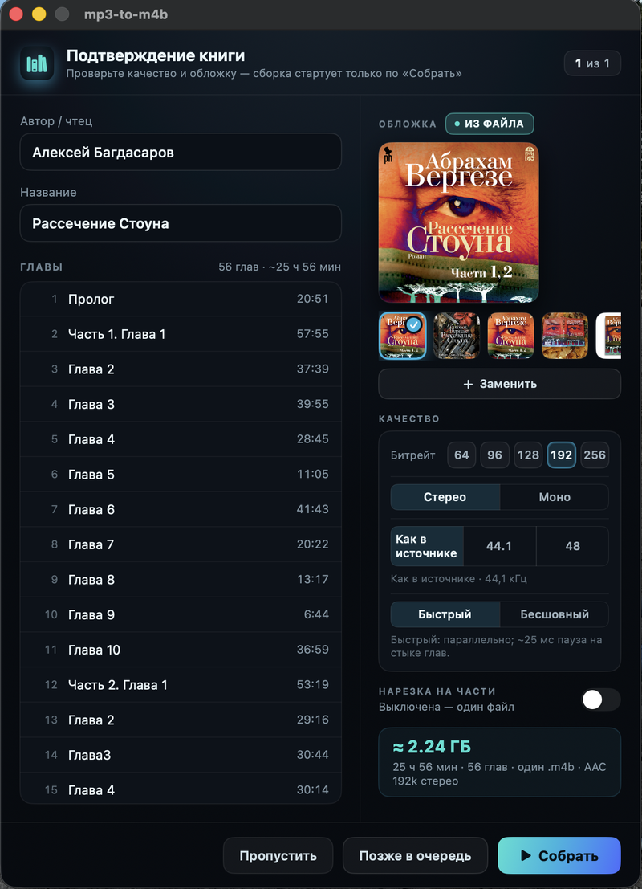
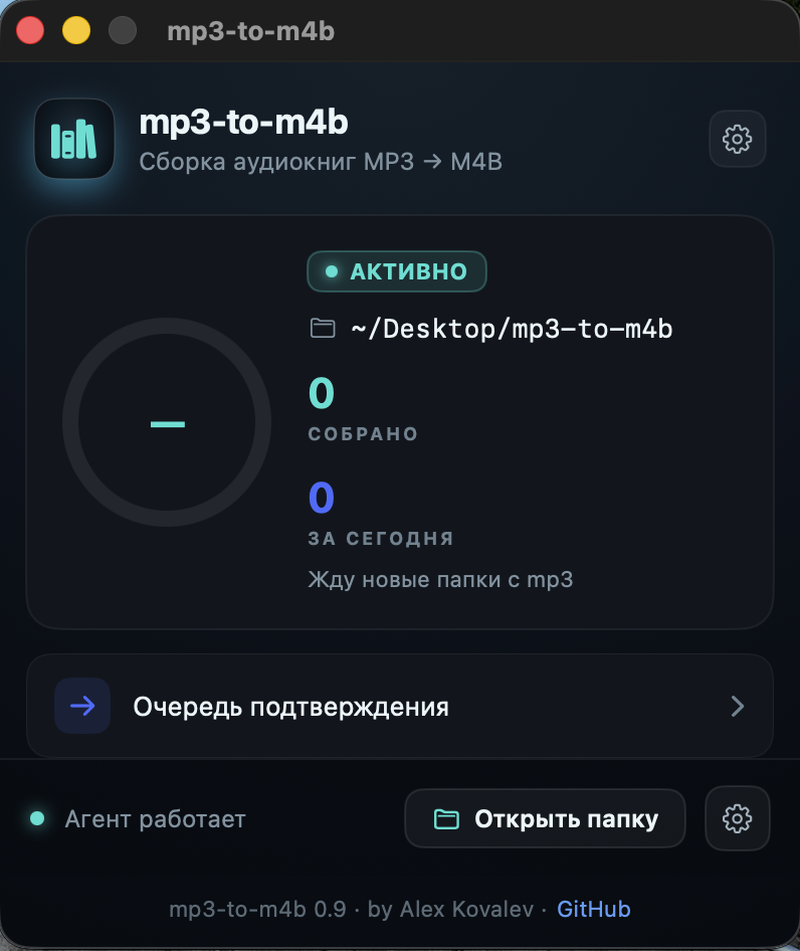
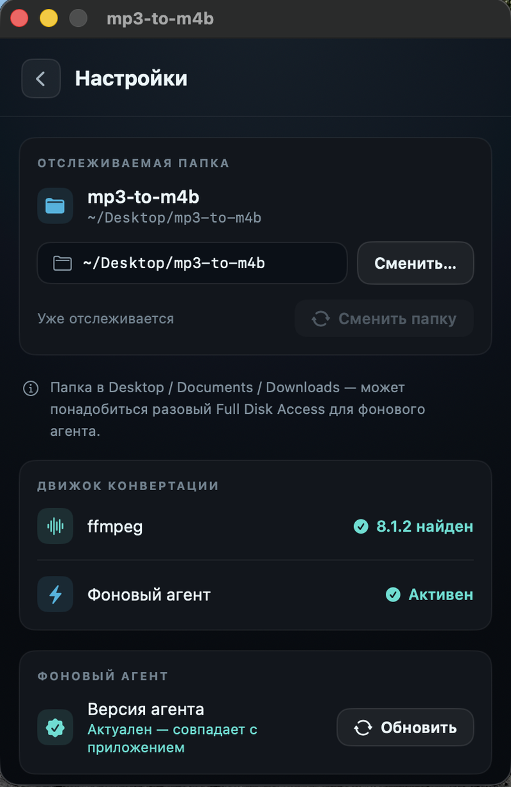

# mp3-to-m4b

**Русский** · [English](README.en.md)


Автоматическая сборка папки с mp3 в **аудиокнигу `.m4b`** (главы + встроенная обложка) на macOS по выбранной папке. Установил приложение, указал папку — дальше просто кидаешь в неё папку с `.mp3`, приложение **всплывает** с окном подтверждения (автор/чтец, название, обложка, качество, режим сборки, нарезка), ты жмёшь **«Собрать»** — и рядом появляется готовый `.m4b`. Движок — только `ffmpeg`/`ffprobe`. Установка и статус — в аккуратном нативном окне; сама сборка идёт фоном.

## Интерфейс

<p align="center">
  
  &nbsp;&nbsp;
  
  &nbsp;&nbsp;
  
  &nbsp;&nbsp;
  
</p>

<p align="center"><sub><b>Подтверждение</b> · <b>Статус</b> · <b>Очередь</b> · <b>Настройки</b></sub></p>

Приложение нативное (SwiftUI / AppKit), окно фиксированной ширины 400pt, тёмная тема. Основные экраны: **Настройка** (первый запуск), **Подтверждение книги** (главный сценарий), **Статус**, **Очередь** и **Настройки**.

## Возможности

- **Авто-сборка по папке.** Указываешь одну папку — фоновый агент сам ловит новые книги, без ручных запусков. **Подпапка с mp3** → одна аудиокнига `.m4b` (глава = файл, в натуральном порядке). Исходники не трогаются; повторные срабатывания идемпотентны (уже собранное не пересобирается молча).
- **Окно подтверждения перед сборкой.** Ни одна книга не собирается, пока ты не подтвердишь параметры во всплывающем окне: **автор / чтец** и **название** (поля редактируемые), **обложка**, **битрейт**, **стерео / моно**, **частота дискретизации** («как в источнике» по умолчанию), **режим сборки** (Быстрый / Бесшовный) и **нарезка на части**. Внизу — **«Пропустить»**, **«Позже»** (в очередь) и **«Собрать»**.
- **Авто-всплытие окна на дроп.** Когда ты сознательно кладёшь (или заново кладёшь) книгу в отслеживаемую папку, окно само выходит на передний план — видно, что книга подхвачена. Триггер — **сам факт дропа**, а не «новизна» содержимого: повторно положенную уже-собранную книгу окно тоже поднимет (ловится и копированием, и перемещением в Finder).
- **Живой прогресс + отмена.** На экране сборки — **детерминированный** прогресс-бар с процентом, «Глава X из Y: …», прошедшим временем и оценкой остатка (ETA), плюс кнопка **«Отменить конвертацию»**. Отмена гасит `ffmpeg` без осиротевших процессов и без обрезка `.m4b`; книга возвращается в подтверждение — можно пересобрать.
- **Быстрый и Бесшовный режимы.** **Быстрый** (по умолчанию) кодирует главы параллельными группами и склеивает их без ре-энкода (`stream-copy`) — в разы быстрее на многоядерных Mac, ценой ~25 мс тишины ровно на границах глав. **Бесшовный** — одна непрерывная кодировка, бит-в-бит на стыках. Есть авто-fallback с Быстрого на Бесшовный при любом сомнении в целостности.
- **Нарезка на части.** Слайдер порога (по умолчанию ~300 МБ) режет книгу по границам глав на несколько `.m4b` (`Часть N из M`), либо оставляет одним файлом. Превью сразу показывает «≈ N частей по ~X МБ».
- **Группировка одиночных mp3.** Если в корне отслеживаемой папки лежат отдельные `.mp3` (не в подпапке), приложение спросит: **объединить в одну книгу** или **собрать по отдельности**.
- **Очередь.** Все книги — в секциях по статусам (Ожидает / В работе / Готово / Ошибка). На готовой книге — **«Открыть»** (показать в Finder) и **«Собрать заново»** (пересобрать, даже если `.m4b` удалён).
- **Обложка.** Берётся из mp3, если встроена; иначе приложение генерирует несколько квадратных вариантов на выбор (подробнее — в разделе [«Обложки»](#обложки)).
- **Экран статуса.** Кольцо-прогресс, счётчики **«Собрано»** и **«За сегодня»**, статус фонового агента и версия движка, компактная строка очереди подтверждения, кнопка **«Открыть папку»** и **«Очистить»** для списка последних сборок. Всё обновляется событийно.
- **Авто-обновление фонового агента.** При запуске приложение сравнивает встроенный движок с установленным и, если они разошлись, **само переустанавливает агент** (с индикатором «Обновляю фоновый агент…»). Кнопка **«Обновить агент»** есть и в Настройках. Так после установки нового DMG движок никогда не остаётся старым.

## Установка (основной путь — DMG)

1. Скачай `mp3-to-m4b-0.9.dmg` со страницы релиза **[v0.9](https://github.com/ArrivaRUS/mp3-to-m4b/releases/tag/v0.9)**.
2. Открой `.dmg` и перетащи приложение **mp3-to-m4b** в папку **«Программы»** (Applications) — стрелка на фоне окна показывает куда.
3. **Первый запуск** (один раз): открой папку «Программы», **правый клик** на `mp3-to-m4b` → **«Открыть»** → в диалоге подтверди **«Открыть»**.
   *Альтернатива:* запусти приложение, затем **Системные настройки → Конфиденциальность и безопасность → «Открыть всё равно»**.
   Приложение собрано без платной подписи Apple (ad-hoc, без нотаризации), поэтому macOS просит подтверждение — это разовый шаг, дальше оно запускается обычным двойным кликом.
4. Приложение проверит, что установлен **ffmpeg** (и `ffprobe`) — если нет, подскажет `brew install ffmpeg`, — затем предложит **выбрать папку** для отслеживания. По умолчанию — `~/Desktop/mp3-to-m4b` (создаётся автоматически). Установка фонового агента запускается прямо из окна («Завершить установку»).
5. Готово. Появится экран статуса с указанием выбранной папки.

Дальше кидай в выбранную папку:

- **подпапку с `.mp3`** → рядом появится `<Имя книги>.m4b` (или несколько частей, если включена нарезка);
- **отдельные `.mp3` в корне** → приложение спросит, объединить их в одну книгу или собрать по отдельности.

Исходники не трогаются. Повторные срабатывания идемпотентны — уже собранное не пересобирается (для пересборки есть кнопка **«Собрать заново»**).

## Full Disk Access (если папка в Desktop / Documents / Downloads)

`~/Desktop`, `~/Documents` и `~/Downloads` — защищённые macOS зоны (TCC). На чистом Mac фоновому агенту может понадобиться **разовый** доступ к ним. Если книги перестали собираться (или не начали вовсе) — выдай Full Disk Access **раннеру**:

1. **Системные настройки → Конфиденциальность и безопасность → Полный доступ к диску** (Full Disk Access).
2. Нажми **«+»**, в открывшемся выборе нажми **Cmd-Shift-G** и вставь путь:
   ```
   ~/Library/Application Support/mp3-to-m4b/bin/runner.sh
   ```
3. Добавь его и **включи переключатель**.

Доступ привязан именно к этому файлу и сохраняется при обновлениях приложения. Установщик печатает точный путь раннера в конце установки. Быстрый переход к нужной панели есть и в самом приложении: **⚙ Настройки → Full Disk Access**.

> Почему именно раннер: macOS привязывает право доступа к файлам не к скрипту-интерпретатору, а к исполняемому файлу, указанному в `ProgramArguments` агента. Поэтому у агента есть стабильная «ответственная» цель по фиксированному пути (`runner.sh`), которой можно выдать доступ один раз.

## Требования

- **macOS** (11.0+).
- **[ffmpeg](https://ffmpeg.org)** и **`ffprobe`** — движок сборки. Нужны оба (ffprobe ставится вместе с ffmpeg).
  Установка: `brew install ffmpeg` ([Homebrew](https://brew.sh)).
- **`python3`** — входит в Xcode Command Line Tools (`xcode-select --install`). На нём работает фоновый агент.

> Установщик сам создаёт виртуальное окружение под `~/Library/Application Support/mp3-to-m4b/venv` и ставит в него **Pillow** — единственную стороннюю зависимость (нужна для генерации обложек). Всё остальное — стандартная библиотека Python.

## Обложки

Приложение старается, чтобы у каждой книги была обложка, и даёт выбрать её прямо в окне подтверждения — отдельного экрана выбора нет.

- **Встроенная обложка.** Если в исходных mp3 уже есть картинка (`attached_pic`), приложение подхватывает её и предлагает как выбранную по умолчанию.
- **Сгенерированные варианты.** Приложение всегда рисует несколько **квадратных типографских обложек** (автор + название, кириллица, play-символ) — их видно лентой превью с большим предпросмотром выбранной. Это нативная генерация через Pillow, **без генеративного ИИ**.
- **Своя картинка.** Кнопка **«Заменить»** открывает выбор файла — можно вшить любое своё изображение. Файл в хранилище обложек копирует **агент** (приложение туда не пишет).
- Выбранная обложка едет вместе с командой сборки и **вшивается в `.m4b`** движком (`ffmpeg`, `attached_pic`) — всегда именно та, что выбрана; при отсутствии выбора берётся встроенная, затем первый сгенерированный вариант.

> Веб-поиск обложек (по автору + названию) в этой версии **отложен** — движок генерации обложек в коде есть, но кнопка «Искать в сети» в UI пока не включена. Поэтому книга всегда получает обложку (встроенную или сгенерированную), даже офлайн.

## Управление

| Действие | Команда |
| --- | --- |
| Логи в реальном времени | `tail -f ~/Library/Logs/mp3-to-m4b.log` |
| Остановить агент | `launchctl bootout gui/$(id -u)/com.arrivarus.mp3tom4b.agent` |
| Запустить агент | `launchctl bootstrap gui/$(id -u) ~/Library/LaunchAgents/com.arrivarus.mp3tom4b.agent.plist` |
| Перезапустить / прогнать вручную | `launchctl kickstart -k gui/$(id -u)/com.arrivarus.mp3tom4b.agent` |
| Сменить отслеживаемую папку | Нажми **«Сменить»** в **⚙ Настройках** и выбери новую папку — переустановка идемпотентна |
| Пересобрать готовую книгу | **«Собрать заново»** на книге в разделе «Готово» (даже если `.m4b` удалён) |
| Удалить | Сними агент: `launchctl bootout gui/$(id -u)/com.arrivarus.mp3tom4b.agent`, затем удали `~/Library/Application Support/mp3-to-m4b` и `~/Library/LaunchAgents/com.arrivarus.mp3tom4b.agent.plist` |

## Как работает

- macOS `launchd` отслеживает **две** директории через `WatchPaths`: выбранную папку (новая книга будит агент) и `queue/commands/` (команда из приложения будит агент). Агент: `com.arrivarus.mp3tom4b.agent`.
- При срабатывании launchd запускает **runner** (`runner.sh`, FDA-цель), который делает `exec python3 -m agent` — это и есть движок.
- **Приложение — читатель, агент — единственный писатель.** Они общаются через файлы состояния: агент атомарно пишет `state.json` (витрина: прогресс, статистика, очередь, обложки) и по-книжные манифесты в `queue/books/`; приложение это читает и реагирует событийно, а свои действия («Собрать», отмена, выбор группировки, «Собрать заново») кладёт командами в `queue/commands/`.
- **Сборка** идёт через `ffmpeg`/`ffprobe`: разведка глав и тегов (`ffprobe`), затем `.m4b` с главами (FFMETADATA), встроенной обложкой (`attached_pic`) и контейнером `-f ipod -movflags +faststart`.
- **Кодек:** приложение предпочитает Apple **`aac_at`** (AudioToolbox, быстрее и качественнее), а если он недоступен — встроенный `aac`. Всегда CBR по выбранному битрейту, чтобы оценка размера файла оставалась точной.
- **Быстрый режим** кодирует главы параллельными группами подряд-идущих глав (до 8 воркеров) и склеивает результат `stream-copy`-конкатенацией (шов только на границах групп); метки глав пере-считываются из **фактической** длительности фрагментов (`ffprobe`), чтобы не было дрейфа. **Бесшовный режим** — одна непрерывная кодировка. При провале валидации Быстрого — авто-fallback на Бесшовный.
- **Частота** по умолчанию — «как в источнике»: агент читает частоты глав и берёт максимум (меньшинство апсемплится, даунсемпла нет); в окне можно задать явные 44.1 / 48 кГц.
- Абсолютные пути к `ffmpeg`/`ffprobe` и к venv-`python3` передаются агенту через `EnvironmentVariables` (агент стартует с минимальным `PATH`).
- `ThrottleInterval=5s` сглаживает пакетное копирование файлов в папку.

Скрипты и застейженный движок живут в `~/Library/Application Support/mp3-to-m4b/bin/` (`runner.sh` + пакет `agent/`), данные (состояние, очередь, обложки) — в `~/Library/Application Support/mp3-to-m4b/`, venv — там же в `venv/`, конфиг агента — в `~/Library/LaunchAgents/com.arrivarus.mp3tom4b.agent.plist`, лог — в `~/Library/Logs/mp3-to-m4b.log`.

## Продвинутый путь — установка из CLI

Для разработчиков и тех, кто предпочитает терминал. Минует приложение и DMG — ставит тот же агент тем же установщиком (`packaging/installer.sh`).

```sh
# 1. ffmpeg (если ещё нет) — вместе с ним ставится ffprobe
brew install ffmpeg

# 2. Клонировать и установить
git clone https://github.com/ArrivaRUS/mp3-to-m4b.git
cd mp3-to-m4b
./packaging/installer.sh                       # папка по умолчанию ~/Desktop/mp3-to-m4b
./packaging/installer.sh "/path/to/my folder"  # или своя папка
```

Установщик определит `ffmpeg`/`ffprobe`/`python3`, создаст venv с Pillow, скопирует пакет `agent/` и раннер в App Support, сгенерирует `plist` через `plutil` (безопасно для путей с пробелами/юникодом) и идемпотентно перезагрузит агент. Полезные флаги для сухого прогона: `MP3TOM4B_NO_LAUNCHCTL=1` (без загрузки launchd), `MP3TOM4B_NO_VENV=1` (без venv/Pillow), `MP3TOM4B_SUPPORT_DIR=…` (перенаправить всё дерево App Support в песочницу).

## Сборка из исходников

Приложение **нативное** — `build-app.sh` компилирует Swift-исходники (SwiftUI / AppKit / Foundation, без сторонних зависимостей) в универсальный бинарь. Артефакты (`*.app`, `*.dmg`, `build/dist/`) в `.gitignore` — бинарники не коммитятся, `.dmg` уходит в GitHub Release.

```sh
# 1. приложение: build/dist/mp3-to-m4b.app
#    (компиляция Swift в универсальный бинарь arm64+x86_64 + иконка + ad-hoc codesign)
build/build-app.sh [версия]

# 2. DMG: build/dist/mp3-to-m4b-<версия>.dmg (+ .sha256)
python3 -m venv build/.venv && build/.venv/bin/pip install dmgbuild   # нужен dmgbuild
build/make-dmg.sh [версия]
```

`build-app.sh`:

- компилирует `app/*.swift` (`main.swift`, `Tokens.swift`, `StateModel.swift`, `EngineClient.swift`, `EngineClient+Status.swift`, `QueueView.swift`, `StatusView.swift`, `SetupView.swift`) через `xcrun swiftc` под **arm64 и x86_64** и склеивает их в универсальный бинарь (`lipo`);
- кладёт движок — пакет `agent/`, FDA-раннер `runner.sh` и `installer.sh` — в `Contents/Resources` (чтобы приложение могло установить агент прямо из бандла);
- собирает иконку из `branding/icon-app.svg` → `.icns` (rasterizer: `cairosvg` из `build/.venv`, иначе `sips`);
- пишет чистый `Info.plist` с фиксированным `CFBundleIdentifier=com.arrivarus.mp3tom4b` (стабильный id важен, чтобы TCC-гранты не слетали при пересборке) и `LSMinimumSystemVersion=11.0`;
- выполняет ad-hoc `codesign` со строгой проверкой (сборка/подпись — в staging-папке вне iCloud, с ретраями против гонки FinderInfo).

`make-dmg.sh` пакует `.app` через `dmgbuild` в **брендированное** окно (фон `branding/dmg-background.png`, значок приложения + симлинк `/Applications`, инструкция первого запуска). Зависимость-free `build/build-dmg.sh` (голый `hdiutil`, без фона) остаётся запасным путём.

## Лицензия

[MIT](LICENSE)
