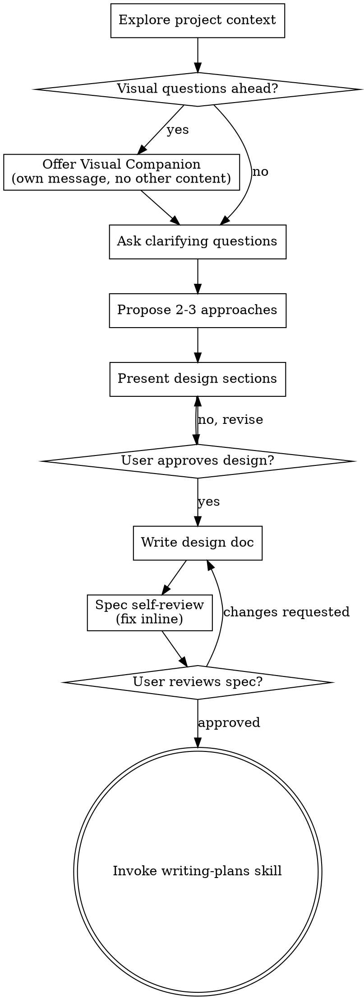

OpenAI Codex v0.142.0
--------
workdir: /Users/arrivarus/Documents/VibeCoding2/2026.06 mp3-to-m4b
model: gpt-5.5
provider: openai
approval: never
sandbox: read-only
reasoning effort: xhigh
reasoning summaries: none
session id: 019f0e99-64cc-70e3-826c-5b3073d79aff
--------
user
Ты — независимый архитектор (второе мнение к Архитектору на Claude). Твоя задача — предложить
архитектуру и порядок сборки нативной macOS-утилиты **mp3-to-m4b**. Дай СВОЙ взгляд; особенно ценно,
где он РАЗОЙДЁТСЯ с типовым Claude-подходом. Кратко, по делу, без воды.

=== Что за продукт ===
Нативная macOS-утилита (личная, не App Store). Фоновый launchd-агент следит за папкой. Появились mp3:
ПАПКА = одна аудиокнига (файлы = главы по натуральному порядку); одиночные mp3 в корне → диалог
«объединить в одну книгу / собрать по отдельности». На выходе — **.m4b** (главы + обложка) через
**только ffmpeg/ffprobe** (других движков нет: AtomicParsley/mp4box/gpac НЕ ставим).

★ ГЛАВНОЕ ОТЛИЧИЕ от соседнего проекта fb2-to-epub: там конвертация МОЛЧАЛИВАЯ (агент сам всё делает,
очередь обложек — постфактум, односторонняя: агент пишет state.json, app только читает). ЗДЕСЬ —
**ОБЯЗАТЕЛЬНОЕ ПОДТВЕРЖДЕНИЕ ПЕРЕД сборкой**: при обнаружении книги приложение всплывает поверх,
человек правит автора/название/имена глав/качество (битрейт, стерео-моно, sample rate)/обложку/нарезку,
и ТОЛЬКО по кнопке «Собрать» агент начинает сборку. Без «Собрать» сборка НИКОГДА не стартует — книга
ждёт в очереди «ожидает подтверждения» бесконечно (человек мог отойти от компьютера). Это прямое ТЗ.

=== Файлы, которые прочитай (read-only, в этом репозитории-проекте) ===
Корень проекта: /Users/arrivarus/Documents/VibeCoding2/2026.06 mp3-to-m4b
- prd/PRD.md — полное ТЗ (что, не как), edge-cases, критерии приёмки.
- design/spec.md — раскладка экранов, матрица состояний, правила нативной реализации (cap высоты окна
  по экрану + скролл переменной секции; .contentShape для тап-таргетов; tabular-nums; имена токенов
  выровнены под fb2-to-epub/app/Tokens.swift).
- design/flows.md — автомат состояний книги (pending-confirm → converting → done/error) и edge-cases.
- research/m4b-toolchain.md — ПРОВЕРЕННАЯ локально тех-разведка ffmpeg (важнейший вход для движка, см. ниже).
- decisions/log.md — принятые решения (D1..D11): группировка, дефолт качества 192k стерео, подтверждение
  (D4), главы (D5), нарезка опц. дефолт-выкл (D6), обложка полной цепочкой в MVP (D7), Status в MVP (D8).

=== Прообраз каркаса (СОСЕД, тоже read-only; можешь его открыть для сверки контракта) ===
/Users/arrivarus/Documents/VibeCoding2/2026.06 fb2-to-epub — рабочий клонируемый каркас:
- app/*.swift: main.swift, EngineClient.swift (+EngineClient+Status), StateModel.swift (Codable-модель
  state.json — поля schema/agent{watch_dir}/totals{converted_total,today,failed_today}/recent[]/
  last_conversion/batch{active,total,done}), StatusView/SetupView/SettingsView/CoverSelectView,
  CoverGenerator.swift, Tokens.swift (namespace C/G/F/Track/M), UpdateChecker.swift.
- bin/fb2-to-epub-watcher.sh: launchd-движок. ВАЖНО про контракт соседа: **агент ВЛАДЕЕТ файлами
  состояния, app только читает**. state.json пишется АТОМАРНО (tmp → mv) после каждой конвертации.
  events.jsonl — append-only журнал. Очередь обложек: covers/{queue,previews,jobs} — агент кладёт
  кандидатов, app постфактум может выбрать другую → роняет apply-job, и ТОЛЬКО агент (под Full Disk
  Access) переписывает файл. book_id = shasum пути. Идемпотентность: пропускает выходы новее источника.
  Агент event-driven: launchctl print в простое = "not running" — это НОРМА (active = bootstrapped rc0
  + plist есть + не disabled; running pid НЕ требуется).
- packaging/installer.sh + runner.sh, build/build-app.sh + make-dmg.sh: установка LaunchAgent (plist
  через plutil, не sed), сборка .app, DMG без платной подписи. Стабильный bundle id
  com.arrivarus.fb2toepub(.agent) → для нас com.arrivarus.mp3tom4b(.agent).
- .patches/001..013 — уроки соседа (DMG-проверка реальным рендером, иконки macОS26, мёртвые кнопки без
  .contentShape, кольцо-счётчик улетал из угла, окно обложки переросло экран → cap по экрану, cairosvg
  ttc-кириллица tofu, валидация существования файла обложки).

=== ★ Тех-разведка ffmpeg (УЖЕ проверено локально, прими как данность — research/m4b-toolchain.md) ===
- raw mp3 НЕЛЬЗЯ stream-copy в mp4/m4b → перекод в AAC обязателен.
- Склейка: **concat filter + aformat** (нормализует каждый вход к общему SR/каналам ДО склейки) —
  детерминированно, без дрейфа границ (concat demuxer даёт дрейф +23мс на разнородных). NB: concat
  filter держит ВСЕ входы открытыми разом → на сотнях файлов риск лимита открытых файлов (для аудиокниг
  редкость; fallback — demuxer с предварительным приведением).
- Главы: **FFMETADATA**, TIMEBASE=1/1000, START/END из накопленных длительностей ffprobe; имя главы из
  ID3 title, иначе из имени файла (зачистка ведущего номера). Кириллица OK.
- Обложка: `-map <idx>:v -c:v copy -disposition:v attached_pic`, формат jpg (mjpeg) — самый совместимый.
- Контейнер: **`-f ipod` + `-movflags +faststart`** (brand M4A, расширение .m4b ставим вручную; формат
  задаём явно `-f ipod`, не по расширению).
- Нарезка: уже готовый m4b режем **stream-copy** `-ss/-to` по границам глав + per-part своя обложка и
  per-part FFMETADATA; ★ОБЯЗАТЕЛЬНО `-map_chapters 1` (иначе дублируются главы исходника + фантомная
  глава нулевой длины — это грабли, уже пойманы). Нумерация title «…Часть N из M», track=N/M, общий album.
- Цепочка обложки: mp3 APIC (ffprobe считает video-потоки: >=1 → есть) → веб-поиск (DuckDuckGo/Yandex
  Images «автор+название аудиокнига», опц. litres, OpenLibrary запас, фильтр квадрат 1:1) → генерация
  квадратных SVG→PNG (cairosvg+pillow, зелёный список шрифтов, проверка рендером). Книга НИКОГДА без обложки.
- Зависимости для детекта в installer: ffmpeg+ffprobe (обяз.), cairosvg+pillow (pip в venv проекта,
  для запасных обложек). НЕ брать php/composer/mp4v2/gpac/m4b-tool.

=== ЧТО ВЕРНУТЬ (строго эти разделы, маркдаун) ===
1. **Процессная модель app/agent** — кто что делает, границы доверия, FDA, event-driven launchd.
2. **★★ Протокол app↔agent ДЛЯ ПОДТВЕРЖДЕНИЯ (главная новизна vs fb2).** Это центр задачи. Опиши
   КОНКРЕТНО: какие файлы/очереди/каталоги, формат, кто пишет/кто читает; как агент сигналит «новая книга
   ждёт подтверждения», как app возвращает АГЕНТУ решение (подтверждение + отредактированные
   автор/название/имена глав/пресет качества/нарезка + ВЫБРАННАЯ обложка), как агент это атомарно
   подхватывает и собирает. Инвариант «без подтверждения не собирать» — как он технически
   гарантируется. **Идемпотентность и ГОНКИ:** что если app пишет правки пока агент сканирует; двойной
   клик «Собрать»; повторное появление той же книги; агент перезапущен в середине; человек закрыл окно;
   частично записанный jobs-файл; устаревшая правка к уже собранной книге. Дай явные стратегии
   (атомарная запись, lock, статусная машина файла-задания, версионирование/heartbeat).
   ★ ОСОБО: где твой протокол подтверждения мог бы РАЗОЙТИСЬ с наивным Claude-подходом и ПОЧЕМУ твой
   надёжнее (направление реверс-канала, единый владелец сборки, idempotency-ключи, отсутствие гонок
   читатель/писатель). Назови рискованные места честно.
3. **Движок ffmpeg** — как обернуть проверенные команды (склейка concat+aformat, FFMETADATA-главы,
   attached_pic, -f ipod +faststart, нарезка stream-copy + map_chapters, цепочка обложки). Где Swift,
   где bash/python; обработка ошибок (нет места, битый mp3 → «собрать без него»), отмена (убить ffmpeg,
   подчистить temp, исходники целы), прогресс по главам.
4. **launchd / installer** — детект ffmpeg (как Calibre у соседа), plist через plutil, стабильный
   bundle id, WatchPaths, PATH агента, FDA-подсказка.
5. **Сборка / DMG** — .app без платной подписи, DMG, venv для cairosvg/pillow.
6. **Карта файлов** — что КЛОНИРУЕТСЯ из fb2-to-epub (с минимальной правкой) vs что НОВОЕ (особенно
   модуль подтверждения и UI окна подтверждения). Таблица: файл · клон/новое · ответственность.
7. **Майлстоны по зависимостям (validation-first)** — M0 скелет (агент видит файлы, state.json,
   app читает) → M1 MVP (полный цикл: всплытие → подтверждение → сборка m4b с главами+обложкой →
   Status). Для каждого — что именно валидируем (как проверить, что работает).
8. **Риски** — топ рискованных мест и митигации; в первую очередь — гонки/протокол подтверждения,
   но также ffmpeg-edge (разнородные входы, лимит файлов, нарезка), обложки (нет сети, tofu),
   нативное окно (cap высоты, мёртвые кнопки).

Формат вывода: компоненты давай как (компонент · ответственность · зависит от · как тестировать).
Будь конкретным и оппозиционным там, где видишь риск. Это ВТОРОЕ независимое мнение — расхождения ценны.

exec
/bin/zsh -lc 'cat /Users/arrivarus/.codex/plugins/cache/openai-curated/superpowers/3fdeeb49/skills/using-superpowers/SKILL.md' in /Users/arrivarus/Documents/VibeCoding2/2026.06 mp3-to-m4b
 succeeded in 0ms:
---
name: using-superpowers
description: Use when starting any conversation - establishes how to find and use skills, requiring Skill tool invocation before ANY response including clarifying questions
---

<SUBAGENT-STOP>
If you were dispatched as a subagent to execute a specific task, skip this skill.
</SUBAGENT-STOP>

<EXTREMELY-IMPORTANT>
If you think there is even a 1% chance a skill might apply to what you are doing, you ABSOLUTELY MUST invoke the skill.

IF A SKILL APPLIES TO YOUR TASK, YOU DO NOT HAVE A CHOICE. YOU MUST USE IT.

This is not negotiable. This is not optional. You cannot rationalize your way out of this.
</EXTREMELY-IMPORTANT>

## Instruction Priority

Superpowers skills override default system prompt behavior, but **user instructions always take precedence**:

1. **User's explicit instructions** (CLAUDE.md, GEMINI.md, AGENTS.md, direct requests) — highest priority
2. **Superpowers skills** — override default system behavior where they conflict
3. **Default system prompt** — lowest priority

If CLAUDE.md, GEMINI.md, or AGENTS.md says "don't use TDD" and a skill says "always use TDD," follow the user's instructions. The user is in control.

## How to Access Skills

**In Claude Code:** Use the `Skill` tool. When you invoke a skill, its content is loaded and presented to you—follow it directly. Never use the Read tool on skill files.

**In Copilot CLI:** Use the `skill` tool. Skills are auto-discovered from installed plugins. The `skill` tool works the same as Claude Code's `Skill` tool.

**In Gemini CLI:** Skills activate via the `activate_skill` tool. Gemini loads skill metadata at session start and activates the full content on demand.

**In other environments:** Check your platform's documentation for how skills are loaded.

## Platform Adaptation

Skills use Claude Code tool names. Non-CC platforms: see `references/copilot-tools.md` (Copilot CLI), `references/codex-tools.md` (Codex) for tool equivalents. Gemini CLI users get the tool mapping loaded automatically via GEMINI.md.

# Using Skills

## The Rule

**Invoke relevant or requested skills BEFORE any response or action.** Even a 1% chance a skill might apply means that you should invoke the skill to check. If an invoked skill turns out to be wrong for the situation, you don't need to use it.


## Red Flags

These thoughts mean STOP—you're rationalizing:

| Thought | Reality |
|---------|---------|
| "This is just a simple question" | Questions are tasks. Check for skills. |
| "I need more context first" | Skill check comes BEFORE clarifying questions. |
| "Let me explore the codebase first" | Skills tell you HOW to explore. Check first. |
| "I can check git/files quickly" | Files lack conversation context. Check for skills. |
| "Let me gather information first" | Skills tell you HOW to gather information. |
| "This doesn't need a formal skill" | If a skill exists, use it. |
| "I remember this skill" | Skills evolve. Read current version. |
| "This doesn't count as a task" | Action = task. Check for skills. |
| "The skill is overkill" | Simple things become complex. Use it. |
| "I'll just do this one thing first" | Check BEFORE doing anything. |
| "This feels productive" | Undisciplined action wastes time. Skills prevent this. |
| "I know what that means" | Knowing the concept ≠ using the skill. Invoke it. |

## Skill Priority

When multiple skills could apply, use this order:

1. **Process skills first** (brainstorming, debugging) - these determine HOW to approach the task
2. **Implementation skills second** (frontend-design, mcp-builder) - these guide execution

"Let's build X" → brainstorming first, then implementation skills.
"Fix this bug" → debugging first, then domain-specific skills.

## Skill Types

**Rigid** (TDD, debugging): Follow exactly. Don't adapt away discipline.

**Flexible** (patterns): Adapt principles to context.

The skill itself tells you which.

## User Instructions

Instructions say WHAT, not HOW. "Add X" or "Fix Y" doesn't mean skip workflows.

exec
/bin/zsh -lc 'cat /Users/arrivarus/.codex/plugins/cache/openai-curated/superpowers/3fdeeb49/skills/brainstorming/SKILL.md' in /Users/arrivarus/Documents/VibeCoding2/2026.06 mp3-to-m4b
 succeeded in 0ms:
---
name: brainstorming
description: "You MUST use this before any creative work - creating features, building components, adding functionality, or modifying behavior. Explores user intent, requirements and design before implementation."
---

# Brainstorming Ideas Into Designs

Help turn ideas into fully formed designs and specs through natural collaborative dialogue.

Start by understanding the current project context, then ask questions one at a time to refine the idea. Once you understand what you're building, present the design and get user approval.

<HARD-GATE>
Do NOT invoke any implementation skill, write any code, scaffold any project, or take any implementation action until you have presented a design and the user has approved it. This applies to EVERY project regardless of perceived simplicity.
</HARD-GATE>

## Anti-Pattern: "This Is Too Simple To Need A Design"

Every project goes through this process. A todo list, a single-function utility, a config change — all of them. "Simple" projects are where unexamined assumptions cause the most wasted work. The design can be short (a few sentences for truly simple projects), but you MUST present it and get approval.

## Checklist

You MUST create a task for each of these items and complete them in order:

1. **Explore project context** — check files, docs, recent commits
2. **Offer visual companion** (if topic will involve visual questions) — this is its own message, not combined with a clarifying question. See the Visual Companion section below.
3. **Ask clarifying questions** — one at a time, understand purpose/constraints/success criteria
4. **Propose 2-3 approaches** — with trade-offs and your recommendation
5. **Present design** — in sections scaled to their complexity, get user approval after each section
6. **Write design doc** — save to `docs/superpowers/specs/YYYY-MM-DD-<topic>-design.md` and commit
7. **Spec self-review** — quick inline check for placeholders, contradictions, ambiguity, scope (see below)
8. **User reviews written spec** — ask user to review the spec file before proceeding
9. **Transition to implementation** — invoke writing-plans skill to create implementation plan

## Process Flow



**The terminal state is invoking writing-plans.** Do NOT invoke frontend-design, mcp-builder, or any other implementation skill. The ONLY skill you invoke after brainstorming is writing-plans.

## The Process

**Understanding the idea:**

- Check out the current project state first (files, docs, recent commits)
- Before asking detailed questions, assess scope: if the request describes multiple independent subsystems (e.g., "build a platform with chat, file storage, billing, and analytics"), flag this immediately. Don't spend questions refining details of a project that needs to be decomposed first.
- If the project is too large for a single spec, help the user decompose into sub-projects: what are the independent pieces, how do they relate, what order should they be built? Then brainstorm the first sub-project through the normal design flow. Each sub-project gets its own spec → plan → implementation cycle.
- For appropriately-scoped projects, ask questions one at a time to refine the idea
- Prefer multiple choice questions when possible, but open-ended is fine too
- Only one question per message - if a topic needs more exploration, break it into multiple questions
- Focus on understanding: purpose, constraints, success criteria

**Exploring approaches:**

- Propose 2-3 different approaches with trade-offs
- Present options conversationally with your recommendation and reasoning
- Lead with your recommended option and explain why

**Presenting the design:**

- Once you believe you understand what you're building, present the design
- Scale each section to its complexity: a few sentences if straightforward, up to 200-300 words if nuanced
- Ask after each section whether it looks right so far
- Cover: architecture, components, data flow, error handling, testing
- Be ready to go back and clarify if something doesn't make sense

**Design for isolation and clarity:**

- Break the system into smaller units that each have one clear purpose, communicate through well-defined interfaces, and can be understood and tested independently
- For each unit, you should be able to answer: what does it do, how do you use it, and what does it depend on?
- Can someone understand what a unit does without reading its internals? Can you change the internals without breaking consumers? If not, the boundaries need work.
- Smaller, well-bounded units are also easier for you to work with - you reason better about code you can hold in context at once, and your edits are more reliable when files are focused. When a file grows large, that's often a signal that it's doing too much.

**Working in existing codebases:**

- Explore the current structure before proposing changes. Follow existing patterns.
- Where existing code has problems that affect the work (e.g., a file that's grown too large, unclear boundaries, tangled responsibilities), include targeted improvements as part of the design - the way a good developer improves code they're working in.
- Don't propose unrelated refactoring. Stay focused on what serves the current goal.

## After the Design

**Documentation:**

- Write the validated design (spec) to `docs/superpowers/specs/YYYY-MM-DD-<topic>-design.md`
  - (User preferences for spec location override this default)
- Use elements-of-style:writing-clearly-and-concisely skill if available
- Commit the design document to git

**Spec Self-Review:**
After writing the spec document, look at it with fresh eyes:

1. **Placeholder scan:** Any "TBD", "TODO", incomplete sections, or vague requirements? Fix them.
2. **Internal consistency:** Do any sections contradict each other? Does the architecture match the feature descriptions?
3. **Scope check:** Is this focused enough for a single implementation plan, or does it need decomposition?
4. **Ambiguity check:** Could any requirement be interpreted two different ways? If so, pick one and make it explicit.

Fix any issues inline. No need to re-review — just fix and move on.

**User Review Gate:**
After the spec review loop passes, ask the user to review the written spec before proceeding:

> "Spec written and committed to `<path>`. Please review it and let me know if you want to make any changes before we start writing out the implementation plan."

Wait for the user's response. If they request changes, make them and re-run the spec review loop. Only proceed once the user approves.

**Implementation:**

- Invoke the writing-plans skill to create a detailed implementation plan
- Do NOT invoke any other skill. writing-plans is the next step.

## Key Principles

- **One question at a time** - Don't overwhelm with multiple questions
- **Multiple choice preferred** - Easier to answer than open-ended when possible
- **YAGNI ruthlessly** - Remove unnecessary features from all designs
- **Explore alternatives** - Always propose 2-3 approaches before settling
- **Incremental validation** - Present design, get approval before moving on
- **Be flexible** - Go back and clarify when something doesn't make sense

## Visual Companion

A browser-based companion for showing mockups, diagrams, and visual options during brainstorming. Available as a tool — not a mode. Accepting the companion means it's available for questions that benefit from visual treatment; it does NOT mean every question goes through the browser.

**Offering the companion:** When you anticipate that upcoming questions will involve visual content (mockups, layouts, diagrams), offer it once for consent:
> "Some of what we're working on might be easier to explain if I can show it to you in a web browser. I can put together mockups, diagrams, comparisons, and other visuals as we go. This feature is still new and can be token-intensive. Want to try it? (Requires opening a local URL)"

**This offer MUST be its own message.** Do not combine it with clarifying questions, context summaries, or any other content. The message should contain ONLY the offer above and nothing else. Wait for the user's response before continuing. If they decline, proceed with text-only brainstorming.

**Per-question decision:** Even after the user accepts, decide FOR EACH QUESTION whether to use the browser or the terminal. The test: **would the user understand this better by seeing it than reading it?**

- **Use the browser** for content that IS visual — mockups, wireframes, layout comparisons, architecture diagrams, side-by-side visual designs
- **Use the terminal** for content that is text — requirements questions, conceptual choices, tradeoff lists, A/B/C/D text options, scope decisions

A question about a UI topic is not automatically a visual question. "What does personality mean in this context?" is a conceptual question — use the terminal. "Which wizard layout works better?" is a visual question — use the browser.

If they agree to the companion, read the detailed guide before proceeding:
`skills/brainstorming/visual-companion.md`

codex
Использую `superpowers:using-superpowers` и `superpowers:brainstorming`: задача архитектурная, поэтому сначала сверю контекст и существующий каркас, затем дам независимый дизайн в запрошенных разделах. В read-only режиме ничего не буду менять.
Выполняю укороченный brainstorming-процесс под прямой формат пользователя: без записи spec-файлов, потому что рабочая область read-only и нужен именно ответ-ревью.
  → Прочитать ТЗ и дизайн-документы mp3-to-m4b
  • Сверить контракт и структуру соседнего fb2-to-epub
  • Сформировать независимую архитектуру с фокусом на протокол подтверждения
  • Проверить ответ на полноту по 8 обязательным разделам
codex
Сначала читаю документы проекта, чтобы не подменить уже принятые решения своими предположениями. Особое внимание дам состояниям `pending-confirm → converting` и ограничениям ffmpeg, потому что там основной источник гонок.
exec
/bin/zsh -lc 'cat prd/PRD.md' in /Users/arrivarus/Documents/VibeCoding2/2026.06 mp3-to-m4b
 succeeded in 0ms:
# PRD — mp3-to-m4b

> Версия: 1.0 · Дата: 2026-06-28 · Автор: ProductManager (студия Юрки)
> Тип продукта: **desktop-утилита для одного пользователя** (personal/B2C, macOS).
> Без серверов, аккаунтов, сбора данных и оплаты. Источник правды для дизайна и кода.
> Зафиксированные решения: `decisions/log.md` D1–D6 (это требования, не пересматриваются).
> Тех-фактура: `research/m4b-toolchain.md`.

---

## 1. Фон и цели

### 1.1 Почему сейчас / проблема
Пользователь (power user macOS) собирает аудиокниги для себя из набора `mp3`-файлов
(папка-сборник = книга, файлы = главы). Готовых решений на macOS, которые делают это
**без терминала, без ручной возни с ffmpeg и без слепого автомата**, у него нет:
- ручная сборка `.m4b` через ffmpeg/`m4b-tool` требует CLI, знания флагов, ручного
  составления глав, поиска обложки и нарезки на части;
- существующие GUI либо платные, либо «всё или ничего» (нельзя проверить параметры и
  обложку до сборки), либо не делают главы/обложку/нарезку под Apple Books корректно.

Рядом уже есть **проверенный каркас** — сосед `fb2-to-epub` (нативное SwiftUI-приложение +
фоновый launchd-агент, следящий за папкой). mp3-to-m4b клонирует этот каркас, заменяя
движок `fb2→epub` на `mp3→m4b` и добавляя **обязательное подтверждение** перед сборкой
(D4) — потому что выбор качества и обложки нельзя угадывать за пользователя.

### 1.2 Целевой пользователь (персона)
**«Антон», power user macOS, делает аудиокниги для себя.**
- Черты: технически грамотен, но не хочет каждый раз открывать терминал; ценит
  контроль над качеством и обложкой; слушает книги в Apple Books / стороннем плеере с
  закладками и переменной скоростью; складывает mp3 пачками (скачал сборник → кинул в папку).
- Контекст: один Mac, один пользователь, без общего доступа; интернет есть **не всегда**
  (поиск обложки должен деградировать корректно); место на диске обычно есть, но большие
  книги могут упереться.
- Чего НЕ хочет: слепой автомат, который соберёт книгу с кривым битрейтом / без обложки /
  с мусорными главами и придётся переделывать.

Один тип пользователя. Ролей/прав/мультиарендности **нет** (см. §10 Не-цели).

### 1.3 Сценарии использования (top-3)
1. **Папка-сборник → книга.** Кидает в отслеживаемую папку подпапку `Толстой - Война и
   мир/` с `01.mp3 … 12.mp3`. Приложение всплывает, показывает распознанные автор/название/
   обложку и параметры, Антон подтверждает (или правит) → рядом появляется `Война и мир.m4b`
   с главами и обложкой.
2. **Одиночные mp3 в корне.** Кинул 3 разрозненных mp3 прямо в корень папки. Приложение
   спрашивает: **объединить в одну книгу** или **собрать по отдельности** (D1) → дальше
   обычный флоу подтверждения.
3. **Нет за компьютером.** Скопировал на ночь 5 папок. Утром видит очередь
   «ожидает подтверждения» из 5 книг; проходит их по одной (или применяет параметры ко
   всем) → сборка идёт фоном с прогрессом.

### 1.4 Бизнес-цели и метрики (SMART)
Продукт личный, без выручки/роста. Цели — **качество результата и отсутствие ручной возни**.
Замер — ручной прогон автором на эталонном наборе из ≥10 реальных книг (вкл. сборники с
тегами, без тегов, со встроенной обложкой, без неё, разнородные sample rate).

| # | Цель (SMART) | Метрика | Срок |
|---|---|---|---|
| G1 | Каждая собранная `.m4b` из эталонного набора открывается в **Apple Books и ≥1 стороннем плеере** с корректными главами и обложкой | 100% книг набора (≥10/10) проигрываются, главы кликабельны, обложка видна | к приёмке v1 (G7) |
| G2 | Любая сборка стартует **только после явного «ок»** пользователя (D4); без подтверждения не конвертируется ничего | 0 сборок без подтверждения в логе за прогон набора | к приёмке v1 |
| G3 | От «кинул папку» до «нажал ок» — **не более 2 экранов/действий** на типовой папке-сборнике с тегами | ручной замер: ≤2 клика (всплытие → ок) на ≥8/10 книг | к приёмке v1 |
| G4 | Обложка найдена/сгенерирована **для 100%** книг (цепочка mp3→сеть→генерация, D-research §6–7), пустых обложек нет | 0 книг без обложки в наборе | к приёмке v1 |
| G5 | Повторный прогон той же папки **не пересобирает** свежую книгу (идемпотентность) | 0 лишних пересборок при повторном срабатывании | к приёмке v1 |
| G6 | **0 ошибок в системном логе** агента при прогоне эталонного набора (кроме осознанно обработанных error-состояний книг) | `grep` лога: 0 необработанных трейсбеков | к приёмке v1 |

---

## 2. Обзор требования (≤30 слов)
macOS-приложение следит за папкой; найдя mp3, **всплывает и ждёт подтверждения** качества и
обложки, затем фоном собирает корректный `.m4b` (главы, обложка, опц. нарезка на части).

---

## 3. Глоссарий и инварианты

**Термины.**
- **Книга** — единица сборки: одна подпапка с mp3 ИЛИ группа одиночных mp3, которую
  пользователь решил объединить, ИЛИ один одиночный mp3 (если решено «по отдельности»).
- **Глава** — один исходный mp3 = одна глава в `.m4b` (D5).
- **Пачка (batch)** — набор книг, обнаруженных одним срабатыванием (несколько папок разом).
- **Задание (job)** — одна книга в работе/очереди со своим статусом и параметрами.
- **Отслеживаемая папка (watch root)** — папка, выбранная при установке; за ней следит агент.

**Инварианты (нарушать нельзя).**
- **I1.** Исходные `mp3` **не изменяются и не удаляются** никогда. Результат — рядом, новый файл.
- **I2.** Без явного «ок» пользователя по параметрам и обложке **сборка не стартует** (D4).
- **I3.** raw mp3 в `.m4b` невозможен → **всегда перекод в AAC** (research §1a). На выходе
  единый AAC с целевым битрейтом; разнородность входов приводится к общему SR/каналам.
- **I4.** Глава = файл; имя главы из ID3 `title`, иначе из имени файла без ведущего номера
  (`^\d+[\s._-]+`) (D5, research §5).
- **I5.** Каждая собранная `.m4b` (и каждая часть при нарезке) — **валидный аудиокнижный
  контейнер** (`-f ipod`, `+faststart`, расширение `.m4b`) с обложкой `attached_pic`.
- **I6.** При расхождении распознанных данных и ожиданий — **спрашиваем у пользователя**
  (всплытие показывает распознанное, пользователь правит), не угадываем молча.

---

## 4. Системный контекст (наследуется от fb2-to-epub, к ратификации на G4 арх)

> Не архитектура (её делают архитекторы), а контекст, в котором живут требования.

- **Два процесса:** (1) нативное **SwiftUI-приложение** (окна Setup/Status/Подтверждение/
  Очередь/Настройки); (2) фоновый **launchd-агент** (`WatchPaths` на отслеживаемой папке)
  с движком на `ffmpeg`/`ffprobe`.
- **Связь через `state.json`** (владелец — агент, пишет атомарно tmp→rename; приложение
  читает; свои маркеры приложение держит отдельно). В отличие от fb2, контракт расширяется
  статусом подтверждения (см. §6) и параметрами книги.
- **Внешняя зависимость-движок:** `ffmpeg` + `ffprobe` (детект как Calibre у соседа).
  Запасные обложки — Python `cairosvg`+`pillow` в venv проекта. Поиск обложки — `urllib`
  (стандартная библиотека). (research «Список зависимостей».)
- **Каталоги данных:** `~/Library/Application Support/mp3-to-m4b/{state,covers,bin,queue}`;
  лог — `~/Library/Logs/mp3-to-m4b.log`; конфиг агента — `~/Library/LaunchAgents/…plist`.
- **Без подписи Apple** (DMG, ad-hoc codesign), стабильный bundle id
  `com.arrivarus.mp3tom4b(.agent)`.

---

## 5. Функциональные требования (карта модулей)

Декомпозиция по user journey (обнаружение → подтверждение → сборка → результат) + по
объектам (книга, глава, обложка, часть, очередь).

| ID | Модуль | Приоритет | Одной фразой |
|---|---|---|---|
| F1 | Установка и выбор папки (Setup) | **P0** | Проверить ffmpeg, выбрать отслеживаемую папку, поставить агент. |
| F2 | Обнаружение и группировка | **P0** | Найти mp3, сгруппировать в книги (подпапка=книга; одиночные → диалог D1). |
| F3 | Распознавание метаданных | **P0** | Извлечь автор/название/порядок/имена глав/обложку (ID3 → имя папки/файлов). |
| F4 | Окно подтверждения (ядро, D4) | **P0** | Всплыть, показать распознанное, дать править параметры+обложку, ждать «ок». |
| F5 | Параметры качества (D2) | **P0** | Битрейт/каналы/SR (дефолт AAC 192k стерео 44100); меняются в окне. |
| F6 | Обложка: цепочка источников | **P0** | mp3 → поиск в сети → генерация вариантов → выбор/ручная замена (research §4,6,7). |
| F7 | Сборка `.m4b` (главы+обложка) | **P0** | concat→AAC, FFMETADATA-главы, attached_pic, `-f ipod +faststart`. |
| F8 | Нарезка на части (D6) | **P1** | Опц. по порогу (~300 МБ) по границам глав; дефолт — одним файлом. |
| F9 | Очередь и прогресс | **P0** | Очередь «ожидает подтверждения» + «в работе»; прогресс пачки/книги. |
| F10 | Идемпотентность и edge-cases | **P0** | Не пересобирать свежее; корректно обработать битые/пустые/мусорные входы. |
| F11 | Отмена сборки | **P1** | Прервать текущую книгу без порчи исходников и без полуфайла на выходе. |
| F12 | Статус и управление (Status) | **P1** | Папка, агент вкл/выкл, счётчики, последние книги, открыть папку. |
| F13 | Настройки | **P2** | Дефолты пресета, Full Disk Access, версия/обновление, сброс статистики. |

---

## 6. Модель состояний задания (книги)

Единый конечный автомат на одну книгу (job). Статусы пишутся агентом в `state.json`,
приложение их отображает.

```
            (обнаружено mp3)
                  │
   ┌──────────────▼───────────────┐
   │  detected                    │  агент нашёл книгу, считает метаданные
   └──────────────┬───────────────┘
                  │ (метаданные распознаны; для одиночных в корне — сперва GROUPING)
   ┌──────────────▼───────────────┐
   │  pending-confirm             │  ждёт пользователя: всплытие окна / уведомление
   │  (обложка под-состояние ▼)   │  ← I2: без «ок» дальше НЕ идёт
   └───┬───────────────────┬──────┘
       │ (пользователь «ок»)│ (пользователь «отмена/в очередь»)
       │                    └──────────► остаётся pending-confirm (ждёт в очереди)
   ┌───▼───────────────────────────┐
   │  converting                   │  идёт сборка; прогресс по главам; ✱ можно «отменить»
   └───┬───────────────────┬───────┘
       │ (успех)            │ (ошибка движка / нет места / битый вход)
   ┌───▼─────────┐     ┌────▼──────────┐
   │  done        │     │  error        │  понятная причина + «повторить»/«пропустить»
   └──────────────┘     └───────────────┘
       ▲                                    (отмена в процессе)
       └───────── cancelled ◄───────────────┘  частичный выход удалён, исходники целы
```

**Под-состояния обложки** (внутри `pending-confirm`, см. §7.6):
`from-mp3` → (если нет) `searching` → `candidates` (пейджер) | `not-found` → `generated`
(варианты SVG→PNG) → `user-picked` | `user-replaced` (файл вручную).

**Под-состояние группировки** (только для одиночных mp3 в корне, до `pending-confirm`):
`grouping-ask` → пользователь выбрал «объединить» (одна книга) или «по отдельности»
(N книг) → далее каждая книга идёт в `pending-confirm`.

---

## 7. Детальный дизайн фич (по модулям)

> Для каждого: user story · приоритет · бизнес-правила (исчерпывающе) ·
> флоу (happy + исключения). Acceptance вынесен в §8.

### F1. Установка и выбор папки (Setup) — P0
**User story.** As Антон, I want указать папку и убедиться, что ffmpeg на месте, so that
приложение само следило за ней и могло собирать книги.

**Бизнес-правила.**
- При первом запуске приложение проверяет наличие `ffmpeg` и `ffprobe` (детект как Calibre
  у соседа). Нет → экран с инструкцией `brew install ffmpeg` и кнопкой «Проверить снова».
- Предлагает выбрать отслеживаемую папку; дефолт `~/Desktop/mp3-to-m4b` (создаётся авто).
- Ставит/обновляет launchd-агент идемпотентно (повторная установка не плодит агентов).
- Если папка в защищённой зоне (Desktop/Documents/Downloads) — подсказать про Full Disk
  Access для раннера (как у соседа).
- Python-зависимости запасной обложки (`cairosvg`/`pillow`) ставятся в venv при установке;
  отсутствие сети поиска обложки на этапе установки не блокирует (поиск нужен позже).

**Флоу.** Запуск → детект ffmpeg → [нет → инструкция] → выбор папки → установка агента →
экран Status. **Исключения:** нет ffmpeg → блок с инструкцией; нет прав на папку → подсказка
FDA; venv не собрался → предупреждение «запасная генерация обложек недоступна, поиск/из mp3
работают» (не блок).

### F2. Обнаружение и группировка — P0
**User story.** As Антон, I want чтобы приложение само понимало, где книга-сборник, а где
разрозненные файлы, so that мне не приходилось вручную раскладывать.

**Бизнес-правила.**
- Агент срабатывает на изменение отслеживаемой папки (`WatchPaths` + throttle, чтобы
  сгладить пакетное копирование — как у соседа).
- **Подпапка, содержащая ≥1 `mp3`** → одна **книга** (главы = все mp3 этой подпапки по
  натуральному порядку). Вложенность глубже — каждая подпапка с mp3 = отдельная книга
  (как «папка-зеркало» у соседа; уточнить с архитектором на G4, базово — подпапка=книга).
- **Одиночные `mp3` в КОРНЕ** отслеживаемой папки → перед сборкой показать диалог D1:
  «объединить в одну книгу» ИЛИ «собрать по отдельности» (каждый mp3 → своя книга).
- Файлы считаются «готовыми к захвату», когда дописаны (размер стабилен между двумя
  тиками / истёк throttle) — чтобы не схватить недокопированный mp3.
- Не-mp3 файлы (txt, jpg, .DS_Store, частичные `.mp3.download`) **игнорируются** при
  отборе глав (но `jpg` рядом может быть кандидатом обложки — см. F6, опц. P2).
- Натуральная сортировка имён: `01,02,…,10` (числовая, не лексикографическая) (research §5).

**Флоу.** Срабатывание → собрать список книг пачки → для подпапок сразу `detected`; для
одиночных в корне → `grouping-ask`. **Исключения:** папка без единого mp3 (только мусор) →
книга не создаётся, запись в лог, ничего не всплывает; смешанная папка (mp3 + мусор) →
берём только mp3.

### F3. Распознавание метаданных — P0
**User story.** As Антон, I want чтобы автор/название/главы определялись сами, so that я лишь
проверял, а не вбивал вручную.

**Бизнес-правила (приоритет — research §5).**
- **Автор/Название:** `album`(→название) + `album_artist`/`artist`(→автор); если пусто/мусор
  → **парс имени папки** по шаблону «Автор - Название» (разделитель ` - `); если и это не
  разобрать → название = имя папки целиком, автор = пусто (пользователь дозаполнит в окне).
- **Порядок глав:** тег `track` → если нет, натуральная сортировка имён файлов.
- **Имя главы:** тег `title` → если нет или мусорное («Track 01», «01») → имя файла без
  расширения и без ведущего номера (`^\d+[\s._-]+`).
- **Длительности глав:** из `ffprobe` (накопительная сумма → START/END, TIMEBASE 1/1000).
- **Встроенная обложка:** детект по наличию video-потока в mp3; берём из **первого** файла,
  где она есть (research §4).
- Кириллица в тегах/именах не должна ломаться (research подтвердил).

**Флоу.** На `detected` агент пробегает все mp3 книги через `ffprobe`, собирает метаданные и
кандидата-обложку, кладёт в job. **Исключения:** теги пустые → fallback на имена; разнобой
тегов (часть файлов с `title`, часть без) → по каждому файлу свой fallback; не разобрать имя
папки → автор пуст, ждём пользователя.

### F4. Окно подтверждения (ядро, D4) — P0
**User story.** As Антон, I want видеть и подтверждать качество и обложку **до** сборки,
so that не получать на выходе книгу, которую придётся переделывать.

**Бизнес-правила.**
- При появлении книги в `pending-confirm` приложение **всплывает** (поднимает окно поверх),
  как у соседа на rising-edge; если приложение закрыто — агент его открывает (`open -b`).
- Окно показывает на одну книгу: **распознанные автор / название**, **число глав** и их
  список (имя главы + длительность), **превью обложки** (текущее под-состояние §7.6),
  блок **параметров качества** (F5), переключатель **нарезки** (F8) с предпросмотром
  «≈ N частей по ~X МБ», и **оценку итогового размера/длительности**.
- Все поля редактируемы: автор, название, имя любой главы, параметры, обложка, нарезка.
- Кнопки: **«Собрать»** (→ `converting`), **«В очередь / Позже»** (книга остаётся
  `pending-confirm`), **«Пропустить»** (книга снимается с обработки, исходники целы).
- **I2:** пока пользователь не нажал «Собрать» — сборка не стартует. Если пользователя нет —
  книга ждёт в очереди (§F9) сколько угодно.
- При нескольких книгах в очереди — «Применить параметры ко всем ожидающим» (одним
  действием задать общий пресет/нарезку; обложку всё равно подтверждать по каждой, т.к.
  она индивидуальна) — **P1**.

**Флоу (happy).** Книга → `pending-confirm` → окно всплыло → пользователь проверил/поправил
→ «Собрать» → `converting`. **Исключения:** пользователь закрыл окно без решения → книга
остаётся `pending-confirm` в очереди; параметры невалидны (напр. пустое название) →
inline-валидация, «Собрать» заблокирована с подсказкой; обложка ещё `searching` →
«Собрать» доступна (соберём с тем, что выбрано/дефолтом), либо пользователь ждёт кандидатов.

### F5. Параметры качества (D2) — P0
**User story.** As Антон, I want задать битрейт/каналы перед сборкой, so that баланс
качество/размер был под мою книгу.

**Бизнес-правила.**
- Дефолт: **AAC 192 kbps, стерео, 44100 Гц** (D2). Кодер — встроенный `aac` (тех-дефолт
  Юрки; QA опц. сравнит с Apple `aac_at`).
- Битрейт — пресеты (напр. 64/96/128/192/256 kbps) + дефолт 192; каналы стерео/моно;
  целевой SR (44100/иное), к которому приводятся разнородные входы (research §1a).
- Битрейт входных mp3 неважен (задаётся на выходе); разные SR/каналы приводятся к общему
  через `aformat` (research §1a).
- Параметры применяются к текущей книге; пользователь может сохранить как новый дефолт (F13).

**Флоу.** В окне подтверждения. **Исключения:** выбран битрейт, дающий заметно больший
размер → предпросмотр размера обновляется; моно для стерео-источника — разрешено (выбор
пользователя).

### F6. Обложка: цепочка источников — P0
**User story.** As Антон, I want чтобы обложка нашлась или сгенерировалась сама, а я мог её
заменить, so that ни одна книга не осталась без приличной квадратной обложки.

**Бизнес-правила (цепочка — research §4,6,7; D-research).**
1. **Из mp3:** если в каком-то файле есть встроенная (APIC) — берём из первого такого
   (research §4). Под-состояние `from-mp3`.
2. **Поиск в сети** (если в mp3 нет): запрос «<автор> <название> аудиокнига [обложка]» по
   **DuckDuckGo / Yandex Images** (осн.), опц. **litres**-листинг, **OpenLibrary** запас.
   Фильтр **квадрат 1:1** (целевой aspect ≈ 1.0, не портрет как у fb2). Под-состояние
   `searching` → `candidates` (если ≥1 подходящих, пейджер) или `not-found`.
3. **Генерация вариантов** (если не нашли / нет сети): несколько **квадратных 1:1**
   SVG→PNG вариантов на выбор (cairosvg+pillow, новые квадратные шаблоны; зелёный список
   шрифтов из research §7). Под-состояние `generated`.
4. **Выбор/замена пользователем:** пейджер кандидатов; «выбрать», «искать ещё» (свой
   запрос, исключая показанные — как у соседа), **«заменить файлом»** (перетащить/выбрать
   свой jpg/png; авто-кроп к квадрату). Под-состояния `user-picked` / `user-replaced`.
- **Никогда не оставляем книгу без обложки** (G4): если сеть недоступна и поиск пуст →
  сразу генерация вариантов; пустой обложки не бывает.
- Обложка в `.m4b` встраивается как `attached_pic`, jpeg, без перекода картинки (research §1c).

**Флоу.** `detected` → если APIC есть → `from-mp3`; иначе фоновый `searching` (не блокирует
показ окна) → `candidates`/`not-found→generated`. Пользователь в окне видит текущее и может
переключить/искать/заменить. **Исключения:** нет сети → пропускаем шаг 2, идём в генерацию;
поиск вернул мусор (не квадрат) → отфильтрован, при пустом результате → генерация; битый
файл, выбранный пользователем → ошибка с просьбой выбрать другой.

### F7. Сборка `.m4b` — P0
**User story.** As Антон, I want получить валидный `.m4b` с главами и обложкой, so that он
открывался как аудиокнига в Apple Books и плеерах.

**Бизнес-правила (research §1).**
- Склейка: **concat filter с `aformat`** (нормализация каждого входа к общему SR/каналам до
  склейки) → детерминированно, без дрейфа границ; перекод в AAC с целевым битрейтом.
- Главы: **FFMETADATA**, `TIMEBASE=1/1000`, START/END из накопленных длительностей; имя
  главы — по I4.
- Обложка: `-map …:v -c:v copy -disposition:v attached_pic`.
- Контейнер: **`-f ipod -movflags +faststart`**, расширение `.m4b` (brand `M4A`, faststart).
- Метаданные книги: `title`=название, `artist`/`album_artist`=автор, `album`=название,
  `genre=Audiobook`. `stik=Audiobook` в v1 **не делаем** (тех-дефолт Юрки; полагаемся на
  `.m4b`+ipod-brand; QA проверит распознавание в Apple Books — см. §11 открытый вопрос).
- Результат кладётся **рядом** с источником, исходники не трогаются (I1). Имя файла — из
  названия книги (санитизация недопустимых символов).
- Сборка идёт во временный файл → атомарное переименование в финал (нет полу-`.m4b` при сбое).

**Флоу.** `converting`: подготовить FFMETADATA + обложку → запустить ffmpeg → прогресс по
главам → атомарный rename → `done`. **Исключения:** см. F10.

### F8. Нарезка на части (D6) — P1
**User story.** As Антон, I want опционально резать большую книгу на части, so that ей было
удобнее управлять в плеере / она влезала в ограничения.

**Бизнес-правила (research §3).**
- Дефолт — **одним файлом** (D6). Опция: нарезать по порогу (дефолт ~300 МБ) **по границам
  глав** (никогда не режем главу посередине).
- Алгоритм: идём по главам, копим длительность; оценка размера части = `битрейт_bps/8 ×
  длит_с` + обложка + overhead; превысили порог → закрываем часть на границе предыдущей
  главы (research §3).
- Нарезка готовой книги **stream-copy** (`-ss/-to -c copy`), **обязательно `-map_chapters`**
  (главы только из per-part FFMETADATA — иначе дублирование, research §3 грабли).
- Каждая часть — валидный `.m4b` со своей обложкой и нумерацией: `title=«… , Часть N из M»`,
  `track=N/M`, общий `album` (плеер группирует части).
- Окно подтверждения показывает **предпросмотр**: «≈ N частей, ~X МБ каждая» при выбранном
  пороге; пользователь меняет порог или выключает нарезку.

**Флоу.** Если нарезка включена → после сборки цельной книги (или вместо неё) нарезать по
границам глав → N валидных частей. **Исключения:** книга меньше порога → одна часть = вся
книга (или просто без нарезки); порог меньше одной главы → часть = одна глава (минимальная
единица — глава, предупредить, что части будут крупнее порога).

### F9. Очередь и прогресс — P0
**User story.** As Антон, I want видеть очередь ожидающих подтверждения и идущих сборок,
so that управлять пачкой из нескольких книг, появившихся разом.

**Бизнес-правила.**
- Две логические очереди: **«ожидает подтверждения»** (`pending-confirm`) и **«в работе/
  готово»** (`converting`/`done`/`error`).
- Несколько книг разом → каждая отдельный job; окно подтверждения проходит их по очереди
  (или пользователь выбирает из списка, какую подтвердить).
- Прогресс: на уровне пачки (`M/N` книг) и на уровне книги (главы), как кольцо-прогресс
  у соседа (`batch{active,total,done}` в state.json).
- Очередь переживает закрытие приложения (статусы в state.json; агент владелец).
- Авто-всплытие окна на rising-edge появления `pending-confirm` (как у соседа).

**Флоу.** Пачка из K книг → K jobs в `pending-confirm` → пользователь подтверждает по одной →
каждая уходит в `converting` → `done`. **Исключения:** приложение закрыто → агент открывает
его при появлении `pending-confirm`; пользователь ушёл → очередь ждёт.

### F10. Идемпотентность и edge-cases — P0
**User story.** As Антон, I want чтобы повторные срабатывания и битые входы не ломали работу
и не плодили мусор, so that можно было спокойно кидать пачки.

**Бизнес-правила (полный перечень edge-cases — §9).**
- **Идемпотентность:** если рядом уже есть `.m4b`, который **новее** всех исходных mp3 книги
  → книга считается актуальной, **не пересобирается** (как `.epub`-правило соседа, G5).
  Изменили/добавили mp3 → исходники новее → пересборка (после подтверждения).
- **Битый/нечитаемый mp3:** `ffprobe` не читает файл → книга → `error` с указанием
  проблемного файла; предложить «пропустить этот файл и собрать остальные» или «отменить».
- **Нет места на диске:** перед/во время сборки проверка/обработка ENOSPC → `error` «не
  хватает места», частичный файл удалён (I1/атомарность F7).
- Прочие — §9.

**Флоу.** На `detected` сперва проверка идемпотентности → если актуально, тихо пропустить.
**Исключения:** перечислены в §9.

### F11. Отмена сборки — P1
**User story.** As Антон, I want прервать идущую сборку, so that не ждать ненужную/ошибочную
книгу.

**Бизнес-правила.**
- В состоянии `converting` доступна «Отмена» → агент гасит ffmpeg, **удаляет временный
  файл** (нет полу-`.m4b`), исходники целы (I1) → книга → `cancelled`.
- Отменённую книгу можно снова подтвердить и собрать.

**Флоу.** `converting` → «Отмена» → kill + cleanup → `cancelled`. **Исключения:** отмена в
момент финального rename → если финал уже создан, считать `done` (atomic boundary), иначе
`cancelled`.

### F12. Статус и управление (Status) — P1
**User story.** As Антон, I want видеть, что агент работает и какая папка отслеживается,
so that быстро понять состояние и открыть результаты.

**Бизнес-правила (по образцу Status соседа).**
- Показ: отслеживаемая папка (+«Сменить», +«Открыть папку»), агент вкл/выкл, счётчики
  (всего собрано / за сегодня), кольцо-прогресс активной пачки, последние собранные книги
  (читаемые имена), вход в очередь подтверждения.
- Live-обновление событийно (file-watch каталога state + focus), без таймера (как у соседа).

**Флоу.** Открыл приложение → Status. **Исключения:** агент выключен → индикатор + кнопка
включить; папка недоступна (удалена/размонтирована) → предупреждение.

### F13. Настройки — P2
**User story.** As Антон, I want задать дефолты и обслужить приложение, so that не настраивать
каждую книгу заново.

**Бизнес-правила.**
- Дефолты пресета качества и нарезки (применяются к новым книгам).
- Full Disk Access (инструкция/путь раннера), версия + проверка обновления (как у соседа),
  сброс статистики.

**Флоу.** Настройки → правка дефолтов. **Исключения:** —.

---

## 8. Acceptance-критерии (Given-When-Then)

### F1 Установка
- **Given** ffmpeg/ffprobe не установлены, **When** пользователь запускает приложение,
  **Then** показывается экран с инструкцией `brew install ffmpeg` и кнопкой «Проверить снова»,
  и установка папки/агента **не** продолжается, пока ffmpeg не найден.
- **Given** ffmpeg есть и папка не выбрана, **When** пользователь подтверждает дефолтную
  `~/Desktop/mp3-to-m4b`, **Then** папка создаётся, агент ставится идемпотентно (повторный
  запуск не плодит агентов), показывается экран Status.

### F2 Обнаружение и группировка
- **Given** в отслеживаемую папку скопирована подпапка `Автор - Книга/` с `01.mp3…10.mp3`,
  **When** копирование завершилось, **Then** создаётся одна книга со статусом `detected`,
  главы упорядочены натурально (01..10, не 1,10,2).
- **Given** в **корень** папки скопированы 3 одиночных mp3, **When** агент сработал,
  **Then** показывается диалог «объединить в одну книгу / собрать по отдельности»; **When**
  выбрано «по отдельности», **Then** создаётся 3 книги; **When** «объединить» — 1 книга из 3 глав.
- **Given** в папке лежат mp3 и мусор (`.txt`, `.DS_Store`, `cover.jpg`), **When** агент
  отбирает главы, **Then** в книгу попадают только mp3, мусор игнорируется (jpg может стать
  кандидатом обложки — опц.).
- **Given** mp3 ещё дописывается (копирование идёт), **When** срабатывает watch, **Then**
  файл не захватывается, пока размер не стабилизировался (нет сборки из недокопированного).

### F3 Метаданные
- **Given** у файлов заполнены `album`/`artist`/`title`/`track`, **When** распознавание,
  **Then** название←album, автор←artist/album_artist, порядок←track, имена глав←title.
- **Given** теги пустые, но папка названа «Толстой - Война и мир», **When** распознавание,
  **Then** автор=«Толстой», название=«Война и мир» (парс «Автор - Название»), имена глав — из
  имён файлов без ведущего номера.
- **Given** часть файлов с `title`, часть без, **When** распознавание, **Then** у файлов без
  тега имя главы берётся из имени файла (per-file fallback), кириллица корректна.

### F4 Подтверждение (ядро)
- **Given** книга перешла в `pending-confirm`, **When** это произошло, **Then** окно
  приложения всплывает поверх (а если закрыто — открывается), показывая автор/название/главы/
  обложку/параметры/предпросмотр.
- **Given** окно подтверждения открыто и пользователь ничего не нажал, **When** проходит
  время, **Then** сборка **не** стартует, книга остаётся в очереди `pending-confirm` (I2).
- **Given** пользователь поправил название и битрейт и нажал «Собрать», **When** действие,
  **Then** книга уходит в `converting` с применёнными параметрами.
- **Given** название пустое, **When** пользователь жмёт «Собрать», **Then** кнопка
  заблокирована с inline-подсказкой, сборка не стартует.

### F5 Качество
- **Given** окно подтверждения, **When** пользователь не менял параметры, **Then** дефолт =
  AAC 192 kbps стерео 44100.
- **Given** входы с разными SR/каналами (44100/стерео, 48000/моно), **When** сборка,
  **Then** все приведены к целевому SR/каналам, итоговая длительность = сумме без дрейфа
  границ глав.

### F6 Обложка
- **Given** в одном из mp3 есть встроенная обложка, **When** распознавание, **Then** обложка
  берётся из первого такого файла (`from-mp3`), сеть не опрашивается.
- **Given** в mp3 обложки нет и есть интернет, **When** поиск, **Then** показываются
  квадратные (≈1:1) кандидаты в пейджере; портретные/непохожие отфильтрованы.
- **Given** обложки нет и **интернета нет**, **When** цепочка обложки, **Then** сразу
  генерируются квадратные SVG→PNG варианты; книга не остаётся без обложки.
- **Given** пользователь перетащил свой jpg, **When** «заменить файлом», **Then** обложка
  заменяется на пользовательскую (кроп к квадрату), под-состояние `user-replaced`.
- **Given** собранная книга, **When** открыть в плеере, **Then** обложка отображается
  (attached_pic), пустых обложек нет (G4).

### F7 Сборка
- **Given** подтверждённая книга из N mp3, **When** сборка завершилась, **Then** рядом есть
  один `.m4b` (brand `M4A`, faststart) с N главами (правильные START/END, кликабельны),
  обложкой и метаданными автор/название; исходные mp3 не изменены (I1).
- **Given** сборка прервалась/упала, **When** это произошло, **Then** финального `.m4b` нет
  (только temp, который удалён) — полу-файла на выходе не остаётся.

### F8 Нарезка
- **Given** нарезка выключена (дефолт), **When** сборка, **Then** результат — один `.m4b`.
- **Given** нарезка включена с порогом ~300 МБ и книга крупнее, **When** сборка, **Then**
  получаются M частей, каждая — валидный `.m4b` со своей обложкой, `title=«…, Часть N из M»`,
  `track=N/M`, общий album; **And** ни одна глава не разрезана посередине.
- **Given** порог меньше длительности одной главы, **When** нарезка, **Then** часть = одна
  глава, пользователю показано, что части будут крупнее порога.

### F9 Очередь/прогресс
- **Given** скопированы 5 папок разом, **When** агент сработал, **Then** 5 книг в очереди
  `pending-confirm`; **When** пользователь подтверждает по одной, **Then** каждая идёт в
  `converting` независимо, прогресс пачки показывает `M/5`.
- **Given** приложение закрыто и появилась книга `pending-confirm`, **When** это произошло,
  **Then** агент открывает приложение и оно всплывает с этой книгой.

### F10 Идемпотентность/edge
- **Given** рядом уже есть `.m4b` новее всех исходных mp3, **When** агент снова сработал,
  **Then** книга **не** пересобирается (тихо пропущена).
- **Given** в книге один mp3 битый/нечитаемый, **When** распознавание/сборка, **Then** книга
  → `error` с указанием файла и выбором «пропустить файл и собрать остальное / отменить».
- **Given** на диске не хватает места, **When** сборка, **Then** книга → `error` «не хватает
  места», частичный файл удалён, исходники целы.

### F11 Отмена
- **Given** книга в `converting`, **When** пользователь жмёт «Отмена», **Then** ffmpeg
  останавливается, временный файл удаляется, исходники целы, статус → `cancelled`, книгу можно
  собрать заново.

### F12 Статус
- **Given** агент работает и идёт сборка, **When** открыть приложение, **Then** Status
  показывает папку, «агент вкл», кольцо-прогресс пачки и обновляется live без ручного refresh.

### F13 Настройки
- **Given** пользователь изменил дефолтный битрейт на 128k, **When** появляется новая книга,
  **Then** окно подтверждения предзаполнено 128k (дефолт применён).

---

## 9. Edge-cases (исчерпывающий перечень) и обработка

| # | Edge-case | Ожидаемое поведение |
|---|---|---|
| E1 | **Нет ID3-тегов вовсе** | Fallback: автор/название из имени папки, имена глав из имён файлов, порядок натуральный (F3). |
| E2 | **Разные sample rate / каналы** между файлами | Привести к целевому SR/каналам через `aformat`; без дрейфа границ глав (F5/F7, research §1a). |
| E3 | **Повреждённый/нечитаемый mp3** | `ffprobe` падает → книга `error`, указать файл, выбор «пропустить файл/отменить» (F10). |
| E4 | **Нет интернета** (поиск обложки) | Пропустить веб-поиск, сразу генерация квадратных вариантов; книга не остаётся без обложки (F6, G4). |
| E5 | **Нет места на диске** | `error` «нет места», частичный файл удалён, исходники целы (F10, I1). |
| E6 | **Повторная конвертация** (идемпотентность) | Свежий `.m4b` новее исходников → не пересобирать; иначе пересборка после подтверждения (F10, G5). |
| E7 | **Пользователь отменил в процессе** | Kill ffmpeg, удалить temp, `cancelled`, можно собрать заново (F11). |
| E8 | **Очень длинная книга** (десятки часов / сотни файлов) | concat filter держит входы открытыми; при упоре в лимит файлов — fallback на demuxer с предварительным приведением (research §1a note); прогресс по главам не зависает. |
| E9 | **Не-mp3 мусор в папке** | Игнорировать при отборе глав; `cover.jpg` рядом — опц. кандидат обложки (F2/F6, опц. P2). |
| E10 | **Недокопированный mp3** (копирование идёт) | Не захватывать, пока размер не стабилизировался / истёк throttle (F2). |
| E11 | **Имя книги с недопустимыми символами** для файла | Санитизировать имя выходного файла, не падать (F7). |
| E12 | **Встроенная обложка не квадрат / повреждена** | Если непригодна — перейти к поиску/генерации; не встраивать битую (F6). |
| E13 | **Пользователь выбрал битый файл-обложку вручную** | Ошибка «не удалось прочитать картинку», просьба выбрать другую (F6). |
| E14 | **Папка/диск размонтирован во время очереди** | Книга → `error`/пауза, предупреждение в Status; повтор при возврате (F12). |
| E15 | **Один mp3 в подпапке** | Книга из одной главы — валидно (одна глава = весь файл). |
| E16 | **Дубли имён глав** (одинаковый `title`) | Допустимо (главы по порядку); не объединять, не падать. |
| E17 | **Порог нарезки < одной главы** | Часть = одна глава (минимум), предупредить, что части крупнее порога (F8). |
| E18 | **Сборка прервана питанием/крашем** | При следующем срабатывании temp-файлы подчищаются; финал отсутствует → книга снова в очереди (F7 атомарность). |

---

## 10. Не-цели / вне скоупа

- **Серверная часть, аккаунты, авторизация, синхронизация, облако** — нет (личная утилита).
- **Мультиарендность, роли, права доступа, шеринг** — нет (один пользователь, один Mac).
- **Биллинг, платные планы, лицензирование** — нет.
- **Продуктовая аналитика/телеметрия/трекинг пользователя** — нет (см. §12: «аналитика» =
  только локальные технические события для отладки, не сбор данных).
- **Молчаливая авто-сборка без подтверждения** — **запрещена** (D4/I2): подтверждение обязательно.
- **Конвертация других форматов** (не mp3 на входе: m4a/flac/wav/opus и т.п.) — вне v1
  (только mp3 → m4b). Кандидат на будущее.
- **Редактор аудио** (обрезка, нормализация громкости, шумодав, разбиение главы по тишине) —
  нет в v1 (глава = файл, D5).
- **`stik=Audiobook`/строгие iTunes media-type теги** через AtomicParsley — не в v1 (тех-дефолт
  Юрки; добавляем только если QA в Apple Books это потребует — §11).
- **Кодек libfdk_aac / HE-AAC** — вне v1 (libfdk недоступен; встроенный `aac`; `aac_at` —
  опц. сравнение QA).
- **Windows/Linux-версии** — нет (macOS only).
- **Загрузка готовых книг в облачные плееры / Audible** — нет.

---

## 11. Открытые вопросы / допущения

**Открытые вопросы (требуют решения человека — наследуют research §«Открытые вопросы»):**
1. **`stik=Audiobook`.** Тех-дефолт Юрки: в v1 НЕ ставим (полагаемся на `.m4b`+ipod-brand;
   QA проверит распознавание в Apple Books). **Вопрос остаётся открытым:** если QA покажет,
   что Apple Books не кладёт книгу в раздел «Аудиокниги» / не запоминает позицию без `stik` —
   добавляем опциональный шаг AtomicParsley (вторая зависимость, GPL-2.0). Решение — по
   итогам QA, не сейчас.
2. **Кодер AAC.** Дефолт — встроенный `aac` (тех-дефолт Юрки). Допущение: его хватает на
   96–192 kbps. QA опц. сравнит с Apple `aac_at` по качеству/весу. Менять дефолт — по итогам QA.
3. **Набор пресетов битрейта.** Принято: 64/96/128/192/256 kbps, дефолт 192 (из D2 +
   research). Подтвердить перечень при дизайне окна — **некритично**.
4. **Дефолтный порог нарезки.** Принято ~300 МБ (research §3). Подтвердить число и шаг
   изменения при дизайне окна — **некритично** (параметр всё равно меняется пользователем).
5. **Набор источников веб-поиска обложек.** Принято (research §6): DuckDuckGo/Yandex Images
   («автор+название+аудиокнига»), опц. litres, OpenLibrary запас, фильтр 1:1. Расширять
   (akniga/Storytel) — опц., не блокирует v1.
6. **Глубокая вложенность папок.** Допущение: «подпапка с mp3 = книга»; если есть многоуровневые
   сборники (книга → части → файлы) — уточнить с архитектором на G4 (базовое правило не падает).

**Допущения (приняты как данность, отмечены явно):**
- D-A1. Каркас (SwiftUI-приложение + launchd-агент + state.json + DMG без подписи) клонируется
  из fb2-to-epub и работоспособен (подтверждено отгрузкой соседа v0.2.9). Финальная арх — G4.
- D-A2. ffmpeg/ffprobe доступны на машине пользователя (детект + инструкция при отсутствии).
- D-A3. Один пользователь, один Mac, нет конкурентного доступа к state.json извне.
- D-A4. Поиск обложки использует только стандартную библиотеку Python (`urllib`) — без доп.
  сетевых пакетов (как у соседа).
- D-A5. Метрики (§1.4) замеряются вручную автором на эталонном наборе (нет телеметрии).

---

## 12. «Аналитика» (только локальные технические события — НЕ сбор данных)

> Личная утилита без телеметрии. «События» = записи в локальный лог
> (`~/Library/Logs/mp3-to-m4b.log`) и поля `state.json` для отладки и для метрик §1.4,
> замеряемых вручную. Наружу ничего не отправляется.

| Событие (в лог/state) | Под какую метрику / зачем |
|---|---|
| `book_detected` (путь, число mp3, источник группировки) | объём работы, отладка обнаружения (F2). |
| `metadata_resolved` (источник автора/названия: tag/folder) | проверка распознавания (F3), G1. |
| `confirm_shown` / `confirm_accepted` / `confirm_skipped` | подтверждение метрики G2 (0 сборок без «ок»), G3 (число действий). |
| `cover_source` (mp3/web/generated/user) | G4 (обложка для 100% книг), отладка цепочки (F6). |
| `build_started` / `build_done` (длительность, размер, главы, части) | G1 (валидность), G6 (ошибки), оценка размера/нарезки (F7/F8). |
| `build_error` (тип: corrupt/enospc/engine, файл) | G6 (0 необработанных ошибок), edge-cases (§9). |
| `build_skipped_idempotent` | G5 (идемпотентность, F10). |
| `build_cancelled` | поведение отмены (F11). |

---

## 13. 10-пунктовый QA-чеклист PRD

- [x] **Каждая цель SMART (число + срок).** §1.4: G1–G6 с числовыми порогами и сроком «к
  приёмке v1». ✔
- [x] **Целевые пользователи конкретны (не «все»).** §1.2: персона «Антон», power user macOS,
  делает аудиокниги для себя; один тип пользователя. ✔
- [x] **У каждой фичи user story (As a/I want/so that).** §7: F1–F13 — каждая со story. ✔
- [x] **Бизнес-правила исчерпывающие, без «и т.д.».** §7 по каждому модулю + §3 инварианты;
  списки источников/приоритетов перечислены полностью. ✔
- [x] **Покрыты исключения** (битые данные/нет сети/нет места/границы/отмена/недокопировано).
  §9 (E1–E18) + «Исключения» в каждом флоу §7. ✔
- [x] **Acceptance в Given-When-Then у каждой фичи.** §8: F1–F13. ✔
- [x] **Приоритеты P0/P1/P2 проставлены.** §5 (таблица модулей) и в заголовках §7. ✔
- [x] **Не-цели/вне скоупа указаны.** §10. ✔
- [x] **События «аналитики» под метрики заданы.** §12 (локальные тех-события, без телеметрии,
  с привязкой к G1–G6). ✔
- [x] **Открытые вопросы/допущения вынесены явно.** §11. ✔

**Вердикт:** чеклист зелёный — PRD готов к user-stories/беклогу и приёмке (G1).

exec
/bin/zsh -lc 'cat design/spec.md' in /Users/arrivarus/Documents/VibeCoding2/2026.06 mp3-to-m4b
exec
/bin/zsh -lc 'cat design/flows.md' in /Users/arrivarus/Documents/VibeCoding2/2026.06 mp3-to-m4b
 succeeded in 0ms:
# mp3-to-m4b — дизайн-спецификация (мост дизайн→код, гейт G3)

> **Как** это выглядит до пикселя (PRD — **что**). Делает Юрка по принятым макетам (G2b) и токенам.
> **Дата:** 2026-06-28.
>
> **Три источника правды для разработчика (используются вместе):**
> 1. **Значения** — `design/tokens.json` (+ читаемо `design/tokens.md`, ~210 токенов, §8 — покомпонентно).
> 2. **Визуал** — `design/mockups/*.html` (CSS = эталон пикселей) и рендеры `design/refs/*.png`.
> 3. **Поведение/состояния** — `design/flows.md` (автомат книги) + этот файл (раскладка, состояния, правила реализации).
>
> Разработчик НЕ снимает значения «на глаз» — только из `tokens.json`. Этот файл фиксирует
> раскладку каждого экрана, матрицу состояний и правила нативной реализации, и закрывает
> расхождения из tokens §9.

---

## 0. Канонические решения по расхождениям (закрыто Юркой)

Решения по 8 находкам `tokens.md §9` — это **обязательные значения**, не на усмотрение разработчика:

1. **Два серых.** `text.tertiary = #6E8390` — ТОЛЬКО caps-микроподписи (`.sec-cap/.cap/.stage-label`).
   `text.secondary = #7e93a0` — весь прочий вторичный текст (подзаголовки, `.lbl`, длительности-контекст). Закреплено.
2. **`bg.app`/канва окна.** Канон фона окна — радиал `canvas.window` (`#14202A→#0E1822→#0a1018→#070B10`).
   Токен `bg.app #0E1A22` из brand-basics в UI **не используется** (был почти-дубль); удалить из UI-набора.
   *Долг:* поправить brand-basics 2-ю стопу на `#0E1822` (косметика, не блокер).
3. **Панельный радиал** = фон **app-иконки** (`canvas.appIcon`, `at 50% 28%`), НЕ окна. Оставляем раздельно.
4. **Бренд-градиент:** канон — `gradient.brand` середина **48%** (обложки), `gradient.brandButton` **45%**
   (primary-кнопки). Это два разных токена для двух разных мест; единый стоп не вводим.
5. **Трекинги логотипа `-2/+6` — только логотип.** В UI: caps `+1.2`, заголовки `-0.2…-0.4`. В UI-токены `-2/+6` не тащить.
6. **`#050709` (bg.void)** — рабочий стол ЗА окном (демо макетов). В нативном приложении окна канвенные —
   отдельной «страницы» нет, **в коде не нужен** (внешняя поверхность = `canvas.window`).
7. **Радиус app-иконки ∝ размеру** в шапке: 11@40px · 9@34px · 8@30px. Сам файл .app-иконки —
   **full-bleed 1024 без скругления** (систему скругляет macOS). Закреплено.
8. **Плейсхолдер-обложки** (`#5b2a6e…`) в макетах — **демо-данные, НЕ дизайн фолбэка**. Реальные
   запасные обложки рисует генератор в фиче F6 (квадратные типографские шаблоны, brand-палитра) —
   это задача дизайна/разработки фазы 4, не этих макетов.

---

## 1. Глобальные правила реализации (для всех экранов)

- **Тема:** приложение **безусловно тёмное** (utility, не следует системной теме).
- **Шрифт:** SF Pro = нативный `.system` (Display/Text не разделяем). Числа — **tabular-nums везде**
  (счётчики, длительности `1:12:40`, размеры, проценты, статистика).
- **Нативный SwiftUI**, каркас клонируется из соседа fb2-to-epub. Имена токенов уже выровнены под
  `fb2-to-epub/app/Tokens.swift` (namespace `C/G/F/Track/M`) → переложить 1-в-1 в `Tokens.swift`.
- **Размер окон — content-sized, но ОБЯЗАТЕЛЬНО cap по высоте экрана** (`screen.visibleFrame`), а
  переменную секцию скроллить. Это жёсткое требование (урок соседа [[native-window-cap-height-test-max-content]]):
  - окно подтверждения: переменная секция = **список глав** (`.ch-list`, min 180 / max 470, внутр. скролл);
  - очередь/Status: списки книг скроллятся;
  - **тестировать на МАКСИМУМЕ** (книга с десятками глав; очередь из многих книг), не на минимуме —
    иначе нижние контролы (кнопки «Собрать»/футер) уезжают за экран.
- **Каждый видимый контрол обязан иметь действие** (нет «мёртвых» кнопок). Для прозрачных/кастомных
  тап-таргетов в SwiftUI — `.contentShape(Rectangle())` (урок соседа: иначе клик не ловится).
- **Иконки:** SF Symbols проверять рендером на реальном macOS (не угадывать по имени).
- **Анимация:** toggle `.15s`; spinner `1s linear ∞`; pulse `1.2s ease-in-out ∞` (opacity 1↔.35);
  кольцо-прогресс — заливка дуги по `batch{done/total}`.
- **Геометрия значений** — из `tokens.json` (§4 размеры, §5 радиусы, §6 тени, §1 цвета, §8 компоненты).

---

## 2. Карта экранов

| # | Экран | Окно (ширина) | Реф | Роль |
|---|---|---|---|---|
| 01 | Setup | 400 | `refs/01-setup.png` | первый запуск: проверка ffmpeg + выбор папки |
| 02 | Status | 400 | `refs/02-status.png` | дом приложения: слежение, прогресс, счётчики, очередь |
| 03 | **Окно подтверждения** | **640** | `refs/03-confirm-core.png` | ★ ядро (D4) |
| 04 | Состояния обложки | 300 (панель) | `refs/04-confirm-cover-states.png` | 6 под-состояний обложки |
| 05 | Состояния окна | 560 | `refs/05-confirm-states.png` | disabled / converting / error |
| 06 | Группировка + нарезка | 440 (sheet) / 300 (панель) | `refs/06-grouping-and-split.png` | диалог D1 + предпросмотр нарезки |
| 07 | Очередь | 400 | `refs/07-queue.png` | ожидает подтверждения / в работе |

Размеры окон — `tokens size.window.*`. Тени окон — `shadow.window*` по ширине.

---

## 3. Окно подтверждения (★ 03) — детально

**Окно:** ширина `size.window.confirmCore` = **640**, radius `radius.window`(16), фон `canvas.window`,
border `border.window`, `shadow.window`. Высота — content, **cap по экрану** (см. §1).

**Раскладка:** вертикально — `header` → `body (grid 1fr / 280)` → `actions (footer)`.
- **header** (`hdr`): padding `16 20 14`, низ `border.hairline`. Слева app-icon 34 (radius 9,
  `canvas.appIcon`, `shadow.appIcon`), по центру `h1` 16px/700 `text.high` + sub 11px `text.secondary`,
  справа счётчик «N из M» (`q-counter`, см. tokens §8).
- **body**: `layout.grid` = `1fr 280px`, **gap 0** (колонки делит `border-right` на `.col-l`).
  Левая `col-l` padding `18 18 18 20`; правая `col-r` padding `18 20 18 18`.
  Колонки **выровнены по высоте** (`align-items: stretch`); левая — flex-column, список глав тянется (G2b-правка).
- **Левая колонка (что за книга):**
  1. cap «КНИГА» (`sec-cap` 9px/700 `text.tertiary` `+1.2`).
  2. поле «Автор» (`inp.author`, вес 500) + поле «Название» (`inp`, вес 600) — tokens §8 «Поле ввода».
  3. cap «ГЛАВЫ» + справа итог «12 глав · ~14 ч 20 мин» (11px `text.secondary` tnum).
  4. **список глав** `ch-list` — **переменная скроллируемая секция** (min 180 / max 470), тянется до
     низа колонки. Строка `ch`: grid `26 / 1fr / auto`, № (`text.quaternary` tnum) · имя (13px `text.high`,
     hover→cyan, редактируемое) · длительность (11.5px `text.secondary` tnum). Разделитель `border.hairlineFaint`.
- **Правая колонка (как собрать)** — вертикальный стек, ритм блоков 16:
  1. cap «ОБЛОЖКА» + `cover-box` (квадрат 1:1, см. §4 ниже и экран 04) + ряд кнопок «Искать в сети» / «Заменить» (`cv-btn`).
  2. cap «КАЧЕСТВО» + **бокс качества** `quality` (tokens §8): ряд «Битрейт» (`q-name` 48px + 5 `preset` flex-1)
     · ряд «Стерео/Моно `seg`» + «44.1/48 `seg`» + суффикс «кГц». Разделитель рядов `border.hairline`.
     Дефолт-выбор: **192 · Стерео · 44.1** (D2). Активный preset/seg — `state.accentTintBg` + `accentBorder60`.
  3. «НАРЕЗКА НА ЧАСТИ» + `toggle` (40×23). **Выкл по умолчанию** (D6) → подпись «Выключена — один файл».
     Вкл → показать предпросмотр «≈ N частей по ~X МБ» (см. экран 06, блок split-preview).
  4. **блок оценки** `estimate` (`accentTint07`): `est-big` 17px/700 cyan «≈ 1.18 ГБ» + `est-sub` 11px
     `text.secondary` «14 ч 20 мин · 12 глав · один .m4b · AAC 192k стерео». Пересчитывается от параметров.
- **footer** `actions`: padding `14 20`, верх `border.card`, фон `surfaceFill.footer`. Слева ссылка
  «Применить параметры ко всем (N)» (`apply-all`, **P1/v1.1** — показывать, если в очереди >1 книги).
  Справа: «Пропустить» (`btn-skip`) · «Позже в очередь» (`btn-ghost`) · **«Собрать»** (`btn-primary`,
  `gradient.brandButton`, `shadow.buttonPrimary`).

**Состояния окна подтверждения** (детально — экран 05):
| Состояние | Вид |
|---|---|
| default / pending-confirm | как выше; «Собрать» активна |
| обложка ещё ищется | «Собрать» доступна (соберём с текущей/дефолтной); обложка — под-состояние (экран 04) |
| **disabled** | пустое «Название» → «Собрать» неактивна (bg `rgba(255,255,255,.08)`, текст `text.quaternary`), inline-подсказка под полем, поле — invalid (border `danger.border55` + `focusRingInvalid`) |
| **converting** | прогресс по главам (`progress-track/fill` + glow + `pulse`), кнопка «Отмена» (`btn-cancel`, danger-soft) вместо «Собрать» |
| **error — нет места** (danger) | баннер `danger.tint10`/border .30, иконка `danger.base`, действия `bbtn` danger |
| **error — битый mp3** (warn) | баннер `warn.tint10`/border .30 «собрать без него / отменить», `bbtn` warn |

> Семантика: **danger `#FF6B6B`** — жёсткие (нет места, пустое имя, отмена). **warn `#FFB454`** —
> восстановимые (битый mp3 «собрать без него»). Это разные цвета, не оттенки.

---

## 4. Обложка — 6 под-состояний (04) + поведение

`cover-box` всегда квадрат 1:1, radius 12, `shadow.cover`. Бейдж-состояние сверху-слева (`cover-badge`,
radius 7, `blur(8)`). Цепочка по PRD F6 / flows:

| Под-состояние | Бейдж/вид | Источник |
|---|---|---|
| `from-mp3` | «ИЗ ФАЙЛА», бейдж `successTint18`/border .50, точка cyan; фон = обложка из mp3 | APIC из первого mp3 |
| `searching` | спиннер (30, `1s linear`) + «ищем обложку…»; сеть не блокирует «Собрать» | веб-поиск идёт |
| `candidates` | пейджер кандидатов (стрелки `pager-btn`), бейдж «ИЗ СЕТИ» `indigoTint20`/border .50 indigo; «N из K» | найдено в сети |
| `not-found` | пустая плашка `bg.cardDeep` + «не нашли» → ведёт к генерации | сеть пуста/нет |
| `generated` | сетка 2×2 квадратных вариантов (`gen-grid 1fr 1fr`, `gen-cell`), выбранный — `shadow.genCellSel` (2px cyan + glow); бейдж «СГЕНЕРИРОВАНО» `rgba(255,255,255,.12)`/.25 | SVG→PNG генерация |
| `user-replaced` | «СВОЯ» (как `from-mp3`-бейдж); кроп к квадрату | перетащил/выбрал файл |

Действия: «Искать в сети» (запуск/повтор поиска), «Искать ещё» (свой запрос, исключая показанные —
как у соседа), «Заменить» (файл). **Книга никогда не остаётся без обложки** (PRD G4): нет сети/пусто → сразу генерация.

---

## 5. Status (02) — раскладка

**Окно 400**, radius 16, `shadow.windowStatus`. Сверху app-icon 40 (radius 11) + h1 «mp3-to-m4b» +
sub. Блоки (ритм 12):
1. **hero-card** (`accentTint*`/`heroInset`): **кольцо-прогресс** 104 (r44, stroke8, `gradient.ring` +
   glow, `rotate(-90)`, round-cap), в центре число `done/total` 20px/700 cyan; справа — «Активно/Пауза»,
   папка, текущая книга «Сейчас: … глава 7 из 12».
2. **3 stat-карты** (`grid 1fr×3`, gap8): «Собрано / За сегодня / ffmpeg»; cap 9px `text.tertiary`,
   значение 21px/700 (cyan/indigo/teal), мини-бар выс. 3 (`gradient.bar*`).
3. **строки** (`row`): «Фоновый агент: Активен» (бейдж-ОК), «Отслеживаемая папка … / Сменить»,
   «Очередь подтверждения» + count-badge (`gradient.brandTealIndigo`, 20×20) → вход в очередь.
4. **последние собранные книги** (`book`, grid `22 / 1fr / auto`): обложка-22, имя, главы/части, время;
   **строка-ошибка** — warn-вариант (имя `text.mutedAlt`, плашка `warn.tint14`, «битый файл …»).
5. **футер**: «Агент работает» (живая точка + glow), «Открыть папку», шестерёнка → Настройки.
6. **кредит** (везде): 11px `text.quaternary` `+0.1`, ссылка GitHub `accent.linkBlue` #5B9DF9.

> Status повышен в MVP (D8). Кольцо/счётчики питаются из `state.json` (`batch{active,total,done}`,
> totals) — как у соседа, событийно (file-watch каталога state + focus), без таймера.

---

## 6. Остальные экраны (раскладка + состояния)

- **Setup (01), окно 400:** мастер из шагов (`step-num` 26: ok `successTint14` / bad `danger.tint13` /
  cur `accentTint14` / disabled). Шаг 1 — **проверка ffmpeg**: нет → `install-box` (mono, `bg.input`)
  с командой `brew install ffmpeg` + «Проверить снова» (`recheck`), следующий шаг disabled. Шаг 2 —
  выбор отслеживаемой папки (дефолт `~/Desktop/mp3-to-m4b`). Подсказка Full Disk Access при защищённой папке (P1).
- **Группировка (06), sheet 440 (модальный, перекрывает Status):** `sheet-icon` 48, h2 18px `-0.3`
  «Найдены отдельные файлы», два `choice` (radius 12): «Объединить в одну книгу» / «Собрать по
  отдельности» (выбранный — `accentBorder60` + `accentTint10` + `choiceInset`, радио 20 teal-заливка),
  чипы имён файлов, «Отмена»/«Продолжить» (primary).
- **Нарезка — панель 300 (в окне подтверждения, при toggle on):** слайдер порога (трек 6, fill
  `gradient.brandTealIndigo`, knob 16) 100…700 МБ (дефолт **300**), `split-preview` (`indigoTint08`):
  `sp-big` 16px/700 indigo «≈ 4 части по ~295 МБ» + ряд чипов частей. Edge: порог < одной главы →
  часть = глава, предупредить «части будут крупнее порога».
- **Очередь (07), окно 400:** секция «ОЖИДАЕТ ПОДТВЕРЖДЕНИЯ» + «В РАБОТЕ / ГОТОВО / ОШИБКА».
  Строка `qrow` (radius 12, `bg.card`): обложка-38, имя 13px/600, sub (ok→cyan, err→warn), `qbtn`
  (base accent / ghost / warn). Сверху `batch-chip` (мини-кольцо 16 + «N из M»), «confirm-all» (dashed).
  **empty-состояние** очереди — `empty-ic` 60 + текст.

---

## 7. Поведение (cross-ref `flows.md`)

- **Авто-всплытие:** при появлении книги в `pending-confirm` приложение поднимает окно поверх
  (rising-edge), закрытое — агент открывает (`open -b`), как у соседа.
- **Без «Собрать» сборка не стартует** (D4/I2); ушёл — книга ждёт в очереди бесконечно.
- **Валидация:** пустое «Название» → «Собрать» disabled + inline-подсказка (не молча).
- **Отмена** (converting): убить ffmpeg, удалить temp, статус `cancelled`, исходники целы.
- Полный автомат и edge-cases — `flows.md` + PRD §6/§9.

---

## 8. Референс-скриншоты (для DesignReviewer, pixel-perfect)
`design/refs/01-setup.png · 02-status.png · 03-confirm-core.png · 04-confirm-cover-states.png ·
05-confirm-states.png · 06-grouping-and-split.png · 07-queue.png` — рендеры принятых макетов
(системный Chrome). DesignReviewer сверяет реализацию с ними поэлементно; ≥1 несовпадение = FAIL.

---

## 9. Открытые вопросы к человеку
**Нет блокирующих.** Все 8 расхождений токенов закрыты в §0 (решения Юрки, обратимы, влияют только
на ~1-байтовые оттенки/именование — на вид не влияют). Если на разработке всплывёт неоднозначность
макета — выносим сюда, не угадываем.

 succeeded in 0ms:
# UX-флоу и состояния — mp3-to-m4b

> Версия: 1.0 · Дата: 2026-06-28 · Автор: UXAnalyst (студия Юрки) · Фаза P7.
> Источник правды по поведению: `prd/PRD.md` §6 (автомат книги), §7 (детальные флоу),
> §9 (edge-cases), `prd/backlog.md` (MVP = 26 Must). Семейный вид — сосед `fb2-to-epub`
> (`design/spec-ui.md`, `app/StatusView.swift`, `app/CoverSelectView.swift`).
>
> Это **поведение и состояния** (что показываем, когда, какие пустые/загрузка/ошибка/disabled).
> Точные размеры/цвета — в макетах `design/mockups/*.html`; токены снимет DesignTokenExtractor.
> ⛔ Не финал — после приёмки макетов человеком (G2b) будут правки.

---

## 0. Карта экранов и их роль

| # | Экран | Окно | Когда показывается | MVP |
|---|---|---|---|---|
| S1 | **Setup** (установка) | ~400×авто | Первый запуск / нет ffmpeg / смена папки | Must (F1) |
| S2 | **Status** (статус) | 400×авто | Обычное открытие приложения; «дом» | **Must (D8)** (F12) |
| S3 | **★ Окно подтверждения** | ~640×860 | Книга в `pending-confirm` → авто-всплытие (ядро D4) | Must (F4) |
| S4 | **Диалог группировки** | ~440 (лист) | Одиночные mp3 в корне, до подтверждения | Must (F2) |
| S5 | **Очередь** | 400×авто | Несколько книг разом; вход из Status | Must (F9) |
| S6 | Настройки | 400×авто | Шестерёнка в шапке | Could (F13) — спроектирован «на будущее» |

Окно одно (как у соседа), экраны сменяются внутри. **S3 (подтверждение) шире** — в нём больше
контента (главы + параметры + обложка + предпросмотр). Состояния ошибок (E*) — не отдельный
экран, а состояния внутри S3/S5/Status (см. §7).

---

## 1. Сквозной флоу (от установки до готовой книги)

```
[Запуск приложения]
      │
      ▼
  ffmpeg/ffprobe есть? ──нет──► S1 Setup: блок «нет движка» (инструкция brew) ──► «Проверить снова»
      │ да                                                                              │
      ▼                                                                                 │
  Папка выбрана? ──нет──► S1 Setup: выбор папки (дефолт ~/Desktop/mp3-to-m4b) ◄─────────┘
      │ да
      ▼
  Ставим/обновляем launchd-агент (идемпотентно) ──► S2 Status («дом»)
      │
      │  ░░░ ФОНОВЫЙ АГЕНТ следит за папкой ░░░
      ▼
  [Пользователь кидает в папку контент]
      │
      ├─ подпапка с mp3 ──────────────► книга: detected
      │
      └─ одиночные mp3 в КОРНЕ ───────► S4 grouping-ask
                                          ├─ «объединить»     → 1 книга: detected
                                          └─ «по отдельности» → N книг: detected
      │
      ▼
  detected: агент читает метаданные (ffprobe) + ищет обложку (фоном)
      │  идемпотентность: рядом есть .m4b новее исходников? → тихо пропустить (НЕ всплываем)
      ▼
  pending-confirm ──► окно ВСПЛЫВАЕТ (S3). Если книг несколько — пейджер/очередь (S5)
      │
      ├─ «Собрать»          → converting
      ├─ «Позже / в очередь» → остаётся pending-confirm (ждёт в S5)
      └─ «Пропустить»        → снято с обработки (исходники целы)
      │
      ▼
  converting: прогресс по главам; доступна «Отмена» (Should)
      │
      ├─ успех ──────────────► done (рядом .m4b; в Status «последние книги»)
      ├─ ошибка движка/место/битый ──► error (причина + «Повторить»/«Пропустить»)
      └─ отмена ─────────────► cancelled (temp удалён, исходники целы; можно собрать заново)
```

**Гейты подтверждения (инвариант I2):** между `pending-confirm` и `converting` всегда стоит
явное «Собрать». Без него ничего не конвертируется (D4). Пользователь может уйти — очередь ждёт
сколько угодно.

---

## 2. Автомат книги (job) — состояния и переходы

Единый КА на одну книгу (PRD §6). Статусы пишет агент в `state.json`, приложение отображает.

| Состояние | Что значит | Где видно | Действия пользователя |
|---|---|---|---|
| `detected` | агент нашёл книгу, считает метаданные/обложку | кратко в Status/очереди (обычно быстро) | — (ждём) |
| `grouping-ask` | одиночные mp3 в корне, нужно решение | **S4 диалог** | объединить / по отдельности |
| `pending-confirm` | ждёт «ок» пользователя | **S3 окно** / строка в **S5** | Собрать · Позже · Пропустить · править поля |
| `converting` | идёт сборка, прогресс по главам | S3 (если открыта эта книга) / S5 / кольцо Status | Отмена (Should) |
| `done` | готово, `.m4b` рядом | Status «последние книги» / S5 | Открыть папку |
| `error` | сбой с понятной причиной | S3/S5 (баннер ошибки) | Повторить · Пропустить · (для битого) Собрать без файла |
| `cancelled` | отменено, выход удалён | S5 (можно вернуть) | Собрать заново |

Переходы — строго по PRD §6 (схема в флоу §1 выше). Ключевое: из `pending-confirm` назад в
`pending-confirm` при «Позже» (книга остаётся в очереди), и `converting → cancelled` при отмене.

### 2.1 Под-состояние ГРУППИРОВКИ (только одиночные mp3 в корне)
`grouping-ask` → пользователь выбрал → далее каждая книга в `pending-confirm`.
- **Загрузка:** пока агент дочитывает список одиночных файлов — диалог показывает «Найдено N
  файлов…» (счётчик растёт при пакетном копировании, throttle).
- **Empty:** не бывает (диалог появляется только при ≥1 одиночном mp3).
- Выбор по умолчанию подсвечен — «объединить в одну книгу» (частый кейс «скачал сборник из
  плоских файлов»); пользователь может переключить на «по отдельности».

### 2.2 Под-состояния ОБЛОЖКИ (внутри `pending-confirm`, PRD §7.6 / F6)
Цепочка источников: mp3 → сеть → генерация → выбор/замена. **Никогда без обложки** (G4).

```
from-mp3 ─(в mp3 нет APIC)─► searching ─┬─(нашлись 1:1)─► candidates (пейджер) ──► user-picked
                                         └─(пусто / нет сети)─► not-found ─► generated (кварт. SVG) ──► user-picked
любое состояние ──(«заменить файлом»)──► user-replaced
```

| Под-состояние | Что в превью обложки | Бейдж/подпись | Управление |
|---|---|---|---|
| `from-mp3` | картинка из первого mp3 с APIC | «Из файла» (изумруд) | «Заменить» · «Искать в сети» |
| `searching` | плейсхолдер + спиннер | «Ищу обложку…» | (кнопки доступны: можно ждать или заменить) |
| `candidates` | текущий кандидат + пейджер ‹ N/M › | «Из сети · <источник>» | пейджер · «Выбрать» · «Искать ещё» · «Заменить» |
| `not-found` | плейсхолдер «не нашлось» | «В сети не найдено» | «Сгенерировать» (или авто-переход) · «Заменить» |
| `generated` | сетка квадратных вариантов | «Сгенерировано» | выбрать вариант · «Ещё варианты» · «Заменить» |
| `user-picked` | выбранный кандидат/вариант | галка-выбор (изумруд) | можно переключить |
| `user-replaced` | картинка пользователя (кроп 1:1) | «Своя картинка» (изумруд) | «Убрать» (вернуться к цепочке) |

- **Loading** обложки (`searching`) **не блокирует** показ окна и кнопку «Собрать» (PRD §7.4:
  соберём с тем, что выбрано/дефолтом, либо пользователь дождётся кандидатов).
- **Error** обложки: пользователь выбрал битый файл (E13) → инлайн «Не удалось прочитать
  картинку, выбери другую»; встроенная битая/непригодная (E12) → молча уходим в поиск/генерацию.
- **Квадрат 1:1** — целевой формат (аудиокниги), НЕ портрет 2:3 как у соседа fb2.

---

## 3. S1 — Setup (установка) · F1

**Назначение.** Проверить движок и выбрать отслеживаемую папку. Первый запуск и точка возврата
(нет ffmpeg / смена папки).

**Под-состояния экрана:**

| Состояние | Триггер | Что показываем |
|---|---|---|
| **error: нет движка** | ffmpeg/ffprobe не найдены | Красный шаг «Движок», инструкция `brew install ffmpeg` (копируемая), кнопка **«Проверить снова»**. Шаг папки и футер **заблокированы** (disabled) — пока движка нет, дальше нельзя (Acceptance F1). |
| **loading: проверка** | нажали «Проверить снова» | Спиннер на шаге движка «Проверяю…», кнопка disabled на время проверки. |
| **success: готово** | ffmpeg есть, папка выбрана | Оба шага зелёные (галки): «ffmpeg N.N найден» + «Отслеживаемая папка ~/…»; футер «Отслеживание активно» + «Открыть папку». Без кнопки старта (как у соседа). |
| **warning: защищённая папка** | папка в Desktop/Documents/Downloads | Под шагом папки — сноска про разовый Full Disk Access (не блок). |
| **warning: venv не собрался** | python cairosvg/pillow не встали | Сноска «Запасная генерация обложек недоступна; из mp3 и поиск работают» (не блок, PRD §7 F1). |

- **empty** как такового нет: дефолтная папка `~/Desktop/mp3-to-m4b` предзаполнена (создаётся
  авто), поле никогда не пустое.
- **disabled:** футер/«Открыть папку» неактивны, пока движок не найден.

**Флоу:** запуск → детект → [нет движка → инструкция → «Проверить снова»] → выбор/подтверждение
папки → агент ставится идемпотентно → переход в S2 Status.

---

## 4. S2 — Status (статус) · F12 · **MVP (D8)**

**Назначение.** «Дом»: видно, что агент работает, какая папка, прогресс пачки, счётчики,
последние книги, вход в очередь. По образцу Status соседа (кольцо-прогресс + статы + ряды +
список + футер + кредит-подвал).

**Состав (сверху вниз):** шапка (иконка+название+шестерёнка) · герой (кольцо-прогресс пачки +
бейдж агента + путь + метрика «всего собрано» + «последняя») · 3 стат-карты (всего / сегодня /
ffmpeg) · ряды (фоновый агент · отслеживаемая папка+«Сменить» · «Очередь подтверждения» N>0) ·
список «Последние собранные книги» · футер (статус агента + «Открыть папку») · кредит-подвал.

**Под-состояния:**

| Часть | loading | empty | error | active |
|---|---|---|---|---|
| **Кольцо-прогресс пачки** | — | нет пачки → полный спокойный круг, в центре ▶ | папка недоступна → тусклое кольцо | идёт пачка → дуга растёт, центр «M/N» |
| **Бейдж агента** | — | — | папка размонтирована → «Папка недоступна» (жёлтый) | «Активно» (изумруд) / «Пауза» (серый) |
| **Стат «за сегодня»** | — | 0 → «0 книг», бар почти пуст | — | растёт |
| **Стат «ffmpeg»** | проверка → «…» | — | не найден → «—» (красный) + ссылка на Setup | «✓ N.N» (изумруд) |
| **Ряд «Очередь подтверждения»** | — | очередь пуста → ряда нет | — | N>0 → бейдж-счётчик + шеврон, ведёт в S5 |
| **Список «Последние книги»** | — | пусто → «Здесь появятся собранные книги» | книга с ошибкой → строка приглушена + значок ⚠ | строки: имя .m4b · время (· «N частей» при нарезке) |

- **disabled:** «Открыть папку» неактивна, если папка недоступна (размонтирована).
- Live-обновление событийно (file-watch state + focus), без таймера — как у соседа.

---

## 5. S3 — ★ Окно подтверждения (ЯДРО, D4) · F4/F5/F6/F8

**Назначение.** Главный экран. Показать распознанное и дать подтвердить/поправить качество и
обложку **до** сборки. Всплывает на rising-edge `pending-confirm`; если приложение закрыто —
агент его открывает.

**Состав (макет ~640 шириной, 2 колонки):**
- **Шапка:** «Подтверждение книги» + (при очереди) счётчик «1 из N» + «В очередь всех».
- **Левая колонка — что за книга:**
  - **Автор** (поле, редактируемое) · **Название** (поле, редактируемое).
  - **Главы** (список: № · имя главы (редактируемое) · длительность). Заголовок «Главы · N ·
    общая длительность ~Чч Чмм».
- **Правая колонка — как собрать:**
  - **Обложка** — превью (квадрат 1:1) с текущим под-состоянием (§2.2) + контролы.
  - **Качество** (F5): битрейт-пресеты (64/96/128/192/256, дефолт **192**), каналы
    (стерео/моно), sample rate (44100/…).
  - **Нарезка** (F8): переключатель Выкл (дефолт) / Вкл; при Вкл — порог (~300 МБ) + предпросмотр
    «≈ N частей по ~X МБ».
  - **Оценка итога:** «≈ X МБ · Чч Чмм · N глав» (· «N частей» при нарезке).
- **Подвал-действия:** **«Собрать»** (primary, градиент) · **«Позже / в очередь»** · **«Пропустить»**.

**Под-состояния экрана:**

| Состояние | Триггер | Поведение |
|---|---|---|
| **default / pending** | книга в pending-confirm | всё заполнено распознанным; «Собрать» активна (если название не пусто). |
| **loading: обложка** | обложка `searching` | в блоке обложки спиннер «Ищу обложку…»; **«Собрать» остаётся активной** (соберём с дефолтом/выбранным). |
| **loading: метаданные** | редкий — длинный ffprobe | список глав показывает скелет-строки «читаю длительности…» (обычно мгновенно). |
| **empty: автор не распознан** | теги пусты + имя папки не разобрать | поле «Автор» пустое с плейсхолдером «Автор (необязательно)»; это не блокирует сборку. |
| **disabled: «Собрать»** | **название пустое** | кнопка серая + инлайн-подсказка «Введите название книги» (Acceptance F4). |
| **error: битый mp3** | E3 | баннер сверху «Файл "07.mp3" не читается» + выбор: «Собрать без него (N−1 глава)» / «Пропустить книгу». |
| **converting** | нажали «Собрать» | окно переходит в режим прогресса: общий прогресс + бегущая глава «Глава 7 из 12», кнопка **«Отмена»** вместо «Собрать» (Should). Поля заблокированы (disabled). |
| **error: при сборке** | E5 нет места / движок | баннер «Не хватает места на диске» (или причина) + «Повторить» / «Пропустить»; частичный файл удалён. |
| **success: done** | сборка завершилась | короткое подтверждение «Готово · <название>.m4b» → авто-переход к следующей книге очереди или закрытие/Status. |

**Очередь нескольких книг (пейджер):** счётчик «1 из N», навигация между книгами, «Применить
параметры ко всем ожидающим» (Should — общий пресет/нарезка; **обложку подтверждаем по каждой**,
она индивидуальна). Закрытие окна без решения → книга остаётся `pending-confirm` в S5.

**Edge в этом экране:** E16 дубли имён глав — допустимо, не объединяем; E11 имя с недопустимыми
символами — на сборке санитизируем имя файла (пользователю показываем читаемое название); E15
одна глава — валидно (список из 1 строки).

---

## 6. S4 — Диалог группировки · F2

**Назначение.** Одиночные mp3 в корне отслеживаемой папки: спросить «объединить в одну книгу»
или «собрать по отдельности» (D1), **до** подтверждения.

**Состав (лист/шит ~440):** заголовок «Найдены отдельные файлы» · подзаголовок «N mp3 лежат в
корне папки — как собрать?» · два крупных выбора-карточки:
- **Объединить в одну книгу** (по умолчанию выбран): «N глав → один .m4b». Иконка «много→один».
- **Собрать по отдельности**: «N отдельных книг по одному файлу». Иконка «N книг».
· Подвал: «Продолжить» (ведёт в S3) · «Отмена» (файлы остаются, ничего не собираем).

**Под-состояния:**

| Состояние | Что показываем |
|---|---|
| **loading** | пакетное копирование ещё идёт → «Найдено N файлов…» (счётчик растёт, throttle); «Продолжить» ждёт стабилизации. |
| **default** | список из N (превью имён первых нескольких + «и ещё K»); выбор «объединить» подсвечен. |
| **empty** | не бывает (диалог только при ≥1 одиночном mp3). |
| **disabled** | «Продолжить» неактивна, пока агент дочитывает файлы (loading). |

---

## 7. S5 — Очередь · F9

**Назначение.** Управление пачкой: «ожидает подтверждения» + «в работе/готово», прогресс пачки.
Вход из Status (ряд «Очередь подтверждения») или авто при нескольких книгах.

**Состав:** шапка «Очередь» + «‹ к статусу» + прогресс пачки «M / N» · две секции:
- **Ожидает подтверждения** — строки книг (`pending-confirm`): обложка-мини + автор/название +
  «N глав» + кнопка «Подтвердить» (→ S3 на этой книге). При >1 — «Подтвердить все по очереди».
- **В работе / готово** — строки `converting` (мини-прогресс) · `done` (галка + «Открыть») ·
  `error` (⚠ причина + «Повторить») · `cancelled` (серым + «Собрать»).

**Под-состояния:**

| Состояние | Что показываем |
|---|---|
| **empty** | обе секции пусты → «Очередь пуста. Кидайте папки с mp3 в отслеживаемую папку.» |
| **loading** | книга `detected` (ещё читается) → строка «Распознаю…» со спиннером. |
| **error (строка)** | `error` → строка с ⚠, причина (битый файл / нет места / нет сети для обложки) + «Повторить»/«Пропустить». |
| **disabled** | «Подтвердить» неактивна для строки в `converting` (уже собирается). |
| **active** | секция «в работе» с прогрессом пачки `M/N` (кольцо/бар). |

**Edge:** E14 папка/диск размонтирован во время очереди → книги → `error`/пауза, предупреждение
вверху «Папка недоступна» + повтор при возврате.

---

## 8. S6 — Настройки (Could, F13) — спроектирован «на будущее»

**Назначение.** Дефолты пресета качества и нарезки, Full Disk Access (путь раннера + инструкция),
версия + проверка обновления, сброс статистики. Вход — шестерёнка в шапке.

**Под-состояния:** default (значения дефолтов) · loading (проверка обновления «Проверяю…») ·
success («Установлена последняя версия» / «Доступна N.N» + «Обновить») · error (нет сети →
«Не удалось проверить обновление»). Это **не MVP** (показываю состав для полноты семейства;
по скоупу можно отложить — см. вопрос к человеку).

---

## 9. Покрытие edge-cases (PRD §9) → где в UX

| # | Edge-case | Где показываем |
|---|---|---|
| E1 | нет ID3 вовсе | S3: поля предзаполнены из имени папки/файлов; автор может быть пуст (плейсхолдер). |
| E2 | разные SR/каналы | прозрачно для UX (приведение под капотом); оценка размера учитывает целевой пресет. |
| E3 | битый/нечитаемый mp3 | S3/S5: баннер ошибки + «собрать без файла» / «пропустить». |
| E4 | нет интернета (обложка) | §2.2: `searching`→`not-found`→`generated` авто; в S3 подпись «Сеть недоступна — сгенерировано». |
| E5 | нет места | S3/S5: баннер «Не хватает места», частичный файл удалён. |
| E6 | повторная конвертация | НЕ всплываем (тихо пропущено); в Status не плодим дубль. |
| E7 | отмена в процессе | S3/S5: `cancelled`, можно собрать заново. |
| E8 | очень длинная книга | S3: прогресс по главам не зависает; список глав скроллится. |
| E9 | мусор в папке | в книгу только mp3; в UX не показываем мусор (cover.jpg рядом — опц. кандидат обложки). |
| E10 | недокопированный mp3 | S4/S5: «Найдено N…» ждёт стабилизации, не хватаем частичный. |
| E11 | недопустимые символы в имени | имя файла санитизируется; в UX — читаемое название. |
| E12 | встроенная обложка не квадрат/битая | молча уходим в поиск/генерацию (не показываем битую). |
| E13 | пользователь выбрал битый файл-обложку | инлайн «Не удалось прочитать картинку, выбери другую». |
| E14 | папка/диск размонтирован | S5/Status: «Папка недоступна», повтор при возврате. |
| E15 | один mp3 в подпапке | S3: книга из 1 главы — валидно. |
| E16 | дубли имён глав | допустимо, не объединяем, не падаем. |
| E17 | порог нарезки < 1 главы | S3: предпросмотр «части будут крупнее порога (минимум — глава)». |
| E18 | сборка прервана крашем | при след. срабатывании temp подчищается; книга снова в очереди. |

---

## 10. Привязка экранов к историям беклога

| Экран | Истории (US) | Фичи |
|---|---|---|
| S1 Setup | US-1.1, US-1.2, US-1.3 | F1 |
| S2 Status | US-1.4, US-1.5 | F12 |
| S3 Подтверждение | US-3.1, US-3.2, US-3.3, US-3.4, US-3.6, US-3.7; US-4.1/4.2/4.3/4.4; US-5.1; US-6.1/6.2/6.3; US-7.2/7.3/7.5; US-2.4/2.5 | F4/F5/F6/F7/F8 |
| S4 Группировка | US-2.2 | F2 |
| S5 Очередь | US-3.5, US-3.6, US-3.7, US-7.5 | F9/F11 |
| S6 Настройки | US-1.6 | F13 |

---

## 11. Принципы состояний (единые для всех экранов)

- **loading** — всегда видимый прогресс (спиннер/скелет/кольцо), никогда «пусто и тихо».
- **empty** — дружелюбный текст «что делать дальше», не голый ноль.
- **error** — понятная причина на русском + действие выхода («Повторить»/«Пропустить»/«Выбрать
  другой»), никогда тупик.
- **disabled** — серый контрол **с подсказкой почему** (пустое название, идёт сборка, нет
  движка).
- **success** — короткое подтверждение + переход к следующему шагу.
- **I2 над всем:** сборка стартует только по явному «Собрать». Loading обложки не блокирует.

exec
/bin/zsh -lc 'cat research/m4b-toolchain.md' in /Users/arrivarus/Documents/VibeCoding2/2026.06 mp3-to-m4b
 succeeded in 0ms:
# Тех-разведка: инструментарий сборки mp3 → .m4b (фаза P2)

> Researcher для Юрки. Дата: 2026-06-28. Цель — дать архитектору обоснованный выбор стека.
> Машина проверки: macOS arm64, **ffmpeg/ffprobe 8.1.2 (Homebrew)**, Python 3.14.6.
> На машине НЕТ: AtomicParsley, mp4box/MP4Box, mp4chaps/mp4v2, php, cairosvg.
> Все команды ниже реально прогнаны на синтетических файлах (`sine=...`), результаты — в тексте.
> Уверенность: **high** = проверено локально командой; **med/low** = из источников (URL рядом).

---

## TL;DR
**Одного `ffmpeg` (+ `ffprobe`) ДОСТАТОЧНО** для производства корректного `.m4b` со всем нужным:
объединение mp3 → AAC, главы с названиями, встроенная обложка, валидный контейнер `.m4b`,
нарезка на части по границам глав. Все пять операций проверены локально и дали верный результат.
Доп. инструменты (AtomicParsley / GPAC / m4b-tool) **не нужны** для функционала — они лишь
автоматизируют то, что мы и так контролируем из bash. Для запасных обложек — `cairosvg`+`pillow`
(pip, как у соседа), но шаблоны нужны **новые, квадратные 1:1**.

---

## 1. Хватит ли ОДНОГО ffmpeg для корректного .m4b

**Да — проверено целиком (high).** Ниже — нюансы по каждому подпункту.

### 1a. Объединение нескольких mp3 → один AAC-поток

Сразу важный факт (high, проверено):
**нельзя stream-copy mp3 в контейнер mp4/m4b.** Попытка `concat demuxer + -c copy → .m4a` падает:
```
[ipod] Could not find tag for codec mp3 in stream #0, codec not currently supported in container
Could not write header ... Conversion failed!
```
→ Вывод: **перекодирование в AAC обязательно** (raw mp3 в m4b жить не может). Это снимает
половину вопросов про «разные битрейты» — на выходе всё равно единый AAC с нашим битрейтом.

Сравнение двух способов склейки (оба перекодируют в AAC), на 3 файлах с РАЗНЫМИ параметрами
(44100/стерео, 48000/моно, 22050/стерео; ожидаемая сумма = 12.000 с):

| способ | результат | вердикт |
|---|---|---|
| **concat demuxer** (`-f concat -i list.txt -c:a aac`) | работает, но при каждой смене параметров пишет `Reconfiguring filter graph...`; итог **12.023 с** (дрейф +23 мс) | приемлемо для однородных файлов; на разнородных даёт мелкий дрейф границ |
| **concat filter + `aformat`** (нормализует каждый вход к общему SR/каналам ДО склейки) | **12.000 с ровно**, без переподключений | **рекомендуется**: детерминированно, чисто на любой разнородности |

Что делать при разных sample rate / каналах / битрейтах: **привести всё к общему** через
`aformat` в фильтре (целевой SR из пресета качества, напр. 44100, стерео). Битрейт входов
неважен — он задаётся на выходе (`-b:a`). **Рекомендация: concat filter**, не demuxer —
он сам ресемплит и не накапливает дрейф на разнородных главах.

> Замечание: concat filter держит все входы открытыми одновременно. На «папке-сборнике»
> в десятки mp3 это норм; если упрёмся в лимит открытых файлов на сотнях файлов — fallback на
> concat demuxer с предварительным приведением входов (но это редкий кейс для аудиокниг).

### 1b. Главы (FFMETADATA) — по одной на каждый исходный mp3

**Проверено, работает идеально (high).** Тайминги считаются из `ffprobe` длительностей:
накопительная сумма даёт START/END каждой главы. TIMEBASE удобнее всего `1/1000` (миллисекунды).

Получение длительности и заголовка одного файла:
```bash
ffprobe -v error -show_entries format=duration:format_tags=title \
        -of default=noprint_wrappers=1 "01 - intro.mp3"
# duration=5.000000
# TAG:title=Глава Первая
```
Формат FFMETADATA (имя главы — из ID3 `title`, а при отсутствии тега — из имени файла):
```
;FFMETADATA1
title=Тестовая Аудиокнига
artist=Тестовый Автор
album=Тестовая Аудиокнига
genre=Audiobook

[CHAPTER]
TIMEBASE=1/1000
START=0
END=5000
title=Глава Первая

[CHAPTER]
TIMEBASE=1/1000
START=5000
END=8000
title=Глава Вторая
...
```
После сборки `ffprobe -show_chapters` подтвердил 3 главы с правильными START/END и
**кириллическими** названиями, включая fallback на имя файла для главы без тега
(`03 - Безымянная глава`). Кириллица в главах не ломается (high).

### 1c. Встраивание обложки в m4b

**Проверено (high).** Рабочая связка:
- `-map <idx_обложки>:v` + `-c:v copy` (картинку НЕ перекодируем, копируем как есть);
- `-disposition:v attached_pic` — помечает поток как «прикреплённую картинку», а не видео;
- формат картинки: **mjpeg (jpg)** — самый совместимый; png тоже принимается, но jpeg меньше
  и его понимают все плееры/Books/iTunes.

После сборки `ffprobe` показал: видеопоток `mjpeg 600x600`, `DISPOSITION:attached_pic=1`. ✔
Нюанс контейнера: mp4-muxer добавляет служебный поток `bin_data` (SubtitleHandler) — это
**трек глав**, так и должно быть, не баг. Обложка остаётся отдельным attached_pic-потоком.

### 1d. Корректный контейнер/расширение .m4b

**Проверено сравнение `-f mp4` vs `-f ipod` (high):**

| флаг | major_brand | главы | обложка | вердикт |
|---|---|---|---|---|
| `-f mp4` | `isom` (`isomiso2mp41`) | ✔ 3 | ✔ attached_pic | работает, но бренд «обычное mp4» |
| **`-f ipod`** | **`M4A `** (`M4A isomiso2`) | ✔ 3 | ✔ | **рекомендуется для .m4b** |

Расширение файла ставим `.m4b` вручную (это «аудиокнижный» вариант m4a — закладки/скорость
в плеерах). `-f ipod` даёт правильный аудиокнижный brand, который ждут Apple Books / iTunes.
Всегда добавлять `-movflags +faststart` (moov-атом в начало — быстрый старт воспроизведения).

> Примечание: ffmpeg может ругаться на `.m4b` как неизвестное расширение при auto-detect, поэтому
> формат задаём ЯВНО через `-f ipod` и не полагаемся на расширение.

### МИНИМАЛЬНЫЙ РАБОЧИЙ ПРИМЕР (проверен, даёт валидный .m4b с главами и обложкой)
```bash
ffmpeg -y \
  -i "01 - intro.mp3" -i "02 - middle.mp3" -i "03 - chapter.mp3" \
  -i chapters.txt -i cover.jpg \
  -filter_complex "\
[0:a]aformat=sample_rates=44100:channel_layouts=stereo[a0];\
[1:a]aformat=sample_rates=44100:channel_layouts=stereo[a1];\
[2:a]aformat=sample_rates=44100:channel_layouts=stereo[a2];\
[a0][a1][a2]concat=n=3:v=0:a=1[aout]" \
  -map "[aout]" -map 4:v \
  -map_metadata 3 \
  -c:a aac -b:a 192k \
  -c:v copy -disposition:v attached_pic \
  -f ipod -movflags +faststart \
  "Книга.m4b"
```
(`chapters.txt` = FFMETADATA из 1b; `cover.jpg` = jpeg-обложка; индекс `3`/`4` = порядок входов.)

**Что ffmpeg НЕ умеет чисто / о чём знать:**
- raw mp3 в m4b невозможен — только перекод в AAC (см. 1a). Это не баг, а ограничение контейнера.
- Кодер: на машине есть встроенный `aac` (FFmpeg native) и `aac_at` (Apple AudioToolbox).
  `libfdk_aac` НЕ собран (он несвободный — ffmpeg из Homebrew его не включает). Для аудиокниг
  на 96–192 kbps встроенного `aac` достаточно (med); при желании топового качества/HE-AAC на
  низких битрейтах — `aac_at` (Apple, бесплатно, уже в системе) — кандидат на проверку качества.
- «iTunes-стиль» тегов (`©nam`, `©ART`, `aART`, `cpil`, медиа-тип `stik=Audiobook`): ffmpeg пишет
  стандартный набор тегов mp4; самый «правильный» аудиокнижный media-type (`stik`) ffmpeg штатно
  НЕ выставляет. На воспроизведение/главы/обложку это не влияет (med). Если когда-нибудь
  понадобится строгий `stik=2` (Audiobook) для сортировки в Apple Books — это единственная
  причина потенциально позвать AtomicParsley (см. п.2). Для v1 — не требуется.

---

## 2. Нужны ли доп. инструменты (AtomicParsley / GPAC / m4b-tool / mp4v2)

Краткий ответ: **для нашего функционала — нет.** Разбор кандидатов (факты с источниками):

| инструмент | что делает сверх ffmpeg | Homebrew | лицензия | размер/вес | вердикт для нас |
|---|---|---|---|---|---|
| **AtomicParsley** | iTunes-style теги (`stik`, `©nam`…), `--artwork`, авто-ресайз/квадрат обложки | `brew install atomicparsley` (core, бутылка `20240608`) | **GPL-2.0+** | лёгкий CLI | **не нужен**: ffmpeg уже кладёт обложку и теги; единственный плюс — строгий `stik=Audiobook`, нам в v1 не критично. Сопровождение «вялое» (мейнтейнер сам им не пользуется). |
| **GPAC / MP4Box** | мощный ISOBMFF-пакетировщик, умеет главы | `brew install gpac` (core, `26.02`) | **LGPL-2.1** (+коммерч.) | **тяжёлый** (видео-стек) | **не нужен**: оверкилл, заточен под видео/DASH, не под m4b. |
| **m4b-tool** (sandreas) | PHP-обёртка над ffmpeg+mp4v2: авто-главы из тегов/тишины, merge/split, MusicBrainz | **НЕ в homebrew-core** (только сторонний tap `sandreas/tap/m4b-tool`); v0.5.2, фев-2025 | Apache-2.0 (обёртка) | **тащит PHP≥7.1+mbstring + mp4v2 + composer (+опц. fdkaac)** | **не нужен и дорого по зависимостям**: внутри всё равно ffmpeg. Даёт фичи, которые мы сами реализуем в bash. Цепочка зависимостей (PHP+composer+mp4v2) противоречит принципу «минимум зависимостей». |
| **mp4v2** (`mp4chaps`/`mp4art`) | низкоуровневые правки глав/обложки in-place | `brew install mp4v2` (core, `2.1.3`) | MPL-1.1 | лёгкий | **не нужен**: ffmpeg делает то же при сборке. |

Источники: AtomicParsley — https://github.com/wez/atomicparsley , https://formulae.brew.sh/formula/atomicparsley (GPL-2.0+, бутылка, вялое сопровождение — med);
GPAC — https://gpac.io/licensing/ , https://github.com/gpac/gpac/wiki/mp4box (LGPL-2.1 — high);
m4b-tool — https://github.com/sandreas/m4b-tool (PHP+mp4v2+composer; v0.5.2 фев-2025 — high; формула в homebrew-core ОТСУТСТВУЕТ — проверено локально `brew info m4b-tool` → нет — high).

### Сравнение трёх стратегий

- **Только ffmpeg** (+ffprobe): ✅ всё нужное проверено; 1 зависимость (как Calibre в fb2);
  кодер `aac` бесплатный встроенный. Минус: нет «авто-глав из тишины» и строгого `stik` —
  нам это не требуется (главы у нас = файлы, имена из тегов/имён).
- **ffmpeg + AtomicParsley**: +строгие iTunes-теги/`stik`, +умный ресайз обложки. Цена: вторая
  GPL-зависимость ради косметики. **Оправдано только если** в QA выяснится, что Apple Books
  не распознаёт книгу как audiobook без `stik` — тогда добавить точечно как опциональный «полиш».
- **m4b-tool (php)**: максимум авто-магии, но 3+ зависимости (PHP, composer, mp4v2) и чужой
  релизный цикл. **Против** нашего принципа минимализма. Не брать.

**РЕКОМЕНДАЦИЯ п.2: только ffmpeg.** AtomicParsley держать в уме как опциональный no-op-улучшайзер
тегов на потом (ставится одной строкой из core, если реально понадобится `stik`).

---

## 3. Нарезка m4b на части по размеру (по границам глав)

**Проверено, работает (high), включая важный подводный камень.**

Способ: резать уже готовый m4b **stream-copy** (без повторного перекода — быстро и без потери
качества) через `-ss`/`-to` по временам границ глав, и для КАЖДОЙ части подкладывать свою
обложку и свой (перебазированный к 0) FFMETADATA-блок глав:
```bash
# Часть 1: главы 0..1 (0 → 8 c)
ffmpeg -y -ss 0 -to 8 -i book.m4b -i part1_chapters.txt -i cover.jpg \
  -map 0:a -map 2:v -map_metadata 1 -map_chapters 1 \
  -c:a copy -c:v copy -disposition:v attached_pic \
  -f ipod "Книга, Часть 1 из 2.m4b"
```
**ПОДВОДНЫЙ КАМЕНЬ (грабли, решены):** без `-map_chapters 1` ffmpeg тащит в часть И главы
исходного m4b, И из файла → дублирование (часть-1 показывала лишние главы до 12 с + фантомную
главу нулевой длины). Лечится **обязательным `-map_chapters 1`** (брать главы ТОЛЬКО из
FFMETADATA-файла, источник глав игнорировать). После фикса проверено: часть-1 = ровно 2 главы
(«Глава Первая», «Глава Вторая»), часть-2 = ровно 1 глава, у каждой части своя обложка
(`cover streams=1`) и свой `title`/`track` (`Часть N из M`). Декод части — без ошибок.

Нумерация: в FFMETADATA части задаём `title=… , Часть 1 из 3`, `track=1/3` (плюс `album` —
общий, чтобы плеер группировал части одной книги).

Варианты и реалистичность:
- **ffmpeg `-ss/-to` + `-c copy` + per-part metadata** — ✅ **рекомендуется**: быстро (без
  перекода), валидный m4b, полный контроль глав/обложки/нумерации. Резать строго по временам
  границ глав, не по произвольным байтам.
- ffmpeg `segment` muxer — режет по фиксированным интервалам, **не по границам глав** и плохо
  переносит главы/обложку → **не подходит** для «части = целые главы».
- m4b-tool `split` — умеет, но тянет PHP-стек (см. п.2) → не берём.

**Оценка размера части заранее** (проверено формулой, high): аудио ≈ `битрейт_bps/8 × длит_с`,
плюс обложка (~30–60 КБ) и мелкий mux-overhead. Для 128 kbps: 1 час ≈ 55 МБ; **порог 300 МБ ≈
5.46 ч** аудио. Алгоритм нарезки: идём по главам, копим длительность, и как только
`оценка_размера(накопл. длит.)` превысит лимит — закрываем часть на границе предыдущей главы.
Битрейт берём целевой из пресета (мы сами кодируем AAC, так что он известен точно).

---

## 4. Чтение существующей обложки из mp3 (ID3v2 APIC)

**Проверено (high).**
- **Детект наличия:** в mp3 встроенная картинка видна как видеопоток. Считаем их:
  ```bash
  ffprobe -v error -select_streams v -show_entries stream=index -of csv=p=0 "in.mp3" | grep -c .
  # >=1 → обложка есть; 0 → нет
  ```
  Проверено: файл с APIC → `1`, файл без → `0`.
- **Извлечение:**
  ```bash
  ffmpeg -y -i "in.mp3" -an -c:v copy "out.jpg"   # копируем картинку как есть
  ```
  Извлёк ровно ту же mjpeg 600×600, что была вшита. (`-disposition` у mp3-APIC может печататься
  пустым — это норм для ID3, поток всё равно есть и копируется чисто.)

Практика: для папки-сборника обычно берём обложку из **первого** mp3, где она есть.

---

## 5. Источник метаданных (название / автор / главы): ID3 vs имена файлов

Типичные расклады для сборников (med, из практики тегирования аудиокниг):
- **Папка = книга, файлы = главы.** Чаще всего: `album` = название книги, `artist`/`album_artist`
  = автор (реже — чтец!), `title` = название главы, `track` = порядок. Но качество тегов
  «в дикой природе» очень разное.
- Частый мусор: `artist` = имя чтеца/студии, а не автора; `title` = «Track 01»; теги пустые,
  зато в **имени папки** «Толстой Л.Н. - Война и мир» и в именах файлов «01. Глава первая.mp3».

**Рекомендация по приоритету (для архитектора):**
1. **Автор/Название книги:** сначала пытаемся `album`(→название) + `album_artist`/`artist`(→автор);
   если пусто/мусор — **парсим имя папки** (часто формат «Автор - Название»). Имя папки —
   надёжный fallback для сборника.
2. **Порядок глав:** `track`-тег → если нет, **натуральная сортировка имён файлов** (важно:
   числовая `01,02,…,10`, а не лексикографическая `1,10,2`).
3. **Название главы:** `title`-тег → если нет/«Track NN», **имя файла без расширения и без
   ведущего номера** (зачистить префикс `^\d+[\s._-]+`). Проверено: fallback на имя файла даёт
   нормальное кириллическое имя главы.
4. **Финальное слово — за человеком:** по флоу проекта приложение всплывает перед сборкой и
   показывает распознанные автор/название/обложку → пользователь правит. Это снимает риск кривых
   тегов (соответствует правилу «при расхождениях — спрашивай, не угадывай»).

---

## 6. Поиск обложки в интернете (если в mp3 нет)

**Схема соседа (OpenLibrary API + DuckDuckGo Images по «автор+название») применима, но нужен
аудио-уклон (med).** Что показал поиск (Yandex Search API, по RU-запросу):

- **OpenLibrary** (`covers.openlibrary.org`) — каталог **книг**, не аудио; для русскоязычных
  узкое покрытие (как и отмечено в коде соседа). Польза: иногда находит обложку печатного
  издания той же книги — для аудиокниги визуально часто та же → можно оставить как один источник.
- **DuckDuckGo Images** (используется соседом) — широкий веб-поиск; для RU-запросов хорошо
  смещён к книжным сайтам. **Оставить как основной широкий источник.**
- **Аудио-специфика:**
  - **litres.ru** отдаёт листинги именно аудио (`litres.ru/author/<...>/?art_types=audio`) —
    самый релевантный RU-источник обложек именно аудиокниг (med).
  - **Yandex Images** по «автор + название + аудиокнига» — практичный широкий источник для RU
    (выдача включает litres/akniga и т.п.).
  - **MusicBrainz / Cover Art Archive** и **Discogs** — это базы **музыкальных релизов**, не
    аудиокниг; покрытие аудиокниг (особенно русских) слабое → как источник обложек аудиокниг
    **малополезны** (med). Audible — обложки есть, но без удобного публичного API и в основном
    EN-каталог → для RU не основной.

**Рекомендация п.6:** переиспользовать пайплайн соседа (тот же `looks_like_cover`/скоринг), но
поменять **набор источников и форму запроса** под аудио: (1) DuckDuckGo Images и/или Yandex
Images по «<автор> <название> аудиокнига обложка»; (2) опц. litres-листинг; (3) OpenLibrary как
запасной (печатная обложка). **Важное отличие от fb2:** фильтр формы — **квадрат 1:1**, а не
портрет (аудиокниги почти всегда квадратные); сообразно поправить `looks_like_cover`
(целевой aspect ≈ 1.0, а не 1.5).

Источники: https://www.litres.ru/author/oblozhka/?art_types=audio ; https://musicbrainz.org/doc/Cover_Art_Archive ; https://www.discogs.com/ru/search (все — med).

---

## 7. Генерация запасных обложек (SVG-шаблон → PNG)

**Схема применима (high для движка), НО шаблоны нужны НОВЫЕ — квадратные.**

- Движок соседа — `cairosvg` (pip) + `pillow` для замера ширины текста; рендер
  `cairosvg.svg2png(output_width=W, output_height=H)`. Тот же подход годен. `cairosvg` сейчас
  НЕ установлен (ставится в venv проекта через pip — как у соседа).
- **Уроки соседа подтверждены и переносятся (high, из `.patches/012`):**
  - ❌ Кириллица → tofu в cairosvg: **Didot, Futura, Avenir** (причина — `.ttc`-коллекции, где
    Cairo/FreeType берёт не тот sub-face). НЕ использовать.
  - ✅ Кириллица OK: **Georgia, Times New Roman, Baskerville, Palatino, Hoefler Text, Cochin**
    (serif); **Gill Sans, Helvetica, Helvetica Neue, Arial** (sans). Я проверил `fc-list` на ЭТОЙ
    машине — все зелёные шрифты присутствуют (Georgia, Baskerville, Helvetica, Gill Sans,
    Palatino, Hoefler Text найдены). High.
  - ❌ **Baskerville *italic*** ломает «ы» (рисует «ъı») — курсивную антикву брать из **Georgia
    italic**, не Baskerville.
  - Всегда ставить серверный fallback-стек в `font-family` (`…, Georgia, serif` /
    `…, Helvetica, Arial, sans-serif`).
  - Маленький PNG (единицы КБ) при «текстовой» картинке = ранний индикатор tofu → проверять
    рендер глазами/PIL.

- **Подводные камни для КВАДРАТНОЙ обложки 1:1 (новое относительно соседа):**
  - Шаблоны соседа — **портрет `viewBox="0 0 1200 1800"` (2:3)**. Для аудиокниги нужен **1:1**
    (`viewBox="0 0 1500 1500"`, выгон в 1400–3000 px). **Нельзя просто отресайзить портретные
    шаблоны** — текст и сетка поедут; нужны новые квадратные макеты с пересчитанными зонами текста.
  - Перенос строк: SVG сам не переносит — у соседа ширина каждой строки замеряется PIL под тот же
    шрифт/кегль; **safe-ширину и y-координаты пересчитать под квадрат** (более широкая, но менее
    высокая текстовая область, чем у портрета).
  - При росте кегля межстрочный интервал увеличивать пропорционально и пере-центрировать блок
    (урок соседа) — на квадрате длинные названия чаще в 2–3 строки.
  - **Обязательная финальная проверка рендером** (SVG→PNG → глазами/PIL) каждого шрифта/начертания
    с проблемными буквами (ы/й/ё) — «в целом подхватился ≠ кириллица отрисовалась».

**Рекомендация п.7:** переиспользовать движок `cover-gen` соседа (cairosvg+pillow, зелёный
список шрифтов, fallback-стек, проверка рендером), но нарисовать **новый набор квадратных 1:1
шаблонов** (это задача BrandDesigner/UXAnalyst на фазе дизайна, не Researcher).

---

## РЕКОМЕНДАЦИЯ ПО СТЕКУ (1 абзац)

Строить `.m4b` **на одном `ffmpeg` (+`ffprobe`)** — этого достаточно для всего пайплайна
(склейка mp3→AAC через **concat filter с `aformat`**; главы через **FFMETADATA** с
`TIMEBASE=1/1000` и таймингами из `ffprobe`; обложка через `-c:v copy -disposition:v
attached_pic`; контейнер **`-f ipod -movflags +faststart`** с расширением `.m4b`; нарезка
по границам глав **stream-copy `-ss/-to` + обязательный `-map_chapters`** с пер-частевой
обложкой и `track=N/M`). Это держит число внешних зависимостей минимальным — ровно как Calibre
в fb2-соседе (одна движковая зависимость). Кодер — встроенный бесплатный `aac` (опционально на
QA сравнить с `aac_at` Apple). Вспомогательная Python-логика (чтение тегов/обложки, генерация
запасных квадратных обложек на `cairosvg`+`pillow`) — по образцу соседних скриптов
`cover-finder.py`/`cover-gen.py`. `AtomicParsley` держать «в запасе» как опциональный полиш
iTunes-тегов (`stik=Audiobook`) — добавлять только если QA в Apple Books это потребует.
`m4b-tool`/`GPAC`/`mp4v2` — **не брать** (лишние зависимости ради того, что мы и так делаем).

---

## Список внешних зависимостей для детекта в installer (аналог Calibre в fb2)

**Обязательные (без них сборка невозможна):**
1. **`ffmpeg`** — движок сборки m4b (склейка, кодирование AAC, главы, обложка, нарезка).
2. **`ffprobe`** — чтение длительностей/тегов/наличия обложки (идёт в комплекте с ffmpeg, но
   детектить отдельно). *На машине: оба 8.1.2 arm64, Homebrew — есть.*

**Для запасных обложек (Python, ставятся в venv проекта через pip, как у соседа):**
3. **`cairosvg`** (pip) — рендер SVG-шаблона запасной обложки в PNG. *Сейчас НЕ установлен.*
4. **`pillow`** (pip) — замер ширины текста под фит в SVG. *Проверить наличие.*
   (Python3 — есть, 3.14.6. Сетевой поиск обложек использует только стандартную библиотеку
   `urllib` — доп. пакетов не требует, как в `cover-finder.py` соседа.)

**Опциональная (НЕ обязательна для v1, детект «если есть — можно полиш»):**
5. **`AtomicParsley`** — только если понадобится строгий iTunes media-type `stik=Audiobook`.
   `brew install atomicparsley` (homebrew-core, GPL-2.0+).

**Детект в installer (паттерн):** `command -v ffmpeg ffprobe` → если нет, подсказать
`brew install ffmpeg`. Для cairosvg/pillow — проверка `python3 -c "import cairosvg, PIL"` и
`pip install` в venv. (НЕ брать: php, composer, mp4v2, gpac, m4b-tool.)

---

## Открытые вопросы к человеку

1. **Кодер AAC и качество.** Берём встроенный бесплатный `aac` (его хватает на 96–192 kbps),
   или хотим, чтобы QA сравнил его с Apple `aac_at` (тоже бесплатный, в системе) на предмет
   качества/веса? `libfdk_aac` недоступен (несвободный, не в Homebrew-сборке).
2. **`stik=Audiobook` (строгий iTunes media-type).** Нужен ли он для v1? ffmpeg его штатно не
   ставит; на главы/обложку/воспроизведение НЕ влияет, но влияет на то, попадёт ли книга в
   раздел «Аудиокниги» Apple Books и будет ли запоминать позицию. Если важно — добавляем
   опциональный шаг AtomicParsley (вторая зависимость, GPL-2.0).
3. **Целевые параметры по умолчанию.** README упоминает «AAC 192 kbps, стерео» — фиксируем это
   как дефолт пресета (и общий sample rate, напр. 44100, к которому приводим разнородные входы)?
4. **Порог нарезки.** «~300 МБ» как дефолт (≈5.46 ч при 128 / ≈3.6 ч при 192 kbps) — оставляем,
   и даём ли пользователю менять порог / выбирать «одним файлом»? (Влияет на UI всплывашки.)
5. **Источники веб-поиска обложек под RU-аудио.** Подтверждаем набор: DuckDuckGo/Yandex Images
   по «автор+название+аудиокнига» (осн.) + опц. litres + OpenLibrary (запас), с фильтром
   «квадрат 1:1»? Или таргетировать что-то ещё (akniga, Storytel и т.п.)?

exec
/bin/zsh -lc 'cat decisions/log.md' in /Users/arrivarus/Documents/VibeCoding2/2026.06 mp3-to-m4b
 succeeded in 0ms:
# Журнал решений — mp3-to-m4b

> Что решили и ПОЧЕМУ. Фиксируется после явного «да» человека на СТОП-точках.

## 2026-06-28 — Интейк и скоуп-гейт

### Контекст (находки, не решения)
- Проект — функциональный **клон соседа fb2-to-epub**: тот же каркас (SwiftUI-приложение +
  фоновый launchd-агент + `state.json` + очередь обложек), но движок `fb2→epub` заменяется
  на `mp3→m4b`, и конвертация НЕ молчаливая (см. D4).
- Инструменты на машине: `ffmpeg`/`ffprobe` есть; `AtomicParsley`/`mp4box` нет;
  `swift`/`xcodebuild`/`python3` есть. GitHub-аккаунт `ArrivaRUS`.
- Дедуп по `HQ/ideas/_index.md`: совпадений нет — заведена новая идея `mp3-to-m4b`.

### D1. Группировка «одна книга»
**Решение:** подпапка с mp3 → один `.m4b` (главы = файлы по естественному порядку).
Одиночные mp3 в КОРНЕ отслеживаемой папки → приложение во всплывающем окне спрашивает:
объединить в одну книгу или собрать по отдельности.
**Почему:** выбор человека на гейте. Папки-сборники — основной кейс аудиокниг; для
свободных файлов решение отдаём пользователю, раз окно подтверждения и так есть.

### D2. Качество по умолчанию
**Решение:** AAC **192 kbps, стерео** — дефолт во всплывающем окне; пользователь меняет
перед каждой конвертацией.
**Почему:** выбор человека на гейте.

### D3. Репозиторий
**Решение:** `ArrivaRUS/mp3-to-m4b`, **публичный** (как fb2-to-epub).
**Почему:** выбор человека на гейте.

### D4. Конвертация с обязательным подтверждением (ядро ТЗ)
**Решение:** в отличие от fb2 (молчаливая конвертация + очередь обложек постфактум),
здесь при обнаружении mp3 приложение **всплывает и ждёт подтверждения** параметров
(битрейт/качество) и обложки ДО старта сборки. Если пользователь не за компьютером —
пачка ждёт в очереди «ожидает подтверждения», без «ок» ничего не конвертируется.
**Почему:** прямое требование человека («нельзя совсем полностью в автоматическом режиме»).

### D5. Главы
**Решение:** каждый исходный mp3 → одна глава в m4b; название главы из ID3-тега `title`,
иначе из имени файла.
**Почему:** стандарт аудиокниг; дефолт Юрки (гейт не требуется).

### D6. Нарезка на части
**Решение:** опциональная нарезка готовой книги на части по размеру (например, ~300 МБ)
по границам глав, либо без нарезки (**дефолт — без нарезки**). Параметр — во всплывающем окне.
**Почему:** прямое требование человека.

### Унаследованная архитектура (предварительно, к ратификации на G4)
Каркас клонируется из fb2-to-epub: нативное **SwiftUI-приложение** + фоновый **launchd-агент**
(`WatchPaths`) + **`state.json`** (атомарная запись агентом, чтение приложением) + **DMG без
платной подписи** + скрипты в `~/Library/Application Support/mp3-to-m4b` + стабильный bundle id
`com.arrivarus.mp3tom4b(.agent)` + **одна внешняя зависимость-движок** (ffmpeg, детект как Calibre).
Финальный выбор движка — после тех-разведки и двойного архитектора (⛔ G4).

## 2026-06-28 — G1: PRD принят

PRD / user stories / беклог приняты человеком (артефакты в `prd/`). Решения по границе MVP:

### D7. Полная цепочка обложки — в MVP
**Решение:** из mp3 → веб-поиск (DuckDuckGo/Yandex «автор+название+аудиокнига» + опц. litres +
OpenLibrary запас, фильтр квадрат 1:1) → генерация квадратных вариантов (SVG→PNG) →
выбор / ручная замена. Всё в первом релизе.
**Почему:** прямое ТЗ человека; цель «обложка для 100% книг» (PRD G4) и работа без интернета.
Это самый дорогой кусок (US-4.2/4.3, ~2.5 дня каждый) — принят сознательно.

### D8. Экран Status — в MVP
**Решение:** полноценный Status (слежение вкл/выкл, счётчики, кольцо-прогресс, последние книги),
как у fb2-to-epub, в первом релизе. US-1.4 повышен Should→Must (**MVP теперь 26 историй**, Should = 5).
**Почему:** выбор человека — хочет видеть состояние с самого начала, как у соседа.

### Приоритизация (DP1–DP5 из беклога) — приняты, с поправкой
- DP1: фреймворк Impact×1/Effort + MoSCoW (не RICE — Reach фиктивен для personal-утилиты). ✅
- DP2: все P0 = Must = MVP. ✅
- DP3: обложка-веб/генерация остаётся в MVP — подтверждено (см. D7). ✅
- DP4: нарезка (US-6.2/6.3) — Should (v1.1); дефолт «одним файлом» закрывает базу. ✅
- DP5: **отменён** — Status повышен в MVP (см. D8).

### Отложено до QA (сейчас не решаем)
- `stik=Audiobook` (нужен ли AtomicParsley для распознавания в Apple Books) — проверит QA.
- Кодер встроенный `aac` vs Apple `aac_at` — опц. сравнение QA; дефолт — встроенный `aac`.

## 2026-06-28 — G2a: логотип выбран

### D9. Логотип — направление 02 «Книга + play»
**Решение:** финал — направление **02** (раскрытая книга + play-треугольник = «аудиокнига»);
**единое визуальное семейство** с fb2-to-epub (общий каркас, свой «аудио»-цвет); фирменный
градиент **cyan `#34E0D2` → teal `#22B5E0` → indigo `#4A6BFF`**.
**Почему:** выбор человека на G2a. 02 точнее всех передаёт «аудиокнига» и держит связь с
соседом, читается в мелком размере.
**Доводка (BrandDesigner):** финал `branding/logo.svg` + лого-пак (иконка/моно/menubar/фавикон),
чистка rim-дуги и наложения play на строки правой страницы, финализация `branding/brand-basics.md`
→ питает токены (P9). Концепты сохранены в `branding/concepts/`.

## 2026-06-28 — G2b: макеты приняты

### D10. Макеты экранов приняты
**Решение:** макеты приняты человеком (`design/mockups/01–07` + флоу `design/flows.md`).
Окно подтверждения — **2 колонки (~640px)**: слева книга+главы, справа обложка+качество+нарезка+оценка.
Правки на приёмке: (1) блок «Качество» собран в один **компактный бокс** (ряд «Битрейт» + ряд
«Стерео/Моно · 44.1/48 кГц»); (2) список **глав растянут на всю высоту** левой колонки (без
мёртвого места снизу; внутренняя прокрутка только при очень многих главах).
**Почему:** выбор человека на G2b («принято»).

## 2026-06-28 — G3: дизайн-спец принята

### D11. Дизайн-спецификация принята
**Решение:** `design/spec.md` принят человеком — разработка может стартовать. 8 расхождений токенов
закрыты решениями Юрки (`spec §0`). Зафиксированы правила нативной реализации: **cap высоты окна по
экрану + скролл переменной секции** (список глав/очередь), `.contentShape` для кастомных тап-таргетов,
tabular-nums на числах, имена токенов 1-в-1 под `Tokens.swift` соседа. Референсы pixel-perfect — `design/refs/`.
**Почему:** выбор человека на G3 («принять — старт архитектуры»).

codex
Документы подтверждают главный разворот относительно соседа: `state.json` остаётся публичной витриной агента, но для подтверждения нужен отдельный командный канал от app к agent. Сейчас дочитываю PRD без усечения и затем сверю, какие файлы у соседа реально можно клонировать.
exec
/bin/zsh -lc "sed -n '181,360p' prd/PRD.md" in /Users/arrivarus/Documents/VibeCoding2/2026.06 mp3-to-m4b
exec
/bin/zsh -lc "sed -n '1,180p' prd/PRD.md" in /Users/arrivarus/Documents/VibeCoding2/2026.06 mp3-to-m4b
 succeeded in 0ms:

> Для каждого: user story · приоритет · бизнес-правила (исчерпывающе) ·
> флоу (happy + исключения). Acceptance вынесен в §8.

### F1. Установка и выбор папки (Setup) — P0
**User story.** As Антон, I want указать папку и убедиться, что ffmpeg на месте, so that
приложение само следило за ней и могло собирать книги.

**Бизнес-правила.**
- При первом запуске приложение проверяет наличие `ffmpeg` и `ffprobe` (детект как Calibre
  у соседа). Нет → экран с инструкцией `brew install ffmpeg` и кнопкой «Проверить снова».
- Предлагает выбрать отслеживаемую папку; дефолт `~/Desktop/mp3-to-m4b` (создаётся авто).
- Ставит/обновляет launchd-агент идемпотентно (повторная установка не плодит агентов).
- Если папка в защищённой зоне (Desktop/Documents/Downloads) — подсказать про Full Disk
  Access для раннера (как у соседа).
- Python-зависимости запасной обложки (`cairosvg`/`pillow`) ставятся в venv при установке;
  отсутствие сети поиска обложки на этапе установки не блокирует (поиск нужен позже).

**Флоу.** Запуск → детект ffmpeg → [нет → инструкция] → выбор папки → установка агента →
экран Status. **Исключения:** нет ffmpeg → блок с инструкцией; нет прав на папку → подсказка
FDA; venv не собрался → предупреждение «запасная генерация обложек недоступна, поиск/из mp3
работают» (не блок).

### F2. Обнаружение и группировка — P0
**User story.** As Антон, I want чтобы приложение само понимало, где книга-сборник, а где
разрозненные файлы, so that мне не приходилось вручную раскладывать.

**Бизнес-правила.**
- Агент срабатывает на изменение отслеживаемой папки (`WatchPaths` + throttle, чтобы
  сгладить пакетное копирование — как у соседа).
- **Подпапка, содержащая ≥1 `mp3`** → одна **книга** (главы = все mp3 этой подпапки по
  натуральному порядку). Вложенность глубже — каждая подпапка с mp3 = отдельная книга
  (как «папка-зеркало» у соседа; уточнить с архитектором на G4, базово — подпапка=книга).
- **Одиночные `mp3` в КОРНЕ** отслеживаемой папки → перед сборкой показать диалог D1:
  «объединить в одну книгу» ИЛИ «собрать по отдельности» (каждый mp3 → своя книга).
- Файлы считаются «готовыми к захвату», когда дописаны (размер стабилен между двумя
  тиками / истёк throttle) — чтобы не схватить недокопированный mp3.
- Не-mp3 файлы (txt, jpg, .DS_Store, частичные `.mp3.download`) **игнорируются** при
  отборе глав (но `jpg` рядом может быть кандидатом обложки — см. F6, опц. P2).
- Натуральная сортировка имён: `01,02,…,10` (числовая, не лексикографическая) (research §5).

**Флоу.** Срабатывание → собрать список книг пачки → для подпапок сразу `detected`; для
одиночных в корне → `grouping-ask`. **Исключения:** папка без единого mp3 (только мусор) →
книга не создаётся, запись в лог, ничего не всплывает; смешанная папка (mp3 + мусор) →
берём только mp3.

### F3. Распознавание метаданных — P0
**User story.** As Антон, I want чтобы автор/название/главы определялись сами, so that я лишь
проверял, а не вбивал вручную.

**Бизнес-правила (приоритет — research §5).**
- **Автор/Название:** `album`(→название) + `album_artist`/`artist`(→автор); если пусто/мусор
  → **парс имени папки** по шаблону «Автор - Название» (разделитель ` - `); если и это не
  разобрать → название = имя папки целиком, автор = пусто (пользователь дозаполнит в окне).
- **Порядок глав:** тег `track` → если нет, натуральная сортировка имён файлов.
- **Имя главы:** тег `title` → если нет или мусорное («Track 01», «01») → имя файла без
  расширения и без ведущего номера (`^\d+[\s._-]+`).
- **Длительности глав:** из `ffprobe` (накопительная сумма → START/END, TIMEBASE 1/1000).
- **Встроенная обложка:** детект по наличию video-потока в mp3; берём из **первого** файла,
  где она есть (research §4).
- Кириллица в тегах/именах не должна ломаться (research подтвердил).

**Флоу.** На `detected` агент пробегает все mp3 книги через `ffprobe`, собирает метаданные и
кандидата-обложку, кладёт в job. **Исключения:** теги пустые → fallback на имена; разнобой
тегов (часть файлов с `title`, часть без) → по каждому файлу свой fallback; не разобрать имя
папки → автор пуст, ждём пользователя.

### F4. Окно подтверждения (ядро, D4) — P0
**User story.** As Антон, I want видеть и подтверждать качество и обложку **до** сборки,
so that не получать на выходе книгу, которую придётся переделывать.

**Бизнес-правила.**
- При появлении книги в `pending-confirm` приложение **всплывает** (поднимает окно поверх),
  как у соседа на rising-edge; если приложение закрыто — агент его открывает (`open -b`).
- Окно показывает на одну книгу: **распознанные автор / название**, **число глав** и их
  список (имя главы + длительность), **превью обложки** (текущее под-состояние §7.6),
  блок **параметров качества** (F5), переключатель **нарезки** (F8) с предпросмотром
  «≈ N частей по ~X МБ», и **оценку итогового размера/длительности**.
- Все поля редактируемы: автор, название, имя любой главы, параметры, обложка, нарезка.
- Кнопки: **«Собрать»** (→ `converting`), **«В очередь / Позже»** (книга остаётся
  `pending-confirm`), **«Пропустить»** (книга снимается с обработки, исходники целы).
- **I2:** пока пользователь не нажал «Собрать» — сборка не стартует. Если пользователя нет —
  книга ждёт в очереди (§F9) сколько угодно.
- При нескольких книгах в очереди — «Применить параметры ко всем ожидающим» (одним
  действием задать общий пресет/нарезку; обложку всё равно подтверждать по каждой, т.к.
  она индивидуальна) — **P1**.

**Флоу (happy).** Книга → `pending-confirm` → окно всплыло → пользователь проверил/поправил
→ «Собрать» → `converting`. **Исключения:** пользователь закрыл окно без решения → книга
остаётся `pending-confirm` в очереди; параметры невалидны (напр. пустое название) →
inline-валидация, «Собрать» заблокирована с подсказкой; обложка ещё `searching` →
«Собрать» доступна (соберём с тем, что выбрано/дефолтом), либо пользователь ждёт кандидатов.

### F5. Параметры качества (D2) — P0
**User story.** As Антон, I want задать битрейт/каналы перед сборкой, so that баланс
качество/размер был под мою книгу.

**Бизнес-правила.**
- Дефолт: **AAC 192 kbps, стерео, 44100 Гц** (D2). Кодер — встроенный `aac` (тех-дефолт
  Юрки; QA опц. сравнит с Apple `aac_at`).
- Битрейт — пресеты (напр. 64/96/128/192/256 kbps) + дефолт 192; каналы стерео/моно;
  целевой SR (44100/иное), к которому приводятся разнородные входы (research §1a).
- Битрейт входных mp3 неважен (задаётся на выходе); разные SR/каналы приводятся к общему
  через `aformat` (research §1a).
- Параметры применяются к текущей книге; пользователь может сохранить как новый дефолт (F13).

**Флоу.** В окне подтверждения. **Исключения:** выбран битрейт, дающий заметно больший
размер → предпросмотр размера обновляется; моно для стерео-источника — разрешено (выбор
пользователя).

### F6. Обложка: цепочка источников — P0
**User story.** As Антон, I want чтобы обложка нашлась или сгенерировалась сама, а я мог её
заменить, so that ни одна книга не осталась без приличной квадратной обложки.

**Бизнес-правила (цепочка — research §4,6,7; D-research).**
1. **Из mp3:** если в каком-то файле есть встроенная (APIC) — берём из первого такого
   (research §4). Под-состояние `from-mp3`.
2. **Поиск в сети** (если в mp3 нет): запрос «<автор> <название> аудиокнига [обложка]» по
   **DuckDuckGo / Yandex Images** (осн.), опц. **litres**-листинг, **OpenLibrary** запас.
   Фильтр **квадрат 1:1** (целевой aspect ≈ 1.0, не портрет как у fb2). Под-состояние
   `searching` → `candidates` (если ≥1 подходящих, пейджер) или `not-found`.
3. **Генерация вариантов** (если не нашли / нет сети): несколько **квадратных 1:1**
   SVG→PNG вариантов на выбор (cairosvg+pillow, новые квадратные шаблоны; зелёный список
   шрифтов из research §7). Под-состояние `generated`.
4. **Выбор/замена пользователем:** пейджер кандидатов; «выбрать», «искать ещё» (свой
   запрос, исключая показанные — как у соседа), **«заменить файлом»** (перетащить/выбрать
   свой jpg/png; авто-кроп к квадрату). Под-состояния `user-picked` / `user-replaced`.
- **Никогда не оставляем книгу без обложки** (G4): если сеть недоступна и поиск пуст →
  сразу генерация вариантов; пустой обложки не бывает.
- Обложка в `.m4b` встраивается как `attached_pic`, jpeg, без перекода картинки (research §1c).

**Флоу.** `detected` → если APIC есть → `from-mp3`; иначе фоновый `searching` (не блокирует
показ окна) → `candidates`/`not-found→generated`. Пользователь в окне видит текущее и может
переключить/искать/заменить. **Исключения:** нет сети → пропускаем шаг 2, идём в генерацию;
поиск вернул мусор (не квадрат) → отфильтрован, при пустом результате → генерация; битый
файл, выбранный пользователем → ошибка с просьбой выбрать другой.

### F7. Сборка `.m4b` — P0
**User story.** As Антон, I want получить валидный `.m4b` с главами и обложкой, so that он
открывался как аудиокнига в Apple Books и плеерах.

**Бизнес-правила (research §1).**
- Склейка: **concat filter с `aformat`** (нормализация каждого входа к общему SR/каналам до
  склейки) → детерминированно, без дрейфа границ; перекод в AAC с целевым битрейтом.
- Главы: **FFMETADATA**, `TIMEBASE=1/1000`, START/END из накопленных длительностей; имя
  главы — по I4.
- Обложка: `-map …:v -c:v copy -disposition:v attached_pic`.
- Контейнер: **`-f ipod -movflags +faststart`**, расширение `.m4b` (brand `M4A`, faststart).
- Метаданные книги: `title`=название, `artist`/`album_artist`=автор, `album`=название,
  `genre=Audiobook`. `stik=Audiobook` в v1 **не делаем** (тех-дефолт Юрки; полагаемся на
  `.m4b`+ipod-brand; QA проверит распознавание в Apple Books — см. §11 открытый вопрос).
- Результат кладётся **рядом** с источником, исходники не трогаются (I1). Имя файла — из
  названия книги (санитизация недопустимых символов).
- Сборка идёт во временный файл → атомарное переименование в финал (нет полу-`.m4b` при сбое).

**Флоу.** `converting`: подготовить FFMETADATA + обложку → запустить ffmpeg → прогресс по
главам → атомарный rename → `done`. **Исключения:** см. F10.

### F8. Нарезка на части (D6) — P1
**User story.** As Антон, I want опционально резать большую книгу на части, so that ей было
удобнее управлять в плеере / она влезала в ограничения.

**Бизнес-правила (research §3).**
- Дефолт — **одним файлом** (D6). Опция: нарезать по порогу (дефолт ~300 МБ) **по границам
  глав** (никогда не режем главу посередине).
- Алгоритм: идём по главам, копим длительность; оценка размера части = `битрейт_bps/8 ×
  длит_с` + обложка + overhead; превысили порог → закрываем часть на границе предыдущей
  главы (research §3).
- Нарезка готовой книги **stream-copy** (`-ss/-to -c copy`), **обязательно `-map_chapters`**
  (главы только из per-part FFMETADATA — иначе дублирование, research §3 грабли).
- Каждая часть — валидный `.m4b` со своей обложкой и нумерацией: `title=«… , Часть N из M»`,
  `track=N/M`, общий `album` (плеер группирует части).
- Окно подтверждения показывает **предпросмотр**: «≈ N частей, ~X МБ каждая» при выбранном
  пороге; пользователь меняет порог или выключает нарезку.

**Флоу.** Если нарезка включена → после сборки цельной книги (или вместо неё) нарезать по
границам глав → N валидных частей. **Исключения:** книга меньше порога → одна часть = вся
книга (или просто без нарезки); порог меньше одной главы → часть = одна глава (минимальная
единица — глава, предупредить, что части будут крупнее порога).


 succeeded in 0ms:
# PRD — mp3-to-m4b

> Версия: 1.0 · Дата: 2026-06-28 · Автор: ProductManager (студия Юрки)
> Тип продукта: **desktop-утилита для одного пользователя** (personal/B2C, macOS).
> Без серверов, аккаунтов, сбора данных и оплаты. Источник правды для дизайна и кода.
> Зафиксированные решения: `decisions/log.md` D1–D6 (это требования, не пересматриваются).
> Тех-фактура: `research/m4b-toolchain.md`.

---

## 1. Фон и цели

### 1.1 Почему сейчас / проблема
Пользователь (power user macOS) собирает аудиокниги для себя из набора `mp3`-файлов
(папка-сборник = книга, файлы = главы). Готовых решений на macOS, которые делают это
**без терминала, без ручной возни с ffmpeg и без слепого автомата**, у него нет:
- ручная сборка `.m4b` через ffmpeg/`m4b-tool` требует CLI, знания флагов, ручного
  составления глав, поиска обложки и нарезки на части;
- существующие GUI либо платные, либо «всё или ничего» (нельзя проверить параметры и
  обложку до сборки), либо не делают главы/обложку/нарезку под Apple Books корректно.

Рядом уже есть **проверенный каркас** — сосед `fb2-to-epub` (нативное SwiftUI-приложение +
фоновый launchd-агент, следящий за папкой). mp3-to-m4b клонирует этот каркас, заменяя
движок `fb2→epub` на `mp3→m4b` и добавляя **обязательное подтверждение** перед сборкой
(D4) — потому что выбор качества и обложки нельзя угадывать за пользователя.

### 1.2 Целевой пользователь (персона)
**«Антон», power user macOS, делает аудиокниги для себя.**
- Черты: технически грамотен, но не хочет каждый раз открывать терминал; ценит
  контроль над качеством и обложкой; слушает книги в Apple Books / стороннем плеере с
  закладками и переменной скоростью; складывает mp3 пачками (скачал сборник → кинул в папку).
- Контекст: один Mac, один пользователь, без общего доступа; интернет есть **не всегда**
  (поиск обложки должен деградировать корректно); место на диске обычно есть, но большие
  книги могут упереться.
- Чего НЕ хочет: слепой автомат, который соберёт книгу с кривым битрейтом / без обложки /
  с мусорными главами и придётся переделывать.

Один тип пользователя. Ролей/прав/мультиарендности **нет** (см. §10 Не-цели).

### 1.3 Сценарии использования (top-3)
1. **Папка-сборник → книга.** Кидает в отслеживаемую папку подпапку `Толстой - Война и
   мир/` с `01.mp3 … 12.mp3`. Приложение всплывает, показывает распознанные автор/название/
   обложку и параметры, Антон подтверждает (или правит) → рядом появляется `Война и мир.m4b`
   с главами и обложкой.
2. **Одиночные mp3 в корне.** Кинул 3 разрозненных mp3 прямо в корень папки. Приложение
   спрашивает: **объединить в одну книгу** или **собрать по отдельности** (D1) → дальше
   обычный флоу подтверждения.
3. **Нет за компьютером.** Скопировал на ночь 5 папок. Утром видит очередь
   «ожидает подтверждения» из 5 книг; проходит их по одной (или применяет параметры ко
   всем) → сборка идёт фоном с прогрессом.

### 1.4 Бизнес-цели и метрики (SMART)
Продукт личный, без выручки/роста. Цели — **качество результата и отсутствие ручной возни**.
Замер — ручной прогон автором на эталонном наборе из ≥10 реальных книг (вкл. сборники с
тегами, без тегов, со встроенной обложкой, без неё, разнородные sample rate).

| # | Цель (SMART) | Метрика | Срок |
|---|---|---|---|
| G1 | Каждая собранная `.m4b` из эталонного набора открывается в **Apple Books и ≥1 стороннем плеере** с корректными главами и обложкой | 100% книг набора (≥10/10) проигрываются, главы кликабельны, обложка видна | к приёмке v1 (G7) |
| G2 | Любая сборка стартует **только после явного «ок»** пользователя (D4); без подтверждения не конвертируется ничего | 0 сборок без подтверждения в логе за прогон набора | к приёмке v1 |
| G3 | От «кинул папку» до «нажал ок» — **не более 2 экранов/действий** на типовой папке-сборнике с тегами | ручной замер: ≤2 клика (всплытие → ок) на ≥8/10 книг | к приёмке v1 |
| G4 | Обложка найдена/сгенерирована **для 100%** книг (цепочка mp3→сеть→генерация, D-research §6–7), пустых обложек нет | 0 книг без обложки в наборе | к приёмке v1 |
| G5 | Повторный прогон той же папки **не пересобирает** свежую книгу (идемпотентность) | 0 лишних пересборок при повторном срабатывании | к приёмке v1 |
| G6 | **0 ошибок в системном логе** агента при прогоне эталонного набора (кроме осознанно обработанных error-состояний книг) | `grep` лога: 0 необработанных трейсбеков | к приёмке v1 |

---

## 2. Обзор требования (≤30 слов)
macOS-приложение следит за папкой; найдя mp3, **всплывает и ждёт подтверждения** качества и
обложки, затем фоном собирает корректный `.m4b` (главы, обложка, опц. нарезка на части).

---

## 3. Глоссарий и инварианты

**Термины.**
- **Книга** — единица сборки: одна подпапка с mp3 ИЛИ группа одиночных mp3, которую
  пользователь решил объединить, ИЛИ один одиночный mp3 (если решено «по отдельности»).
- **Глава** — один исходный mp3 = одна глава в `.m4b` (D5).
- **Пачка (batch)** — набор книг, обнаруженных одним срабатыванием (несколько папок разом).
- **Задание (job)** — одна книга в работе/очереди со своим статусом и параметрами.
- **Отслеживаемая папка (watch root)** — папка, выбранная при установке; за ней следит агент.

**Инварианты (нарушать нельзя).**
- **I1.** Исходные `mp3` **не изменяются и не удаляются** никогда. Результат — рядом, новый файл.
- **I2.** Без явного «ок» пользователя по параметрам и обложке **сборка не стартует** (D4).
- **I3.** raw mp3 в `.m4b` невозможен → **всегда перекод в AAC** (research §1a). На выходе
  единый AAC с целевым битрейтом; разнородность входов приводится к общему SR/каналам.
- **I4.** Глава = файл; имя главы из ID3 `title`, иначе из имени файла без ведущего номера
  (`^\d+[\s._-]+`) (D5, research §5).
- **I5.** Каждая собранная `.m4b` (и каждая часть при нарезке) — **валидный аудиокнижный
  контейнер** (`-f ipod`, `+faststart`, расширение `.m4b`) с обложкой `attached_pic`.
- **I6.** При расхождении распознанных данных и ожиданий — **спрашиваем у пользователя**
  (всплытие показывает распознанное, пользователь правит), не угадываем молча.

---

## 4. Системный контекст (наследуется от fb2-to-epub, к ратификации на G4 арх)

> Не архитектура (её делают архитекторы), а контекст, в котором живут требования.

- **Два процесса:** (1) нативное **SwiftUI-приложение** (окна Setup/Status/Подтверждение/
  Очередь/Настройки); (2) фоновый **launchd-агент** (`WatchPaths` на отслеживаемой папке)
  с движком на `ffmpeg`/`ffprobe`.
- **Связь через `state.json`** (владелец — агент, пишет атомарно tmp→rename; приложение
  читает; свои маркеры приложение держит отдельно). В отличие от fb2, контракт расширяется
  статусом подтверждения (см. §6) и параметрами книги.
- **Внешняя зависимость-движок:** `ffmpeg` + `ffprobe` (детект как Calibre у соседа).
  Запасные обложки — Python `cairosvg`+`pillow` в venv проекта. Поиск обложки — `urllib`
  (стандартная библиотека). (research «Список зависимостей».)
- **Каталоги данных:** `~/Library/Application Support/mp3-to-m4b/{state,covers,bin,queue}`;
  лог — `~/Library/Logs/mp3-to-m4b.log`; конфиг агента — `~/Library/LaunchAgents/…plist`.
- **Без подписи Apple** (DMG, ad-hoc codesign), стабильный bundle id
  `com.arrivarus.mp3tom4b(.agent)`.

---

## 5. Функциональные требования (карта модулей)

Декомпозиция по user journey (обнаружение → подтверждение → сборка → результат) + по
объектам (книга, глава, обложка, часть, очередь).

| ID | Модуль | Приоритет | Одной фразой |
|---|---|---|---|
| F1 | Установка и выбор папки (Setup) | **P0** | Проверить ffmpeg, выбрать отслеживаемую папку, поставить агент. |
| F2 | Обнаружение и группировка | **P0** | Найти mp3, сгруппировать в книги (подпапка=книга; одиночные → диалог D1). |
| F3 | Распознавание метаданных | **P0** | Извлечь автор/название/порядок/имена глав/обложку (ID3 → имя папки/файлов). |
| F4 | Окно подтверждения (ядро, D4) | **P0** | Всплыть, показать распознанное, дать править параметры+обложку, ждать «ок». |
| F5 | Параметры качества (D2) | **P0** | Битрейт/каналы/SR (дефолт AAC 192k стерео 44100); меняются в окне. |
| F6 | Обложка: цепочка источников | **P0** | mp3 → поиск в сети → генерация вариантов → выбор/ручная замена (research §4,6,7). |
| F7 | Сборка `.m4b` (главы+обложка) | **P0** | concat→AAC, FFMETADATA-главы, attached_pic, `-f ipod +faststart`. |
| F8 | Нарезка на части (D6) | **P1** | Опц. по порогу (~300 МБ) по границам глав; дефолт — одним файлом. |
| F9 | Очередь и прогресс | **P0** | Очередь «ожидает подтверждения» + «в работе»; прогресс пачки/книги. |
| F10 | Идемпотентность и edge-cases | **P0** | Не пересобирать свежее; корректно обработать битые/пустые/мусорные входы. |
| F11 | Отмена сборки | **P1** | Прервать текущую книгу без порчи исходников и без полуфайла на выходе. |
| F12 | Статус и управление (Status) | **P1** | Папка, агент вкл/выкл, счётчики, последние книги, открыть папку. |
| F13 | Настройки | **P2** | Дефолты пресета, Full Disk Access, версия/обновление, сброс статистики. |

---

## 6. Модель состояний задания (книги)

Единый конечный автомат на одну книгу (job). Статусы пишутся агентом в `state.json`,
приложение их отображает.

```
            (обнаружено mp3)
                  │
   ┌──────────────▼───────────────┐
   │  detected                    │  агент нашёл книгу, считает метаданные
   └──────────────┬───────────────┘
                  │ (метаданные распознаны; для одиночных в корне — сперва GROUPING)
   ┌──────────────▼───────────────┐
   │  pending-confirm             │  ждёт пользователя: всплытие окна / уведомление
   │  (обложка под-состояние ▼)   │  ← I2: без «ок» дальше НЕ идёт
   └───┬───────────────────┬──────┘
       │ (пользователь «ок»)│ (пользователь «отмена/в очередь»)
       │                    └──────────► остаётся pending-confirm (ждёт в очереди)
   ┌───▼───────────────────────────┐
   │  converting                   │  идёт сборка; прогресс по главам; ✱ можно «отменить»
   └───┬───────────────────┬───────┘
       │ (успех)            │ (ошибка движка / нет места / битый вход)
   ┌───▼─────────┐     ┌────▼──────────┐
   │  done        │     │  error        │  понятная причина + «повторить»/«пропустить»
   └──────────────┘     └───────────────┘
       ▲                                    (отмена в процессе)
       └───────── cancelled ◄───────────────┘  частичный выход удалён, исходники целы
```

**Под-состояния обложки** (внутри `pending-confirm`, см. §7.6):
`from-mp3` → (если нет) `searching` → `candidates` (пейджер) | `not-found` → `generated`
(варианты SVG→PNG) → `user-picked` | `user-replaced` (файл вручную).

**Под-состояние группировки** (только для одиночных mp3 в корне, до `pending-confirm`):
`grouping-ask` → пользователь выбрал «объединить» (одна книга) или «по отдельности»
(N книг) → далее каждая книга идёт в `pending-confirm`.

---

## 7. Детальный дизайн фич (по модулям)

exec
/bin/zsh -lc "sed -n '361,540p' prd/PRD.md" in /Users/arrivarus/Documents/VibeCoding2/2026.06 mp3-to-m4b
 succeeded in 0ms:
### F9. Очередь и прогресс — P0
**User story.** As Антон, I want видеть очередь ожидающих подтверждения и идущих сборок,
so that управлять пачкой из нескольких книг, появившихся разом.

**Бизнес-правила.**
- Две логические очереди: **«ожидает подтверждения»** (`pending-confirm`) и **«в работе/
  готово»** (`converting`/`done`/`error`).
- Несколько книг разом → каждая отдельный job; окно подтверждения проходит их по очереди
  (или пользователь выбирает из списка, какую подтвердить).
- Прогресс: на уровне пачки (`M/N` книг) и на уровне книги (главы), как кольцо-прогресс
  у соседа (`batch{active,total,done}` в state.json).
- Очередь переживает закрытие приложения (статусы в state.json; агент владелец).
- Авто-всплытие окна на rising-edge появления `pending-confirm` (как у соседа).

**Флоу.** Пачка из K книг → K jobs в `pending-confirm` → пользователь подтверждает по одной →
каждая уходит в `converting` → `done`. **Исключения:** приложение закрыто → агент открывает
его при появлении `pending-confirm`; пользователь ушёл → очередь ждёт.

### F10. Идемпотентность и edge-cases — P0
**User story.** As Антон, I want чтобы повторные срабатывания и битые входы не ломали работу
и не плодили мусор, so that можно было спокойно кидать пачки.

**Бизнес-правила (полный перечень edge-cases — §9).**
- **Идемпотентность:** если рядом уже есть `.m4b`, который **новее** всех исходных mp3 книги
  → книга считается актуальной, **не пересобирается** (как `.epub`-правило соседа, G5).
  Изменили/добавили mp3 → исходники новее → пересборка (после подтверждения).
- **Битый/нечитаемый mp3:** `ffprobe` не читает файл → книга → `error` с указанием
  проблемного файла; предложить «пропустить этот файл и собрать остальные» или «отменить».
- **Нет места на диске:** перед/во время сборки проверка/обработка ENOSPC → `error` «не
  хватает места», частичный файл удалён (I1/атомарность F7).
- Прочие — §9.

**Флоу.** На `detected` сперва проверка идемпотентности → если актуально, тихо пропустить.
**Исключения:** перечислены в §9.

### F11. Отмена сборки — P1
**User story.** As Антон, I want прервать идущую сборку, so that не ждать ненужную/ошибочную
книгу.

**Бизнес-правила.**
- В состоянии `converting` доступна «Отмена» → агент гасит ffmpeg, **удаляет временный
  файл** (нет полу-`.m4b`), исходники целы (I1) → книга → `cancelled`.
- Отменённую книгу можно снова подтвердить и собрать.

**Флоу.** `converting` → «Отмена» → kill + cleanup → `cancelled`. **Исключения:** отмена в
момент финального rename → если финал уже создан, считать `done` (atomic boundary), иначе
`cancelled`.

### F12. Статус и управление (Status) — P1
**User story.** As Антон, I want видеть, что агент работает и какая папка отслеживается,
so that быстро понять состояние и открыть результаты.

**Бизнес-правила (по образцу Status соседа).**
- Показ: отслеживаемая папка (+«Сменить», +«Открыть папку»), агент вкл/выкл, счётчики
  (всего собрано / за сегодня), кольцо-прогресс активной пачки, последние собранные книги
  (читаемые имена), вход в очередь подтверждения.
- Live-обновление событийно (file-watch каталога state + focus), без таймера (как у соседа).

**Флоу.** Открыл приложение → Status. **Исключения:** агент выключен → индикатор + кнопка
включить; папка недоступна (удалена/размонтирована) → предупреждение.

### F13. Настройки — P2
**User story.** As Антон, I want задать дефолты и обслужить приложение, so that не настраивать
каждую книгу заново.

**Бизнес-правила.**
- Дефолты пресета качества и нарезки (применяются к новым книгам).
- Full Disk Access (инструкция/путь раннера), версия + проверка обновления (как у соседа),
  сброс статистики.

**Флоу.** Настройки → правка дефолтов. **Исключения:** —.

---

## 8. Acceptance-критерии (Given-When-Then)

### F1 Установка
- **Given** ffmpeg/ffprobe не установлены, **When** пользователь запускает приложение,
  **Then** показывается экран с инструкцией `brew install ffmpeg` и кнопкой «Проверить снова»,
  и установка папки/агента **не** продолжается, пока ffmpeg не найден.
- **Given** ffmpeg есть и папка не выбрана, **When** пользователь подтверждает дефолтную
  `~/Desktop/mp3-to-m4b`, **Then** папка создаётся, агент ставится идемпотентно (повторный
  запуск не плодит агентов), показывается экран Status.

### F2 Обнаружение и группировка
- **Given** в отслеживаемую папку скопирована подпапка `Автор - Книга/` с `01.mp3…10.mp3`,
  **When** копирование завершилось, **Then** создаётся одна книга со статусом `detected`,
  главы упорядочены натурально (01..10, не 1,10,2).
- **Given** в **корень** папки скопированы 3 одиночных mp3, **When** агент сработал,
  **Then** показывается диалог «объединить в одну книгу / собрать по отдельности»; **When**
  выбрано «по отдельности», **Then** создаётся 3 книги; **When** «объединить» — 1 книга из 3 глав.
- **Given** в папке лежат mp3 и мусор (`.txt`, `.DS_Store`, `cover.jpg`), **When** агент
  отбирает главы, **Then** в книгу попадают только mp3, мусор игнорируется (jpg может стать
  кандидатом обложки — опц.).
- **Given** mp3 ещё дописывается (копирование идёт), **When** срабатывает watch, **Then**
  файл не захватывается, пока размер не стабилизировался (нет сборки из недокопированного).

### F3 Метаданные
- **Given** у файлов заполнены `album`/`artist`/`title`/`track`, **When** распознавание,
  **Then** название←album, автор←artist/album_artist, порядок←track, имена глав←title.
- **Given** теги пустые, но папка названа «Толстой - Война и мир», **When** распознавание,
  **Then** автор=«Толстой», название=«Война и мир» (парс «Автор - Название»), имена глав — из
  имён файлов без ведущего номера.
- **Given** часть файлов с `title`, часть без, **When** распознавание, **Then** у файлов без
  тега имя главы берётся из имени файла (per-file fallback), кириллица корректна.

### F4 Подтверждение (ядро)
- **Given** книга перешла в `pending-confirm`, **When** это произошло, **Then** окно
  приложения всплывает поверх (а если закрыто — открывается), показывая автор/название/главы/
  обложку/параметры/предпросмотр.
- **Given** окно подтверждения открыто и пользователь ничего не нажал, **When** проходит
  время, **Then** сборка **не** стартует, книга остаётся в очереди `pending-confirm` (I2).
- **Given** пользователь поправил название и битрейт и нажал «Собрать», **When** действие,
  **Then** книга уходит в `converting` с применёнными параметрами.
- **Given** название пустое, **When** пользователь жмёт «Собрать», **Then** кнопка
  заблокирована с inline-подсказкой, сборка не стартует.

### F5 Качество
- **Given** окно подтверждения, **When** пользователь не менял параметры, **Then** дефолт =
  AAC 192 kbps стерео 44100.
- **Given** входы с разными SR/каналами (44100/стерео, 48000/моно), **When** сборка,
  **Then** все приведены к целевому SR/каналам, итоговая длительность = сумме без дрейфа
  границ глав.

### F6 Обложка
- **Given** в одном из mp3 есть встроенная обложка, **When** распознавание, **Then** обложка
  берётся из первого такого файла (`from-mp3`), сеть не опрашивается.
- **Given** в mp3 обложки нет и есть интернет, **When** поиск, **Then** показываются
  квадратные (≈1:1) кандидаты в пейджере; портретные/непохожие отфильтрованы.
- **Given** обложки нет и **интернета нет**, **When** цепочка обложки, **Then** сразу
  генерируются квадратные SVG→PNG варианты; книга не остаётся без обложки.
- **Given** пользователь перетащил свой jpg, **When** «заменить файлом», **Then** обложка
  заменяется на пользовательскую (кроп к квадрату), под-состояние `user-replaced`.
- **Given** собранная книга, **When** открыть в плеере, **Then** обложка отображается
  (attached_pic), пустых обложек нет (G4).

### F7 Сборка
- **Given** подтверждённая книга из N mp3, **When** сборка завершилась, **Then** рядом есть
  один `.m4b` (brand `M4A`, faststart) с N главами (правильные START/END, кликабельны),
  обложкой и метаданными автор/название; исходные mp3 не изменены (I1).
- **Given** сборка прервалась/упала, **When** это произошло, **Then** финального `.m4b` нет
  (только temp, который удалён) — полу-файла на выходе не остаётся.

### F8 Нарезка
- **Given** нарезка выключена (дефолт), **When** сборка, **Then** результат — один `.m4b`.
- **Given** нарезка включена с порогом ~300 МБ и книга крупнее, **When** сборка, **Then**
  получаются M частей, каждая — валидный `.m4b` со своей обложкой, `title=«…, Часть N из M»`,
  `track=N/M`, общий album; **And** ни одна глава не разрезана посередине.
- **Given** порог меньше длительности одной главы, **When** нарезка, **Then** часть = одна
  глава, пользователю показано, что части будут крупнее порога.

### F9 Очередь/прогресс
- **Given** скопированы 5 папок разом, **When** агент сработал, **Then** 5 книг в очереди
  `pending-confirm`; **When** пользователь подтверждает по одной, **Then** каждая идёт в
  `converting` независимо, прогресс пачки показывает `M/5`.
- **Given** приложение закрыто и появилась книга `pending-confirm`, **When** это произошло,
  **Then** агент открывает приложение и оно всплывает с этой книгой.

### F10 Идемпотентность/edge
- **Given** рядом уже есть `.m4b` новее всех исходных mp3, **When** агент снова сработал,
  **Then** книга **не** пересобирается (тихо пропущена).
- **Given** в книге один mp3 битый/нечитаемый, **When** распознавание/сборка, **Then** книга
  → `error` с указанием файла и выбором «пропустить файл и собрать остальное / отменить».
- **Given** на диске не хватает места, **When** сборка, **Then** книга → `error` «не хватает
  места», частичный файл удалён, исходники целы.

### F11 Отмена
- **Given** книга в `converting`, **When** пользователь жмёт «Отмена», **Then** ffmpeg
  останавливается, временный файл удаляется, исходники целы, статус → `cancelled`, книгу можно
  собрать заново.

### F12 Статус
- **Given** агент работает и идёт сборка, **When** открыть приложение, **Then** Status
  показывает папку, «агент вкл», кольцо-прогресс пачки и обновляется live без ручного refresh.

### F13 Настройки
- **Given** пользователь изменил дефолтный битрейт на 128k, **When** появляется новая книга,
  **Then** окно подтверждения предзаполнено 128k (дефолт применён).

---

exec
/bin/zsh -lc "sed -n '541,760p' prd/PRD.md" in /Users/arrivarus/Documents/VibeCoding2/2026.06 mp3-to-m4b
 succeeded in 0ms:

## 9. Edge-cases (исчерпывающий перечень) и обработка

| # | Edge-case | Ожидаемое поведение |
|---|---|---|
| E1 | **Нет ID3-тегов вовсе** | Fallback: автор/название из имени папки, имена глав из имён файлов, порядок натуральный (F3). |
| E2 | **Разные sample rate / каналы** между файлами | Привести к целевому SR/каналам через `aformat`; без дрейфа границ глав (F5/F7, research §1a). |
| E3 | **Повреждённый/нечитаемый mp3** | `ffprobe` падает → книга `error`, указать файл, выбор «пропустить файл/отменить» (F10). |
| E4 | **Нет интернета** (поиск обложки) | Пропустить веб-поиск, сразу генерация квадратных вариантов; книга не остаётся без обложки (F6, G4). |
| E5 | **Нет места на диске** | `error` «нет места», частичный файл удалён, исходники целы (F10, I1). |
| E6 | **Повторная конвертация** (идемпотентность) | Свежий `.m4b` новее исходников → не пересобирать; иначе пересборка после подтверждения (F10, G5). |
| E7 | **Пользователь отменил в процессе** | Kill ffmpeg, удалить temp, `cancelled`, можно собрать заново (F11). |
| E8 | **Очень длинная книга** (десятки часов / сотни файлов) | concat filter держит входы открытыми; при упоре в лимит файлов — fallback на demuxer с предварительным приведением (research §1a note); прогресс по главам не зависает. |
| E9 | **Не-mp3 мусор в папке** | Игнорировать при отборе глав; `cover.jpg` рядом — опц. кандидат обложки (F2/F6, опц. P2). |
| E10 | **Недокопированный mp3** (копирование идёт) | Не захватывать, пока размер не стабилизировался / истёк throttle (F2). |
| E11 | **Имя книги с недопустимыми символами** для файла | Санитизировать имя выходного файла, не падать (F7). |
| E12 | **Встроенная обложка не квадрат / повреждена** | Если непригодна — перейти к поиску/генерации; не встраивать битую (F6). |
| E13 | **Пользователь выбрал битый файл-обложку вручную** | Ошибка «не удалось прочитать картинку», просьба выбрать другую (F6). |
| E14 | **Папка/диск размонтирован во время очереди** | Книга → `error`/пауза, предупреждение в Status; повтор при возврате (F12). |
| E15 | **Один mp3 в подпапке** | Книга из одной главы — валидно (одна глава = весь файл). |
| E16 | **Дубли имён глав** (одинаковый `title`) | Допустимо (главы по порядку); не объединять, не падать. |
| E17 | **Порог нарезки < одной главы** | Часть = одна глава (минимум), предупредить, что части крупнее порога (F8). |
| E18 | **Сборка прервана питанием/крашем** | При следующем срабатывании temp-файлы подчищаются; финал отсутствует → книга снова в очереди (F7 атомарность). |

---

## 10. Не-цели / вне скоупа

- **Серверная часть, аккаунты, авторизация, синхронизация, облако** — нет (личная утилита).
- **Мультиарендность, роли, права доступа, шеринг** — нет (один пользователь, один Mac).
- **Биллинг, платные планы, лицензирование** — нет.
- **Продуктовая аналитика/телеметрия/трекинг пользователя** — нет (см. §12: «аналитика» =
  только локальные технические события для отладки, не сбор данных).
- **Молчаливая авто-сборка без подтверждения** — **запрещена** (D4/I2): подтверждение обязательно.
- **Конвертация других форматов** (не mp3 на входе: m4a/flac/wav/opus и т.п.) — вне v1
  (только mp3 → m4b). Кандидат на будущее.
- **Редактор аудио** (обрезка, нормализация громкости, шумодав, разбиение главы по тишине) —
  нет в v1 (глава = файл, D5).
- **`stik=Audiobook`/строгие iTunes media-type теги** через AtomicParsley — не в v1 (тех-дефолт
  Юрки; добавляем только если QA в Apple Books это потребует — §11).
- **Кодек libfdk_aac / HE-AAC** — вне v1 (libfdk недоступен; встроенный `aac`; `aac_at` —
  опц. сравнение QA).
- **Windows/Linux-версии** — нет (macOS only).
- **Загрузка готовых книг в облачные плееры / Audible** — нет.

---

## 11. Открытые вопросы / допущения

**Открытые вопросы (требуют решения человека — наследуют research §«Открытые вопросы»):**
1. **`stik=Audiobook`.** Тех-дефолт Юрки: в v1 НЕ ставим (полагаемся на `.m4b`+ipod-brand;
   QA проверит распознавание в Apple Books). **Вопрос остаётся открытым:** если QA покажет,
   что Apple Books не кладёт книгу в раздел «Аудиокниги» / не запоминает позицию без `stik` —
   добавляем опциональный шаг AtomicParsley (вторая зависимость, GPL-2.0). Решение — по
   итогам QA, не сейчас.
2. **Кодер AAC.** Дефолт — встроенный `aac` (тех-дефолт Юрки). Допущение: его хватает на
   96–192 kbps. QA опц. сравнит с Apple `aac_at` по качеству/весу. Менять дефолт — по итогам QA.
3. **Набор пресетов битрейта.** Принято: 64/96/128/192/256 kbps, дефолт 192 (из D2 +
   research). Подтвердить перечень при дизайне окна — **некритично**.
4. **Дефолтный порог нарезки.** Принято ~300 МБ (research §3). Подтвердить число и шаг
   изменения при дизайне окна — **некритично** (параметр всё равно меняется пользователем).
5. **Набор источников веб-поиска обложек.** Принято (research §6): DuckDuckGo/Yandex Images
   («автор+название+аудиокнига»), опц. litres, OpenLibrary запас, фильтр 1:1. Расширять
   (akniga/Storytel) — опц., не блокирует v1.
6. **Глубокая вложенность папок.** Допущение: «подпапка с mp3 = книга»; если есть многоуровневые
   сборники (книга → части → файлы) — уточнить с архитектором на G4 (базовое правило не падает).

**Допущения (приняты как данность, отмечены явно):**
- D-A1. Каркас (SwiftUI-приложение + launchd-агент + state.json + DMG без подписи) клонируется
  из fb2-to-epub и работоспособен (подтверждено отгрузкой соседа v0.2.9). Финальная арх — G4.
- D-A2. ffmpeg/ffprobe доступны на машине пользователя (детект + инструкция при отсутствии).
- D-A3. Один пользователь, один Mac, нет конкурентного доступа к state.json извне.
- D-A4. Поиск обложки использует только стандартную библиотеку Python (`urllib`) — без доп.
  сетевых пакетов (как у соседа).
- D-A5. Метрики (§1.4) замеряются вручную автором на эталонном наборе (нет телеметрии).

---

## 12. «Аналитика» (только локальные технические события — НЕ сбор данных)

> Личная утилита без телеметрии. «События» = записи в локальный лог
> (`~/Library/Logs/mp3-to-m4b.log`) и поля `state.json` для отладки и для метрик §1.4,
> замеряемых вручную. Наружу ничего не отправляется.

| Событие (в лог/state) | Под какую метрику / зачем |
|---|---|
| `book_detected` (путь, число mp3, источник группировки) | объём работы, отладка обнаружения (F2). |
| `metadata_resolved` (источник автора/названия: tag/folder) | проверка распознавания (F3), G1. |
| `confirm_shown` / `confirm_accepted` / `confirm_skipped` | подтверждение метрики G2 (0 сборок без «ок»), G3 (число действий). |
| `cover_source` (mp3/web/generated/user) | G4 (обложка для 100% книг), отладка цепочки (F6). |
| `build_started` / `build_done` (длительность, размер, главы, части) | G1 (валидность), G6 (ошибки), оценка размера/нарезки (F7/F8). |
| `build_error` (тип: corrupt/enospc/engine, файл) | G6 (0 необработанных ошибок), edge-cases (§9). |
| `build_skipped_idempotent` | G5 (идемпотентность, F10). |
| `build_cancelled` | поведение отмены (F11). |

---

## 13. 10-пунктовый QA-чеклист PRD

- [x] **Каждая цель SMART (число + срок).** §1.4: G1–G6 с числовыми порогами и сроком «к
  приёмке v1». ✔
- [x] **Целевые пользователи конкретны (не «все»).** §1.2: персона «Антон», power user macOS,
  делает аудиокниги для себя; один тип пользователя. ✔
- [x] **У каждой фичи user story (As a/I want/so that).** §7: F1–F13 — каждая со story. ✔
- [x] **Бизнес-правила исчерпывающие, без «и т.д.».** §7 по каждому модулю + §3 инварианты;
  списки источников/приоритетов перечислены полностью. ✔
- [x] **Покрыты исключения** (битые данные/нет сети/нет места/границы/отмена/недокопировано).
  §9 (E1–E18) + «Исключения» в каждом флоу §7. ✔
- [x] **Acceptance в Given-When-Then у каждой фичи.** §8: F1–F13. ✔
- [x] **Приоритеты P0/P1/P2 проставлены.** §5 (таблица модулей) и в заголовках §7. ✔
- [x] **Не-цели/вне скоупа указаны.** §10. ✔
- [x] **События «аналитики» под метрики заданы.** §12 (локальные тех-события, без телеметрии,
  с привязкой к G1–G6). ✔
- [x] **Открытые вопросы/допущения вынесены явно.** §11. ✔

**Вердикт:** чеклист зелёный — PRD готов к user-stories/беклогу и приёмке (G1).

codex
PRD полон: в нём нет готового безопасного протокола подтверждения, только требование и состояние. Значит в ответе я явно разведу `state` как витрину и `jobs/commands` как единственный канал мутаций.
  ✓ Прочитать ТЗ и дизайн-документы mp3-to-m4b
  → Сверить контракт и структуру соседнего fb2-to-epub
  • Сформировать независимую архитектуру с фокусом на протокол подтверждения
  • Проверить ответ на полноту по 8 обязательным разделам
codex
Теперь смотрю соседний проект как источник контрактов, а не как шаблон для слепого копирования. Меня интересуют атомарная запись, launchd-упаковка, состояние агента и уроки из patches.
exec
/bin/zsh -lc "sed -n '1,220p' app/StateModel.swift" in /Users/arrivarus/Documents/VibeCoding2/2026.06 fb2-to-epub
 succeeded in 0ms:
// StateModel — the UI's read-only view of the engine's state.json snapshot.
//
// Contract (arch/plans-ui.md, "Контракты данных"):
//   ~/Library/Application Support/fb2-to-epub/state/state.json
//   { schema, agent:{watch_dir},
//     totals:{converted_total, today, failed_today},
//     recent:[ ≤50 {src,dst,ts,status} ],   // newest-first
//     last_conversion }
//
// The watcher OWNS this file and rewrites it atomically (tmp -> rename); the app
// only ever reads it. Decoding is defensive: a missing file / partial write /
// unknown extra keys must degrade to an empty-but-valid model, never crash.

import Foundation

// MARK: - Wire model (matches state.json exactly)

struct ConversionEntry: Codable, Identifiable, Equatable {
    let src: String      // basename, e.g. "роман.fb2"
    let dst: String      // basename, e.g. "роман.epub"
    let ts: String       // ISO-8601 UTC, e.g. "2026-06-25T12:04:00Z"
    let status: String   // "ok" | "failed"

    var isOK: Bool { status == "ok" }

    /// Stable id for SwiftUI lists. ts+dst is unique enough for a ≤50 list; if a
    /// rare collision happens the list just reuses a row identity (harmless).
    var id: String { "\(ts)|\(dst)" }
}

struct EngineTotals: Codable, Equatable {
    var convertedTotal: Int
    var today: Int
    var failedToday: Int

    enum CodingKeys: String, CodingKey {
        case convertedTotal = "converted_total"
        case today
        case failedToday = "failed_today"
    }

    static let empty = EngineTotals(convertedTotal: 0, today: 0, failedToday: 0)

    // Tolerate a missing totals block / missing individual keys.
    init(convertedTotal: Int, today: Int, failedToday: Int) {
        self.convertedTotal = convertedTotal
        self.today = today
        self.failedToday = failedToday
    }

    init(from decoder: Decoder) throws {
        let c = try decoder.container(keyedBy: CodingKeys.self)
        convertedTotal = (try? c.decode(Int.self, forKey: .convertedTotal)) ?? 0
        today          = (try? c.decode(Int.self, forKey: .today)) ?? 0
        failedToday    = (try? c.decode(Int.self, forKey: .failedToday)) ?? 0
    }
}

struct EngineAgentInfo: Codable, Equatable {
    var watchDir: String?

    enum CodingKeys: String, CodingKey {
        case watchDir = "watch_dir"
    }
}

/// Live batch progress for the hero ring. Written by the engine at the top level
/// of state.json as `"batch": {"active", "total", "done"}` while it processes a
/// drop of new files. ABSENT in older / idle state.json — the decoder below maps
/// that to `nil` ("no active batch"), so the ring shows a calm full circle.
/// `done`/`total` count files in the current run; `progress` is done/total.
struct EngineBatch: Codable, Equatable {
    var active: Bool
    var total: Int
    var done: Int

    enum CodingKeys: String, CodingKey {
        case active
        case total
        case done
    }

    init(active: Bool, total: Int, done: Int) {
        self.active = active
        self.total = total
        self.done = done
    }

    // Tolerate missing individual keys inside an otherwise-present batch object.
    init(from decoder: Decoder) throws {
        let c = try decoder.container(keyedBy: CodingKeys.self)
        active = (try? c.decode(Bool.self, forKey: .active)) ?? false
        total  = (try? c.decode(Int.self,  forKey: .total)) ?? 0
        done   = (try? c.decode(Int.self,  forKey: .done)) ?? 0
    }

    /// Fraction filled, clamped to 0...1. No batch / total==0 → 1.0 (full ring):
    /// nothing is in flight, so the ring rests complete rather than empty.
    var progress: Double {
        guard total > 0 else { return 1.0 }
        return min(1.0, max(0.0, Double(done) / Double(total)))
    }
}

/// The full snapshot. Extra keys present in the JSON are ignored by Codable —
/// EXCEPT the watcher's private "_today_date" day stamp, which we DO decode (as
/// `todayDate`) so the app can make the "за сегодня" reset day-aware: a baseline
/// captured today must expire once the watcher rolls the day over (see
/// EngineClient+Status.resetStats / loadState). We never WRITE this field (D13).
struct EngineState: Codable, Equatable {
    var schema: Int
    var agent: EngineAgentInfo
    var totals: EngineTotals
    var recent: [ConversionEntry]
    var lastConversion: ConversionEntry?

    /// Current batch progress for the hero ring (top-level `batch` in state.json).
    /// nil when the engine has not written it (older state / no active drop) — the
    /// ring treats nil as "all done" and shows a calm full circle. Read-only.
    var batch: EngineBatch?

    /// The watcher's local-day stamp ("yyyy-MM-dd", via Python `datetime.now()`),
    /// i.e. the day `totals.today` is currently counting. nil when the watcher has
    /// not written it yet (e.g. a fresh / pre-day-stamp state.json). Read-only.
    var todayDate: String?

    enum CodingKeys: String, CodingKey {
        case schema
        case agent
        case totals
        case recent
        case lastConversion = "last_conversion"
        case batch
        case todayDate = "_today_date"
    }

    static let empty = EngineState(
        schema: 1,
        agent: EngineAgentInfo(watchDir: nil),
        totals: .empty,
        recent: [],
        lastConversion: nil
    )

    init(schema: Int, agent: EngineAgentInfo, totals: EngineTotals,
         recent: [ConversionEntry], lastConversion: ConversionEntry?,
         batch: EngineBatch? = nil,
         todayDate: String? = nil) {
        self.schema = schema
        self.agent = agent
        self.totals = totals
        self.recent = recent
        self.lastConversion = lastConversion
        self.batch = batch
        self.todayDate = todayDate
    }

    init(from decoder: Decoder) throws {
        let c = try decoder.container(keyedBy: CodingKeys.self)
        schema         = (try? c.decode(Int.self, forKey: .schema)) ?? 1
        agent          = (try? c.decode(EngineAgentInfo.self, forKey: .agent)) ?? EngineAgentInfo(watchDir: nil)
        totals         = (try? c.decode(EngineTotals.self, forKey: .totals)) ?? .empty
        recent         = (try? c.decode([ConversionEntry].self, forKey: .recent)) ?? []
        lastConversion = try? c.decodeIfPresent(ConversionEntry.self, forKey: .lastConversion)
        batch          = try? c.decodeIfPresent(EngineBatch.self, forKey: .batch)
        todayDate      = try? c.decodeIfPresent(String.self, forKey: .todayDate)
    }
}

// MARK: - Loader

/// Reads state.json from the engine's Application Support dir. All paths derive
/// from `home`, so tests can point this at a throwaway HOME and never touch the
/// real file.
struct StateStore {
    let home: String

    init(home: String = NSHomeDirectory()) {
        self.home = home
    }

    /// `~/Library/Application Support/fb2-to-epub/state/state.json`
    var stateFilePath: String {
        "\(home)/Library/Application Support/fb2-to-epub/state/state.json"
    }

    /// Load + decode. Returns `.empty` for any failure (absent / unreadable /
    /// malformed) so the Status screen always has a valid model to render.
    func load() -> EngineState {
        let url = URL(fileURLWithPath: stateFilePath)
        guard let data = try? Data(contentsOf: url) else { return .empty }
        guard let state = try? JSONDecoder().decode(EngineState.self, from: data) else {
            return .empty
        }
        return state
    }
}

// MARK: - Relative time ("… назад")

enum RelativeTime {
    /// Parse an ISO-8601 UTC timestamp ("...Z"). Returns nil on malformed input.
    static func parse(_ iso: String) -> Date? {
        let f = ISO8601DateFormatter()
        f.formatOptions = [.withInternetDateTime]
        if let d = f.date(from: iso) { return d }
        // Fallback: allow fractional seconds if a future writer adds them.
        f.formatOptions = [.withInternetDateTime, .withFractionalSeconds]
        return f.date(from: iso)
    }

    /// Russian short "ago" phrase: "только что" / "N мин назад" / "N ч назад" /
    /// "N дн назад". `now` is injectable for deterministic tests.
    static func ago(_ iso: String, now: Date = Date()) -> String? {
        guard let date = parse(iso) else { return nil }
        let secs = max(0, now.timeIntervalSince(date))
        switch secs {
        case ..<60:
            return "только что"
        case ..<3600:

exec
/bin/zsh -lc "sed -n '1,220p' app/EngineClient+Status.swift" in /Users/arrivarus/Documents/VibeCoding2/2026.06 fb2-to-epub
exec
/bin/zsh -lc "sed -n '1,220p' app/EngineClient.swift" in /Users/arrivarus/Documents/VibeCoding2/2026.06 fb2-to-epub
 succeeded in 0ms:
// EngineClient+Status — M2 additions for the Status screen, kept in a separate
// file as a Swift extension (same struct, same target). This avoids editing the
// M1 EngineClient.swift while still exposing the read-only data + the one live
// action (open folder) the Status screen needs.
//
// Contract reminders (arch/plans-ui.md):
//   - We only READ engine state (state.json) and reveal the watch folder.
//   - Mutating actions (change folder, toggle agent, clear history) are PREPARED
//     here but intentionally inert in M2 — the destructive, live wiring lands in
//     later milestones with explicit testing. They must NOT touch the real agent.

import Foundation

extension EngineClient {

    // MARK: - Calibre version (for the CALIBRE stat card)

    /// Best-effort Calibre version string for the stat card. Returns the numeric
    /// version (e.g. "7.21") when `ebook-convert --version` parses, else "✓" when
    /// the binary merely exists, else nil. Never throws.
    func calibreVersion() -> String? {
        guard calibreInstalled() else { return nil }
        let r = run(ebookConvertPath, ["--version"])
        guard r.status == 0 else { return "✓" }
        // Output looks like: "ebook-convert (calibre 7.21)".
        if let range = r.stdout.range(of: #"calibre\s+[0-9]+(\.[0-9]+)+"#,
                                      options: .regularExpression) {
            let token = r.stdout[range]
            if let v = token.range(of: #"[0-9]+(\.[0-9]+)+"#, options: .regularExpression) {
                return String(token[v])
            }
        }
        return "✓"
    }

    // MARK: - State snapshot for the Status screen (read-only)

    /// Load the engine's state.json snapshot (totals + recent + watch_dir). Reads
    /// from the SAME home as this client, so isolated tests stay isolated.
    ///
    /// "Очистить" semantics: we never touch state.json (the watcher owns it — a
    /// race would corrupt it). Instead we keep an app-owned "recent-cleared-at"
    /// marker and FILTER `recent[]` on read — only events strictly NEWER than the
    /// marker survive, so future conversions reappear naturally. `totals` are left
    /// untouched (we clear the visible list, not the lifetime counters).
    func loadState() -> EngineState {
        var state = StateStore(home: home).load()

        // "Сбросить статистику" semantics: like the clear marker, we never touch
        // state.json (the watcher owns it — D13). We stash an app-owned baseline =
        // the raw lifetime total at reset time, then subtract it here so the card
        // reads from zero and new conversions count again (current − baseline).
        // max(0,…) guards against a stale/over-large baseline.
        if let base = statsBaseline() {
            state.totals.convertedTotal = max(0, state.totals.convertedTotal - base)
        }

        // "За сегодня" reset (D13-safe, DATE-AWARE). The watcher resets `today`
        // daily by comparing its own `_today_date` stamp, so a plain baseline would
        // keep subtracting after midnight and bury tomorrow's count at 0. We instead
        // store {date, today} at reset and apply it ONLY while the day is unchanged:
        //   same day  → today = max(0, raw today − baseline.today)
        //   day rolled → ignore the baseline, show the watcher's fresh `today`.
        // "Same day" compares the baseline's date against the day the snapshot is
        // counting: state.todayDate (the watcher's _today_date) when present, else
        // our own local "today" (matches the watcher's local datetime.now()).
        if let tb = todayBaseline() {
            let currentDay = state.todayDate ?? Self.localDayString()
            if tb.date == currentDay {
                state.totals.today = max(0, state.totals.today - tb.today)
            }
            // Different day → baseline expired: leave state.totals.today as-is.
        }

        guard let cutoff = recentClearedAt() else { return state }

        // Keep entries strictly newer than the cutoff. Unparseable ts -> keep
        // (fail-open: never hide an event just because its timestamp is odd).
        state.recent = state.recent.filter { entry in
            guard let ts = RelativeTime.parse(entry.ts) else { return true }
            return ts > cutoff
        }

        // If last_conversion was cleared (ts <= cutoff), re-point it at whatever
        // survived the filter (newest-first), or nil when the list is now empty.
        if let last = state.lastConversion,
           let lastTs = RelativeTime.parse(last.ts),
           lastTs <= cutoff {
            state.lastConversion = state.recent.first
        }
        return state
    }

    /// Path to the app-owned "recent cleared at" marker, rooted at THIS client's
    /// home (so throwaway-HOME tests never touch the real file).
    /// `~/Library/Application Support/fb2-to-epub/state/recent-cleared-at`
    private var recentClearedAtPath: String {
        "\(home)/Library/Application Support/fb2-to-epub/state/recent-cleared-at"
    }

    /// Read + parse the clear marker. nil when absent / empty / unparseable.
    private func recentClearedAt() -> Date? {
        guard let raw = try? String(contentsOfFile: recentClearedAtPath,
                                    encoding: .utf8) else { return nil }
        return RelativeTime.parse(raw.trimmingCharacters(in: .whitespacesAndNewlines))
    }

    /// Path to the app-owned "stats baseline" marker, rooted at THIS client's home
    /// (so throwaway-HOME tests never touch the real file).
    /// `~/Library/Application Support/fb2-to-epub/state/stats-baseline`
    private var statsBaselinePath: String {
        "\(home)/Library/Application Support/fb2-to-epub/state/stats-baseline"
    }

    /// Read + parse the stats baseline (the `converted_total` captured at reset).
    /// nil when absent / unreadable / malformed (fail-open: show the raw total
    /// rather than hide a number because the marker is odd).
    private func statsBaseline() -> Int? {
        guard let data = try? Data(contentsOf: URL(fileURLWithPath: statsBaselinePath)),
              let obj = try? JSONSerialization.jsonObject(with: data) as? [String: Any],
              let base = obj["converted_total"] as? Int else { return nil }
        return base
    }

    /// Path to the app-owned "today baseline" marker, rooted at THIS client's home.
    /// `~/Library/Application Support/fb2-to-epub/state/today-baseline`
    /// Schema: {"date":"yyyy-MM-dd","today":<Int>,"ts":<ISO-8601>}. `date` is the
    /// watcher's day stamp at reset time, so loadState() can expire the baseline
    /// once the day rolls over (otherwise it would bury tomorrow's count at 0).
    private var todayBaselinePath: String {
        "\(home)/Library/Application Support/fb2-to-epub/state/today-baseline"
    }

    /// Read + parse the today baseline as (date, today). nil when absent /
    /// unreadable / malformed (fail-open: show the raw `today`).
    private func todayBaseline() -> (date: String, today: Int)? {
        guard let data = try? Data(contentsOf: URL(fileURLWithPath: todayBaselinePath)),
              let obj = try? JSONSerialization.jsonObject(with: data) as? [String: Any],
              let date = obj["date"] as? String,
              let today = obj["today"] as? Int else { return nil }
        return (date, today)
    }

    /// Local-day string "yyyy-MM-dd" in the CURRENT timezone — the exact shape the
    /// watcher writes via Python `datetime.now().strftime("%Y-%m-%d")` (local, no
    /// tz suffix). Used as the fallback "today" when state.json has no _today_date,
    /// and to stamp the baseline's date at reset time. POSIX locale keeps it
    /// digits-only regardless of the user's locale.
    static func localDayString(_ now: Date = Date()) -> String {
        let f = DateFormatter()
        f.locale = Locale(identifier: "en_US_POSIX")
        f.calendar = Calendar(identifier: .gregorian)
        f.timeZone = TimeZone.current
        f.dateFormat = "yyyy-MM-dd"
        return f.string(from: now)
    }

    // MARK: - Cover queue (M5, read-only)

    /// The cover-selection queue store, rooted at this client's home (so tests
    /// stay isolated). Honors FB2_COVERS_DIR for the temp-dir test harness.
    private var coverQueueStore: CoverQueueStore { CoverQueueStore(home: home) }

    /// Count of pending books awaiting a cover decision (Status row badge).
    func coverQueueCount() -> Int {
        coverQueueStore.pendingCount()
    }

    /// Pending queue entries, newest-first, for the Выбор обложки screen.
    func loadCoverQueue() -> [CoverQueueEntry] {
        coverQueueStore.loadPending()
    }

    /// Latest snapshot of ONE book's queue file (no filtering). Used by the
    /// "Искать ещё" polling loop to watch the agent rewrite the entry with fresh
    /// candidates or set `no_more`. nil when the file is absent/unreadable.
    func loadCoverQueueEntry(bookId: String) -> CoverQueueEntry? {
        coverQueueStore.loadEntry(bookId: bookId)
    }

    // MARK: - Actions

    /// Open the watch folder in Finder. The only mutating-ish action wired live in
    /// M2, and it is read-only w.r.t. the engine (just reveals a folder). Falls
    /// back to the default path if no plist/WATCH_DIR is present.
    @discardableResult
    func openWatchFolder() -> Bool {
        let dir = readWatchDir() ?? "\(home)/Desktop/fb2-to-epub"
        // Ensure it exists so `open` doesn't error on a fresh setup.
        try? FileManager.default.createDirectory(atPath: dir,
                                                 withIntermediateDirectories: true)
        let r = run("/usr/bin/open", [dir])
        return r.status == 0
    }

    // --- Mutating actions ------------------------------------------------------

    /// Re-point the watched folder at `newDir` by re-running installer.sh, which
    /// idempotently rewrites the plist's WATCH_DIR and re-bootstraps the agent
    /// (bootout→bootstrap→kickstart). Returns true on success (installer rc == 0).
    ///
    /// Scope: ONLY re-targets the agent. We do NOT move existing files and do NOT
    /// re-scan — no other side effects. Calibre is required (the installer exits
    /// non-zero without it), so we short-circuit to false when it's absent and let
    /// the UI surface guidance.
    @discardableResult
    func changeWatchFolder(to newDir: String) -> Bool {
        guard calibreInstalled() else { return false }
        let res = runInstaller(watchDir: newDir)
        return res.status == 0
    }

    /// Toggle the background agent on/off. STUB (live): bootout / bootstrap.
    func setAgentEnabled(_: Bool) {
        // Intentionally not implemented in M2 (would mutate the live agent).
    }

    /// Clear the recent-conversions history shown in the Status screen.
    ///
    /// We do NOT rewrite state.json — the watcher owns it (D13), so touching it

 succeeded in 0ms:
// EngineClient — thin Swift bridge between the SwiftUI app and the existing
// shell engine (LaunchAgent + installer.sh + Calibre). M1.
//
// Design rules (from arch/plans-ui.md, "Инварианты" + "Контракты данных"):
//   - The engine logic is NOT changed here. We only *call* installer.sh and
//     read agent state via launchctl / plutil.
//   - runner.sh / watcher.sh are never invoked from Swift.
//   - The app is unsandboxed, no external Swift deps: Foundation only.
//
// Everything here shells out via Process. Arguments are passed as a real argv
// array (never spliced into a shell string), so paths with spaces / unicode are
// safe — same contract the installer relies on (plutil, not sed).

import Foundation

// MARK: - Public model

/// Resolved state of the LaunchAgent, as the UI needs to render it.
///
/// IMPORTANT (Codex's nuance, confirmed by `launchctl print` on a real agent):
/// the agent is *event-driven*. In the normal idle case `launchctl print`
/// reports `state = not running` — that is healthy, not an error. So "active"
/// is defined as: `launchctl print` returned 0  AND  the plist exists  AND  the
/// label is not disabled. A running pid is NOT required.
struct AgentStatus {
    /// `launchctl print gui/$UID/<label>` returned rc == 0 (agent is bootstrapped).
    var isLoaded: Bool
    /// Label is disabled in the user domain (`launchctl print-disabled` => disabled).
    var isDisabled: Bool
    /// `state = running` was seen in `launchctl print` (informational only).
    var isRunning: Bool
    /// Whether the LaunchAgent plist file exists on disk.
    var plistExists: Bool

    /// The UI's single source of truth: is the agent effectively active?
    /// active = bootstrapped (rc 0) AND plist present AND not disabled.
    /// Running pid is intentionally NOT part of this — the agent is event-driven.
    var isActive: Bool { isLoaded && plistExists && !isDisabled }
}

/// Result of the first-run / migration decision.
enum FirstRunOutcome: Equatable {
    /// No plist existed → installer was run on the given default folder.
    case installedDefault(watchDir: String)
    /// A plist already existed → we kept the user's existing WATCH_DIR untouched.
    case migratedExisting(watchDir: String)
    /// Calibre was missing, so installer could not run (UI must surface this).
    case blockedNoCalibre
}

/// One-shot snapshot the UI reads to prove the bridge works (M1 placeholder
/// screen; the real Status screen lands at M2).
struct EngineSnapshot {
    var watchDir: String?
    var agent: AgentStatus
    var calibreInstalled: Bool
}

// MARK: - EngineClient

/// All paths are derived from `home` so the whole client can be pointed at a
/// throwaway HOME (and a throwaway label) for isolated tests — without ever
/// touching the user's real agent or watch folder.
struct EngineClient {

    // --- configuration -----------------------------------------------------

    /// LaunchAgent label. Default is the production label; tests override it
    /// with a throwaway label so they never collide with the real agent.
    let label: String

    /// Home directory root. Default is the real HOME; tests point it at a
    /// `mktemp -d` so the installer writes into a sandbox.
    let home: String

    /// Absolute path to the bundled installer.sh (in the .app Resources, or a
    /// checkout path for tests).
    let installerPath: String

    /// Calibre's ebook-convert (the M1 invariant probe).
    let ebookConvertPath: String

    init(
        label: String = "com.arrivarus.fb2toepub.agent",
        home: String = NSHomeDirectory(),
        installerPath: String,
        ebookConvertPath: String = "/Applications/calibre.app/Contents/MacOS/ebook-convert"
    ) {
        self.label = label
        self.home = home
        self.installerPath = installerPath
        self.ebookConvertPath = ebookConvertPath
    }

    // --- derived paths -----------------------------------------------------

    /// `~/Library/LaunchAgents/<label>.plist`
    var plistPath: String {
        "\(home)/Library/LaunchAgents/\(label).plist"
    }

    /// `gui/<uid>/<label>` — the launchd service target.
    private var serviceTarget: String { "gui/\(getuid())/\(label)" }
    private var domainTarget: String { "gui/\(getuid())" }

    // MARK: - Process helper

    /// Result of running a child process.
    struct RunResult {
        let status: Int32
        let stdout: String
        let stderr: String
    }

    /// Run an executable with an explicit argv array. No shell, no string
    /// splicing. `env` is merged onto the current environment when provided
    /// (used to inject a throwaway HOME for the installer in tests).
    @discardableResult
    func run(_ launchPath: String, _ args: [String], env: [String: String]? = nil) -> RunResult {
        let proc = Process()
        proc.executableURL = URL(fileURLWithPath: launchPath)
        proc.arguments = args
        if let env = env {
            var merged = ProcessInfo.processInfo.environment
            for (k, v) in env { merged[k] = v }
            proc.environment = merged
        }

        let outPipe = Pipe()
        let errPipe = Pipe()
        proc.standardOutput = outPipe
        proc.standardError = errPipe

        do {
            try proc.run()
        } catch {
            return RunResult(status: -1, stdout: "", stderr: "spawn failed: \(error)")
        }

        // Read both pipes fully BEFORE waitUntilExit to avoid a deadlock if the
        // child fills a pipe buffer (launchctl print can be large).
        let outData = outPipe.fileHandleForReading.readDataToEndOfFile()
        let errData = errPipe.fileHandleForReading.readDataToEndOfFile()
        proc.waitUntilExit()

        return RunResult(
            status: proc.terminationStatus,
            stdout: String(data: outData, encoding: .utf8) ?? "",
            stderr: String(data: errData, encoding: .utf8) ?? ""
        )
    }

    // MARK: - Calibre probe

    /// M1 invariant: Calibre present == ebook-convert is an executable file.
    func calibreInstalled() -> Bool {
        var isDir: ObjCBool = false
        let exists = FileManager.default.fileExists(atPath: ebookConvertPath, isDirectory: &isDir)
        guard exists, !isDir.boolValue else { return false }
        return FileManager.default.isExecutableFile(atPath: ebookConvertPath)
    }

    // MARK: - Watch dir (read from installed plist)

    func plistExists() -> Bool {
        FileManager.default.fileExists(atPath: plistPath)
    }

    /// Read the installed WATCH_DIR straight from the plist's EnvironmentVariables
    /// via `plutil -extract` (the same typed value the installer wrote). Returns
    /// nil when the plist is absent or the key is missing.
    func readWatchDir() -> String? {
        guard plistExists() else { return nil }
        let r = run("/usr/bin/plutil",
                    ["-extract", "EnvironmentVariables.WATCH_DIR", "raw", "-o", "-", plistPath])
        guard r.status == 0 else { return nil }
        let value = r.stdout.trimmingCharacters(in: .whitespacesAndNewlines)
        return value.isEmpty ? nil : value
    }

    // MARK: - launchctl: status

    /// `launchctl print <target>` + `launchctl print-disabled <domain>` parsed
    /// into an AgentStatus. See AgentStatus doc for why running is not required.
    func agentStatus() -> AgentStatus {
        let printRes = run("/bin/launchctl", ["print", serviceTarget])
        let isLoaded = printRes.status == 0

        // `state = running` is informational only (event-driven agent idles as
        // "not running"). Match the exact token launchctl prints.
        let isRunning = Self.parseIsRunning(fromPrint: printRes.stdout)

        let disabledRes = run("/bin/launchctl", ["print-disabled", domainTarget])
        let isDisabled = Self.parseIsDisabled(fromPrintDisabled: disabledRes.stdout, label: label)

        return AgentStatus(
            isLoaded: isLoaded,
            isDisabled: isDisabled,
            isRunning: isRunning,
            plistExists: plistExists()
        )
    }

    /// Parse `state = running` from `launchctl print` output.
    /// launchctl prints e.g. `\tstate = running` or `\tstate = not running`.
    static func parseIsRunning(fromPrint out: String) -> Bool {
        for rawLine in out.split(separator: "\n") {
            let line = rawLine.trimmingCharacters(in: .whitespaces)
            guard line.hasPrefix("state") else { continue }
            // Only the top-level service `state = ...` line (there are nested
            // `state = active` lines for endpoints — those are not the pid state).
            // The service line has the form "state = running" / "state = not running".
            if let eq = line.firstIndex(of: "=") {
                let value = line[line.index(after: eq)...].trimmingCharacters(in: .whitespaces)
                if value == "running" { return true }
                if value == "not running" { return false }
            }
        }
        return false
    }

exec
/bin/zsh -lc 'rg --files app bin packaging build .patches' in /Users/arrivarus/Documents/VibeCoding2/2026.06 fb2-to-epub
 succeeded in 0ms:
build/make-dmg.sh
app/main.swift
bin/fb2-to-epub-cover-finder.py
.patches/006-overbuilt-update-instead-of-sibling-pattern.md
packaging/applet.applescript
build/dmg-settings.py
build/build-app.sh
app/StateModel.swift
app/CoverGenerator.swift
app/StatusView.swift
app/UpdateChecker.swift
app/EngineClient+Status.swift
app/EngineClient.swift
app/CoverSelectView.swift
app/SettingsView.swift
app/Tokens.swift
app/SetupView.swift
.patches/009-gear-rendered-as-flower.md
.patches/005-inert-buttons-shipped.md
.patches/013-cover-window-outgrew-screen.md
.patches/007-cover-queue-validate-file-existence.md
.patches/004-build-artifact-spotlight-duplicate.md
.patches/011-ring-counter-flew-from-window-corner.md
.patches/008-research-ignores-embedded-cover.md
.patches/012-cover-svg-fonts-ttc-cyrillic-cairosvg.md
.patches/003-dmg-window-width-and-codesign-race.md
.patches/002-macos26-icon-rendering-cache.md
.patches/010-plain-button-no-contentshape-dead.md
.patches/001-dmg-verify-real-render.md
packaging/installer.sh
packaging/fb2-to-epub-runner.sh
bin/fb2-to-epub-cover-gen.py
bin/fb2-to-epub-watcher.sh
bin/fb2-to-epub-fb3-genre.json
bin/fb2-to-epub-fb3.py

exec
/bin/zsh -lc "sed -n '1,260p' bin/fb2-to-epub-watcher.sh" in /Users/arrivarus/Documents/VibeCoding2/2026.06 fb2-to-epub
 succeeded in 0ms:
#!/bin/bash
# Watches ~/Desktop/fb2-to-epub. For each top-level entry:
#   - .fb2 / .fb2.zip file  -> sibling .epub
#   - folder                -> sibling "<name>-epub" with mirrored tree of .epub files
#
# Cover handling:
#   - If FB2 has an embedded cover, Calibre keeps it as-is.
#   - Otherwise the cover-finder script searches Google Books for a match.
#   - If nothing is found (or no network), the EPUB is produced without a cover
#     (Calibre's default placeholder is suppressed via --no-default-epub-cover).
#
# Idempotent: skips outputs that are newer than their source.

set -u
set -o pipefail

# WATCH_DIR is supplied by the LaunchAgent (EnvironmentVariables) or the caller's
# environment; it falls back to the historical default when run standalone.
WATCH_DIR="${WATCH_DIR:-$HOME/Desktop/fb2-to-epub}"
LOG_FILE="${FB2_LOG_FILE:-$HOME/Library/Logs/fb2-to-epub.log}"
LOCK_DIR="/tmp/fb2-to-epub.lock.d"
EBOOK_CONVERT="${EBOOK_CONVERT:-/Applications/calibre.app/Contents/MacOS/ebook-convert}"

# UI state snapshot (read by the SwiftUI app). The watcher OWNS these files; the
# app only reads them. STATE_FILE is rewritten atomically (tmp -> mv) after every
# conversion so a reader never sees a half-written JSON. EVENTS_FILE is an
# append-only journal for diagnostics / rebuilding. Schema: see arch/plans-ui.md.
STATE_DIR="${FB2_STATE_DIR:-$HOME/Library/Application Support/fb2-to-epub/state}"
STATE_FILE="$STATE_DIR/state.json"
EVENTS_FILE="$STATE_DIR/events.jsonl"
STATE_SCHEMA=1
STATE_RECENT_MAX=50

# Cover-selection queue (read by the SwiftUI app, written here). When a book has
# no embedded cover and the finder returns 2+ candidates, we apply the best one
# immediately (non-blocking) AND drop a queue entry so the user can later pick a
# different one (M5). Layout/schema: see arch/plans-ui.md.
COVERS_DIR="${FB2_COVERS_DIR:-$HOME/Library/Application Support/fb2-to-epub/covers}"
COVERS_QUEUE_DIR="$COVERS_DIR/queue"
COVERS_PREVIEWS_DIR="$COVERS_DIR/previews"
COVERS_JOBS_DIR="$COVERS_DIR/jobs"

# ebook-meta is used by the finder for embedded-cover detection / metadata; the
# watcher itself only needs ebook-convert, but we resolve EBOOK_META here so the
# plist/installer can supply it (and M5's ebook-polish path stays consistent).
EBOOK_META="${EBOOK_META:-/Applications/calibre.app/Contents/MacOS/ebook-meta}"

# ebook-polish applies a user-chosen cover into an existing EPUB (M5 apply-job).
# Only the agent (this watcher, under its Full Disk Access) ever rewrites EPUBs;
# the app just drops a job. Resolve from the same Calibre MacOS dir.
EBOOK_POLISH="${EBOOK_POLISH:-/Applications/calibre.app/Contents/MacOS/ebook-polish}"

# python3 absolute path: env override (set by installer) -> common locations ->
# bare-PATH lookup. The agent starts with PATH=/usr/bin:/bin so we never rely on
# a login shell having resolved a custom interpreter.
PYTHON3="${PYTHON3:-}"
if [[ -z "$PYTHON3" || ! -x "$PYTHON3" ]]; then
  for cand in /usr/bin/python3 /opt/homebrew/bin/python3 /usr/local/bin/python3; do
    if [[ -x "$cand" ]]; then PYTHON3="$cand"; break; fi
  done
fi
[[ -z "$PYTHON3" || ! -x "$PYTHON3" ]] && PYTHON3="$(command -v python3 2>/dev/null || true)"

# cover-finder lives next to this script; allow an env override for installs that
# relocate the bundle.
COVER_FINDER="${COVER_FINDER:-$(cd "$(dirname "${BASH_SOURCE[0]}")" && pwd)/fb2-to-epub-cover-finder.py}"

# fb3-transform lives next to this script too (FB3 -> FB2, stdlib python3). Same
# env-override-then-sibling resolution as COVER_FINDER. The genre-map JSON sits
# beside the transform; we pass it explicitly (dirname of the transform) so a
# relocated bundle still finds it. Both are bundled/installed together with the
# other bin scripts (see build-app.sh / installer.sh).
FB3_TRANSFORM="${FB3_TRANSFORM:-$(cd "$(dirname "${BASH_SOURCE[0]}")" && pwd)/fb2-to-epub-fb3.py}"

mkdir -p "$WATCH_DIR" "$(dirname "$LOG_FILE")" "$STATE_DIR" \
         "$COVERS_QUEUE_DIR" "$COVERS_PREVIEWS_DIR" "$COVERS_JOBS_DIR"

log() { printf '[%s] %s\n' "$(date '+%F %T')" "$*" >> "$LOG_FILE"; }

# Stable book id derived from the final epub path (survives re-runs of the same
# book; distinct books get distinct ids). Used as the queue/previews key so the
# finder and the watcher agree on where previews live. Hex digest, no slashes.
book_id_for() {
  local p="$1"
  printf '%s' "$p" | shasum -a 256 2>/dev/null | cut -c1-16 \
    || printf '%s' "$p" | cksum | tr -d ' \t' | cut -c1-16
}

# --- UI state writers ------------------------------------------------------
# Both writers are best-effort: a failure here must NEVER abort a conversion, so
# every call is guarded and errors are swallowed (logged at most). They delegate
# JSON encoding to python3 (already resolved above) — bash string-building can't
# safely escape unicode filenames / quotes / control chars.

# One conversion event -> {src,dst,ts,status}. Appended to events.jsonl AND fed
# into the rolling recent[] of state.json. status is "ok" or "failed".
# Args: <src_abs> <dst_abs> <status>
record_conversion() {
  local src="$1" dst="$2" status="$3"
  [[ -z "$PYTHON3" || ! -x "$PYTHON3" ]] && return 0

  STATE_DIR="$STATE_DIR" STATE_FILE="$STATE_FILE" EVENTS_FILE="$EVENTS_FILE" \
  WATCH_DIR="$WATCH_DIR" STATE_SCHEMA="$STATE_SCHEMA" STATE_RECENT_MAX="$STATE_RECENT_MAX" \
  EV_SRC="$src" EV_DST="$dst" EV_STATUS="$status" \
  "$PYTHON3" - <<'PY' 2>>"$LOG_FILE" || return 0
import json, os, sys, time
from datetime import datetime, timezone

state_dir   = os.environ["STATE_DIR"]
state_file  = os.environ["STATE_FILE"]
events_file = os.environ["EVENTS_FILE"]
watch_dir   = os.environ["WATCH_DIR"]
schema      = int(os.environ["STATE_SCHEMA"])
recent_max  = int(os.environ["STATE_RECENT_MAX"])

src    = os.environ["EV_SRC"]
dst    = os.environ["EV_DST"]
status = os.environ["EV_STATUS"]

# ISO-8601 UTC with trailing Z (what the Swift side parses).
ts = datetime.now(timezone.utc).replace(microsecond=0).isoformat().replace("+00:00", "Z")

def basename(p):
    return os.path.basename(p) if p else ""

event = {"src": basename(src), "dst": basename(dst), "ts": ts, "status": status}

# Append-only journal first (raw line).
try:
    with open(events_file, "a", encoding="utf-8") as f:
        f.write(json.dumps(event, ensure_ascii=False) + "\n")
except Exception as e:
    print(f"[state] events append failed: {e}", file=sys.stderr)

# Load (or seed) the snapshot, then mutate.
try:
    with open(state_file, "r", encoding="utf-8") as f:
        state = json.load(f)
    if not isinstance(state, dict):
        raise ValueError("state.json is not an object")
except Exception:
    state = {}

state["schema"] = schema
state.setdefault("agent", {})
state["agent"]["watch_dir"] = watch_dir

totals = state.get("totals")
if not isinstance(totals, dict):
    totals = {}
totals.setdefault("converted_total", 0)
totals.setdefault("today", 0)
totals.setdefault("failed_today", 0)

recent = state.get("recent")
if not isinstance(recent, list):
    recent = []

# "today" / "failed_today" are day-scoped. Reset the day counters when the last
# recorded conversion fell on a previous local day.
today_str = datetime.now().strftime("%Y-%m-%d")
if state.get("_today_date") != today_str:
    totals["today"] = 0
    totals["failed_today"] = 0
    state["_today_date"] = today_str

if status == "ok":
    totals["converted_total"] = int(totals.get("converted_total", 0)) + 1
    totals["today"] = int(totals.get("today", 0)) + 1
else:
    totals["failed_today"] = int(totals.get("failed_today", 0)) + 1

# Newest first, capped.
recent.insert(0, event)
del recent[recent_max:]

state["totals"] = totals
state["recent"] = recent
state["last_conversion"] = event

# Atomic publish: write a sibling tmp in the SAME dir, fsync, then rename over.
tmp = state_file + ".tmp"
try:
    with open(tmp, "w", encoding="utf-8") as f:
        json.dump(state, f, ensure_ascii=False, separators=(",", ":"))
        f.flush()
        os.fsync(f.fileno())
    os.replace(tmp, state_file)
except Exception as e:
    print(f"[state] atomic write failed: {e}", file=sys.stderr)
    try:
        os.unlink(tmp)
    except OSError:
        pass
    sys.exit(1)
PY
}

# --- batch progress (ring) -------------------------------------------------
# Additive top-level field state.json["batch"] = {active, total, done} drives the
# app's animated progress ring. The app treats a MISSING batch field as "no
# active batch". Best-effort (like every state writer): a failure must never
# abort a conversion. Goes through the SAME atomic tmp->os.replace publish as
# record_conversion, reusing the existing state, so it composes with the
# per-conversion writes that happen between begin/tick/end.
#
# Modes (arg 1):
#   begin <total>  -> {active:true, total:<total>, done:0}
#   tick           -> if active: done = min(done+1, total)   (subshell-safe: the
#                     counter lives in state.json, not a bash variable that a
#                     piped `while` subshell would lose)
#   end            -> active=false; total/done LEFT AS IS (ring shows 100% and
#                     stays filled until the next batch begins)
batch_state() {
  local mode="$1" total_arg="${2:-0}"
  [[ -z "$PYTHON3" || ! -x "$PYTHON3" ]] && return 0

  STATE_FILE="$STATE_FILE" BATCH_MODE="$mode" BATCH_TOTAL="$total_arg" \
  "$PYTHON3" - <<'PY' 2>>"$LOG_FILE" || return 0
import json, os, sys

state_file = os.environ["STATE_FILE"]
mode       = os.environ["BATCH_MODE"]
total_arg  = int(os.environ.get("BATCH_TOTAL") or 0)

# Load the existing snapshot so we extend it rather than clobber other fields.
try:
    with open(state_file, "r", encoding="utf-8") as f:
        state = json.load(f)
    if not isinstance(state, dict):
        raise ValueError("state.json is not an object")
except Exception:
    state = {}

batch = state.get("batch")
if not isinstance(batch, dict):
    batch = {"active": False, "total": 0, "done": 0}

if mode == "begin":
    batch = {"active": True, "total": total_arg, "done": 0}
elif mode == "tick":
    # Only advance an active batch; cap at total so the ring never exceeds 100%.
    if batch.get("active"):
        total = int(batch.get("total", 0) or 0)
        done  = int(batch.get("done", 0) or 0) + 1
        if total > 0 and done > total:
            done = total
        batch["done"] = done
elif mode == "end":
    batch["active"] = False
else:
    # Unknown mode: write nothing rather than corrupt state.
    sys.exit(0)

state["batch"] = batch

# Atomic publish: sibling tmp in the SAME dir, fsync, rename over.
tmp = state_file + ".tmp"
try:
    with open(tmp, "w", encoding="utf-8") as f:

codex
У соседа подтверждается важная дисциплина: Swift не запускает watcher напрямую и не пишет `state.json`. Для mp3-to-m4b я сохраню это, но добавлю app-owned командные файлы, которые агент валидирует и потребляет.
exec
/bin/zsh -lc "sed -n '1,260p' packaging/installer.sh" in /Users/arrivarus/Documents/VibeCoding2/2026.06 fb2-to-epub
exec
/bin/zsh -lc "sed -n '260,620p' bin/fb2-to-epub-watcher.sh" in /Users/arrivarus/Documents/VibeCoding2/2026.06 fb2-to-epub
exec
/bin/zsh -lc "sed -n '1,240p' build/build-app.sh" in /Users/arrivarus/Documents/VibeCoding2/2026.06 fb2-to-epub
exec
/bin/zsh -lc "sed -n '1,220p' packaging/fb2-to-epub-runner.sh" in /Users/arrivarus/Documents/VibeCoding2/2026.06 fb2-to-epub
 succeeded in 0ms:
#!/bin/bash
# Stable FDA "responsible target" for the fb2-to-epub LaunchAgent.
#
# WHY THIS EXISTS:
#   macOS TCC attributes file-access permission (incl. Full Disk Access) to the
#   *executable named in ProgramArguments*, not to the script it runs. If the
#   agent pointed ProgramArguments at /bin/bash, the user would have to grant FDA
#   to /bin/bash itself (broad, and the grant is keyed to that binary). By giving
#   the agent its own stable runner at a fixed App Support path, Full Disk Access
#   can be granted to THIS file specifically, and the grant survives reinstalls
#   as long as the path and bytes are stable.
#
#   => Grant Full Disk Access to:
#      ~/Library/Application Support/fb2-to-epub/bin/fb2-to-epub-runner.sh
#
# It is intentionally minimal: it locates the watcher next to itself and execs it,
# inheriting WATCH_DIR / PATH / EBOOK_CONVERT / PYTHON3 from the LaunchAgent's
# EnvironmentVariables. Keep this file stable (avoid churn) so the TCC grant holds.

set -u

HERE="$(cd "$(dirname "${BASH_SOURCE[0]}")" && pwd)"
WATCHER="$HERE/fb2-to-epub-watcher.sh"

if [[ ! -x "$WATCHER" ]]; then
  echo "fb2-to-epub: watcher not found at $WATCHER" >&2
  exit 1
fi

exec /bin/bash "$WATCHER"

 succeeded in 0ms:
#!/bin/bash
# fb2-to-epub installer (all install logic lives here).
#
# Responsibilities:
#   - detect Calibre (ebook-convert) and python3 (clear message if missing)
#   - accept a WATCH_DIR (arg or env); create it if absent
#   - copy watcher + cover-finder + runner into App Support/bin
#   - generate the LaunchAgent plist via `plutil` (NOT sed) so arbitrary paths
#     with spaces / unicode are encoded safely
#   - (re)load the agent idempotently: bootout -> bootstrap -> enable -> kickstart
#   - print Full Disk Access guidance when WATCH_DIR is in a TCC-protected zone
#
# Usage:
#   installer.sh ["/path/to/watch folder"]
#   WATCH_DIR="/path/to/folder" installer.sh
# Default WATCH_DIR: ~/Desktop/fb2-to-epub
#
# Invoked both by the .app applet (do shell script) and by the advanced CLI
# install.sh. Idempotent: re-running re-points the agent without leaving dupes.

set -euo pipefail

# ---------------------------------------------------------------------------
# Constants
# ---------------------------------------------------------------------------
LABEL="com.arrivarus.fb2toepub.agent"
APP_SUPPORT="$HOME/Library/Application Support/fb2-to-epub"
BIN_DIR="$APP_SUPPORT/bin"
PLIST="$HOME/Library/LaunchAgents/$LABEL.plist"
LOG_FILE="$HOME/Library/Logs/fb2-to-epub.log"
AGENT_PATH="/usr/bin:/bin:/usr/sbin:/sbin"
# Cover apply-jobs (M5): the app drops jobs here; this dir is in the agent's
# WatchPaths so a dropped job fires the agent. It must exist before (re)load.
COVERS_JOBS_DIR="$APP_SUPPORT/covers/jobs"

RUNNER_DST="$BIN_DIR/fb2-to-epub-runner.sh"
WATCHER_DST="$BIN_DIR/fb2-to-epub-watcher.sh"
COVER_DST="$BIN_DIR/fb2-to-epub-cover-finder.py"
# FB3 support: transform + its genre map, installed next to the other bin scripts
# so the watcher (which resolves them relative to itself) finds them after install.
FB3_DST="$BIN_DIR/fb2-to-epub-fb3.py"
FB3_GENRE_DST="$BIN_DIR/fb2-to-epub-fb3-genre.json"

# Resolve where our source scripts are. Search order:
#   1) FB2_SRC_DIR override (used by build/tests)
#   2) a sibling layout when run from a checkout (packaging/.. -> bin/, packaging/)
#   3) the same directory as this installer (the .app Resources layout)
SELF_DIR="$(cd "$(dirname "${BASH_SOURCE[0]}")" && pwd)"
find_src() {
  local name="$1"
  local c
  for c in \
    "${FB2_SRC_DIR:-}/$name" \
    "$SELF_DIR/$name" \
    "$SELF_DIR/../bin/$name" \
    "$SELF_DIR/bin/$name"; do
    [[ -n "$c" && -f "$c" ]] && { printf '%s' "$c"; return 0; }
  done
  return 1
}

# ---------------------------------------------------------------------------
# 1. Detect Calibre + python3
# ---------------------------------------------------------------------------
CALIBRE_MACOS_DEFAULT="/Applications/calibre.app/Contents/MacOS"
EBOOK_CONVERT_DEFAULT="$CALIBRE_MACOS_DEFAULT/ebook-convert"
EBOOK_CONVERT="${EBOOK_CONVERT:-$EBOOK_CONVERT_DEFAULT}"
if [[ ! -x "$EBOOK_CONVERT" ]]; then
  cat >&2 <<EOF
fb2-to-epub: Calibre not found.

Expected: $EBOOK_CONVERT_DEFAULT

Install Calibre first:
  - Download: https://calibre-ebook.com/download_osx
  - or:       brew install --cask calibre

Then run this installer again.
EOF
  exit 1
fi

# ebook-meta + ebook-polish live next to ebook-convert. The watcher/finder use
# ebook-meta (metadata + embedded-cover detection); the agent uses ebook-polish
# to apply a chosen cover (M5). Resolve them from the same Calibre MacOS dir and
# verify all three so a partial/old Calibre is caught up front.
CALIBRE_MACOS_DIR="$(cd "$(dirname "$EBOOK_CONVERT")" && pwd)"
EBOOK_META="${EBOOK_META:-$CALIBRE_MACOS_DIR/ebook-meta}"
EBOOK_POLISH="${EBOOK_POLISH:-$CALIBRE_MACOS_DIR/ebook-polish}"

missing=()
[[ -x "$EBOOK_META" ]]   || missing+=("ebook-meta   ($EBOOK_META)")
[[ -x "$EBOOK_POLISH" ]] || missing+=("ebook-polish ($EBOOK_POLISH)")
if [[ ${#missing[@]} -gt 0 ]]; then
  {
    echo "fb2-to-epub: Calibre is installed but some required tools are missing:"
    echo
    for m in "${missing[@]}"; do echo "  - $m"; done
    echo
    echo "These ship with a normal Calibre install. Update Calibre, then re-run:"
    echo "  - Download: https://calibre-ebook.com/download_osx"
    echo "  - or:       brew upgrade --cask calibre"
  } >&2
  exit 1
fi

detect_python3() {
  local cand
  for cand in /usr/bin/python3 /opt/homebrew/bin/python3 /usr/local/bin/python3; do
    [[ -x "$cand" ]] && { printf '%s' "$cand"; return 0; }
  done
  cand="$(command -v python3 2>/dev/null || true)"
  [[ -n "$cand" ]] && { printf '%s' "$cand"; return 0; }
  return 1
}
if ! PYTHON3="$(detect_python3)"; then
  cat >&2 <<EOF
fb2-to-epub: python3 not found.

Install the Xcode Command Line Tools (provides /usr/bin/python3):
  xcode-select --install

Then run this installer again.
EOF
  exit 1
fi

# ---------------------------------------------------------------------------
# 2. Resolve WATCH_DIR
# ---------------------------------------------------------------------------
WATCH_DIR="${1:-${WATCH_DIR:-$HOME/Desktop/fb2-to-epub}}"
# Normalize a literal leading tilde from user input (it would not expand inside
# the quoted arg/env). We match the literal '~' on purpose, then expand via HOME.
# shellcheck disable=SC2088
case "$WATCH_DIR" in
  "~"|"~/"*) WATCH_DIR="$HOME/${WATCH_DIR#\~/}" ;;
esac
mkdir -p "$WATCH_DIR"
WATCH_DIR="$(cd "$WATCH_DIR" && pwd)"

# ---------------------------------------------------------------------------
# 3. Copy scripts into App Support/bin
# ---------------------------------------------------------------------------
mkdir -p "$BIN_DIR" "$(dirname "$PLIST")" "$(dirname "$LOG_FILE")" "$COVERS_JOBS_DIR"

src_runner="$(find_src fb2-to-epub-runner.sh)"   || { echo "fb2-to-epub: missing fb2-to-epub-runner.sh source" >&2; exit 1; }
src_watcher="$(find_src fb2-to-epub-watcher.sh)" || { echo "fb2-to-epub: missing fb2-to-epub-watcher.sh source" >&2; exit 1; }
src_cover="$(find_src fb2-to-epub-cover-finder.py)" || { echo "fb2-to-epub: missing fb2-to-epub-cover-finder.py source" >&2; exit 1; }
src_fb3="$(find_src fb2-to-epub-fb3.py)"            || { echo "fb2-to-epub: missing fb2-to-epub-fb3.py source" >&2; exit 1; }
src_fb3_genre="$(find_src fb2-to-epub-fb3-genre.json)" || { echo "fb2-to-epub: missing fb2-to-epub-fb3-genre.json source" >&2; exit 1; }

# runner.sh is the FDA-granted "responsible" target — the TCC grant is keyed to
# this file. On update, only (re)install it if missing or actually changed, so an
# idempotent re-run never churns the file and risks dropping the user's FDA grant.
if [[ ! -f "$RUNNER_DST" ]] || ! cmp -s "$src_runner" "$RUNNER_DST"; then
  install -m 0755 "$src_runner" "$RUNNER_DST"
fi
install -m 0755 "$src_watcher" "$WATCHER_DST"
install -m 0755 "$src_cover"   "$COVER_DST"
install -m 0755 "$src_fb3"       "$FB3_DST"
install -m 0644 "$src_fb3_genre" "$FB3_GENRE_DST"

# ---------------------------------------------------------------------------
# 4. Generate the LaunchAgent plist via plutil (safe for spaces/unicode)
#    Build a minimal valid skeleton, then insert/replace typed values whose
#    contents are passed as separate argv -> never spliced into XML.
# ---------------------------------------------------------------------------
gen_plist() {
  local out="$1"
  # Minimal valid empty-dict plist to seed plutil edits.
  cat > "$out" <<'PLIST'
<?xml version="1.0" encoding="UTF-8"?>
<!DOCTYPE plist PUBLIC "-//Apple//DTD PLIST 1.0//EN" "http://www.apple.com/DTDs/PropertyList-1.0.dtd">
<plist version="1.0">
<dict/>
</plist>
PLIST

  plutil -replace Label -string "$LABEL" "$out"

  # ProgramArguments -> [ runner ]
  plutil -replace ProgramArguments -json '[]' "$out"
  plutil -insert  ProgramArguments.0 -string "$RUNNER_DST" "$out"

  # WatchPaths -> [ WATCH_DIR, COVERS_JOBS_DIR ]
  # The watch folder fires the agent on new books; covers/jobs fires it when the
  # app drops a cover apply-job (M5) so the agent applies the chosen cover under
  # its Full Disk Access. The dir must EXIST for launchd to watch it (created
  # below before (re)load).
  plutil -replace WatchPaths -json '[]' "$out"
  plutil -insert  WatchPaths.0 -string "$WATCH_DIR" "$out"
  plutil -insert  WatchPaths.1 -string "$COVERS_JOBS_DIR" "$out"

  # EnvironmentVariables -> { WATCH_DIR, PATH, EBOOK_CONVERT, EBOOK_META,
  #                           EBOOK_POLISH, PYTHON3 }
  plutil -replace EnvironmentVariables -json '{}' "$out"
  plutil -insert  EnvironmentVariables.WATCH_DIR     -string "$WATCH_DIR"     "$out"
  plutil -insert  EnvironmentVariables.PATH          -string "$AGENT_PATH"    "$out"
  plutil -insert  EnvironmentVariables.EBOOK_CONVERT -string "$EBOOK_CONVERT" "$out"
  plutil -insert  EnvironmentVariables.EBOOK_META    -string "$EBOOK_META"    "$out"
  plutil -insert  EnvironmentVariables.EBOOK_POLISH  -string "$EBOOK_POLISH"  "$out"
  plutil -insert  EnvironmentVariables.PYTHON3       -string "$PYTHON3"       "$out"

  plutil -replace RunAtLoad       -bool true "$out"
  plutil -replace ThrottleInterval -integer 5 "$out"
  plutil -replace StandardOutPath  -string "$LOG_FILE" "$out"
  plutil -replace StandardErrorPath -string "$LOG_FILE" "$out"

  # Final sanity: must be a valid plist.
  plutil -lint "$out" >/dev/null
}

# Generate into a temp file, then atomically move it into place. mktemp gives a
# bare name; appending .plist keeps `plutil` happy without orphaning the base
# file. The trap cleans up the temp on any early exit (set -e).
tmp_plist_base="$(mktemp -t fb2plist)"
tmp_plist="$tmp_plist_base.plist"
trap 'rm -f "$tmp_plist_base" "$tmp_plist"' EXIT
gen_plist "$tmp_plist"
mv -f "$tmp_plist" "$PLIST"
rm -f "$tmp_plist_base"
trap - EXIT

# ---------------------------------------------------------------------------
# 5. (Re)load the agent idempotently
# ---------------------------------------------------------------------------
domain="gui/$(id -u)"

# Migration: remove the legacy hand-installed agent (com.user.fb2-to-epub).
# Earlier manual/CLI installs left a SEPARATE agent watching the same folder,
# which double-converts alongside ours. Remove it (idempotent) so exactly one
# agent (ours) remains. Touches ONLY this specific legacy label + its plist.
LEGACY_LABEL="com.user.fb2-to-epub"
LEGACY_PLIST="$HOME/Library/LaunchAgents/$LEGACY_LABEL.plist"
if [[ -f "$LEGACY_PLIST" ]] || launchctl print "$domain/$LEGACY_LABEL" >/dev/null 2>&1; then
  launchctl bootout "$domain/$LEGACY_LABEL" 2>/dev/null || true
  rm -f "$LEGACY_PLIST"
  echo "migration: removed legacy agent $LEGACY_LABEL"
fi

# bootout is best-effort (agent may not be loaded yet); ignore its failure.
launchctl bootout "$domain/$LABEL" 2>/dev/null || true
launchctl bootstrap "$domain" "$PLIST"
launchctl enable "$domain/$LABEL" 2>/dev/null || true
launchctl kickstart -k "$domain/$LABEL" 2>/dev/null || true

# ---------------------------------------------------------------------------
# 6. Full Disk Access guidance for TCC-protected zones
# ---------------------------------------------------------------------------
needs_fda=0
case "$WATCH_DIR/" in
  "$HOME/Desktop/"*|"$HOME/Documents/"*|"$HOME/Downloads/"*) needs_fda=1 ;;
esac

cat <<EOF
fb2-to-epub installed.

  Watch folder: $WATCH_DIR
  Agent label:  $LABEL
  Runner:       $RUNNER_DST

 succeeded in 0ms:
#!/bin/bash
# Build fb2-to-epub.app — NATIVE SwiftUI app (M0+).
#
# Steps:
#   1. compile app/main.swift for arm64 + x86_64 (xcrun swiftc) and lipo them
#      into a universal Contents/MacOS/fb2-to-epub
#   2. copy installer.sh + watcher + cover-finder + runner into Contents/Resources
#   3. build AppIcon.icns from branding/icon-app.svg (svg->png->iconutil)
#   4. write a clean Info.plist from scratch: CFBundleIdentifier=com.arrivarus.fb2toepub
#      (stable! a drifting id breaks TCC grants on every rebuild),
#      CFBundleExecutable=fb2-to-epub, version, icon, LSMinimumSystemVersion=11.0
#   5. ad-hoc codesign (-s -) and strict verify, inside a retry loop (iCloud
#      FinderInfo race — see .patches/003)
#
# Unsandboxed, no external Swift deps (SwiftUI/AppKit/Foundation), offline build.
#
# Output: build/dist/fb2-to-epub.app
#
# Usage: build/build-app.sh [version]   (default version below)

set -euo pipefail

VERSION="${1:-0.1.0}"
BUNDLE_ID="com.arrivarus.fb2toepub"
APP_NAME="fb2-to-epub"
MIN_MACOS="11.0"

REPO_DIR="$(cd "$(dirname "${BASH_SOURCE[0]}")/.." && pwd)"
BUILD_DIR="$REPO_DIR/build"
DIST_DIR="$BUILD_DIR/dist"
APP="$DIST_DIR/$APP_NAME.app"
# Swift sources (compiled together into one binary, whole-module). main.swift
# drives the AppKit/SwiftUI window; EngineClient(+Status) is the engine bridge
# (M1/M2); Tokens/StateModel/StatusView make up the M2 Status screen;
# SetupView is the M3 first-run "Установка" screen; CoverSelectView is the M5
# "Выбор обложки" screen (reads the cover queue, writes an apply-job);
# SettingsView is the "Настройки" screen (replaces the old gear NSMenu).
SWIFT_SRCS=(
  "$REPO_DIR/app/main.swift"
  "$REPO_DIR/app/EngineClient.swift"
  "$REPO_DIR/app/EngineClient+Status.swift"
  "$REPO_DIR/app/StateModel.swift"
  "$REPO_DIR/app/Tokens.swift"
  "$REPO_DIR/app/StatusView.swift"
  "$REPO_DIR/app/SetupView.swift"
  "$REPO_DIR/app/CoverSelectView.swift"
  "$REPO_DIR/app/SettingsView.swift"
  "$REPO_DIR/app/UpdateChecker.swift"
  "$REPO_DIR/app/CoverGenerator.swift"
)
ICON_SVG="$REPO_DIR/branding/icon-app.svg"

# --- tool checks -----------------------------------------------------------
for t in xcrun lipo sips iconutil plutil codesign; do
  command -v "$t" >/dev/null 2>&1 || { echo "build-app: required tool '$t' not found" >&2; exit 1; }
done
xcrun --find swiftc >/dev/null 2>&1 || { echo "build-app: swiftc not found (install Xcode)" >&2; exit 1; }
for s in "${SWIFT_SRCS[@]}"; do
  [[ -f "$s" ]] || { echo "build-app: missing $s" >&2; exit 1; }
done
[[ -f "$ICON_SVG"  ]] || { echo "build-app: missing $ICON_SVG" >&2; exit 1; }

SDK_PATH="$(xcrun --show-sdk-path --sdk macosx)"
[[ -d "$SDK_PATH" ]] || { echo "build-app: macOS SDK not found via xcrun" >&2; exit 1; }

# cairosvg rasterizes the SVG with a TRANSPARENT background (qlmanage forced a WHITE
# backing outside the squircle → opaque white corners in the .icns → a white "frame"
# ring around the icon in Finder/DMG). Resolve the venv binary; require it explicitly.
CAIROSVG="$BUILD_DIR/.venv/bin/cairosvg"
if [[ ! -x "$CAIROSVG" ]]; then
  if command -v cairosvg >/dev/null 2>&1; then
    CAIROSVG="$(command -v cairosvg)"
  else
    echo "build-app: cairosvg not found. Install it:" >&2
    echo "    python3 -m venv build/.venv && build/.venv/bin/pip install cairosvg" >&2
    echo "    (needs system cairo: brew install cairo)" >&2
    exit 1
  fi
fi

# --- clean + build native universal binary ---------------------------------
rm -rf "$APP"
MACOS="$APP/Contents/MacOS"
RES="$APP/Contents/Resources"
mkdir -p "$MACOS" "$RES"

echo "==> compiling native SwiftUI binary (arm64 + x86_64)"
BIN_TMP="$(mktemp -d)"
for arch in arm64 x86_64; do
  echo "    swiftc -> $arch"
  xcrun swiftc \
    -sdk "$SDK_PATH" \
    -target "${arch}-apple-macos${MIN_MACOS}" \
    -O \
    "${SWIFT_SRCS[@]}" \
    -o "$BIN_TMP/$APP_NAME-$arch" 2>&1 | sed 's/^/    /'
  # swiftc exit code is hidden by the pipe to sed — verify the artifact exists.
  [[ -f "$BIN_TMP/$APP_NAME-$arch" ]] || {
    echo "build-app: swiftc failed to produce $arch binary" >&2; rm -rf "$BIN_TMP"; exit 1; }
done

echo "==> lipo -> universal $MACOS/$APP_NAME"
lipo -create "$BIN_TMP/$APP_NAME-arm64" "$BIN_TMP/$APP_NAME-x86_64" \
  -output "$MACOS/$APP_NAME"
chmod 0755 "$MACOS/$APP_NAME"
rm -rf "$BIN_TMP"
lipo -info "$MACOS/$APP_NAME" | sed 's/^/    /'

# --- bundle the install logic + scripts ------------------------------------
echo "==> copying scripts into Resources"
install -m 0755 "$REPO_DIR/packaging/installer.sh"             "$RES/installer.sh"
install -m 0755 "$REPO_DIR/packaging/fb2-to-epub-runner.sh"    "$RES/fb2-to-epub-runner.sh"
install -m 0755 "$REPO_DIR/bin/fb2-to-epub-watcher.sh"         "$RES/fb2-to-epub-watcher.sh"
install -m 0755 "$REPO_DIR/bin/fb2-to-epub-cover-finder.py"    "$RES/fb2-to-epub-cover-finder.py"
# FB3 support: the transform (executable, like cover-finder) + its genre map (data,
# 0644 like the cover templates). The watcher resolves both next to itself.
install -m 0755 "$REPO_DIR/bin/fb2-to-epub-fb3.py"            "$RES/fb2-to-epub-fb3.py"
install -m 0644 "$REPO_DIR/bin/fb2-to-epub-fb3-genre.json"    "$RES/fb2-to-epub-fb3-genre.json"

# --- bundle the typographic cover templates --------------------------------
# CoverGenerator.swift renders a fallback book cover NATIVELY via an offscreen
# WKWebView from these 4 approved tokenized SVG templates (text substitution +
# width-fit happen in JS inside the webview). They must ship inside the bundle
# at Contents/Resources/cover-templates/ so Bundle.main can find them at runtime.
echo "==> copying cover templates into Resources/cover-templates"
COVER_TPL_SRC="$REPO_DIR/design/cover-templates/tokenized"
COVER_TPL_DST="$RES/cover-templates"
mkdir -p "$COVER_TPL_DST"
for n in 1 2 3 4; do
  case "$n" in
    1) f="tmpl-1-minimal.tok.svg" ;;
    2) f="tmpl-2-classic.tok.svg" ;;
    3) f="tmpl-3-modern.tok.svg" ;;
    4) f="tmpl-4-dark.tok.svg" ;;
  esac
  [[ -f "$COVER_TPL_SRC/$f" ]] || { echo "build-app: missing cover template $COVER_TPL_SRC/$f" >&2; exit 1; }
  install -m 0644 "$COVER_TPL_SRC/$f" "$COVER_TPL_DST/$f"
done

# --- icon: SVG -> PNG set -> .icns -----------------------------------------
echo "==> building AppIcon.icns from $(basename "$ICON_SVG")"
ICON_TMP="$(mktemp -d)"
ICONSET="$ICON_TMP/AppIcon.iconset"
mkdir -p "$ICONSET"

# Render the SVG once at high resolution with cairosvg (transparent background, exact
# 1024x1024). Then downscale with sips to each required size — sips preserves the alpha
# channel, so the squircle's rounded corners stay transparent all the way down.
BASE_PNG="$ICON_TMP/base-1024.png"
"$CAIROSVG" "$ICON_SVG" -o "$BASE_PNG" --output-width 1024 --output-height 1024 2>&1 | sed 's/^/    /' || true
if [[ ! -f "$BASE_PNG" ]]; then
  echo "build-app: failed to rasterize SVG to PNG via cairosvg" >&2
  rm -rf "$ICON_TMP"; exit 1
fi

# Apple iconset requires these named sizes (1x + 2x).
make_size() { sips -z "$2" "$2" "$BASE_PNG" --out "$ICONSET/$1" >/dev/null; }
make_size icon_16x16.png        16
make_size icon_16x16@2x.png     32
make_size icon_32x32.png        32
make_size icon_32x32@2x.png     64
make_size icon_128x128.png     128
make_size icon_128x128@2x.png  256
make_size icon_256x256.png     256
make_size icon_256x256@2x.png  512
make_size icon_512x512.png     512
make_size icon_512x512@2x.png 1024

iconutil -c icns "$ICONSET" -o "$RES/AppIcon.icns"
# Native bundle: the icon resolves straight from CFBundleIconFile=AppIcon → AppIcon.icns.
# No applet.icns / applet.rsrc legacy carriers here (those were osacompile artifacts).
rm -rf "$ICON_TMP"

# --- Info.plist: clean, written from scratch (native bundle) ---------------
# A native bundle has NO pre-seeded Info.plist (unlike osacompile, which dumped a
# pile of Carbon/AppleEvents keys). Write exactly the keys we want — stable id,
# native executable name, dark-capable windowed app. No LSUIElement (plain window).
# No CFBundleIconName (that key would override CFBundleIconFile and, without an
# Assets.car, fall back to the generic icon — see .patches/002).
echo "==> writing Info.plist (id=$BUNDLE_ID, exec=$APP_NAME, version=$VERSION)"
PLIST="$APP/Contents/Info.plist"
cat > "$PLIST" <<PLIST_EOF
<?xml version="1.0" encoding="UTF-8"?>
<!DOCTYPE plist PUBLIC "-//Apple//DTD PLIST 1.0//EN" "http://www.apple.com/DTDs/PropertyList-1.0.dtd">
<plist version="1.0">
<dict>
	<key>CFBundleIdentifier</key>
	<string>$BUNDLE_ID</string>
	<key>CFBundleExecutable</key>
	<string>$APP_NAME</string>
	<key>CFBundleName</key>
	<string>$APP_NAME</string>
	<key>CFBundleDisplayName</key>
	<string>$APP_NAME</string>
	<key>CFBundleShortVersionString</key>
	<string>$VERSION</string>
	<key>CFBundleVersion</key>
	<string>$VERSION</string>
	<key>CFBundlePackageType</key>
	<string>APPL</string>
	<key>CFBundleInfoDictionaryVersion</key>
	<string>6.0</string>
	<key>CFBundleDevelopmentRegion</key>
	<string>en</string>
	<key>CFBundleIconFile</key>
	<string>AppIcon</string>
	<key>LSMinimumSystemVersion</key>
	<string>$MIN_MACOS</string>
	<key>NSHighResolutionCapable</key>
	<true/>
	<key>NSPrincipalClass</key>
	<string>NSApplication</string>
	<key>NSSupportsAutomaticTermination</key>
	<true/>
	<key>NSSupportsSuddenTermination</key>
	<true/>
</dict>
</plist>
PLIST_EOF
plutil -lint "$PLIST" >/dev/null

# --- strip xattrs + ad-hoc sign + verify (strict), with retry --------------
# cairosvg/sips/iconutil/touch leave com.apple.FinderInfo / quarantine xattrs that
# make `codesign --deep --strict` reject the bundle ("resource fork ... detritus
# not allowed"). Worse: when the repo lives in a synced folder (iCloud/fileprovider),
# the daemon re-stamps com.apple.FinderInfo onto the bundle ROOT directory
# ASYNCHRONOUSLY — sometimes between the strip and codesign, or between codesign and
# strict verify — so the failure is a RACE and reproduces only intermittently. That
# xattr sits on the wrapper DIRECTORY, not on any signed payload, so clearing it just
# before signing/verify is safe and does not invalidate the signature.
# Note: do NOT `touch` the bundle root — touch re-adds FinderInfo and re-breaks strict.
#
# Strategy: run the full strip→sign→clean→verify sequence inside a retry loop (up to 5
# attempts, ~1s pause between). Both codesign calls are guarded by `if` so a failed
# attempt RETRIES instead of killing the script under `set -euo pipefail`.
echo "==> ad-hoc codesign + strict verify (with retry)"
CODESIGN_OK=0
for attempt in 1 2 3 4 5; do
  echo "==> codesign attempt $attempt/5"
  # Full cleanup on every attempt — FinderInfo may have been re-stamped since last try.

 succeeded in 0ms:
    with open(tmp, "w", encoding="utf-8") as f:
        json.dump(state, f, ensure_ascii=False, separators=(",", ":"))
        f.flush()
        os.fsync(f.fileno())
    os.replace(tmp, state_file)
except Exception as e:
    print(f"[batch] atomic write failed: {e}", file=sys.stderr)
    try:
        os.unlink(tmp)
    except OSError:
        pass
    sys.exit(1)
PY
}

# Cheap PRE-count of files that WOULD be converted this run = batch total. Mirrors
# the main loop's discovery + convert_book's up-to-date skip EXACTLY (top-level
# .fb2/.fb2.zip files -> sibling .epub; folders -> mirrored "<name>-epub" tree),
# but only stat()s instead of converting. A file is "pending" if its output is
# missing OR not newer than the source (same test as `[[ "$dst" -nt "$src" ]]`).
# Prints a single integer.
count_pending() {
  local n=0
  shopt -s nullglob dotglob
  local entry name out_name
  for entry in "$WATCH_DIR"/*; do
    name="${entry##*/}"
    case "$name" in
      .DS_Store|.localized) continue ;;
    esac
    if [[ -f "$entry" ]]; then
      out_name="$(epub_name "$name")"
      [[ -z "$out_name" ]] && continue
      local dst="$WATCH_DIR/$out_name"
      if [[ ! -e "$dst" ]] || [[ ! "$dst" -nt "$entry" ]]; then
        n=$((n + 1))
      fi
    elif [[ -d "$entry" ]]; then
      case "$name" in
        *-epub) continue ;;
      esac
      local mirror_root="$WATCH_DIR/${name}-epub" f rel base fout dir_part out_path
      while IFS= read -r -d '' f; do
        rel="${f#$entry/}"
        base="${rel##*/}"
        fout="$(epub_name "$base")"
        [[ -z "$fout" ]] && continue
        if [[ "$rel" == */* ]]; then
          dir_part="${rel%/*}"
          out_path="$mirror_root/$dir_part/$fout"
        else
          out_path="$mirror_root/$fout"
        fi
        if [[ ! -e "$out_path" ]] || [[ ! "$out_path" -nt "$f" ]]; then
          n=$((n + 1))
        fi
      done < <(find "$entry" -type f \( -iname '*.fb2' -o -iname '*.fb2.zip' -o -iname '*.fb3' \) -print0)
    fi
  done
  printf '%s' "$n"
}

# --- cover queue helpers ---------------------------------------------------
# Both delegate JSON work to python3 (bash can't parse JSON safely). Best-effort:
# a failure must never abort a conversion.

# Read the finder's --json output (file) and print three shell-safe lines meant
# to be consumed via `eval`:
#   cand_count=<N>
#   best_preview=<abs path or empty>
#   confident=<0|1>
# best_preview is the preview of best_candidate_id (the top TITLE-MATCH candidate)
# and is EMPTY when the finder set best_candidate_id=null (no candidate's caption
# matched the book title) — so the watcher won't auto-embed a wrong cover. We do
# NOT fall back to cands[0] anymore: a null best means "not confident, leave the
# choice to the user". confident mirrors the finder's flag (legacy outputs that
# predate the flag are treated as confident iff a best_preview resolved). Prints
# cand_count=0 / confident=0 on error.
cover_json_summary() {
  local json_file="$1"
  [[ -z "$PYTHON3" || ! -x "$PYTHON3" ]] && { printf 'cand_count=0\nbest_preview=\nconfident=0\n'; return 0; }
  CJ_FILE="$json_file" "$PYTHON3" - <<'PY' 2>>"$LOG_FILE" || printf 'cand_count=0\nbest_preview=\nconfident=0\n'
import json, os, sys, shlex
try:
    with open(os.environ["CJ_FILE"], "r", encoding="utf-8") as f:
        d = json.load(f)
    cands = d.get("candidates") or []
    best_id = d.get("best_candidate_id")
    best = ""
    if best_id:
        for c in cands:
            if c.get("id") == best_id:
                best = c.get("preview_path") or ""
                break
    # confident: prefer the finder's explicit flag; if the field is absent
    # (older finder), fall back to "we resolved a best preview".
    if "confident" in d:
        confident = 1 if d.get("confident") else 0
    else:
        confident = 1 if best else 0
    # shlex.quote keeps a path with spaces/unicode safe for `eval`.
    print(f"cand_count={len(cands)}")
    print(f"best_preview={shlex.quote(best)}")
    print(f"confident={confident}")
except Exception as e:
    print(f"[queue] summary failed: {e}", file=sys.stderr)
    print("cand_count=0")
    print("best_preview=")
    print("confident=0")
PY
}

# Write covers/queue/<book_id>.json atomically (tmp -> rename), merging the
# finder's candidates with the conversion facts (epub_path/src/title/author/ts).
# Args: <book_id> <json_file> <epub_path> <src_file> <status>
write_queue_entry() {
  local book_id="$1" json_file="$2" epub_path="$3" src_file="$4" status="$5"
  [[ -z "$PYTHON3" || ! -x "$PYTHON3" ]] && return 0
  mkdir -p "$COVERS_QUEUE_DIR" 2>/dev/null || true

  QE_BOOK_ID="$book_id" QE_JSON="$json_file" QE_EPUB="$epub_path" \
  QE_SRC="$src_file" QE_STATUS="$status" QE_QUEUE_DIR="$COVERS_QUEUE_DIR" \
  "$PYTHON3" - <<'PY' 2>>"$LOG_FILE" || return 0
import json, os, sys
from datetime import datetime, timezone

book_id = os.environ["QE_BOOK_ID"]
status  = os.environ["QE_STATUS"]
qdir    = os.environ["QE_QUEUE_DIR"]

try:
    with open(os.environ["QE_JSON"], "r", encoding="utf-8") as f:
        finder = json.load(f)
except Exception as e:
    print(f"[queue] cannot read finder json: {e}", file=sys.stderr)
    sys.exit(1)

ts = datetime.now(timezone.utc).replace(microsecond=0).isoformat().replace("+00:00", "Z")

# confident: carry the finder's title-match verdict into the queue so the app
# knows nothing was auto-embedded (best_candidate_id is null) and can lead with
# the generated fallbacks. Fall back to "a best id resolved" for older finders.
confident = finder.get("confident")
if confident is None:
    confident = bool(finder.get("best_candidate_id"))

entry = {
    "book_id":           book_id,
    "epub_path":         os.environ["QE_EPUB"],
    "title":             finder.get("title"),
    "author":            finder.get("author"),
    "src_file":          os.environ["QE_SRC"],
    "status":            status,
    "candidates":        finder.get("candidates") or [],
    "best_candidate_id": finder.get("best_candidate_id"),
    "confident":         bool(confident),
    "ts":                ts,
}

dst = os.path.join(qdir, f"{book_id}.json")
tmp = dst + ".tmp"
try:
    with open(tmp, "w", encoding="utf-8") as f:
        json.dump(entry, f, ensure_ascii=False, separators=(",", ":"))
        f.flush()
        os.fsync(f.fileno())
    os.replace(tmp, dst)
except Exception as e:
    print(f"[queue] atomic write failed: {e}", file=sys.stderr)
    try:
        os.unlink(tmp)
    except OSError:
        pass
    sys.exit(1)
PY
}

# --- cover apply-jobs (M5) -------------------------------------------------
# The app writes covers/jobs/<job_id>.json = {book_id, chosen_candidate_id|"skip", ts}
# atomically. When the agent fires (covers/jobs is in WatchPaths + a kickstart),
# we drain those jobs HERE — under the agent's Full Disk Access — applying the
# chosen cover to the already-produced EPUB via ebook-polish. The app never
# touches the EPUB. Best-effort: a failure must never abort the rest of the run.

# Print one base64-encoded plan line per job (NUL-free, space/unicode safe). The
# FIRST field is an action token so the bash loop dispatches without re-parsing:
#   apply <job_b64> <book_id_b64> <epub_path_b64> <chosen_b64>  <preview_b64>
#   gen   <job_b64> <book_id_b64> <epub_path_b64> <png_b64>     <""_b64>
# - apply: the original M5 chosen-cover path. chosen is "skip" or a candidate id;
#   preview is the local preview of that candidate (empty for skip / not found).
# - gen:   action=="apply_generated" — the app pre-rendered a fallback cover PNG;
#   we vend it the SAME way as a web cover (ebook-polish --cover <png>). The png
#   path comes straight from the job; the 5th field is unused (kept for symmetry).
# "research" jobs are drained by a separate pass; ignored (and never deleted) here.
cover_jobs_plan() {
  [[ -z "$PYTHON3" || ! -x "$PYTHON3" ]] && return 0
  [[ -d "$COVERS_JOBS_DIR" ]] || return 0
  CJP_JOBS_DIR="$COVERS_JOBS_DIR" CJP_QUEUE_DIR="$COVERS_QUEUE_DIR" \
  "$PYTHON3" - <<'PY' 2>>"$LOG_FILE"
import base64, glob, json, os, sys

jobs_dir  = os.environ["CJP_JOBS_DIR"]
queue_dir = os.environ["CJP_QUEUE_DIR"]

def b64(s):
    return base64.b64encode((s or "").encode("utf-8")).decode("ascii")

for job_file in sorted(glob.glob(os.path.join(jobs_dir, "*.json"))):
    if job_file.endswith(".tmp"):
        continue
    try:
        with open(job_file, "r", encoding="utf-8") as f:
            job = json.load(f)
    except Exception as e:
        print(f"[apply] bad job {job_file}: {e}", file=sys.stderr)
        continue

    action = job.get("action") or ""
    # "research" jobs ("Search more") are drained by a separate pass; ignore them
    # here so the apply loop never touches them (and never deletes them).
    if action == "research":
        continue

    book_id = job.get("book_id") or ""
    if not book_id:
        print(f"[apply] job missing book_id: {job_file}", file=sys.stderr)
        continue

    # epub_path comes from the queue entry for BOTH branches; the original fb2 is
    # usually gone by the time the user acts.
    epub_path = ""
    qpath = os.path.join(queue_dir, f"{book_id}.json")
    q = None
    try:
        with open(qpath, "r", encoding="utf-8") as f:
            q = json.load(f)
        epub_path = q.get("epub_path") or ""
    except Exception as e:
        print(f"[apply] no queue entry for {book_id}: {e}", file=sys.stderr)
        # Still emit the job (epub_path empty) so it can be cleared — no retry loop.

    if action == "apply_generated":
        # App-generated fallback cover: the PNG already exists on disk.
        png = job.get("png") or ""
        if not png:
            print(f"[apply] apply_generated job missing png: {job_file}", file=sys.stderr)
        print(" ".join(["gen", b64(job_file), b64(book_id),
                        b64(epub_path), b64(png), b64("")]))
        continue

    # Default branch: M5 chosen-candidate (or "skip").
    chosen = job.get("chosen_candidate_id") or ""
    if not chosen:
        print(f"[apply] job missing fields: {job_file}", file=sys.stderr)
        continue

    preview = ""
    if q is not None and chosen != "skip":
        for c in (q.get("candidates") or []):
            if c.get("id") == chosen:
                preview = c.get("preview_path") or ""
                break

    print(" ".join(["apply", b64(job_file), b64(book_id),
                    b64(epub_path), b64(chosen), b64(preview)]))
PY
}

# Update a queue entry's status (resolved|skipped|failed) atomically, then delete
# the job file. Args: <book_id> <new_status> <job_file>
cover_job_resolve() {
  local book_id="$1" new_status="$2" job_file="$3"
  [[ -z "$PYTHON3" || ! -x "$PYTHON3" ]] && { rm -f "$job_file" 2>/dev/null || true; return 0; }
  CJR_BOOK_ID="$book_id" CJR_STATUS="$new_status" CJR_JOB="$job_file" \
  CJR_QUEUE_DIR="$COVERS_QUEUE_DIR" "$PYTHON3" - <<'PY' 2>>"$LOG_FILE"
import json, os, sys

book_id = os.environ["CJR_BOOK_ID"]
status  = os.environ["CJR_STATUS"]
job     = os.environ["CJR_JOB"]
qdir    = os.environ["CJR_QUEUE_DIR"]

qpath = os.path.join(qdir, f"{book_id}.json")
try:
    with open(qpath, "r", encoding="utf-8") as f:
        entry = json.load(f)
    entry["status"] = status
    tmp = qpath + ".tmp"
    with open(tmp, "w", encoding="utf-8") as f:
        json.dump(entry, f, ensure_ascii=False, separators=(",", ":"))
        f.flush(); os.fsync(f.fileno())
    os.replace(tmp, qpath)
except Exception as e:
    print(f"[apply] could not update queue {book_id}: {e}", file=sys.stderr)

# Always remove the job, even if the queue update failed: keeping it would make
# the agent retry forever on every fire.
try:
    os.unlink(job)
except OSError:
    pass
PY
}

# Vend a cover file into an EPUB the M5 way: ebook-polish --cover <cover_file>
# into a tmp (D13: tmp + mv -f), then atomically replace the EPUB. Shared by the
# chosen-candidate path and the apply_generated path so both use the EXACT same
# mechanism. Returns 0 on success, non-zero on any failure (caller logs/cleans up).
# Args: <cover_file> <epub_path>
polish_cover_into_epub() {
  local cover_file="$1" epub_path="$2"
  local out_tmp rc=0
  out_tmp="$(mktemp -t fb2polish).epub"
  if "$EBOOK_POLISH" --cover "$cover_file" "$epub_path" "$out_tmp" >>"$LOG_FILE" 2>&1 \
     && [[ -s "$out_tmp" ]]; then
    mv -f "$out_tmp" "$epub_path" || rc=1
  else
    rc=1
  fi
  [[ "$rc" -ne 0 ]] && rm -f "$out_tmp" 2>/dev/null || true
  return "$rc"
}

# Remove the queue entry for a finished book (the apply_generated contract: once
# the generated cover is vended, the book is DONE — drop the queue card, no status
# carried). Best-effort. Args: <book_id>
remove_queue_entry() {
  local book_id="$1"
  rm -f "$COVERS_QUEUE_DIR/${book_id}.json" 2>/dev/null || true
}

# Drain all pending apply-jobs. Run once per agent fire, before conversions.
apply_cover_jobs() {
  [[ -x "$EBOOK_POLISH" ]] || { log "apply: ebook-polish not found at $EBOOK_POLISH"; }
  local plan
  plan="$(cover_jobs_plan)" || return 0
  [[ -z "$plan" ]] && return 0

  local action job_file book_id epub_path arg1 arg2
  while IFS=' ' read -r act jf bid ep a1 a2; do
    [[ -z "$act" ]] && continue
    action="$act"
    job_file="$(printf '%s'  "$jf"  | base64 --decode)"
    book_id="$(printf '%s'   "$bid" | base64 --decode)"
    epub_path="$(printf '%s' "$ep"  | base64 --decode)"
    arg1="$(printf '%s'      "$a1"  | base64 --decode)"
    arg2="$(printf '%s'      "${a2:-}" | base64 --decode 2>/dev/null || true)"

    # --- app-generated fallback cover -------------------------------------
    # arg1 = absolute PNG path the app already wrote. Vend it like a web cover.
    if [[ "$action" == "gen" ]]; then
      local png="$arg1"
      # Book gone (epub deleted before the user acted): drop the job, no retry,
      # and don't touch the queue — there's nothing left to cover.
      if [[ -z "$epub_path" || ! -f "$epub_path" ]]; then
        log "apply_generated: drop ${book_id} (epub missing: ${epub_path:-<none>})"
        rm -f "$job_file" 2>/dev/null || true
        continue
      fi
      if [[ -z "$png" || ! -s "$png" ]]; then
        log "apply_generated: FAIL ${book_id} (png missing: ${png:-<none>})"

exec
/bin/zsh -lc "sed -n '1,240p' build/make-dmg.sh" in /Users/arrivarus/Documents/VibeCoding2/2026.06 fb2-to-epub
 succeeded in 0ms:
#!/bin/bash
# Package build/dist/fb2-to-epub.app into a distributable .dmg.
#
# Uses dmgbuild (Python) — NOT create-dmg. create-dmg lays out the window by
# scripting Finder over Apple Events; a headless build has no Automation (TCC)
# grant, so that step silently no-ops and you get a broken window (wrong size →
# white gap, generic icon positions). dmgbuild writes the .DS_Store directly
# (ds_store/mac_alias), so the layout is baked in without any Finder, working
# headless. Layout/geometry live in build/dmg-settings.py; this script feeds it
# the concrete paths and the version.
#
# Layout (design-agreed, enforced in dmg-settings.py):
#   window 920x440 (macOS 26 opens the DMG window ~920 wide; matched → no white gap)
#   background 960x440 (>= window, dark to the edges)
#   app icon at (290,190), /Applications drop link at (630,190), icon size 120 (centered)
#   background = branding/dmg-background.png (+ @2x sibling → Retina-crisp TIFF)
#   app .app extension hidden; no toolbar/sidebar/statusbar/pathbar
#   volume icon = the app icon (.icns)
#
# Output: build/dist/fb2-to-epub-<version>.dmg  (+ .sha256)
#
# Usage:
#   build/make-dmg.sh [version]          # normal release build (volname fb2-to-epub)
#   build/make-dmg.sh [version] --test   # unique volname → dodge Finder's remembered
#                                        # window size when test-mounting repeatedly

set -euo pipefail

VERSION="${1:-0.1.0}"
MODE="${2:-}"
APP_NAME="fb2-to-epub"
VOLNAME="fb2-to-epub"

REPO_DIR="$(cd "$(dirname "${BASH_SOURCE[0]}")/.." && pwd)"
BUILD_DIR="$REPO_DIR/build"
DIST_DIR="$BUILD_DIR/dist"
APP="$DIST_DIR/$APP_NAME.app"
DMG="$DIST_DIR/$APP_NAME-$VERSION.dmg"
BG="$REPO_DIR/branding/dmg-background.png"        # 1x; @2x sibling auto-picked
ICON="$APP/Contents/Resources/AppIcon.icns"      # volume icon
SETTINGS="$BUILD_DIR/dmg-settings.py"
VENV_DMGBUILD="$BUILD_DIR/.venv/bin/dmgbuild"

# Test mode: unique volume name so Finder can't reuse a stale remembered window
# geometry for a volume it has seen before. Writes a throwaway dmg next to dist.
if [[ "$MODE" == "--test" ]]; then
  VOLNAME="fb2-to-epub-test-$(date +%s)"
  DMG="$DIST_DIR/$APP_NAME-$VERSION-TEST.dmg"
fi

# --- preconditions ---------------------------------------------------------
if [[ -x "$VENV_DMGBUILD" ]]; then
  DMGBUILD="$VENV_DMGBUILD"
elif command -v dmgbuild >/dev/null 2>&1; then
  DMGBUILD="$(command -v dmgbuild)"
else
  echo "make-dmg: dmgbuild not found. Install it:" >&2
  echo "    python3 -m venv build/.venv && build/.venv/bin/pip install dmgbuild" >&2
  exit 1
fi
[[ -d "$APP"      ]] || { echo "make-dmg: $APP not found — run build/build-app.sh first" >&2; exit 1; }
[[ -f "$SETTINGS" ]] || { echo "make-dmg: missing $SETTINGS" >&2; exit 1; }
[[ -f "$BG"       ]] || { echo "make-dmg: missing background $BG" >&2; exit 1; }
[[ -f "$ICON"     ]] || { echo "make-dmg: missing volume icon $ICON" >&2; exit 1; }
if [[ ! -f "${BG%.png}@2x.png" ]]; then
  echo "make-dmg: WARNING — ${BG%.png}@2x.png missing; background will be 1x only (blurry on Retina)" >&2
fi
# Background must be >= the window (920x440) so the Finder window (macOS 26 opens the
# DMG window ~920 wide, ignoring the remembered size) is fully covered — dark filler to
# the edges, never a white gap. dmgbuild anchors the bg top-left and does NOT scale/center
# it, so a larger image is safe; a smaller one risks white. Warn (don't fail) if under.
BG_W=$(sips -g pixelWidth  "$BG" 2>/dev/null | awk '/pixelWidth/{print $2}')
BG_H=$(sips -g pixelHeight "$BG" 2>/dev/null | awk '/pixelHeight/{print $2}')
echo "==> background 1x: ${BG_W:-?}x${BG_H:-?}  (window 920x440; bg >= window avoids white gap on macOS 26)"
if [[ -n "$BG_W" && -n "$BG_H" ]] && { [[ "$BG_W" -lt 920 ]] || [[ "$BG_H" -lt 440 ]]; }; then
  echo "make-dmg: WARNING — background ${BG_W}x${BG_H} is smaller than the 920x440 window" >&2
fi

# --- build the dmg ---------------------------------------------------------
rm -f "$DMG"
echo "==> dmgbuild  vol='$VOLNAME'  (window 920x440, app@(290,190), /Applications@(630,190))"
"$DMGBUILD" \
  -s "$SETTINGS" \
  -D app="$APP" \
  -D appname="$APP_NAME" \
  -D bg="$BG" \
  -D icon="$ICON" \
  "$VOLNAME" \
  "$DMG"

# --- checksum --------------------------------------------------------------
( cd "$DIST_DIR" && shasum -a 256 "$(basename "$DMG")" > "$(basename "$DMG").sha256" )

echo ""
echo "Built: $DMG"
echo "  size:   $(du -h "$DMG" | cut -f1)"
echo "  sha256: $(cut -d' ' -f1 < "$DMG.sha256")"

codex
Из упаковки беру готовые решения без спора: plist через `plutil`, стабильный runner как TCC/FDA-цель, event-driven статус агента без требования running pid, DMG через `dmgbuild` и реальный рендер-проверки. Дальше дочитываю patch-уроки, чтобы не повторить UI/пакетные ошибки.
exec
/bin/zsh -lc "sed -n '1,220p' .patches/005-inert-buttons-shipped.md" in /Users/arrivarus/Documents/VibeCoding2/2026.06 fb2-to-epub
exec
/bin/zsh -lc "sed -n '1,220p' .patches/001-dmg-verify-real-render.md" in /Users/arrivarus/Documents/VibeCoding2/2026.06 fb2-to-epub
 succeeded in 0ms:
# 001 — DMG: проверять реальный рендер Finder, не только структуру

**Дата:** 2026-06-23 · **Фаза:** Ревью/верификация (G5)

## Что сломалось
Юрка дал «зелёный» на `.dmg` по СТРУКТУРНОЙ проверке (байты фона, `.icns`, монтирование, `ls`). Человек открыл `.dmg` и увидел: иконка приложения generic (не Концепт 1), окно шире фона → белый провал справа, подписи под иконками тёмные на тёмном (невидимы) + торчит `.app`, текст внизу мутный (1x на Retina). Ни один из дефектов структурная проверка не ловит.

## Почему (настоящая причина)
1. **Главное:** верификация шла по файлам/командам, а не по РЕАЛЬНОМУ отрендеренному окну Finder. Это прямое нарушение правила «в целом похоже ≠ совпадает».
2. **Техкорень раскладки:** `create-dmg` задаёт размер окна / позиции иконок / hide-extension через скриптинг Finder по Apple Events. В фоновой (headless) сборке у процесса нет разрешения Automation → шаг раскладки молча не применился (окно 920 вместо 660, виден `.app`, белый провал). Архитекторы это предупреждали («AppleScript-раскладка DMG хрупка в headless»).
3. Фон 1x на Retina = муть. Иконка osacompile-апплета берётся из `applet.icns`, а клали только `AppIcon.icns`.

## Как починили
- Юрка теперь СНИМАЕТ реальный экран Finder (`hdiutil attach` → `open` → `screencapture` → смотрит глазами) перед «готово».
- DMG-сборка переведена на детерминированную раскладку (`dmgbuild`, без Finder-скриптинга) + HiDPI @2x фон + иконка через `applet.icns`.
- Фон переработан: светлые «полки» под подписями для читабельности на тёмной теме.

## ПРАВИЛО НА БУДУЩЕЕ
Для ЛЮБОГО артефакта с визуальным выводом (DMG-окно, установщик, UI) приёмка = РЕАЛЬНЫЙ скриншот отрендеренного результата, поэлементно, ДО «готово». Структурные проверки (байты/`ls`/`mount`) — необходимое, но НЕ достаточное. Для macOS DMG: раскладку делать инструментом БЕЗ live-Finder-скриптинга (`dmgbuild`), фон — @2x Retina, иконку апплета класть в `applet.icns`.

 succeeded in 0ms:
# 005 — В релиз попали «неживые» кнопки (prepared-but-inert M2-заглушки)

**Дата:** 2026-06-26 · **Фаза:** после релиза (человек тестирует v0.2.0)

## Что сломалось
Человек нажал «Очистить» (список последних конвертаций) — ничего не произошло. Кнопка видимая и кликабельная, но проброшена в пустое замыкание. Это не единичный случай: тем же образом неживые **«Сменить» (папка)** и **шестерёнка-настройки** — на экранах Статус и Установка.

## Почему (настоящая причина)
План M2 сознательно оставил мутирующие действия (`changeWatchFolder`, `setAgentEnabled`, `clearHistory`, `settings`) «подготовленными, но inert» — дожать в поздних майлстоунах. Но контролы остались ВИДИМЫМИ и активными → для пользователя это «сломано», а не «ещё не готово». Релиз ушёл с видимыми неживыми кнопками, и тестировщик-человек закономерно на них наткнулся. Корень — процессный: не было аудита «каждый видимый контрол обязан работать» перед релизом.

## Как починили
- «Очистить» реализована: app-owned маркер `state/recent-cleared-at` + фильтр в `loadState()` (watcher/`state.json` не трогаем) — коммит `f52936e`; регресс-тесты 20/20 (`tests/ClearHistoryTests`).
- Остальные inert-кнопки («Сменить папку», настройки) — вынесены человеку решением: реализовать как майлстоуны ИЛИ скрыть/задизейблить до готовности.

## ПРАВИЛО НА БУДУЩЕЕ
**Видимый кликабельный контрол = ОБЯЗАН работать.** Если действие не реализовано — контрол скрыт или явно `disabled` (с поясняющим состоянием), НИКОГДА не показан как живой. Перед каждым релизом — аудит ВСЕХ контролов каждого экрана: либо делает дело, либо отсутствует/неактивен. «Prepared-but-inert» допустимо только для скрытых/disabled элементов. Это часть QA-чеклиста (добавить в qa-агента/фазу 6).

exec
/bin/zsh -lc "sed -n '1,220p' .patches/010-plain-button-no-contentshape-dead.md" in /Users/arrivarus/Documents/VibeCoding2/2026.06 fb2-to-epub
 succeeded in 0ms:
# 010 — Кнопка ‹ «не работает»: Button(.plain) с прозрачным лейблом без .contentShape = неживой контрол

**Дата:** 2026-06-26 · **Фаза:** после релиза v0.2.7 (человек тестирует)

## Что сломалось
Кнопка ‹ «Назад» на экране настроек (и байт-в-байт кнопка выхода ‹ в выборе обложки) не реагировала на клик — экран оставался на месте. Воспроизводилось на СВЕЖЕМ экране, без всякой модалки.

## Почему (настоящая причина)
`Button(action:).buttonStyle(.plain)`, чей лейбл состоит ТОЛЬКО из не-хит-тестируемых слоёв: `RoundedRectangle.fill(Color.clear)` (прозрачная заливка тап не ловит), `.stroke`-бордер и обведённый `StrokeIcon` (контур без заливки). `.buttonStyle(.plain)` НЕ синтезирует прямоугольную область тапа — кликабельной остаётся лишь объединённая площадь хит-тестируемых сабвью, а её тут практически нет. Соседние ряды/кнопки работали, потому что у них `.contentShape(Rectangle())` (паттерн `row`/updateButton) или реальная заливка фона. Тот же класс «видимый, но неживой контрол», что и `.patches/005`.

**Ложная гипотеза (отвергнута):** сначала грешили на `NSAlert.runModal()` из жеста («вешает» распознаватели). Реальный клик-тест опроверг: баг есть ДО всякой модалки, на свежем экране, лог чист, `onDone` не стрелял. Async-defer модалки оставили как безвредную страховку, но причиной он не был.

## Как починили
‹-кнопки (`SettingsView.backButton`, `CoverSelectView.exitButton`): те же визуальные слои + `.contentShape(Rectangle())` + `.onTapGesture(perform: onDone)` (вместо `Button`). Кнопки, которым нужен `.disabled` (пейджер `navButton`, `researchRow` «Искать ещё»): добавили `.contentShape(Rectangle())`, `Button` сохранён. Проверено РЕАЛЬНЫМ кликом (computer-use): ‹ уводит на Статус, в т.ч. после сброса→Отмена.

## ПРАВИЛО НА БУДУЩЕЕ
1. Любому кастомному тап-таргету (`Button`/`.onTapGesture`) с ПРОЗРАЧНЫМ фоном — ОБЯЗАТЕЛЕН `.contentShape(Rectangle())`. `.buttonStyle(.plain)` сам область тапа не создаёт.
2. Интерактивные элементы проверять РЕАЛЬНЫМ КЛИКОМ, а не только рендером и не рассуждением: «рисуется» ≠ «работает». Дважды поймали именно потому, что верифицировали скриншот-рендер, а не нажатие. Усиливает `.patches/005` и паттерны #4/#5: к скриншоту добавлять клик-тест ключевых контролов (выход/назад/применить).

exec
/bin/zsh -lc "sed -n '1,260p' .patches/012-cover-svg-fonts-ttc-cyrillic-cairosvg.md" in /Users/arrivarus/Documents/VibeCoding2/2026.06 fb2-to-epub
 succeeded in 0ms:
# 012 — SVG-обложки: Didot/Futura/Avenir дают tofu в cairosvg (кириллица)

## Грабли
Дизайнил 4 типографских шаблона обложки в SVG для рендера запасной обложки через
**cairosvg** на macOS. Два шаблона (минимализм, тёмный премиум) завязал на красивые
macOS-шрифты `Didot` (serif) и `Futura`/`Avenir` (sans). При первом же рендере в PNG
весь кириллический текст этих шаблонов вышел **пустыми квадратами (tofu)** — фон/линии
есть, букв нет. Файл вышел 2.6 КБ вместо ~20 КБ (тихий сигнал «текста нет»).

## Настоящая причина (не та, что на поверхности)
- `fc-match` находит Didot/Futura/Avenir по имени — резолв имени НЕ виноват.
- fonttools подтвердил: в `Didot.ttc`/`Futura.ttc`/`Avenir.ttc` кириллические глифы
  ФИЗИЧЕСКИ ЕСТЬ — «нет глифа» тоже НЕ виновато.
- Реальная причина: эти шрифты — **`.ttc` (TrueType Collections)**, и связка
  Cairo/FreeType, которую тянет cairosvg, выбирает из коллекции не тот sub-face /
  не дотягивается до кириллической cmap → рисует .notdef. Часть `.ttc` (Baskerville,
  Palatino, Hoefler Text, Cochin, Gill Sans, Helvetica) при этом работает.
  То есть «.ttc» — не приговор, надо **проверять каждый шрифт фактическим рендером**.

## Карта шрифтов под cairosvg на этой macOS (проверено прямым SVG→PNG-пробником)
- ✅ Кириллица OK: **Georgia, Times New Roman, Baskerville, Palatino, Hoefler Text,
  Cochin** (serif); **Gill Sans, Helvetica, Helvetica Neue, Arial** (sans).
- ❌ Кириллица → tofu: **Didot, Futura, Avenir** (а также Bodoni 72/Optima — там
  кириллицы реально нет).

## Правило на будущее
1. **Любой шрифт в SVG-шаблоне, который пойдёт через cairosvg, проверять фактическим
   рендером кириллицы (SVG→PNG → глазами/PIL)**, а не доверять `fc-match`/наличию глифов
   в файле. «В целом подхватился ≠ кириллица отрисовалась».
2. Для русскоязычных обложек брать ТОЛЬКО из зелёного списка выше. Дидо-эффект (высокий
   контраст штриха) имитировать через **Hoefler Text / Cochin**, геометрический гротеск —
   через **Gill Sans** (humanist) или **Helvetica**, НЕ через Futura/Avenir.
3. Всегда ставить кириллице **серверный fallback-стек** в `font-family`
   (`…, Georgia, 'Times New Roman', serif` / `…, Helvetica, Arial, sans-serif`),
   чтобы даже при срыве экзотики вышел читаемый текст, а не квадраты.
4. Маленький размер PNG (единицы КБ) при «текстовой» картинке — ранний индикатор tofu,
   проверять рендер глазами.

## Добавка (раунд +20% кегля): Baskerville *italic* ломает «ы»
При увеличении кегля всплыл отдельный баг (он был и раньше, но мелким незаметен):
**`Baskerville` в `font-style="italic"` рендерит строчную «ы» (U+044B) как ДВА глифа
«ъı»** — т.е. «Падчевары» → «Падчеваръı», «миры» → «миръı». Проверено изолированным
пробником: Baskerville **normal** «ы»/«Ы» рисует чисто, а **italic** — нет; Georgia
italic, Times italic, Palatino italic — все чистые.
- **Правило:** курсивную антикву для кириллицы НЕ брать из Baskerville. Использовать
  **Georgia italic** (благородна, «издательская», кириллица в курсиве чистая). Baskerville
  оставлять только для **прямого** начертания (напр. имя автора в caps — там ок).
- В шаблоне 2 (классика) `{title}` переведён с Baskerville italic на Georgia italic.
- Общий вывод: проверять рендером не только семейство, но и **конкретное начертание
  (italic/bold) + проблемные буквы** (ы/й/ё) — дефект может быть в одном стиле шрифта.

## Поведение при росте кегля (для будущего скрипта запасных обложек)
При увеличении базового кегля на 2-строчных названиях нужно увеличивать и **межстрочный
интервал пропорционально** (не оставлять фиксированный шаг в px) и пере-центрировать блок,
иначе строки наезжают. В long-шаблонах межстрочье пересчитано (~1.18× кегля).

## Связь с памятью
Рифмуется с уроком «cairosvg thin-stroke filter dropout» и «viz verify по реальному
рендеру»: cairosvg — капризный рендер-движок, финал проверяем PNG-ом, не доверяем SVG-коду.

exec
/bin/zsh -lc "sed -n '1,220p' .patches/011-ring-counter-flew-from-window-corner.md" in /Users/arrivarus/Documents/VibeCoding2/2026.06 fb2-to-epub
 succeeded in 0ms:
# 011 — Счётчик кольца «влетал» из угла окна (identity-swap + refit-гонка)

**Дата:** 2026-06-26 · **Фаза:** разработка v0.2.8 (кольцо-прогресс), человек тестирует

## Что сломалось
Центральный счётчик кольца «M/N» при СТАРТЕ батча на уже открытом живом окне «влетал» из верхнего-левого угла окна (поверх иконки и заголовка «fb2-to-epub»), далеко за пределы кольца, и осциллировал вверх-вниз, прежде чем встать в центр. Статично (приложение стартует уже-активным) — счётчик сразу в центре; баг ТОЛЬКО на живом переходе `active` false→true.

## Почему (настоящая причина)
Центр был `@ViewBuilder if active { Text("M/N") } else { StrokeIcon(play) }` — РАЗНЫЕ типы вью → при флипе `active` false→true меняется view-IDENTITY → SwiftUI трактует это как remove+insert и анимирует вставленный `Text` через `.transition(.opacity)`. На том же восходящем фронте хост СИНХРОННО делает `bringWindowForward()` + `layoutSubtreeIfNeeded()` + `refitWindowHeight()`/`setFrame` (окно переразмеривается, т.к. высота контента в active-состоянии другая). У вставляемого `Text` ещё нет разрешённой геометрии → он анимируется ИЗ origin окна (верх-лево) в центр кольца. `repeatForever`-пульс (`scaleEffect(pulse)`) добавлял видимую осцилляцию. Подтверждено репро: статика=ок; флип-БЕЗ-смены-высоты=ок; флип-СО-сменой-высоты=баг. Второе мнение Codex (read-only) сошлось на той же причине.

## Как починили
В `StatusRing.center` (`app/StatusView.swift`): убран `if/else` (смена identity). Оба глифа (► и `Text("M/N")`) ВСЕГДА в одном фиксированном центрированном `ZStack`, переключаются только `.opacity(showCounter ? …)`. Никакого `.transition`/вставки → нечему гоняться с refit. Анимация строго заскоуплена на тумблер (`.animation(.easeInOut(0.25), value: showCounter)`). Убраны `scaleEffect(pulse)` + `repeatForever` + `@State pulse` (стабильность важнее «дыхания», как просил человек). Дуга-заливка (`trim` + `value: progress`) и finishWash не тронуты. Добавлена вспомогалка `FB2_FORCE_BATCH="done/total"` (in-memory оверлей, в `state.json` НЕ пишется) для проверки активного кольца. Проверено кадрами: «0/10» и «3/10» — счётчик строго в центре; живой флип — чистый opacity-кросс-фейд.

## ПРАВИЛО НА БУДУЩЕЕ
В SwiftUI элемент (центр/оверлей), меняющийся СИНХРОННО с AppKit-refit/`setFrame` (переразмер окна), держать ОДНИМ стабильным контейнером с `.opacity`-тумблером — НЕ через `if/else` (смена view-identity → `.transition`-вставка анимируется из УСТАРЕВШИХ координат окна = «влетает из угла»). Анимации строго `value:`-скоупить, никаких широких неявных `.animation(...)`. И: анимационные баги видны только на ЖИВОМ переходе с реальным refit — проверять переход (живой флип / несколько кадров), а не статикой. Усиливает `.patches/005`, `009`, `010`.

exec
/bin/zsh -lc "sed -n '1,220p' .patches/013-cover-window-outgrew-screen.md" in /Users/arrivarus/Documents/VibeCoding2/2026.06 fb2-to-epub
 succeeded in 0ms:
# 013 — Окно выбора обложки переросло экран (фикс-высота под контент без cap)

**Дата:** 2026-06-26 · **Фаза:** после v0.8.0 (генерёжка), человек тестирует

## Что сломалось
После добавления 4 сгенерированных обложек в сетку кандидатов «Выбора обложки»
при многих кандидатах (4 веб + 4 генерёжки = **8**) окно вырастало по высоте ВЫШЕ
экрана Mac, и нижняя панель с кнопкой «Применить» (+ «Искать ещё») уходила за нижний
край экрана — физически не нажать. Фича стала неюзабельной в самом частом сценарии
(много вариантов). Поймал человек на своих книгах (скриншот: окно во весь экран).

## Почему
`refitWindowHeight` подгонял высоту окна строго под `hosting.fittingSize`
(интринзик-высота контента) БЕЗ ограничения высотой экрана. Пока кандидатов было мало
(тестировал на 6: 2 веб + 4 генерёжки → влезало), проблема не проявлялась. На реальных
8 контент стал выше экрана → окно тоже → нижние контролы за кадром. Корень — недосмотр
тестирования: проверял на МИНИМУМЕ контента, а не на МАКСИМУМЕ.

## Как починили
1. `CoverSelectView`: сетку кандидатов вынесли в `ScrollView`; шапка (карточка книги) и
   нижний бар («Назад·Применить·Вперёд» + «Искать ещё») — ВНЕ скролла, всегда видимы.
2. `main.swift refitWindowHeight`: высота = `min(контент, visibleFrame.height − 32)`;
   после set — окно держится в `visibleFrame` (origin сдвигается, чтобы верх и низ были
   на экране). При capped-высоте ScrollView-сетка получает остаток и скроллится.
Проверено вживую: экран 982 → окно 864, «Применить» видна и нажимается. Отгружено v0.8.2.

## ПРАВИЛО НА БУДУЩЕЕ
Окно фикс-ширины, чья высота подгоняется под контент, ОБЯЗАНО иметь cap по высоте экрана
(`visibleFrame.height − запас`) + прокрутку переменной части — иначе на максимуме контента
нижние контролы (Применить/submit) уезжают за экран. И: UI с переменным числом элементов
тестировать на МАКСИМУМЕ (worst case = много элементов / маленький экран), а не на минимуме,
иначе регресс ловит человек. Усиливает live-проверку из `.patches/010`, `011`.

exec
/bin/zsh -lc "sed -n '1,220p' app/CoverGenerator.swift" in /Users/arrivarus/Documents/VibeCoding2/2026.06 fb2-to-epub
exec
/bin/zsh -lc "sed -n '1,280p' app/main.swift" in /Users/arrivarus/Documents/VibeCoding2/2026.06 fb2-to-epub
exec
/bin/zsh -lc "sed -n '1,220p' app/CoverSelectView.swift" in /Users/arrivarus/Documents/VibeCoding2/2026.06 fb2-to-epub
 succeeded in 0ms:
// CoverSelectView — the "Выбор обложки" screen (M5).
//
// Renders the real cover-selection queue the watcher produced:
//   ~/Library/Application Support/fb2-to-epub/covers/queue/<book_id>.json
//   ~/Library/Application Support/fb2-to-epub/covers/previews/<book_id>/<rank>.jpg
//
// The screen is pixel-mapped from design/mockups/cover-select.html via the design
// spec (design/spec-ui.md, "Cover-select"). Every metric/color comes from Tokens;
// the few cover-select-only values (counter chip, book card, candidate grid,
// select ring, action links) are added to Tokens.swift under the CS namespace.
//
// Read-only w.r.t. the engine: this view ONLY reads the queue + previews. The
// user's choice is written as an apply-job by EngineClient (covers/jobs/), and
// the EPUB is rewritten exclusively by the agent under its Full Disk Access
// (synthesis-ui.md D13). The app never touches the EPUB.
//
// Helpers (StrokeIcon / CSIcons / csCard) are file-private duplicates of the
// StatusView/SetupView pattern: those are `private` and not shared across files,
// so each screen carries its own small icon+card kit (keeps pixel-perfect a
// one-file diff).

import SwiftUI

// MARK: - Wire model (matches covers/queue/<book_id>.json exactly)

/// One cover candidate the finder produced, with a local preview on disk.
/// Schema (arch/plans-ui.md, cover-finder --json):
///   { id, rank, source, url, preview_path, score }
struct CoverCandidate: Codable, Identifiable, Equatable {
    let id: String          // e.g. "<book_id>-1"
    let rank: Int
    let source: String      // e.g. "Open Library", "labirint.ru"
    let url: String
    let previewPath: String // absolute path to the local .jpg preview
    let score: Double

    enum CodingKeys: String, CodingKey {
        case id, rank, source, url
        case previewPath = "preview_path"
        case score
    }

    /// Tolerant decode: a partial entry (missing score / rank) degrades rather
    /// than dropping the whole queue. id + preview_path are the load-bearing keys.
    init(from decoder: Decoder) throws {
        let c = try decoder.container(keyedBy: CodingKeys.self)
        id          = (try? c.decode(String.self, forKey: .id)) ?? UUID().uuidString
        rank        = (try? c.decode(Int.self, forKey: .rank)) ?? 0
        source      = (try? c.decode(String.self, forKey: .source)) ?? ""
        url         = (try? c.decode(String.self, forKey: .url)) ?? ""
        previewPath = (try? c.decode(String.self, forKey: .previewPath)) ?? ""
        score       = (try? c.decode(Double.self, forKey: .score)) ?? 0
    }

    init(id: String, rank: Int, source: String, url: String, previewPath: String, score: Double) {
        self.id = id; self.rank = rank; self.source = source
        self.url = url; self.previewPath = previewPath; self.score = score
    }

    /// "Open Library" / "labirint.ru" — the host label shown under the cover.
    /// Already a clean label from the finder; trimmed for safety.
    var hostLabel: String { source.trimmingCharacters(in: .whitespacesAndNewlines) }
}

/// One queued book awaiting a cover decision.
/// Schema (arch/plans-ui.md):
///   { book_id, epub_path, title, author, src_file, status, candidates[],
///     best_candidate_id, ts }
struct CoverQueueEntry: Codable, Identifiable, Equatable {
    let bookId: String
    let epubPath: String
    let title: String?
    let author: String?
    let srcFile: String?
    let status: String          // pending | apply_requested | resolved | skipped | failed
    let candidates: [CoverCandidate]
    let bestCandidateId: String?
    let ts: String?
    /// Set by the agent after a "research" re-search that found NOTHING new: the
    /// old `candidates` are kept and this flag flips true. The "Искать ещё" polling
    /// reads it to show "больше вариантов не нашлось". Absent/false by default.
    let noMore: Bool
    /// Title-match confidence from the cover finder: `true` when a web cover was
    /// matched to this book's TITLE with confidence (and `best_candidate_id` is the
    /// pick). `false` means NO confident web match — `best_candidate_id` is null and
    /// the default selection must NOT sit on a (possibly wrong) web candidate; the
    /// screen defaults to a GENERATED cover instead. Absent → `true` (legacy entries
    /// predate the flag, so they keep the original "best/first web pick" behaviour).
    let confident: Bool

    var id: String { bookId }

    enum CodingKeys: String, CodingKey {
        case bookId = "book_id"
        case epubPath = "epub_path"
        case title, author
        case srcFile = "src_file"
        case status, candidates
        case bestCandidateId = "best_candidate_id"
        case ts
        case noMore = "no_more"
        case confident
    }

    init(from decoder: Decoder) throws {
        let c = try decoder.container(keyedBy: CodingKeys.self)
        bookId          = (try? c.decode(String.self, forKey: .bookId)) ?? ""
        epubPath        = (try? c.decode(String.self, forKey: .epubPath)) ?? ""
        title           = try? c.decodeIfPresent(String.self, forKey: .title)
        author          = try? c.decodeIfPresent(String.self, forKey: .author)
        srcFile         = try? c.decodeIfPresent(String.self, forKey: .srcFile)
        status          = (try? c.decode(String.self, forKey: .status)) ?? "pending"
        candidates      = (try? c.decode([CoverCandidate].self, forKey: .candidates)) ?? []
        bestCandidateId = try? c.decodeIfPresent(String.self, forKey: .bestCandidateId)
        ts              = try? c.decodeIfPresent(String.self, forKey: .ts)
        noMore          = (try? c.decodeIfPresent(Bool.self, forKey: .noMore)) ?? false
        // Absent → true: legacy entries keep the original "best/first web pick"
        // default; only an explicit `false` switches the default to a generated cover.
        confident       = (try? c.decodeIfPresent(Bool.self, forKey: .confident)) ?? true
    }

    init(bookId: String, epubPath: String, title: String?, author: String?,
         srcFile: String?, status: String, candidates: [CoverCandidate],
         bestCandidateId: String?, ts: String?, noMore: Bool = false,
         confident: Bool = true) {
        self.bookId = bookId; self.epubPath = epubPath; self.title = title
        self.author = author; self.srcFile = srcFile; self.status = status
        self.candidates = candidates; self.bestCandidateId = bestCandidateId; self.ts = ts
        self.noMore = noMore
        self.confident = confident
    }

    var isPending: Bool { status == "pending" }

    /// Basename of the source file ("война-и-мир.fb2") for the book card.
    var srcBasename: String? {
        guard let s = srcFile, !s.isEmpty else { return nil }
        return (s as NSString).lastPathComponent
    }
}

// MARK: - Loader

/// Reads the cover queue from the engine's Application Support dir. All paths
/// derive from `home`, so tests can point this at a throwaway HOME and never
/// touch the real queue. The watcher OWNS these files; the app only reads them.
struct CoverQueueStore {
    let home: String

    init(home: String = NSHomeDirectory()) {
        self.home = home
    }

    /// `~/Library/Application Support/fb2-to-epub/covers`
    var coversDir: String {
        if let override = ProcessInfo.processInfo.environment["FB2_COVERS_DIR"], !override.isEmpty {
            return override
        }
        return "\(home)/Library/Application Support/fb2-to-epub/covers"
    }

    var queueDir: String { "\(coversDir)/queue" }

    /// Count of pending queue entries — the number shown on the Status row badge.
    /// Counts files whose decoded status == "pending"; malformed files are skipped.
    func pendingCount() -> Int {
        loadPending().count
    }

    /// Load all pending queue entries, newest-first by ts (stable on missing ts).
    /// Any unreadable / malformed file is skipped so one bad entry never blanks
    /// the whole screen.
    ///
    /// EPUB-existence gate: a "pending" entry only counts when its `epub_path`
    /// still exists on disk. The user can delete the watched folder (sources +
    /// converted EPUBs) while stale queue files linger; without this gate the
    /// "Выбрать обложку" row + screen would offer covers for books that no longer
    /// exist (nothing to apply to). When the EPUB is GONE we also self-clean the
    /// stale `covers/queue/<id>.json` (App Support is app-writable; the watcher
    /// only ADDS new entries, so there's no write race). We delete ONLY when the
    /// EPUB is provably absent — a transient read error never drops an entry.
    func loadPending() -> [CoverQueueEntry] {
        let fm = FileManager.default
        guard let names = try? fm.contentsOfDirectory(atPath: queueDir) else { return [] }
        var entries: [CoverQueueEntry] = []
        for name in names where name.hasSuffix(".json") && !name.hasSuffix(".tmp") {
            let path = "\(queueDir)/\(name)"
            guard let data = try? Data(contentsOf: URL(fileURLWithPath: path)),
                  let entry = try? JSONDecoder().decode(CoverQueueEntry.self, from: data),
                  entry.isPending else { continue }
            // Only surface books whose EPUB still exists. If it's gone, drop the
            // entry from the result AND remove the now-orphaned queue file.
            guard !entry.epubPath.isEmpty,
                  fm.fileExists(atPath: entry.epubPath) else {
                if !entry.epubPath.isEmpty { try? fm.removeItem(atPath: path) }
                continue
            }
            entries.append(entry)
        }
        // Newest first; entries without ts sort last but keep a stable order.
        entries.sort { ($0.ts ?? "") > ($1.ts ?? "") }
        return entries
    }

    /// Read ONE book's queue file directly (`covers/queue/<book_id>.json`), tolerant
    /// of a half-written/malformed file (returns nil rather than throwing). Used by
    /// the "Искать ещё" polling loop to watch a single book's entry get rewritten by
    /// the agent with fresh candidates (or a `no_more` flag). Unlike `loadPending()`
    /// this applies NO pending/epub filtering: the caller already showed this book,
    /// and a re-search keeps status "pending" — we just need the latest snapshot,
    /// including the `no_more` case.
    func loadEntry(bookId: String) -> CoverQueueEntry? {
        let path = "\(queueDir)/\(bookId).json"
        guard let data = try? Data(contentsOf: URL(fileURLWithPath: path)),
              let entry = try? JSONDecoder().decode(CoverQueueEntry.self, from: data) else {
            return nil
        }
        return entry
    }
}

 succeeded in 0ms:
// CoverGenerator.swift — NATIVE fallback book-cover renderer (1200×1800 PNG).
//
// Why this exists
// ---------------
// When no cover is found online, fb2-to-epub falls back to a typographic cover
// built from one of 4 approved SVG templates in design/cover-templates/. The
// reference logic is the Python prototype bin/fb2-to-epub-cover-gen.py (which
// uses cairosvg + PIL). We do NOT want to depend on python/cairo on the user's
// Mac, so this module renders the SAME templates NATIVELY through an offscreen
// WKWebView: a real browser engine + macOS system fonts paint the Cyrillic
// typography pixel-faithfully, and we measure text width via the DOM
// (getComputedTextLength()) — more accurate than PIL's conservative estimate.
//
// How it works
// ------------
// 1. The 4 tokenized templates (*.tok.svg) ship in the bundle at
//    Contents/Resources/cover-templates/. Each text zone is wrapped in BLOCK
//    marker comments carrying layout metadata, e.g.
//        <!--BLOCK:TITLE cx=600 baseline=860 ceil=480 base=166 min=82 ...-->
//        <text ...>__TITLE__</text>
//        <!--/BLOCK:TITLE-->
//    The original <text> inside is just a human-readable preview of the default.
// 2. We load the chosen template, embed it inside an HTML page together with a
//    <script> that re-implements the prototype's fit rules (shrink the type and/
//    or wrap to 2–3 lines so the title never overflows the safe area and is
//    never clipped) — but measures with the DOM instead of PIL. The script
//    reads the BLOCK metadata, builds a fresh <text>/<g> block (correct size, N
//    lines, y-coords, letter-spacing) and replaces everything between markers.
// 3. After the navigation finishes we run the fit (evaluateJavaScript), then
//    takeSnapshot at exactly 1200×1800 → NSImage → PNG Data.
//
// Fonts: only macOS system fonts proven to render Cyrillic correctly are used
// (see .patches/012): Hoefler Text, Georgia italic, Cochin, Gill Sans,
// Baskerville, Helvetica Neue. font-family always carries a fallback stack.
//
// This file is STEP 1 (renderer + test harness). Wiring it into the cover-pick
// window is a separate step.

import Foundation
import AppKit
import WebKit

/// Renders a fallback typographic book cover (1200×1800 PNG) from one of the 4
/// approved SVG templates by substituting author + title and fitting the text.
///
/// Webview rendering is asynchronous, so the generator holds a strong reference
/// to its WKWebView + navigation delegate for the lifetime of a render and only
/// releases them once the snapshot (or failure) is delivered.
final class CoverGenerator: NSObject {

    /// The fixed cover canvas (portrait 2:3), matching the templates' viewBox.
    static let canvasWidth: CGFloat = 1200
    static let canvasHeight: CGFloat = 1800

    // Strong refs kept alive for the duration of one async render.
    private var webView: WKWebView?
    private var navDelegate: NavDelegate?

    /// Render a cover for `template` (1...4). Returns PNG `Data`, or nil on any
    /// failure (unknown template, missing resource, webview/snapshot error).
    ///
    /// Must be called on the main thread (WKWebView is main-thread only).
    @MainActor
    func render(author: String, title: String, template: Int) async -> Data? {
        guard (1...4).contains(template) else {
            NSLog("CoverGenerator: template %d out of range (1...4)", template)
            return nil
        }
        guard let svg = Self.loadTemplateSVG(template: template) else {
            NSLog("CoverGenerator: could not load template %d from bundle", template)
            return nil
        }

        let html = Self.buildHTML(svg: svg, author: author, title: title)

        return await withCheckedContinuation { (continuation: CheckedContinuation<Data?, Never>) in
            let config = WKWebViewConfiguration()
            let frame = NSRect(x: 0, y: 0, width: Self.canvasWidth, height: Self.canvasHeight)
            let web = WKWebView(frame: frame, configuration: config)
            // Opaque white backing is irrelevant — every template paints a full
            // background rect — but set the frame precisely so the snapshot is 1:1.
            web.setValue(false, forKey: "drawsBackground") // honour SVG bg, no white flash

            // Deliver the result at most once, then drop the webview + delegate.
            var finished = false
            let finish: (Data?) -> Void = { [weak self] data in
                guard !finished else { return }
                finished = true
                self?.webView = nil
                self?.navDelegate = nil
                continuation.resume(returning: data)
            }

            let delegate = NavDelegate(onFinish: { [weak web] in
                guard let web = web else { finish(nil); return }
                Self.runFitThenSnapshot(web: web, finish: finish)
            }, onFail: { err in
                NSLog("CoverGenerator: navigation failed: %@", String(describing: err))
                finish(nil)
            })

            self.webView = web
            self.navDelegate = delegate
            web.navigationDelegate = delegate

            // baseURL nil is fine: everything (SVG, fonts via system, script) is inline.
            web.loadHTMLString(html, baseURL: nil)
        }
    }

    // MARK: - Fit + snapshot (after navigation finished)

    @MainActor
    private static func runFitThenSnapshot(web: WKWebView, finish: @escaping (Data?) -> Void) {
        // Run the JS fit. It returns a short status string ("ok") on success.
        web.evaluateJavaScript("__fb2FitCover();") { _, err in
            if let err = err {
                NSLog("CoverGenerator: fit JS error: %@", String(describing: err))
                // Still try to snapshot — the SVG preview text would render unfitted,
                // but a blank/error is worse. Proceed to snapshot regardless.
            }
            // Give the layout/paint one runloop turn to settle before snapshotting.
            DispatchQueue.main.async {
                let cfg = WKSnapshotConfiguration()
                cfg.rect = NSRect(x: 0, y: 0, width: canvasWidth, height: canvasHeight)
                // Force the output bitmap to exactly 1200×1800 device pixels regardless
                // of the screen's backing scale (snapshotWidth is in points; the image
                // we then re-encode at the canvas size).
                cfg.snapshotWidth = NSNumber(value: Double(canvasWidth))
                web.takeSnapshot(with: cfg) { image, snapErr in
                    if let snapErr = snapErr {
                        NSLog("CoverGenerator: takeSnapshot error: %@", String(describing: snapErr))
                        finish(nil)
                        return
                    }
                    guard let image = image else {
                        NSLog("CoverGenerator: takeSnapshot returned no image")
                        finish(nil)
                        return
                    }
                    finish(pngData(from: image))
                }
            }
        }
    }

    /// Encode an NSImage to PNG at exactly canvasWidth×canvasHeight pixels.
    static func pngData(from image: NSImage) -> Data? {
        let w = Int(canvasWidth)
        let h = Int(canvasHeight)
        guard let rep = NSBitmapImageRep(
            bitmapDataPlanes: nil,
            pixelsWide: w,
            pixelsHigh: h,
            bitsPerSample: 8,
            samplesPerPixel: 4,
            hasAlpha: true,
            isPlanar: false,
            colorSpaceName: .deviceRGB,
            bytesPerRow: 0,
            bitsPerPixel: 0
        ) else {
            NSLog("CoverGenerator: failed to allocate bitmap rep")
            return nil
        }
        rep.size = NSSize(width: w, height: h)
        guard let ctx = NSGraphicsContext(bitmapImageRep: rep) else {
            NSLog("CoverGenerator: failed to make graphics context")
            return nil
        }
        NSGraphicsContext.saveGraphicsState()
        NSGraphicsContext.current = ctx
        image.draw(
            in: NSRect(x: 0, y: 0, width: w, height: h),
            from: .zero,
            operation: .copy,
            fraction: 1.0
        )
        NSGraphicsContext.restoreGraphicsState()
        return rep.representation(using: .png, properties: [:])
    }

    // MARK: - Template loading

    static let templateFiles: [Int: String] = [
        1: "tmpl-1-minimal.tok.svg",
        2: "tmpl-2-classic.tok.svg",
        3: "tmpl-3-modern.tok.svg",
        4: "tmpl-4-dark.tok.svg",
    ]

    /// Per-template footer/label defaults — kept identical to the approved SVGs
    /// and to the Python prototype (LABEL_DEFAULTS / FOOTER_DEFAULTS).
    static let labelDefaults: [Int: String] = [1: "РОМАН", 2: "КЛАССИКА", 3: "РОМАН", 4: "РОМАН"]
    static let footerDefaults: [Int: String] = [2: "КЛАССИКА"]

    /// Read a tokenized template SVG from Contents/Resources/cover-templates/.
    /// Honours FB2_COVER_TEMPLATES_DIR for tests run outside a bundle.
    static func loadTemplateSVG(template: Int) -> String? {
        guard let file = templateFiles[template] else { return nil }
        let dir = templatesDir()
        let path = (dir as NSString).appendingPathComponent(file)
        return try? String(contentsOfFile: path, encoding: .utf8)
    }

    static func templatesDir() -> String {
        if let override = ProcessInfo.processInfo.environment["FB2_COVER_TEMPLATES_DIR"],
           !override.isEmpty {
            return override
        }
        if let res = Bundle.main.resourcePath {
            return (res as NSString).appendingPathComponent("cover-templates")
        }
        return "cover-templates"
    }

    // MARK: - HTML assembly

    /// Build the offscreen HTML page: the inline SVG (with its BLOCK markers and
    /// preview text intact) + the JS fit engine. author/title/label/footer are

 succeeded in 0ms:
// fb2-to-epub — native SwiftUI window.
//
// M0: prove the native stack builds, codesigns, and launches a dark window.
// M1: wire EngineClient + first-run logic and prove the bridge.
// M2: render the real Status screen (StatusView) from the engine's state.json
//     snapshot + live agent status. The Setup screen lands at M3.
//
// Plain windowed app (NOT LSUIElement). Unsandboxed, no external deps:
// SwiftUI + AppKit + Foundation only. macOS 11.0 target.
//
// We drive the window via AppKit (NSApplication + NSWindow + NSHostingView)
// instead of the SwiftUI `App`/`WindowGroup` lifecycle: it gives precise
// control over the fixed width and the dark titlebar on macOS 11, and keeps the
// minimum-deployment surface small.

import AppKit
import SwiftUI

// MARK: - Window constants

private enum UI {
    /// Fixed content width per the design spec (400px window).
    static let windowWidth: CGFloat = Tokens.M.windowWidth
}

// MARK: - App delegate (AppKit lifecycle)

final class AppDelegate: NSObject, NSApplicationDelegate {
    private var window: NSWindow!
    /// The window's single hosting view; we swap its rootView to navigate.
    private var hosting: NSHostingView<AnyView>!
    /// Kept so action closures can call back into the engine for the whole run.
    private var engine: EngineClient!

    /// Live data for the Status screen. Created/updated on each `buildRoot(.status)`
    /// and refreshed in place (see `refreshStatusNow`) so the window updates while a
    /// batch conversion runs — instead of freezing on the snapshot taken when it opened.
    private var statusStore: StatusStore?
    /// Event-driven refresh: a directory watcher on the engine's `state/` folder. The
    /// background agent rewrites `state.json` atomically (tmp → rename) after each
    /// conversion, so watching the FILE would go stale on the inode swap — we watch
    /// the directory instead and re-read on its change. No polling. Lifecycle tied to
    /// Status being visible (armed on present(.status), torn down otherwise).
    private var stateWatcher: DispatchSourceFileSystemObject?
    /// Coalesces a burst of directory events (a batch writes several files) into one
    /// refresh ~150ms after the last event. Rescheduled on every event.
    private var watchDebounce: DispatchWorkItem?
    /// Window-focus observers (catch-up refresh when the user looks at the window),
    /// kept so they can be removed on teardown. Belt-and-suspenders for any event the
    /// directory watcher might miss; also event-driven, not a timer.
    private var focusObservers: [NSObjectProtocol] = []
    /// The screen currently shown. Used to refresh only while Status is visible
    /// (we never live-update Setup/Выбор обложки).
    private var currentScreen: Screen = .status

    /// Previous `state.batch?.active` value, for rising-edge detection in
    /// `refreshStatusNow`. When a fresh state flips this false→true (a new batch
    /// STARTED), we bring the window forward so the user sees the conversion begin.
    /// We react ONLY to the rising edge — not to every `done` tick or to active
    /// falling back to false — so focus doesn't dither during a run. Seeded at
    /// launch from the initial state (see applicationDidFinishLaunching) so the
    /// agent-launched "already active" case doesn't trigger a redundant raise on
    /// top of the launch-time NSApp.activate.
    private var lastBatchActive = false

    /// Which top-level screen is showing. Setup is decided once at launch; the
    /// rest are navigable (Status <-> Выбор обложки, Status <-> Настройки).
    private enum Screen { case setup, status, coverSelect, settings }

    /// Resolve the bundled installer.sh from Contents/Resources. Falls back to a
    /// checkout layout so the app also works when run from a dev build.
    private func resolveInstallerPath() -> String {
        if let p = Bundle.main.path(forResource: "installer", ofType: "sh") {
            return p
        }
        return "\(NSHomeDirectory())/Library/Application Support/fb2-to-epub/installer.sh"
    }

    /// UserDefaults flag: has the first-run Setup screen been shown already?
    /// Once true, launches always go straight to Status.
    private static let didShowSetupKey = "didShowSetup"

    /// Decide which screen to show on this launch.
    ///
    /// Setup wins when ANY of:
    ///   - FB2_FORCE_SETUP=1 in the environment (demo/screenshot override) — this
    ///     never flips the persisted flag, so it is purely a viewing aid;
    ///   - the agent was just installed this launch (.installedDefault) and Setup
    ///     hasn't been shown yet;
    ///   - Setup hasn't been shown yet AND there are no conversions on record
    ///     (a fresh machine that migrated an empty older applet still deserves the
    ///     welcome once).
    /// On a real (non-forced) Setup show we set the flag so it won't reappear.
    private func shouldShowSetup(outcome: FirstRunOutcome, state: EngineState) -> Bool {
        if ProcessInfo.processInfo.environment["FB2_FORCE_SETUP"] == "1" {
            return true
        }
        let alreadyShown = UserDefaults.standard.bool(forKey: Self.didShowSetupKey)
        guard !alreadyShown else { return false }

        let freshInstall: Bool
        switch outcome {
        case .installedDefault: freshInstall = true
        case .migratedExisting, .blockedNoCalibre: freshInstall = false
        }
        let noHistory = state.totals.convertedTotal == 0 && state.recent.isEmpty

        if freshInstall || noHistory {
            UserDefaults.standard.set(true, forKey: Self.didShowSetupKey)
            return true
        }
        return false
    }

    /// Collapse the home prefix to "~" for display (matches StatusView).
    private func displayWatchDir(_ raw: String?) -> String {
        let path = raw ?? "\(NSHomeDirectory())/Desktop/fb2-to-epub"
        let home = NSHomeDirectory()
        return path.hasPrefix(home) ? "~" + path.dropFirst(home.count) : path
    }

    /// Build the SwiftUI root for a given screen. Setup is built directly in
    /// `applicationDidFinishLaunching`; this builds the navigable Status and
    /// Выбор обложки screens (both re-read live engine data on each present).
    private func buildRoot(_ screen: Screen) -> AnyView {
        switch screen {
        case .setup:
            // Built once at launch (see applicationDidFinishLaunching); never
            // re-entered here. Kept exhaustive for the switch.
            let watchDir = displayWatchDir(engine.readWatchDir())
            return AnyView(SetupView(
                calibreVersion: engine.calibreVersion(),
                watchDir: watchDir,
                onOpenFolder: { [weak self] in self?.engine.openWatchFolder() },
                onChangeFolder: { [weak self] in self?.changeWatchFolder() },
                onSettings: { [weak self] in self?.present(.settings) },
                onOpenGitHub: { Self.openGitHub() }
            ))

        case .status:
            // Seed (or refresh) the live store from the current engine reads, then
            // hand the SAME store to the view. The timer mutates this store in place
            // so the screen stays live without rebuilding the view tree.
            let store: StatusStore
            if let existing = statusStore {
                existing.state = loadStateForDisplay()
                existing.agentActive = engine.agentStatus().isActive
                existing.calibreText = engine.calibreVersion() ?? "—"
                existing.coverCount = engine.coverQueueCount()
                store = existing
            } else {
                store = StatusStore(
                    state: loadStateForDisplay(),
                    agentActive: engine.agentStatus().isActive,
                    calibreText: engine.calibreVersion() ?? "—",
                    coverCount: engine.coverQueueCount()
                )
                statusStore = store
            }
            return AnyView(StatusView(
                store: store,
                onOpenFolder: { [weak self] in self?.engine.openWatchFolder() },
                onClearHistory: { [weak self] in
                    self?.engine.clearHistory()
                    self?.present(.status)   // rebuild Status -> re-read filtered loadState()
                },
                onSettings: { [weak self] in self?.present(.settings) },
                onSelectCovers: { [weak self] in self?.present(.coverSelect) },
                onOpenGitHub: { Self.openGitHub() }
            ))

        case .coverSelect:
            let queue = engine.loadCoverQueue()
            guard !queue.isEmpty else {
                // Queue drained (nothing pending) -> back to Status.
                return buildRoot(.status)
            }
            // CoverSelectView is a self-contained pager over the whole pending
            // queue: it owns the current index + per-book selection. The host only
            // commits one book (writes the apply-job) and goes back to Status when
            // the pager is exhausted. Navigation (Назад/Вперёд) never round-trips
            // here — but the row count can differ per book, so we let the view ask
            // for a window refit via onHeightMayChange.
            return AnyView(CoverSelectView(
                queue: queue,
                onApply: { [weak self] bookId, candidateId in
                    // Apply only — do NOT navigate; the pager advances internally.
                    self?.engine.requestCover(bookId: bookId,
                                              decision: .apply(candidateId: candidateId))
                },
                onDone: { [weak self] in self?.present(.status) },
                onHeightMayChange: { [weak self] in self?.refitCoverSelectHeight() },
                onResearch: { [weak self] bookId, excludeUrls, query in
                    // "Искать ещё с подсказкой": write a research-job carrying the
                    // user's free-text hint (author+title); the view polls the queue
                    // for the agent's rewrite (new candidates or no_more).
                    self?.engine.requestCoverResearch(bookId: bookId,
                                                      excludeUrls: excludeUrls,
                                                      query: query)
                },
                reloadEntry: { [weak self] bookId in
                    // Read ONE book's queue file fresh for the polling loop.
                    self?.engine.loadCoverQueueEntry(bookId: bookId)
                },
                onApplyGenerated: { [weak self] bookId, pngData in
                    // Generated cover chosen: save the PNG to
                    // <COVERS_DIR>/generated/<book_id>.png (atomic), then write an
                    // "apply_generated" job pointing at that absolute path. The app
                    // never touches the EPUB — the agent reads the PNG under FDA.
                    guard let self = self,
                          let path = self.engine.saveGeneratedCover(bookId: bookId,
                                                                    pngData: pngData)
                    else { return }
                    self.engine.requestApplyGenerated(bookId: bookId, pngPath: path)
                }
            ))

        case .settings:
            // The "Настройки" screen replaces the old text NSMenu. Every action
            // reuses the host's existing logic (factored into plain methods that
            // the menu's @objc shims used to wrap). It now leads with the
            // "Отслеживаемая папка" card (moved off Status): its "Сменить" link
            // reuses changeWatchFolder() — the SAME flow Status/Setup use — and the
            // current path is read fresh on every (re)build via readWatchDir, so a
            // change made from here re-renders with the new path. Below it: the two
            // rows (Сбросить статистику · Full Disk Access) + version/update + credit.
            let watchDir = displayWatchDir(engine.readWatchDir())
            return AnyView(SettingsView(
                onDone: { [weak self] in self?.present(.status) },
                onChangeFolder: { [weak self] in self?.changeWatchFolder() },
                onOpenFDA: { [weak self] in self?.openFullDiskAccess() },
                onResetStats: { [weak self] in self?.resetStatsConfirmed() },
                onCheckUpdate: { [weak self] in self?.checkUpdate() },
                onOpenGitHub: { Self.openGitHub() },
                watchDir: watchDir
            ))
        }
    }

    /// Screenshot/QA override parsed once at launch from FB2_FORCE_BATCH="done/total"
    /// (e.g. "3/10"). When set, it OVERLAYS an active batch onto every state we load
    /// for display so the Status ring renders "converting" in isolation, without a
    /// real conversion. It is layered onto the in-memory snapshot ONLY — state.json
    /// on disk is never written — so the real engine/agent are untouched. Absent /
    /// malformed → nil → normal behavior. Mirrors FB2_FORCE_COVER / FB2_FORCE_SETTINGS.
    private lazy var forcedBatch: EngineBatch? = Self.parseForcedBatch()

    private static func parseForcedBatch() -> EngineBatch? {
        guard let raw = ProcessInfo.processInfo.environment["FB2_FORCE_BATCH"] else {
            return nil
        }
        let parts = raw.split(separator: "/", maxSplits: 1).map {
            $0.trimmingCharacters(in: .whitespaces)
        }
        guard parts.count == 2,
              let done = Int(parts[0]),
              let total = Int(parts[1]),
              total > 0 else { return nil }
        return EngineBatch(active: true, total: total, done: max(0, min(done, total)))
    }

    /// `engine.loadState()` with the FB2_FORCE_BATCH overlay applied (no-op when the
    /// var is unset). Used everywhere the Status store is seeded/refreshed so the
    /// forced batch survives focus refreshes — it's re-applied on every read and
    /// never persisted. Without an override this is exactly `engine.loadState()`.
    private func loadStateForDisplay() -> EngineState {
        var s = engine.loadState()
        if let forced = forcedBatch { s.batch = forced }
        return s
    }

    func applicationDidFinishLaunching(_ notification: Notification) {
        // --- Cover-generator test harness (renderer step 1, NO normal launch). ---
        // FB2_GENCOVER_TEST="<author>|<title>|<out-dir>": render ALL 4 fallback-cover
        // templates via CoverGenerator (offscreen WKWebView) into <out-dir> as
        // cover-tmpl<N>.png, then terminate. Anything other than this env var → the
        // app launches normally (the branch below is skipped entirely).
        if let spec = ProcessInfo.processInfo.environment["FB2_GENCOVER_TEST"], !spec.isEmpty {
            runCoverGenTestHarness(spec: spec)
            return

exec
/bin/zsh -lc "sed -n '1,220p' app/Tokens.swift" in /Users/arrivarus/Documents/VibeCoding2/2026.06 fb2-to-epub
 succeeded in 0ms:
// Tokens — the single source of truth for the native UI's colors, type and
// metrics. Every value here is lifted verbatim from the design spec
// (design/spec-ui.md, derived from design/mockups/ui-native.html). Views must
// pull from Tokens, never hardcode hex/sizes inline — that keeps pixel-perfect
// (G3 / M7) a one-file diff.
//
// The app is unconditionally dark (utility app, D10): colors are fixed and do
// NOT follow the system appearance.

import SwiftUI

// MARK: - Color(hex:) helper

extension Color {
    /// Build a Color from "#RRGGBB" / "RRGGBB" / "#RRGGBBAA". Falls back to
    /// opaque magenta on a malformed string so a typo is loud, not silent.
    init(hex: String) {
        let s = hex.trimmingCharacters(in: CharacterSet(charactersIn: "#"))
        var v: UInt64 = 0
        guard Scanner(string: s).scanHexInt64(&v) else {
            self = Color(.sRGB, red: 1, green: 0, blue: 1, opacity: 1)
            return
        }
        let r, g, b, a: Double
        switch s.count {
        case 6:
            r = Double((v & 0xFF0000) >> 16) / 255
            g = Double((v & 0x00FF00) >> 8) / 255
            b = Double(v & 0x0000FF) / 255
            a = 1
        case 8:
            r = Double((v & 0xFF000000) >> 24) / 255
            g = Double((v & 0x00FF0000) >> 16) / 255
            b = Double((v & 0x0000FF00) >> 8) / 255
            a = Double(v & 0x000000FF) / 255
        default:
            r = 1; g = 0; b = 1; a = 1
        }
        self = Color(.sRGB, red: r, green: g, blue: b, opacity: a)
    }

    /// White at a given opacity — the spec expresses most hairlines/surfaces as
    /// rgba(255,255,255,a).
    static func white(_ opacity: Double) -> Color { Color(.sRGB, white: 1, opacity: opacity) }
}

// MARK: - macOS-11 compatibility shims for Text modifiers

// The app targets macOS 11.0 (a hard invariant). `.tracking` (13+) and
// `.monospacedDigit` (12+) are newer; these shims apply them when available and
// no-op otherwise, so the design values are honored on modern macOS (where the
// screenshots are taken) without breaking the 11.0 build.
extension Text {
    @ViewBuilder
    func trackingCompat(_ value: CGFloat) -> some View {
        if #available(macOS 13.0, *) { self.tracking(value) } else { self }
    }

    @ViewBuilder
    func monoDigitsCompat() -> some View {
        if #available(macOS 12.0, *) { self.monospacedDigit() } else { self }
    }

    /// Both tracking (13+) and tabular digits (12+) in one shot — used by the
    /// hero metric where both are needed on the same Text.
    @ViewBuilder
    func trackingMonoCompat(_ value: CGFloat) -> some View {
        if #available(macOS 13.0, *) {
            self.tracking(value).monospacedDigit()
        } else if #available(macOS 12.0, *) {
            self.monospacedDigit()
        } else {
            self
        }
    }
}

enum Tokens {

    // MARK: - Colors (roles -> hex/rgba), from spec "Цвета"

    enum C {
        // Text
        static let textPrimary   = Color(hex: "#F4F1FA")
        static let textSecondary = Color(hex: "#9A8FB5")
        static let textTertiary  = Color(hex: "#7E748F") // muted / caps label
        static let textSoft      = Color(hex: "#C9BFE0")
        static let textVeryMute  = Color(hex: "#5C546B")

        // Surfaces
        static let cardBg        = Color(hex: "#16131F")
        static let inputBg       = Color(hex: "#0E0B16") // setup field
        static let cardBorder    = Color.white(0.06)
        static let hairline      = Color.white(0.05)
        static let windowBorder  = Color.white(0.07)

        // Brand accent (single orange — links / arrows / hover)
        static let accentOrange  = Color(hex: "#FF8A3D")
        static let magenta       = Color(hex: "#E63CC8")

        // Success / active (emerald)
        static let emerald       = Color(hex: "#34D399")
        static let emeraldDark   = Color(hex: "#1D9E75")
        static let emeraldBg     = Color(.sRGB, red: 52/255, green: 211/255, blue: 153/255, opacity: 0.12)
        static let emeraldBorder = Color(.sRGB, red: 52/255, green: 211/255, blue: 153/255, opacity: 0.25)

        // Stat-bar track
        static let barTrack      = Color.white(0.07)

        // Row-icon tints (accent .12), from mockup inline styles
        static let tintEmerald   = Color(.sRGB, red: 52/255,  green: 211/255, blue: 153/255, opacity: 0.12)
        static let tintOrange    = Color(.sRGB, red: 255/255, green: 138/255, blue: 61/255,  opacity: 0.12)
        static let tintMagenta   = Color(.sRGB, red: 230/255, green: 60/255,  blue: 200/255, opacity: 0.12)

        // Generic translucent button surface (footer .btn / icon-btn)
        static let btnBg         = Color.white(0.05)
        static let btnBorder     = Color.white(0.10)
        static let iconBtnBg     = Color.white(0.04)
        static let iconBtnBorder = Color.white(0.06)

        // Conversion-row separator (slightly lighter than hairline per mockup)
        static let convDivider   = Color.white(0.045)

        // Credit footer (spec "Кредит-подвал"): muted grey text + blue link.
        static let creditText    = Color(hex: "#6E647F")
        static let creditLink    = Color(hex: "#5B9DF9")

        // Setup screen (mockup ".step-num", ".field-input", ".field-btn").
        // step-num "ok": emerald tint .14 fill + .4 border (stronger than the
        // row tints, so the green checkmark reads on the wizard card).
        static let stepOkBg      = Color(.sRGB, red: 52/255, green: 211/255, blue: 153/255, opacity: 0.14)
        static let stepOkBorder  = Color(.sRGB, red: 52/255, green: 211/255, blue: 153/255, opacity: 0.40)
        // step-num "current": orange tint .14 fill + .4 border (unused in the
        // all-green Setup, kept for parity with the mockup's step states).
        static let stepCurBg     = Color(.sRGB, red: 255/255, green: 138/255, blue: 61/255, opacity: 0.14)
        static let stepCurBorder = Color(.sRGB, red: 255/255, green: 138/255, blue: 61/255, opacity: 0.40)
        // field-input: darker inputBg + a slightly stronger border than cards.
        static let fieldBorder   = Color.white(0.08)
        // field-btn: same translucent surface as the footer .btn.
        static let fieldBtnBg    = Color.white(0.05)
        static let fieldBtnBorder = Color.white(0.12)
    }

    // MARK: - Gradients (spec "Бренд-акцент" + stat bars)

    enum G {
        /// Brand accent 135°: #FFB23D 0% -> #FF6B2C 35% -> #FF3D5A 68% -> #E63CC8 100%.
        static let brand135 = LinearGradient(
            stops: [
                .init(color: Color(hex: "#FFB23D"), location: 0.00),
                .init(color: Color(hex: "#FF6B2C"), location: 0.35),
                .init(color: Color(hex: "#FF3D5A"), location: 0.68),
                .init(color: Color(hex: "#E63CC8"), location: 1.00),
            ],
            startPoint: .topLeading, endPoint: .bottomTrailing
        )

        /// App icon: same stops, 145° (mockup uses 38/70 splits).
        static let appIcon = LinearGradient(
            stops: [
                .init(color: Color(hex: "#FFB23D"), location: 0.00),
                .init(color: Color(hex: "#FF6B2C"), location: 0.38),
                .init(color: Color(hex: "#FF3D5A"), location: 0.70),
                .init(color: Color(hex: "#E63CC8"), location: 1.00),
            ],
            startPoint: .topLeading, endPoint: .bottomTrailing
        )

        /// Status ring, angular sweep of the brand stops (full circle).
        static let ring = AngularGradient(
            gradient: Gradient(stops: [
                .init(color: Color(hex: "#FFB23D"), location: 0.00),
                .init(color: Color(hex: "#FF6B2C"), location: 0.40),
                .init(color: Color(hex: "#FF3D5A"), location: 0.72),
                .init(color: Color(hex: "#E63CC8"), location: 1.00),
            ]),
            center: .center
        )

        // Stat bars
        static let barOrange = LinearGradient(
            colors: [Color(hex: "#FFB23D"), Color(hex: "#FF6B2C")],
            startPoint: .leading, endPoint: .trailing)
        static let barMagenta = LinearGradient(
            colors: [Color(hex: "#FF3D5A"), Color(hex: "#E63CC8")],
            startPoint: .leading, endPoint: .trailing)
        static let barEmerald = LinearGradient(
            colors: [Color(hex: "#1D9E75"), Color(hex: "#34D399")],
            startPoint: .leading, endPoint: .trailing)

        /// Count-badge: linear 135° #FF6B2C -> #E63CC8 (mockup .count-badge).
        static let countBadge = LinearGradient(
            colors: [Color(hex: "#FF6B2C"), Color(hex: "#E63CC8")],
            startPoint: .topLeading, endPoint: .bottomTrailing)
    }

    // MARK: - Window canvas (spec "Окно")

    /// radial-gradient(120% 90% at 50% -10%, #42257E 0% -> #1A1422 38% -> #100C18 64% -> #08080C 100%).
    /// Approximated with a SwiftUI RadialGradient anchored above-center.
    static let canvas = RadialGradient(
        gradient: Gradient(stops: [
            .init(color: Color(hex: "#42257E"), location: 0.00),
            .init(color: Color(hex: "#1A1422"), location: 0.38),
            .init(color: Color(hex: "#100C18"), location: 0.64),
            .init(color: Color(hex: "#08080C"), location: 1.00),
        ]),
        center: UnitPoint(x: 0.5, y: -0.10),
        startRadius: 0,
        endRadius: 460 // ~120% of the 400px window across the diagonal
    )

    // MARK: - Typography (spec "Типографика"; SF Pro = system)

    enum F {
        static let h1        = Font.system(size: 17,   weight: .bold)      // header title
        static let headerSub = Font.system(size: 12,   weight: .regular)   // header subtitle
        static let cap       = Font.system(size: 9,    weight: .bold)      // caps label
        static let statVal   = Font.system(size: 21,   weight: .bold)      // stat value
        static let statSub   = Font.system(size: 9.5,  weight: .regular)

exec
/bin/zsh -lc "sed -n '1,220p' app/StatusView.swift" in /Users/arrivarus/Documents/VibeCoding2/2026.06 fb2-to-epub
 succeeded in 0ms:
// StatusView — the real Status screen (M2). Replaces the M1 debug snapshot.
//
// Built strictly from design/spec-ui.md + design/mockups/ui-native.html. Every
// color/size/inset comes from Tokens (no inline literals). Layout mirrors the
// mockup top-to-bottom: header, hero (status ring + metrics), 3 stat cards, a
// grouped settings list, the recent-conversions list, and the footer.
//
// Data: EngineState (state.json) for numbers/paths/recent + AgentStatus
// (EngineClient) for the live agent/active state. Mutating actions are wired to
// closures the host supplies; only "open folder" is functional in M2.

import SwiftUI
import AppKit

// MARK: - Vector icons (stroke paths in a 24x24 box, like the mockup SVGs)

/// A stroked icon drawn from a path builder over a 0...24 coordinate box, scaled
/// to `size`. Matches the lucide-style 2px strokes used throughout the mockup.
private struct StrokeIcon: View {
    let size: CGFloat
    var lineWidth: CGFloat = 2
    let build: (inout Path) -> Void

    var body: some View {
        IconShape(build: build)
            .stroke(style: StrokeStyle(lineWidth: lineWidth * 24 / size,
                                       lineCap: .round, lineJoin: .round))
            .frame(width: size, height: size)
    }

    private struct IconShape: Shape {
        let build: (inout Path) -> Void
        func path(in rect: CGRect) -> Path {
            var p = Path()
            build(&p)
            // Map the 0...24 design box onto rect.
            let s = min(rect.width, rect.height) / 24
            return p.applying(CGAffineTransform(scaleX: s, y: s))
        }
    }
}

/// A filled icon (e.g. the play triangle, the book-spark star) in a 24x24 box.
private struct FillIcon: View {
    let size: CGFloat
    let build: (inout Path) -> Void
    var body: some View {
        IconShape(build: build)
            .frame(width: size, height: size)
    }
    private struct IconShape: Shape {
        let build: (inout Path) -> Void
        func path(in rect: CGRect) -> Path {
            var p = Path()
            build(&p)
            let s = min(rect.width, rect.height) / 24
            return p.applying(CGAffineTransform(scaleX: s, y: s))
        }
    }
}

// Path builders (coordinates lifted from the mockup's SVG `d` attributes).
private enum Icons {
    // folder: M3 7a2 2 0 012-2h4l2 2h8a2 2 0 012 2v8a2 2 0 01-2 2H5a2 2 0 01-2-2z
    static func folder(_ p: inout Path) {
        p.move(to: .init(x: 3, y: 7))
        p.addLine(to: .init(x: 3, y: 19))
        p.addLine(to: .init(x: 21, y: 19))
        p.addLine(to: .init(x: 21, y: 9))
        p.addLine(to: .init(x: 11, y: 9))
        p.addLine(to: .init(x: 9, y: 7))
        p.closeSubpath()
    }
    // gear: a real cogwheel, lucide "settings" style — ONE continuous closed
    // outline whose edge alternates between an outer tooth-tip radius and an inner
    // tooth-root radius (flat-topped teeth joined by valleys), plus a centered
    // round hole. The previous version drew 8 free radial spokes from a dot, which
    // read as an asterisk/flower because nothing connected the teeth. Here the
    // toothed RING is a single closed subpath, so it is unmistakably a gear.
    //
    // Geometry: 6 teeth (chunky, legible at 15px). Each tooth spans 60°; within it
    // the tip arc occupies `tipFrac` of the angle (the flat top) and the valley the
    // rest. We walk the 4 corners per tooth: valley-start, tip-start, tip-end,
    // valley-end — emitting straight edges between radii so each tooth has crisp
    // flanks. rRoot/rTip give the ring thickness; rHole is the center bore.
    static func gear(_ p: inout Path) {
        let cx: CGFloat = 12, cy: CGFloat = 12
        let rTip: CGFloat = 10.2   // outer tooth-tip radius
        let rRoot: CGFloat = 7.4   // tooth-root (valley) radius
        let rHole: CGFloat = 3.1   // center hole radius
        let teeth = 6
        let step = 2 * CGFloat.pi / CGFloat(teeth) // 60° per tooth
        let tipHalf = step * 0.26   // half-width of the flat tooth top
        let valleyHalf = step * 0.5 - tipHalf // half-width of the valley
        func pt(_ r: CGFloat, _ a: CGFloat) -> CGPoint {
            .init(x: cx + cos(a) * r, y: cy + sin(a) * r)
        }
        for i in 0..<teeth {
            let c = CGFloat(i) * step - .pi / 2 // tooth center (start at top)
            let valleyStart = c - tipHalf - valleyHalf
            let tipStart = c - tipHalf
            let tipEnd = c + tipHalf
            // valley before this tooth -> rise to the flat top -> across the top
            if i == 0 { p.move(to: pt(rRoot, valleyStart)) }
            else { p.addLine(to: pt(rRoot, valleyStart)) }
            p.addLine(to: pt(rTip, tipStart))
            p.addLine(to: pt(rTip, tipEnd))
        }
        p.closeSubpath() // last tip drops back to the first valley, closing the ring
        // center hole (separate subpath; stroked as the inner circle)
        p.addEllipse(in: CGRect(x: cx - rHole, y: cy - rHole,
                                width: rHole * 2, height: rHole * 2))
    }
    // play triangle (filled): M5 4l14 8-14 8z
    static func play(_ p: inout Path) {
        p.move(to: .init(x: 5, y: 4))
        p.addLine(to: .init(x: 19, y: 12))
        p.addLine(to: .init(x: 5, y: 20))
        p.closeSubpath()
    }
    // lightning bolt (filled): M13 2L3 14h7l-1 8 10-12h-7z
    static func bolt(_ p: inout Path) {
        p.move(to: .init(x: 13, y: 2))
        p.addLine(to: .init(x: 3, y: 14))
        p.addLine(to: .init(x: 10, y: 14))
        p.addLine(to: .init(x: 9, y: 22))
        p.addLine(to: .init(x: 19, y: 10))
        p.addLine(to: .init(x: 12, y: 10))
        p.closeSubpath()
    }
    // image / cover: rect + dot + mountain
    static func image(_ p: inout Path) {
        p.addRoundedRect(in: CGRect(x: 3, y: 3, width: 18, height: 18),
                         cornerSize: CGSize(width: 2, height: 2))
        p.addEllipse(in: CGRect(x: 8.5 - 1.5, y: 8.5 - 1.5, width: 3, height: 3))
        p.move(to: .init(x: 21, y: 15))
        p.addLine(to: .init(x: 16, y: 10))
        p.addLine(to: .init(x: 5, y: 21))
    }
    // checkmark: M5 13l4 4L19 7
    static func check(_ p: inout Path) {
        p.move(to: .init(x: 5, y: 13))
        p.addLine(to: .init(x: 9, y: 17))
        p.addLine(to: .init(x: 19, y: 7))
    }
    // chevron right: M9 6l6 6-6 6
    static func chevron(_ p: inout Path) {
        p.move(to: .init(x: 9, y: 6))
        p.addLine(to: .init(x: 15, y: 12))
        p.addLine(to: .init(x: 9, y: 18))
    }
    // arrow right (conversion): M5 12h14M13 6l6 6-6 6
    static func arrow(_ p: inout Path) {
        p.move(to: .init(x: 5, y: 12)); p.addLine(to: .init(x: 19, y: 12))
        p.move(to: .init(x: 13, y: 6)); p.addLine(to: .init(x: 19, y: 12)); p.addLine(to: .init(x: 13, y: 18))
    }
    // trash: M4 7h16M9 7V5a1 1 0 011-1h4a1 1 0 011 1v2M6 7l1 13a1 1 0 001 1h8a1 1 0 001-1l1-13
    static func trash(_ p: inout Path) {
        p.move(to: .init(x: 4, y: 7)); p.addLine(to: .init(x: 20, y: 7))
        p.move(to: .init(x: 9, y: 7)); p.addLine(to: .init(x: 9, y: 4)); p.addLine(to: .init(x: 15, y: 4)); p.addLine(to: .init(x: 15, y: 7))
        p.move(to: .init(x: 6, y: 7)); p.addLine(to: .init(x: 7, y: 21)); p.addLine(to: .init(x: 17, y: 21)); p.addLine(to: .init(x: 18, y: 7))
    }
}

// MARK: - App icon (brand squircle + book-spark)

private struct AppIcon: View {
    var size: CGFloat = Tokens.M.appIconSize
    var body: some View {
        RoundedRectangle(cornerRadius: Tokens.M.appIconRadius, style: .continuous)
            .fill(Tokens.G.appIcon)
            .overlay(
                RoundedRectangle(cornerRadius: Tokens.M.appIconRadius, style: .continuous)
                    .stroke(Color.white(0.4), lineWidth: 0.5)
                    .blendMode(.overlay)
            )
            .overlay(BookSpark().frame(width: size * 0.62, height: size * 0.62))
            .frame(width: size, height: size)
            .shadow(color: Color(.sRGB, red: 1, green: 61/255, blue: 90/255, opacity: 0.55),
                    radius: 8, x: 0, y: 6)
    }

    /// Open book with a spark, white on the gradient — a clean redraw of the
    /// mockup's two pages + center seam + 4-point star.
    private struct BookSpark: View {
        var body: some View {
            GeometryReader { geo in
                let w = geo.size.width, h = geo.size.height
                let cx = w / 2, cy = h / 2
                let u = w / 24 // design unit
                ZStack {
                    // Left page
                    pageLeft(cx: cx, cy: cy, u: u)
                        .fill(Color.white(0.16))
                    pageLeft(cx: cx, cy: cy, u: u)
                        .stroke(Color.white(0.85), lineWidth: 1.1 * u)
                    // Right page
                    pageRight(cx: cx, cy: cy, u: u)
                        .fill(Color.white(0.16))
                    pageRight(cx: cx, cy: cy, u: u)
                        .stroke(Color.white(0.85), lineWidth: 1.1 * u)
                    // Seam
                    Path { p in
                        p.move(to: .init(x: cx, y: cy - 7.5 * u))
                        p.addLine(to: .init(x: cx, y: cy + 8 * u))
                    }.stroke(Color.white(0.6), lineWidth: 1 * u)
                    // Spark (4-point star), top center
                    star(cx: cx, cy: cy, u: u).fill(Color.white)
                }
            }
        }
        private func pageLeft(cx: CGFloat, cy: CGFloat, u: CGFloat) -> Path {
            var p = Path()
            p.move(to: .init(x: cx - 9 * u, y: cy - 7 * u))
            p.addQuadCurve(to: .init(x: cx - 7 * u, y: cy - 8.5 * u),
                           control: .init(x: cx - 9 * u, y: cy - 8.5 * u))
            p.addLine(to: .init(x: cx - 1 * u, y: cy - 7.5 * u))
            p.addLine(to: .init(x: cx - 1 * u, y: cy + 7.5 * u))
            p.addLine(to: .init(x: cx - 7 * u, y: cy + 8.5 * u))
            p.addQuadCurve(to: .init(x: cx - 9 * u, y: cy + 7 * u),

codex
Каркас соседского cover-queue уже даёт полезный образец обратного канала, но для mp3 он слишком постфактумный. Я возьму только паттерн “app пишет job, agent делает”, а не семантику “agent уже сделал, app потом поправила”.
exec
/bin/zsh -lc "sed -n '220,520p' app/EngineClient+Status.swift" in /Users/arrivarus/Documents/VibeCoding2/2026.06 fb2-to-epub
 succeeded in 0ms:
    /// We do NOT rewrite state.json — the watcher owns it (D13), so touching it
    /// would race the agent. Instead we stamp an app-owned "cleared at" marker in
    /// our OWN App Support dir; `loadState()` then filters out every event at or
    /// before that instant. Newer conversions reappear; `totals` are unaffected.
    /// Written atomically (tmp -> rename via .atomic). Best-effort: a write
    /// failure simply leaves the history as-is.
    func clearHistory() {
        let path = recentClearedAtPath
        let dir = (path as NSString).deletingLastPathComponent
        try? FileManager.default.createDirectory(atPath: dir,
                                                 withIntermediateDirectories: true)
        // ISO-8601 UTC with trailing Z — same shape RelativeTime.parse expects.
        let stamp = Self.iso8601Now()
        try? stamp.write(toFile: path, atomically: true, encoding: .utf8)
    }

    /// Reset ALL visible statistics shown on the Status screen: "сконвертировано
    /// всего", "за сегодня", AND the recent-conversions list.
    ///
    /// Same contract as clearHistory(): we do NOT rewrite state.json (the watcher
    /// owns it — D13). We capture the current raw counters as app-owned baselines;
    /// `loadState()` then subtracts them so the cards read zero now and future
    /// conversions count again. Three app-owned markers, each written atomically:
    ///   • stats-baseline  = {converted_total} → zeroes "всего" (current − base).
    ///   • today-baseline  = {date, today}     → zeroes "за сегодня" for TODAY only;
    ///     it expires when the watcher rolls the day over (loadState compares
    ///     `date` to the snapshot's day) so tomorrow's count is never buried at 0.
    ///   • recent-cleared-at (via clearHistory) → hides the current recent list.
    /// Best-effort: a failure on any marker simply leaves that part as-is.
    func resetStats() {
        let snapshot = StateStore(home: home).load()
        let fm = FileManager.default

        // 1) "Всего": baseline the raw lifetime total.
        let basePath = statsBaselinePath
        try? fm.createDirectory(atPath: (basePath as NSString).deletingLastPathComponent,
                                withIntermediateDirectories: true)
        let totalPayload: [String: Any] = [
            "converted_total": snapshot.totals.convertedTotal,
            "ts": Self.iso8601Now(),
        ]
        if let data = try? JSONSerialization.data(withJSONObject: totalPayload,
                                                  options: [.sortedKeys]) {
            try? data.write(to: URL(fileURLWithPath: basePath), options: .atomic)
        }

        // 2) "За сегодня": date-stamped baseline. The day is the watcher's own
        // _today_date when present (so the comparison in loadState is exact), else
        // our local day (which matches the watcher's local datetime.now()).
        let day = snapshot.todayDate ?? Self.localDayString()
        let todayPath = todayBaselinePath
        try? fm.createDirectory(atPath: (todayPath as NSString).deletingLastPathComponent,
                                withIntermediateDirectories: true)
        let todayPayload: [String: Any] = [
            "date": day,
            "today": snapshot.totals.today,
            "ts": Self.iso8601Now(),
        ]
        if let data = try? JSONSerialization.data(withJSONObject: todayPayload,
                                                  options: [.sortedKeys]) {
            try? data.write(to: URL(fileURLWithPath: todayPath), options: .atomic)
        }

        // 3) Recent list: reuse the exact "Очистить" logic (recent-cleared-at).
        clearHistory()
    }

    // MARK: - Cover decision (M5): write an apply-job, then nudge the agent

    /// The user's cover decision for one book. `.apply(id)` picks a specific
    /// candidate; `.skip` keeps whatever the agent already embedded (best/auto)
    /// and just clears the queue entry.
    enum CoverDecision {
        case apply(candidateId: String)
        case skip
    }

    /// Write the apply-job atomically, then kickstart the agent as a safety net.
    ///
    /// Contract (synthesis-ui.md D13, arch/plans-ui.md "Контракты данных"):
    ///   covers/jobs/<job_id>.json = { book_id, chosen_candidate_id | "skip", ts }
    /// The app NEVER touches the EPUB. The agent — triggered by `covers/jobs`
    /// being in its WatchPaths (and by this kickstart) — reads the job under its
    /// Full Disk Access and applies the cover via ebook-polish, then clears it.
    ///
    /// Atomic publish: write `<job_id>.json.tmp` in the SAME dir, fsync, rename
    /// over the final name — a reader never sees a half-written job.
    /// Returns true when the job file was published (kickstart is best-effort).
    @discardableResult
    func requestCover(bookId: String, decision: CoverDecision) -> Bool {
        let jobsDir = "\(CoverQueueStore(home: home).coversDir)/jobs"
        let fm = FileManager.default
        try? fm.createDirectory(atPath: jobsDir, withIntermediateDirectories: true)

        let ts = Self.iso8601Now()
        var job: [String: Any] = ["book_id": bookId, "ts": ts]
        switch decision {
        case .apply(let candidateId): job["chosen_candidate_id"] = candidateId
        case .skip:                   job["chosen_candidate_id"] = "skip"
        }

        // A unique, traceable job id: <book_id>-<short-random>. Distinct decisions
        // never collide; the book_id stays readable in the filename.
        let jobId = "\(bookId)-\(UUID().uuidString.prefix(8))"
        let finalPath = "\(jobsDir)/\(jobId).json"
        let tmpPath = "\(finalPath).tmp"

        guard let data = try? JSONSerialization.data(withJSONObject: job,
                                                     options: [.sortedKeys]) else {
            return false
        }
        do {
            try data.write(to: URL(fileURLWithPath: tmpPath), options: .atomic)
            // Rename over the final name (atomic within the same dir).
            if fm.fileExists(atPath: finalPath) { try? fm.removeItem(atPath: finalPath) }
            try fm.moveItem(atPath: tmpPath, toPath: finalPath)
        } catch {
            try? fm.removeItem(atPath: tmpPath)
            return false
        }

        // Safety net: nudge the agent in case the WatchPaths event is coalesced.
        // Best-effort; tests pass a throwaway label so this never hits the real
        // agent, and the env-only temp test skips it entirely.
        if ProcessInfo.processInfo.environment["FB2_SKIP_KICKSTART"] != "1" {
            kickstart()
        }
        return true
    }

    // MARK: - Apply a GENERATED cover (Step 2): save PNG, then write an apply-job

    /// Directory holding saved generated fallback covers:
    /// `<COVERS_DIR>/generated`. Honors FB2_COVERS_DIR (same root the queue uses),
    /// so the temp-dir test harness stays isolated.
    private var generatedCoversDir: String {
        "\(CoverQueueStore(home: home).coversDir)/generated"
    }

    /// Absolute path where book `bookId`'s generated cover PNG is saved:
    /// `<COVERS_DIR>/generated/<book_id>.png`. The book_id is the queue's key
    /// (already filename-safe — it's the same id used for queue/<book_id>.json).
    func generatedCoverPath(bookId: String) -> String {
        "\(generatedCoversDir)/\(bookId).png"
    }

    /// Save a generated cover PNG atomically to `<COVERS_DIR>/generated/<book_id>.png`
    /// and return its absolute path (nil on write failure). Overwrites any prior
    /// generated PNG for the same book. Written with `.atomic` (tmp → rename) so the
    /// agent never reads a half-written file. The app owns this dir (App Support /
    /// the FB2_COVERS_DIR override), so there is no write race with the watcher.
    @discardableResult
    func saveGeneratedCover(bookId: String, pngData: Data) -> String? {
        let dir = generatedCoversDir
        let fm = FileManager.default
        try? fm.createDirectory(atPath: dir, withIntermediateDirectories: true)
        let path = generatedCoverPath(bookId: bookId)
        do {
            try pngData.write(to: URL(fileURLWithPath: path), options: .atomic)
            return path
        } catch {
            return nil
        }
    }

    /// Write an "apply_generated" job for one book, then kickstart the agent.
    /// Mirrors `requestCover` exactly — same `covers/jobs` dir, same atomic
    /// tmp → rename publish, same kickstart safety net (skippable via
    /// FB2_SKIP_KICKSTART for tests).
    ///
    /// Contract (the agent already reads this side):
    ///   covers/jobs/<book_id>-gen-<rand8>.json =
    ///     { book_id, action: "apply_generated", png: "<abs PNG path>", ts }
    /// `png` is the absolute path returned by `saveGeneratedCover`. The agent reads
    /// that PNG under its Full Disk Access and embeds it as the cover via
    /// ebook-polish, then clears the queue entry. The app NEVER touches the EPUB.
    ///
    /// Returns true when the job file was published (kickstart is best-effort).
    @discardableResult
    func requestApplyGenerated(bookId: String, pngPath: String) -> Bool {
        let jobsDir = "\(CoverQueueStore(home: home).coversDir)/jobs"
        let fm = FileManager.default
        try? fm.createDirectory(atPath: jobsDir, withIntermediateDirectories: true)

        let job: [String: Any] = [
            "book_id": bookId,
            "action": "apply_generated",
            "png": pngPath,
            "ts": Self.iso8601Now(),
        ]

        // Unique, traceable id: <book_id>-gen-<short-random>. The "-gen-" infix
        // distinguishes it from apply-jobs (<book_id>-<rand>) and research-jobs
        // (<book_id>-research-<rand>) at a glance.
        let jobId = "\(bookId)-gen-\(UUID().uuidString.prefix(8))"
        let finalPath = "\(jobsDir)/\(jobId).json"
        let tmpPath = "\(finalPath).tmp"

        guard let data = try? JSONSerialization.data(withJSONObject: job,
                                                     options: [.sortedKeys]) else {
            return false
        }
        do {
            try data.write(to: URL(fileURLWithPath: tmpPath), options: .atomic)
            // Rename over the final name (atomic within the same dir).
            if fm.fileExists(atPath: finalPath) { try? fm.removeItem(atPath: finalPath) }
            try fm.moveItem(atPath: tmpPath, toPath: finalPath)
        } catch {
            try? fm.removeItem(atPath: tmpPath)
            return false
        }

        // Safety net: nudge the agent in case the WatchPaths event is coalesced.
        if ProcessInfo.processInfo.environment["FB2_SKIP_KICKSTART"] != "1" {
            kickstart()
        }
        return true
    }

    // MARK: - Cover research ("Искать ещё"): write a research-job, then nudge

    /// Ask the agent to re-search covers for one book, excluding the URLs the user
    /// has already seen. Mirrors `requestCover` exactly — same `covers/jobs` dir,
    /// same atomic tmp → rename publish, same kickstart safety net.
    ///
    /// Contract (the agent already implements this side):
    ///   covers/jobs/<book_id>-research-<rand>.json =
    ///     { book_id, action: "research", exclude: [url, …], query: "<text>", ts }
    /// `query` is the user's free-text hint ("author + title") from the "Искать ещё
    /// с подсказкой" dialog. Empty string = auto behavior (the agent re-derives the
    /// query from the book's own metadata, as before). The agent re-searches
    /// (skipping `exclude`, honoring `query`) and REWRITES
    /// covers/queue/<book_id>.json with fresh `candidates` + `best_candidate_id`
    /// (status "pending"). If nothing new is found it sets `"no_more": true` and
    /// keeps the old `candidates`. The app NEVER touches the EPUB or the queue.
    ///
    /// Returns true when the job file was published (kickstart is best-effort).
    @discardableResult
    func requestCoverResearch(bookId: String, excludeUrls: [String], query: String) -> Bool {
        let jobsDir = "\(CoverQueueStore(home: home).coversDir)/jobs"
        let fm = FileManager.default
        try? fm.createDirectory(atPath: jobsDir, withIntermediateDirectories: true)

        let job: [String: Any] = [
            "book_id": bookId,
            "action": "research",
            "exclude": excludeUrls,
            "query": query,
            "ts": Self.iso8601Now(),
        ]

        // Unique, traceable id: <book_id>-research-<short-random>. The "-research-"
        // infix distinguishes it from apply-jobs (<book_id>-<rand>) at a glance.
        let jobId = "\(bookId)-research-\(UUID().uuidString.prefix(8))"
        let finalPath = "\(jobsDir)/\(jobId).json"
        let tmpPath = "\(finalPath).tmp"

        guard let data = try? JSONSerialization.data(withJSONObject: job,
                                                     options: [.sortedKeys]) else {
            return false
        }
        do {
            try data.write(to: URL(fileURLWithPath: tmpPath), options: .atomic)
            // Rename over the final name (atomic within the same dir).
            if fm.fileExists(atPath: finalPath) { try? fm.removeItem(atPath: finalPath) }
            try fm.moveItem(atPath: tmpPath, toPath: finalPath)
        } catch {
            try? fm.removeItem(atPath: tmpPath)
            return false
        }

        // Safety net: nudge the agent in case the WatchPaths event is coalesced.
        if ProcessInfo.processInfo.environment["FB2_SKIP_KICKSTART"] != "1" {
            kickstart()
        }
        return true
    }

    // MARK: - Engine refresh on update (fix #2)

    /// The three engine scripts that installer.sh copies into App Support/bin.
    /// Exact names verified against packaging/installer.sh (RUNNER/WATCHER/COVER
    /// _DST) and build/build-app.sh (what it stages into Contents/Resources).
    /// Both sides use these identical filenames, so a name maps 1:1 from the
    /// bundled copy to the installed copy.
    private static let engineScriptNames = [
        "fb2-to-epub-runner.sh",
        "fb2-to-epub-watcher.sh",
        "fb2-to-epub-cover-finder.py",
    ]

    /// Directory holding the bundled engine scripts. In a real .app this is
    /// `Contents/Resources` (Bundle.main.resourcePath). Tests (which run as a
    /// bare CLI, NOT inside a bundle) point it at a throwaway dir via
    /// FB2_BUNDLED_RES_DIR — same override style as FB2_COVERS_DIR/FB2_SRC_DIR.
    /// nil when neither is available (e.g. a dev binary run outside a bundle and
    /// without the override) → refresh then safely no-ops.
    private var bundledResourceDir: String? {
        if let override = ProcessInfo.processInfo.environment["FB2_BUNDLED_RES_DIR"],
           !override.isEmpty {
            return override

exec
/bin/zsh -lc 'rg -n "requestCover|requestApplyGenerated|saveGeneratedCover|atomic|jobs" app/EngineClient+Status.swift app/CoverSelectView.swift bin/fb2-to-epub-watcher.sh' in /Users/arrivarus/Documents/VibeCoding2/2026.06 fb2-to-epub
 succeeded in 0ms:
bin/fb2-to-epub-watcher.sh:25:# app only reads them. STATE_FILE is rewritten atomically (tmp -> mv) after every
bin/fb2-to-epub-watcher.sh:41:COVERS_JOBS_DIR="$COVERS_DIR/jobs"
bin/fb2-to-epub-watcher.sh:190:    print(f"[state] atomic write failed: {e}", file=sys.stderr)
bin/fb2-to-epub-watcher.sh:203:# abort a conversion. Goes through the SAME atomic tmp->os.replace publish as
bin/fb2-to-epub-watcher.sh:266:    print(f"[batch] atomic write failed: {e}", file=sys.stderr)
bin/fb2-to-epub-watcher.sh:372:# Write covers/queue/<book_id>.json atomically (tmp -> rename), merging the
bin/fb2-to-epub-watcher.sh:428:    print(f"[queue] atomic write failed: {e}", file=sys.stderr)
bin/fb2-to-epub-watcher.sh:437:# --- cover apply-jobs (M5) -------------------------------------------------
bin/fb2-to-epub-watcher.sh:438:# The app writes covers/jobs/<job_id>.json = {book_id, chosen_candidate_id|"skip", ts}
bin/fb2-to-epub-watcher.sh:439:# atomically. When the agent fires (covers/jobs is in WatchPaths + a kickstart),
bin/fb2-to-epub-watcher.sh:440:# we drain those jobs HERE — under the agent's Full Disk Access — applying the
bin/fb2-to-epub-watcher.sh:453:# "research" jobs are drained by a separate pass; ignored (and never deleted) here.
bin/fb2-to-epub-watcher.sh:454:cover_jobs_plan() {
bin/fb2-to-epub-watcher.sh:461:jobs_dir  = os.environ["CJP_JOBS_DIR"]
bin/fb2-to-epub-watcher.sh:467:for job_file in sorted(glob.glob(os.path.join(jobs_dir, "*.json"))):
bin/fb2-to-epub-watcher.sh:478:    # "research" jobs ("Search more") are drained by a separate pass; ignore them
bin/fb2-to-epub-watcher.sh:528:# Update a queue entry's status (resolved|skipped|failed) atomically, then delete
bin/fb2-to-epub-watcher.sh:565:# into a tmp (D13: tmp + mv -f), then atomically replace the EPUB. Shared by the
bin/fb2-to-epub-watcher.sh:591:# Drain all pending apply-jobs. Run once per agent fire, before conversions.
bin/fb2-to-epub-watcher.sh:592:apply_cover_jobs() {
bin/fb2-to-epub-watcher.sh:595:  plan="$(cover_jobs_plan)" || return 0
bin/fb2-to-epub-watcher.sh:678:# --- cover research-jobs ("Search more") -----------------------------------
bin/fb2-to-epub-watcher.sh:679:# The app writes covers/jobs/<book_id>-research-<rand>.json =
bin/fb2-to-epub-watcher.sh:681:# atomically. We drain those HERE: read the queue entry for the book to recover
bin/fb2-to-epub-watcher.sh:693:# search hint (base64 of the string, empty if absent/blank). Non-research jobs
bin/fb2-to-epub-watcher.sh:695:research_jobs_plan() {
bin/fb2-to-epub-watcher.sh:702:jobs_dir  = os.environ["RJP_JOBS_DIR"]
bin/fb2-to-epub-watcher.sh:708:for job_file in sorted(glob.glob(os.path.join(jobs_dir, "*.json"))):
bin/fb2-to-epub-watcher.sh:815:    print(f"[research] atomic write failed {book_id}: {e}", file=sys.stderr)
bin/fb2-to-epub-watcher.sh:826:# Drain all pending research-jobs. Run once per agent fire, alongside apply-jobs.
bin/fb2-to-epub-watcher.sh:827:apply_research_jobs() {
bin/fb2-to-epub-watcher.sh:830:  plan="$(research_jobs_plan)" || return 0
bin/fb2-to-epub-watcher.sh:921:# Drain any cover apply-jobs the app dropped (M5) before processing new files.
bin/fb2-to-epub-watcher.sh:922:apply_cover_jobs
bin/fb2-to-epub-watcher.sh:923:# Drain any "Search more" research-jobs (refresh the candidate set for a book).
bin/fb2-to-epub-watcher.sh:924:apply_research_jobs
app/EngineClient+Status.swift:224:    /// Written atomically (tmp -> rename via .atomic). Best-effort: a write
app/EngineClient+Status.swift:233:        try? stamp.write(toFile: path, atomically: true, encoding: .utf8)
app/EngineClient+Status.swift:242:    /// conversions count again. Three app-owned markers, each written atomically:
app/EngineClient+Status.swift:263:            try? data.write(to: URL(fileURLWithPath: basePath), options: .atomic)
app/EngineClient+Status.swift:280:            try? data.write(to: URL(fileURLWithPath: todayPath), options: .atomic)
app/EngineClient+Status.swift:297:    /// Write the apply-job atomically, then kickstart the agent as a safety net.
app/EngineClient+Status.swift:300:    ///   covers/jobs/<job_id>.json = { book_id, chosen_candidate_id | "skip", ts }
app/EngineClient+Status.swift:301:    /// The app NEVER touches the EPUB. The agent — triggered by `covers/jobs`
app/EngineClient+Status.swift:309:    func requestCover(bookId: String, decision: CoverDecision) -> Bool {
app/EngineClient+Status.swift:310:        let jobsDir = "\(CoverQueueStore(home: home).coversDir)/jobs"
app/EngineClient+Status.swift:312:        try? fm.createDirectory(atPath: jobsDir, withIntermediateDirectories: true)
app/EngineClient+Status.swift:324:        let finalPath = "\(jobsDir)/\(jobId).json"
app/EngineClient+Status.swift:332:            try data.write(to: URL(fileURLWithPath: tmpPath), options: .atomic)
app/EngineClient+Status.swift:333:            // Rename over the final name (atomic within the same dir).
app/EngineClient+Status.swift:366:    /// Save a generated cover PNG atomically to `<COVERS_DIR>/generated/<book_id>.png`
app/EngineClient+Status.swift:368:    /// generated PNG for the same book. Written with `.atomic` (tmp → rename) so the
app/EngineClient+Status.swift:372:    func saveGeneratedCover(bookId: String, pngData: Data) -> String? {
app/EngineClient+Status.swift:378:            try pngData.write(to: URL(fileURLWithPath: path), options: .atomic)
app/EngineClient+Status.swift:386:    /// Mirrors `requestCover` exactly — same `covers/jobs` dir, same atomic
app/EngineClient+Status.swift:391:    ///   covers/jobs/<book_id>-gen-<rand8>.json =
app/EngineClient+Status.swift:393:    /// `png` is the absolute path returned by `saveGeneratedCover`. The agent reads
app/EngineClient+Status.swift:399:    func requestApplyGenerated(bookId: String, pngPath: String) -> Bool {
app/EngineClient+Status.swift:400:        let jobsDir = "\(CoverQueueStore(home: home).coversDir)/jobs"
app/EngineClient+Status.swift:402:        try? fm.createDirectory(atPath: jobsDir, withIntermediateDirectories: true)
app/EngineClient+Status.swift:412:        // distinguishes it from apply-jobs (<book_id>-<rand>) and research-jobs
app/EngineClient+Status.swift:415:        let finalPath = "\(jobsDir)/\(jobId).json"
app/EngineClient+Status.swift:423:            try data.write(to: URL(fileURLWithPath: tmpPath), options: .atomic)
app/EngineClient+Status.swift:424:            // Rename over the final name (atomic within the same dir).
app/EngineClient+Status.swift:442:    /// has already seen. Mirrors `requestCover` exactly — same `covers/jobs` dir,
app/EngineClient+Status.swift:443:    /// same atomic tmp → rename publish, same kickstart safety net.
app/EngineClient+Status.swift:446:    ///   covers/jobs/<book_id>-research-<rand>.json =
app/EngineClient+Status.swift:458:    func requestCoverResearch(bookId: String, excludeUrls: [String], query: String) -> Bool {
app/EngineClient+Status.swift:459:        let jobsDir = "\(CoverQueueStore(home: home).coversDir)/jobs"
app/EngineClient+Status.swift:461:        try? fm.createDirectory(atPath: jobsDir, withIntermediateDirectories: true)
app/EngineClient+Status.swift:472:        // infix distinguishes it from apply-jobs (<book_id>-<rand>) at a glance.
app/EngineClient+Status.swift:474:        let finalPath = "\(jobsDir)/\(jobId).json"
app/EngineClient+Status.swift:482:            try data.write(to: URL(fileURLWithPath: tmpPath), options: .atomic)
app/EngineClient+Status.swift:483:            // Rename over the final name (atomic within the same dir).
app/CoverSelectView.swift:13:// user's choice is written as an apply-job by EngineClient (covers/jobs/), and
app/CoverSelectView.swift:227:/// different path (save PNG + `requestApplyGenerated`), so it carries its own
app/CoverSelectView.swift:624:///   onApply(bookId, candidateId) -> EngineClient.requestCover(.apply(...))  (writes apply-job)
app/CoverSelectView.swift:633:    /// Commit one book's chosen cover (host writes the apply-job via requestCover).
app/CoverSelectView.swift:642:    /// (author+title hint; "" = auto) (host → EngineClient.requestCoverResearch).
app/CoverSelectView.swift:651:    /// job (EngineClient.saveGeneratedCover + requestApplyGenerated). Distinct from

exec
/bin/zsh -lc "sed -n '620,1040p' bin/fb2-to-epub-watcher.sh" in /Users/arrivarus/Documents/VibeCoding2/2026.06 fb2-to-epub
 succeeded in 0ms:
        log "apply_generated: FAIL ${book_id} (png missing: ${png:-<none>})"
        rm -f "$job_file" 2>/dev/null || true
        continue
      fi
      if [[ ! -x "$EBOOK_POLISH" ]]; then
        log "apply_generated: FAIL ${book_id} (ebook-polish unavailable)"
        rm -f "$job_file" 2>/dev/null || true
        continue
      fi
      # Same vend mechanism as a web cover (ebook-polish --cover <png>).
      if polish_cover_into_epub "$png" "$epub_path"; then
        remove_queue_entry "$book_id"
        rm -f "$job_file" 2>/dev/null || true
        log "apply_generated: ok ${book_id} -> ${epub_path}"
      else
        # Best-effort: a polish failure must not loop. Drop the job; leave the
        # queue card so the user can still pick a cover another way.
        rm -f "$job_file" 2>/dev/null || true
        log "apply_generated: FAIL ${book_id} (ebook-polish error)"
      fi
      continue
    fi

    # --- M5 chosen-candidate / skip ---------------------------------------
    local chosen="$arg1" preview="$arg2"
    if [[ "$chosen" == "skip" ]]; then
      cover_job_resolve "$book_id" "skipped" "$job_file"
      log "apply: skip ${book_id}"
      continue
    fi

    # chosen candidate: validate inputs before touching the EPUB.
    if [[ -z "$epub_path" || ! -f "$epub_path" ]]; then
      log "apply: FAIL ${book_id} (epub missing: ${epub_path:-<none>})"
      cover_job_resolve "$book_id" "failed" "$job_file"
      continue
    fi
    if [[ -z "$preview" || ! -s "$preview" ]]; then
      log "apply: FAIL ${book_id} (preview missing: ${preview:-<none>})"
      cover_job_resolve "$book_id" "failed" "$job_file"
      continue
    fi
    if [[ ! -x "$EBOOK_POLISH" ]]; then
      log "apply: FAIL ${book_id} (ebook-polish unavailable)"
      cover_job_resolve "$book_id" "failed" "$job_file"
      continue
    fi

    if polish_cover_into_epub "$preview" "$epub_path"; then
      cover_job_resolve "$book_id" "resolved" "$job_file"
      log "apply: ok ${book_id} -> ${epub_path}"
    else
      log "apply: FAIL ${book_id} (ebook-polish error)"
      cover_job_resolve "$book_id" "failed" "$job_file"
    fi
  done <<< "$plan"
}

# --- cover research-jobs ("Search more") -----------------------------------
# The app writes covers/jobs/<book_id>-research-<rand>.json =
#   {book_id, action:"research", exclude:[<url>,...], query?:"<text>", ts}
# atomically. We drain those HERE: read the queue entry for the book to recover
# epub_path (the original fb2 may be long gone), re-run the finder in --json mode
# with --exclude <the already-shown urls> and, when the optional `query` is a
# non-blank string, --query <that text> (overrides the epub metadata so the user
# can search by their own author+title hint), then REWRITE the queue with the
# fresh candidate set. Best-effort: a failure must never abort the rest of the
# run, and the job is always deleted so a bad job can't loop forever.

# Print one plan line per research job (base64, space-separated, NUL-free):
#   <job_file_b64> <book_id_b64> <epub_path_b64> <exclude_b64> <query_b64>
# epub_path is read from the queue entry. exclude is the job's url list joined by
# newlines then base64'd (empty if none). query is the job's optional free-text
# search hint (base64 of the string, empty if absent/blank). Non-research jobs
# are ignored here.
research_jobs_plan() {
  [[ -z "$PYTHON3" || ! -x "$PYTHON3" ]] && return 0
  [[ -d "$COVERS_JOBS_DIR" ]] || return 0
  RJP_JOBS_DIR="$COVERS_JOBS_DIR" RJP_QUEUE_DIR="$COVERS_QUEUE_DIR" \
  "$PYTHON3" - <<'PY' 2>>"$LOG_FILE"
import base64, glob, json, os, sys

jobs_dir  = os.environ["RJP_JOBS_DIR"]
queue_dir = os.environ["RJP_QUEUE_DIR"]

def b64(s):
    return base64.b64encode((s or "").encode("utf-8")).decode("ascii")

for job_file in sorted(glob.glob(os.path.join(jobs_dir, "*.json"))):
    if job_file.endswith(".tmp"):
        continue
    try:
        with open(job_file, "r", encoding="utf-8") as f:
            job = json.load(f)
    except Exception as e:
        print(f"[research] bad job {job_file}: {e}", file=sys.stderr)
        continue
    if (job.get("action") or "") != "research":
        continue
    # Optional user query (free-text author+title). A non-string or blank value
    # means "no query" -> finder falls back to epub metadata as before.
    query = job.get("query")
    query = query.strip() if isinstance(query, str) else ""

    book_id = job.get("book_id") or ""
    if not book_id:
        print(f"[research] job missing book_id: {job_file}", file=sys.stderr)
        # Emit with empty fields so the bash side can delete it (no retry loop).
        print(" ".join([b64(job_file), b64(""), b64(""), b64(""), b64("")]))
        continue

    exclude = job.get("exclude") or []
    if not isinstance(exclude, list):
        exclude = []
    exclude = [u for u in exclude if isinstance(u, str) and u]
    exclude_blob = "\n".join(exclude)

    epub_path = ""
    qpath = os.path.join(queue_dir, f"{book_id}.json")
    try:
        with open(qpath, "r", encoding="utf-8") as f:
            q = json.load(f)
        epub_path = q.get("epub_path") or ""
    except Exception as e:
        print(f"[research] no queue entry for {book_id}: {e}", file=sys.stderr)
        # Still emit (epub_path empty) so the job is cleared rather than retried.

    print(" ".join([b64(job_file), b64(book_id), b64(epub_path),
                    b64(exclude_blob), b64(query)]))
PY
}

# Rewrite covers/queue/<book_id>.json from a fresh finder --json result, per the
# research contract. Replaces candidates + best_candidate_id, sets status=pending,
# refreshes ts, and PRESERVES epub_path/title/author/src_file from the existing
# entry. If the finder returned 0 candidates -> keep the OLD candidates and set
# no_more=true (so the app still has something to show); otherwise clear/false
# no_more. Args: <book_id> <finder_json_file>
research_rewrite_queue() {
  local book_id="$1" json_file="$2"
  [[ -z "$PYTHON3" || ! -x "$PYTHON3" ]] && return 1
  RRQ_BOOK_ID="$book_id" RRQ_JSON="$json_file" RRQ_QUEUE_DIR="$COVERS_QUEUE_DIR" \
  "$PYTHON3" - <<'PY' 2>>"$LOG_FILE"
import json, os, sys
from datetime import datetime, timezone

book_id = os.environ["RRQ_BOOK_ID"]
qdir    = os.environ["RRQ_QUEUE_DIR"]
qpath   = os.path.join(qdir, f"{book_id}.json")

# Existing queue entry is the source of truth for the conversion facts; without
# it we have nowhere to write the refreshed candidates.
try:
    with open(qpath, "r", encoding="utf-8") as f:
        entry = json.load(f)
    if not isinstance(entry, dict):
        raise ValueError("queue entry is not an object")
except Exception as e:
    print(f"[research] cannot read queue {book_id}: {e}", file=sys.stderr)
    sys.exit(1)

try:
    with open(os.environ["RRQ_JSON"], "r", encoding="utf-8") as f:
        finder = json.load(f)
except Exception as e:
    print(f"[research] cannot read finder json: {e}", file=sys.stderr)
    sys.exit(1)

new_cands = finder.get("candidates") or []
ts = datetime.now(timezone.utc).replace(microsecond=0).isoformat().replace("+00:00", "Z")

if new_cands:
    entry["candidates"]        = new_cands
    entry["best_candidate_id"] = finder.get("best_candidate_id")
    # Carry the finder's title-match verdict (older finders: derive from best id).
    conf = finder.get("confident")
    if conf is None:
        conf = bool(finder.get("best_candidate_id"))
    entry["confident"]         = bool(conf)
    entry["no_more"]           = False
else:
    # No fresh covers: keep whatever we already had so the UI isn't left empty,
    # and flag that there is nothing more to find.
    entry["no_more"] = True

entry["status"] = "pending"
entry["ts"]     = ts

tmp = qpath + ".tmp"
try:
    with open(tmp, "w", encoding="utf-8") as f:
        json.dump(entry, f, ensure_ascii=False, separators=(",", ":"))
        f.flush(); os.fsync(f.fileno())
    os.replace(tmp, qpath)
except Exception as e:
    print(f"[research] atomic write failed {book_id}: {e}", file=sys.stderr)
    try:
        os.unlink(tmp)
    except OSError:
        pass
    sys.exit(1)

print("ok" if new_cands else "no_more")
PY
}

# Drain all pending research-jobs. Run once per agent fire, alongside apply-jobs.
apply_research_jobs() {
  [[ -x "$COVER_FINDER" && -n "$PYTHON3" ]] || return 0
  local plan
  plan="$(research_jobs_plan)" || return 0
  [[ -z "$plan" ]] && return 0

  local jf bid ep exb qy job_file book_id epub_path exclude_blob query
  while IFS=' ' read -r jf bid ep exb qy; do
    [[ -z "$jf" ]] && continue
    job_file="$(printf '%s'  "$jf"  | base64 --decode)"
    book_id="$(printf '%s'   "$bid" | base64 --decode)"
    epub_path="$(printf '%s' "$ep"  | base64 --decode)"
    exclude_blob="$(printf '%s' "$exb" | base64 --decode)"
    # query is the LAST field. It may be empty (no user hint); decode tolerantly.
    query="$(printf '%s' "${qy:-}" | base64 --decode 2>/dev/null || true)"

    # Guard: need a book_id and a real epub to feed the finder its metadata.
    if [[ -z "$book_id" ]]; then
      log "research: FAIL (job without book_id, dropped)"
      rm -f "$job_file" 2>/dev/null || true
      continue
    fi
    if [[ -z "$epub_path" || ! -f "$epub_path" ]]; then
      log "research: FAIL ${book_id} (epub missing: ${epub_path:-<none>})"
      rm -f "$job_file" 2>/dev/null || true
      continue
    fi

    # Rebuild the --exclude argument vector from the newline-joined blob.
    local -a exclude_args=()
    if [[ -n "$exclude_blob" ]]; then
      while IFS= read -r u; do
        [[ -n "$u" ]] && exclude_args+=("$u")
      done <<< "$exclude_blob"
    fi

    # Assemble the finder argv: base flags, then optional --query (user's hint,
    # overrides epub meta) and optional --exclude (URLs already shown). The src
    # epub path always comes last. Both options are independent — any combination
    # (query only / exclude only / both / neither) is valid.
    local -a finder_args=(--json --book-id "$book_id"
                          --previews-dir "$COVERS_PREVIEWS_DIR")
    if [[ -n "$query" ]]; then
      finder_args+=(--query "$query")
    fi
    if [[ ${#exclude_args[@]} -gt 0 ]]; then
      finder_args+=(--exclude "${exclude_args[@]}")
    fi
    finder_args+=("$epub_path")

    local research_tmp json_file rc=0
    research_tmp="$(mktemp -d -t fb2research)"
    json_file="$research_tmp/finder.json"
    "$PYTHON3" "$COVER_FINDER" "${finder_args[@]}" \
      >"$json_file" 2>>"$LOG_FILE" || rc=$?

    if [[ "$rc" -eq 0 && -s "$json_file" ]]; then
      local result rrc=0
      result="$(research_rewrite_queue "$book_id" "$json_file")" || rrc=$?
      if [[ "$rrc" -eq 0 ]]; then
        local q_flag="no"; [[ -n "$query" ]] && q_flag="yes"
        log "research: ${result} ${book_id} (exclude=${#exclude_args[@]} query=${q_flag})"
      else
        log "research: FAIL ${book_id} (queue rewrite error)"
      fi
    else
      # rc=3 (embedded cover) or 1 (giving up) or non-empty stderr only: leave the
      # existing queue untouched, just clear the job so we don't loop.
      log "research: FAIL ${book_id} (finder rc=${rc}, no usable output)"
    fi

    rm -rf "$research_tmp"
    rm -f "$job_file" 2>/dev/null || true
  done <<< "$plan"
}

if ! mkdir "$LOCK_DIR" 2>/dev/null; then
  log "another run in progress; exiting"
  exit 0
fi
# batch_started gates the on-exit ring release: only flip active->false if this
# run actually opened a batch (pending>0). This keeps an idle/no-op fire from
# touching the batch field at all. The EXIT trap also keeps the lock cleanup so
# the ring never hangs "active" if the run dies mid-conversion (error/early exit).
batch_started=0
trap 'rmdir "$LOCK_DIR" 2>/dev/null || true; [[ "$batch_started" -eq 1 ]] && batch_state end' EXIT

if [[ ! -x "$EBOOK_CONVERT" ]]; then
  log "ebook-convert not found at $EBOOK_CONVERT"
  exit 1
fi

log "=== run start ==="

# Drain any cover apply-jobs the app dropped (M5) before processing new files.
apply_cover_jobs
# Drain any "Search more" research-jobs (refresh the candidate set for a book).
apply_research_jobs

epub_name() {
  local name="$1" lower
  lower="$(printf '%s' "$name" | tr '[:upper:]' '[:lower:]')"
  case "$lower" in
    *.fb2.zip) printf '%s' "${name%.[fF][bB]2.[zZ][iI][pP]}.epub" ;;
    *.fb2)     printf '%s' "${name%.[fF][bB]2}.epub" ;;
    *.fb3)     printf '%s' "${name%.[fF][bB]3}.epub" ;;
    *)         printf '' ;;
  esac
}

convert_book() {
  local src="$1" dst="$2"
  if [[ -e "$dst" ]] && [[ "$dst" -nt "$src" ]]; then
    log "skip (up-to-date): ${dst#$WATCH_DIR/}"
    return 0
  fi
  mkdir -p "$(dirname "$dst")"

  # FB3 врез: an .fb3 is first transformed (stdlib python3) into a temp .fb2, then
  # the ENTIRE existing path below (cover-finder + ebook-convert) runs against that
  # .fb2 — i.e. everything downstream sees a normal FB2 and is untouched. For
  # .fb2/.fb2.zip conv_src stays = src, so the FB2/.fb2.zip path is byte-for-byte
  # unchanged. The transform's embedded cover (from the FB3 OPC thumbnail) makes
  # the finder report rc=3 (embedded) -> no online/generated cover, as for a native
  # FB2 with a cover. Log lines and queue/state keep the user's original .fb3 name.
  local conv_src="$src" fb3_tmp_dir=""
  case "$(printf '%s' "$src" | tr '[:upper:]' '[:lower:]')" in
    *.fb3)
      if [[ -f "$FB3_TRANSFORM" && -n "$PYTHON3" && -x "$PYTHON3" ]]; then
        fb3_tmp_dir="$(mktemp -d -t fb2fb3)"
        local fb2_tmp="$fb3_tmp_dir/book.fb2" rc3=0
        "$PYTHON3" "$FB3_TRANSFORM" --out "$fb2_tmp" \
          --genre-map "$(dirname "$FB3_TRANSFORM")/fb2-to-epub-fb3-genre.json" \
          "$src" >>"$LOG_FILE" 2>&1 || rc3=$?
        if [[ "$rc3" -ne 0 || ! -s "$fb2_tmp" ]]; then
          # Transform failure (bad/not-FB3 etc.): log + skip THIS book, but keep the
          # batch going. Record a failed conversion so the UI reflects it.
          log "FB3 FAIL (rc=$rc3): ${src#$WATCH_DIR/}"
          rm -rf "$fb3_tmp_dir"
          rm -f "$dst"   # drop any stale .epub from a previous successful run
          record_conversion "$src" "$dst" "failed"
          return 0
        fi
        conv_src="$fb2_tmp"
        log "FB3->FB2 ok: ${src#$WATCH_DIR/}"
      else
        # No python3 / transform available: skip the FB3 (don't fail the batch).
        log "FB3 skip (no python3/transform): ${src#$WATCH_DIR/}"
        return 0
      fi
      ;;
  esac

  local cover_args=("--no-default-epub-cover")
  local cover_tmp_dir rc
  local bid="" json_file="" cand_count=0 best_preview="" confident=0 queue_pending=0
  cover_tmp_dir="$(mktemp -d -t fb2cover)"

  # Cover finder runs in --json mode: it returns the top-N candidates with local
  # previews under covers/previews/<book_id>/. The finder also TITLE-MATCHES each
  # candidate's caption against the book title and only sets best_candidate_id /
  # confident when at least one candidate actually matches. We branch on that:
  #   embedded (rc=3)           -> Calibre keeps the embedded cover, no finder cover.
  #   no candidates (rc=1)      -> convert with no cover (placeholder suppressed).
  #   candidates + confident    -> auto-embed the BEST (title-matched) preview now,
  #                                and (if 2+) queue the set for later re-pick.
  #   candidates + NOT confident-> DON'T auto-embed (the matches are other books by
  #                                the same author, not THIS one); leave the book
  #                                cover-less but STILL queue so the user can pick a
  #                                web candidate or one of the app's generated covers.
  if [[ -x "$COVER_FINDER" && -n "$PYTHON3" ]]; then
    bid="$(book_id_for "$dst")"
    json_file="$cover_tmp_dir/finder.json"
    rc=0
    "$PYTHON3" "$COVER_FINDER" --json --book-id "$bid" \
      --previews-dir "$COVERS_PREVIEWS_DIR" "$conv_src" \
      >"$json_file" 2>>"$LOG_FILE" || rc=$?
    case $rc in
      0)
        eval "$(cover_json_summary "$json_file")"
        if [[ "${confident:-0}" -eq 1 && -n "$best_preview" && -s "$best_preview" ]]; then
          # Confident title-match: auto-embed the best preview now.
          cover_args=(--cover "$best_preview" --no-default-epub-cover)
          if [[ "${cand_count:-0}" -ge 2 ]]; then
            queue_pending=1
            log "cover (best of $cand_count, queued): ${src#$WATCH_DIR/}"
          else
            log "cover (online, 1): ${src#$WATCH_DIR/}"
          fi
        elif [[ "${cand_count:-0}" -ge 1 ]]; then
          # Candidates exist but none title-match (or best preview missing): do
          # NOT auto-embed a likely-wrong cover. Convert cover-less, but queue the
          # set so the user can choose (web candidate or app-generated fallback).
          queue_pending=1
          log "cover (no title-match, queued, no auto): ${src#$WATCH_DIR/}"
        else
          log "cover (none):    ${src#$WATCH_DIR/}"
        fi
        ;;
      3) log "cover (embedded): ${src#$WATCH_DIR/}" ;;
      *) log "cover (none):    ${src#$WATCH_DIR/}" ;;
    esac
  fi

  log "convert: ${src#$WATCH_DIR/}"
  if "$EBOOK_CONVERT" "$conv_src" "$dst" "${cover_args[@]}" >>"$LOG_FILE" 2>&1; then
    log "ok:      ${dst#$WATCH_DIR/}"
    record_conversion "$src" "$dst" "ok"
    # Advance the batch ring (no-op if no batch is active). Subshell-safe: the
    # counter lives in state.json, not a bash var the piped folder loop would lose.
    batch_state tick
    # Queue only after a successful conversion: the entry points at a real epub.
    if [[ "$queue_pending" -eq 1 ]]; then
      write_queue_entry "$bid" "$json_file" "$dst" "$src" "pending" \

exec
/bin/zsh -lc "sed -n '260,420p' packaging/installer.sh" in /Users/arrivarus/Documents/VibeCoding2/2026.06 fb2-to-epub
 succeeded in 0ms:
  Runner:       $RUNNER_DST
  LaunchAgent:  $PLIST
  Log:          $LOG_FILE

Drop .fb2 / .fb2.zip files (or folders of them) into the watch folder.
EOF

if [[ "$needs_fda" -eq 1 ]]; then
  cat <<EOF

NOTE: Your watch folder is inside a macOS-protected location. If conversions do
not start, grant Full Disk Access to the runner:

  System Settings -> Privacy & Security -> Full Disk Access -> "+"
  Add: $RUNNER_DST
  (press Cmd-Shift-G in the picker and paste the path above)

Then toggle it on. The grant is keyed to that file and persists across updates.
EOF
fi

exec
/bin/zsh -lc "sed -n '1040,1320p' bin/fb2-to-epub-watcher.sh" in /Users/arrivarus/Documents/VibeCoding2/2026.06 fb2-to-epub
 succeeded in 0ms:
      write_queue_entry "$bid" "$json_file" "$dst" "$src" "pending" \
        && log "queue:   ${bid} (${COVERS_QUEUE_DIR}/${bid}.json)"
    fi
  else
    log "FAIL:    ${src#$WATCH_DIR/}"
    rm -f "$dst" 2>/dev/null || true
    record_conversion "$src" "$dst" "failed"
  fi

  rm -rf "$cover_tmp_dir"
  [[ -n "$fb3_tmp_dir" ]] && rm -rf "$fb3_tmp_dir" 2>/dev/null || true
}

process_folder_tree() {
  local src_root="$1" mirror_root="$2"
  mkdir -p "$mirror_root"
  find "$src_root" -type f \( -iname '*.fb2' -o -iname '*.fb2.zip' -o -iname '*.fb3' \) -print0 \
    | while IFS= read -r -d '' f; do
        local rel base out_name out_path dir_part
        rel="${f#$src_root/}"
        base="${rel##*/}"
        out_name="$(epub_name "$base")"
        [[ -z "$out_name" ]] && continue
        if [[ "$rel" == */* ]]; then
          dir_part="${rel%/*}"
          out_path="$mirror_root/$dir_part/$out_name"
        else
          out_path="$mirror_root/$out_name"
        fi
        convert_book "$f" "$out_path"
      done
}

shopt -s nullglob dotglob

# Open the batch BEFORE converting: pre-count the files that would actually be
# converted (output missing/stale) = total. >0 -> publish {active:true,total,done:0}
# so the ring starts at 0%. ==0 (idle/holdout fire) -> leave the batch field
# untouched per the contract (no active batch). convert_book ticks done as it goes;
# the EXIT trap flips active->false at the end (and on error).
pending_total="$(count_pending)"
if [[ "$pending_total" -gt 0 ]]; then
  batch_started=1
  batch_state begin "$pending_total"
  log "batch: start total=$pending_total"
  # Surface the app at batch START (exactly once per batch): launch it if closed,
  # bring it to front if already running. `open -b <bundle-id>` needs no app path.
  # Best-effort & non-blocking: backgrounded, every failure swallowed — a missing/
  # broken `open` must never delay or abort the run. NOT in tick/end (one open per
  # batch); idle fires (pending==0) skip this whole block, so no open.
  if command -v open >/dev/null 2>&1; then
    ( open -b com.arrivarus.fb2toepub >/dev/null 2>&1 || true ) &
    disown 2>/dev/null || true
    log "app: open -b com.arrivarus.fb2toepub (batch start)"
  fi
fi

for entry in "$WATCH_DIR"/*; do
  name="${entry##*/}"
  case "$name" in
    .DS_Store|.localized) continue ;;
  esac
  if [[ -f "$entry" ]]; then
    out_name="$(epub_name "$name")"
    [[ -z "$out_name" ]] && continue
    convert_book "$entry" "$WATCH_DIR/$out_name"
  elif [[ -d "$entry" ]]; then
    case "$name" in
      *-epub) continue ;;
    esac
    process_folder_tree "$entry" "$WATCH_DIR/${name}-epub"
  fi
done

log "=== run end ==="

exec
/bin/zsh -lc "sed -n '520,760p' app/EngineClient+Status.swift" in /Users/arrivarus/Documents/VibeCoding2/2026.06 fb2-to-epub
exec
/bin/zsh -lc "sed -n '280,620p' app/main.swift" in /Users/arrivarus/Documents/VibeCoding2/2026.06 fb2-to-epub
 succeeded in 0ms:
            return override
        }
        return Bundle.main.resourcePath
    }

    /// Installed engine bin dir, rooted at THIS client's home (so throwaway-HOME
    /// tests stay isolated): `~/Library/Application Support/fb2-to-epub/bin`.
    private var installedBinDir: String {
        "\(home)/Library/Application Support/fb2-to-epub/bin"
    }

    /// Byte-for-byte compare a bundled script against its installed counterpart.
    /// Treats "installed file missing" as DIFFERENT (the engine must be (re)laid
    /// down). A missing BUNDLED file is treated as "same" (fail-safe: we can't
    /// prove an update, so we don't churn the agent over a packaging gap).
    private func scriptDiffers(name: String, bundledDir: String) -> Bool {
        let bundledPath = "\(bundledDir)/\(name)"
        let installedPath = "\(installedBinDir)/\(name)"
        guard let bundled = try? Data(contentsOf: URL(fileURLWithPath: bundledPath)) else {
            return false // can't read the bundled source → don't trigger a refresh
        }
        guard let installed = try? Data(contentsOf: URL(fileURLWithPath: installedPath)) else {
            return true  // installed copy absent → engine needs to be laid down
        }
        return bundled != installed
    }

    /// True when ANY bundled engine script differs from its installed copy, i.e.
    /// this app build carries a newer (or just changed) engine than what the
    /// agent is currently running. nil bundled dir → false (nothing to compare).
    func bundledEngineDiffersFromInstalled() -> Bool {
        guard let bundledDir = bundledResourceDir else { return false }
        return Self.engineScriptNames.contains { scriptDiffers(name: $0, bundledDir: bundledDir) }
    }

    /// Result of the on-launch engine-refresh check (fix #2), for tests/logging.
    enum EngineRefreshOutcome: Equatable {
        /// No plist → fresh install, not our job (firstRunSetupIfNeeded owns it).
        case skippedNoPlist
        /// Engine scripts already match → agent left completely untouched.
        case upToDate
        /// Engine changed → installer.sh re-ran successfully (bin+plist refreshed).
        case refreshed(watchDir: String)
        /// Engine changed but the installer refresh failed (swallowed, not fatal —
        /// the agent is left as-is and the next launch retries).
        case refreshFailed
    }

    /// Idempotent on-launch repair for the "stale agent after update" bug.
    ///
    /// Runs AFTER firstRunSetupIfNeeded(). It mutates the agent ONLY when the
    /// engine genuinely changed:
    ///   - no plist           → skip (a fresh install is handled elsewhere);
    ///   - plist + scripts same → no-op (e.g. an app-only update like v0.2.2:
    ///                            ZERO agent mutation);
    ///   - plist + any script differs → re-run installer.sh ONCE against the
    ///                            user's EXISTING WATCH_DIR (read from the plist).
    ///                            installer.sh idempotently refreshes bin + plist;
    ///                            its runner-preserve (cmp) keeps the FDA grant.
    ///
    /// The watch folder is NEVER changed. Any installer failure is swallowed and
    /// reported as `.refreshFailed` (we do NOT crash or brick the agent — the
    /// next launch simply retries). Calibre absence ⇒ installer would exit non-
    /// zero ⇒ `.refreshFailed`, which is the correct "leave it as-is" behavior.
    ///
    /// `extraEnv` is forwarded to the installer (tests inject HOME/FB2_SRC_DIR so
    /// the throwaway agent is touched, never the real one).
    @discardableResult
    func refreshEngineIfBundledChanged(extraEnv: [String: String]? = nil) -> EngineRefreshOutcome {
        // Fresh install (no plist) is firstRunSetupIfNeeded's job, not ours.
        guard plistExists() else { return .skippedNoPlist }

        // Engine unchanged → do not touch the agent at all.
        guard bundledEngineDiffersFromInstalled() else { return .upToDate }

        // Engine changed → idempotent refresh against the user's existing folder.
        let watchDir = readWatchDir() ?? "\(home)/Desktop/fb2-to-epub"
        let res = runInstaller(watchDir: watchDir, extraEnv: extraEnv)
        return res.status == 0 ? .refreshed(watchDir: watchDir) : .refreshFailed
    }

    /// ISO-8601 UTC with trailing Z — matches what the watcher/Python side writes.
    private static func iso8601Now() -> String {
        let f = ISO8601DateFormatter()
        f.formatOptions = [.withInternetDateTime]
        return f.string(from: Date())
    }
}

 succeeded in 0ms:
            return
        }

        // --- Engine bridge + first-run/migration (M1 behavior, unchanged). ---
        let engine = EngineClient(installerPath: resolveInstallerPath())
        self.engine = engine
        // Production launch: only install when there is no plist; an existing
        // WATCH_DIR is read and kept (migration). This never clobbers the user.
        let outcome = engine.firstRunSetupIfNeeded()

        // Fix #2 — stale agent after an update. firstRunSetupIfNeeded() leaves an
        // EXISTING plist untouched (.migratedExisting), so after a DMG/auto update
        // the agent keeps running the OLD bin scripts + plist. Here we refresh them
        // ONLY when the engine genuinely changed: compare the bundled scripts
        // against the installed ones and, if any differ, re-run installer.sh once
        // against the user's existing WATCH_DIR (idempotent; runner-preserve keeps
        // FDA). An app-only update (identical bin, e.g. v0.2.2) does NOTHING. Run
        // off the main thread so launch/UI never blocks; any failure is swallowed
        // (logged) and retried on the next launch — never bricks the agent.
        DispatchQueue.global(qos: .utility).async {
            let result = engine.refreshEngineIfBundledChanged()
            switch result {
            case .refreshed(let dir):
                NSLog("fb2-to-epub: engine changed on update → refreshed agent (watch: \(dir))")
            case .refreshFailed:
                NSLog("fb2-to-epub: engine changed but installer refresh failed; leaving agent as-is (will retry next launch)")
            case .skippedNoPlist, .upToDate:
                break // fresh install / nothing changed → no log noise
            }
        }

        // --- Decide the initial screen. ---
        // Setup is shown exactly once after the agent gets installed, then never
        // again (a persisted flag flips on first show). The decision is read-only.
        // FB2_FORCE_COVER=1 jumps straight to Выбор обложки for screenshots (it
        // never flips any persisted flag — purely a viewing aid).
        let state = loadStateForDisplay()
        let initial: Screen
        if ProcessInfo.processInfo.environment["FB2_FORCE_COVER"] == "1" {
            initial = .coverSelect
        } else if ProcessInfo.processInfo.environment["FB2_FORCE_SETTINGS"] == "1" {
            initial = .settings
        } else if shouldShowSetup(outcome: outcome, state: state) {
            initial = .setup
        } else {
            initial = .status
        }
        currentScreen = initial

        let hosting = NSHostingView(rootView: buildRoot(initial))
        self.hosting = hosting

        // Let SwiftUI compute the natural height for the fixed 400px width.
        let fitting = hosting.fittingSize
        let contentSize = NSSize(width: UI.windowWidth, height: fitting.height)

        let window = NSWindow(
            contentRect: NSRect(origin: .zero, size: contentSize),
            styleMask: [.titled, .closable, .miniaturizable],
            backing: .buffered,
            defer: false
        )
        window.title = "fb2-to-epub"
        window.contentView = hosting
        window.isReleasedWhenClosed = false

        // Fixed width: lock min == max so the window cannot be resized.
        window.minSize = NSSize(width: UI.windowWidth, height: contentSize.height)
        window.maxSize = NSSize(width: UI.windowWidth, height: contentSize.height)

        // Dark appearance so the titlebar/chrome matches the dark content.
        window.appearance = NSAppearance(named: .darkAqua)

        window.center()
        window.makeKeyAndOrderFront(nil)
        self.window = window

        // Plain app: take focus on launch even when started via `open`.
        NSApp.activate(ignoringOtherApps: true)

        // Seed the rising-edge baseline from the state we just loaded. If the agent
        // launched us because a batch is ALREADY active, the activate() above has
        // handled visibility — recording it here prevents the first refresh from
        // re-detecting a false→true edge and raising the window a second time.
        lastBatchActive = state.batch?.active ?? false

        // Catch-up refresh whenever the window regains focus / the app activates —
        // covers any event the directory watcher might miss and gives a fresh view
        // the moment the user looks at the window. Installed once for the run.
        installFocusObservers()

        // Start event-driven live updates if we launched straight into Status (the
        // common case). Setup/Выбор обложки start static; the watcher arms when
        // `present(.status)` navigates back.
        if initial == .status {
            startStateWatcher()
        }
    }

    /// Navigate to a screen: rebuild the hosting rootView (re-reads live engine
    /// data) and refit the fixed-width window's height to the new content. Used
    /// for Status <-> Выбор обложки and Status <-> Настройки (the Settings screen
    /// is shorter than Status, so the refit shrinks the window). Width stays locked
    /// at 400px.
    private func present(_ screen: Screen) {
        guard let hosting = hosting else { return }
        currentScreen = screen
        hosting.rootView = buildRoot(screen)
        hosting.layoutSubtreeIfNeeded()
        refitWindowHeight()  // guards on window itself
        // Live-refresh only on Status. Entering Setup/Выбор обложки/Настройки tears
        // the watcher down (and closes its fd); returning to Status re-arms it.
        if screen == .status {
            startStateWatcher()
        } else {
            stopStateWatcher()
        }
    }

    /// Refit the fixed-width window's height to the current hosting content,
    /// preserving the top-left corner so the window doesn't jump. Width is locked
    /// (min == max == 400px) and never touched. `setFrame` is skipped when the
    /// height is unchanged, so per-second live refreshes don't cause jitter.
    /// Caller must `layoutSubtreeIfNeeded()` first when content just changed.
    ///
    /// Screen-height cap: the content's natural height (`fittingSize`) can exceed
    /// the screen — Выбор обложки with many candidates (web + generated) wants a
    /// window taller than the display, which pushed the bottom bar (‹ Назад ·
    /// Применить · Вперёд › + «Искать ещё») off-screen. We clamp the WINDOW frame
    /// height to the screen's `visibleFrame` minus a small margin; the Cover-select
    /// view's middle ScrollView then absorbs the squeeze (the grid scrolls) while
    /// header + bottom bar stay on-screen. Short screens (Status/Настройки) fit
    /// well under the cap, so this is a no-op for them. After resizing we also
    /// nudge the origin so the whole window sits inside `visibleFrame` (top AND
    /// bottom on-screen).
    private func refitWindowHeight() {
        guard let hosting = hosting, let window = window else { return }
        let naturalContentHeight = hosting.fittingSize.height
        let naturalFrame = window.frameRect(forContentRect:
            NSRect(x: 0, y: 0, width: UI.windowWidth, height: naturalContentHeight))

        // Cap the FRAME height to the visible screen area minus a margin for the
        // menu bar / window shadow / breathing room. visibleFrame already excludes
        // the menu bar + Dock; the margin keeps a hair of gap top & bottom.
        let margin: CGFloat = 32
        let screen = window.screen ?? NSScreen.main
        let availableHeight = (screen?.visibleFrame.height ?? naturalFrame.size.height) - margin
        let cappedHeight = min(naturalFrame.size.height, max(0, availableHeight))
        let newSize = NSSize(width: naturalFrame.size.width, height: cappedHeight)

        // Re-lock min == max so the resize sticks and the window stays fixed-width
        // (and, when capped, fixed-height at the screen limit).
        window.minSize = newSize
        window.maxSize = newSize

        // Preserve the top-left corner so the window doesn't jump as height changes.
        var frame = window.frame
        let topY = frame.origin.y + frame.size.height
        frame.size = newSize
        frame.origin.y = topY - newSize.height

        // Keep the whole window inside the visible screen area: if the (possibly
        // capped) frame would poke past the top or below the bottom, shift the
        // origin so both edges land on-screen. Without this, a tall window keeps
        // its old top-left and the capped bottom can still sit under the Dock edge.
        if let vf = screen?.visibleFrame {
            if frame.maxY > vf.maxY { frame.origin.y = vf.maxY - frame.size.height }
            if frame.origin.y < vf.minY { frame.origin.y = vf.minY }
        }

        // No real change in height AND origin → nothing to do (avoids per-tick
        // dithering on live Status refreshes).
        if abs(window.frame.size.height - frame.size.height) < 0.5,
           abs(window.frame.origin.y - frame.origin.y) < 0.5 {
            return
        }

        window.setFrame(frame, display: true, animate: false)
    }

    /// Re-fit the window after the Cover-select pager changed its OWN @State (the
    /// user flipped to another book, or applied one and advanced). Unlike `present`,
    /// the rootView is NOT rebuilt — SwiftUI re-lays the existing view tree, and
    /// that happens on a later runloop tick. So we hop to the next tick, force a
    /// layout pass, then refit the fixed-width window's height to the new content
    /// (book ↔ book candidate counts differ → height changes). No-ops off the
    /// Cover-select screen.
    private func refitCoverSelectHeight() {
        guard currentScreen == .coverSelect else { return }
        DispatchQueue.main.async { [weak self] in
            guard let self = self, self.currentScreen == .coverSelect else { return }
            self.hosting?.layoutSubtreeIfNeeded()
            self.refitWindowHeight()
        }
    }

    // MARK: - Live Status refresh (event-driven: directory watch + window focus)

    /// Absolute path to the engine's state directory. The agent writes `state.json`
    /// inside it atomically after each conversion; watching this directory is our
    /// change signal.
    private var stateDirPath: String {
        "\(NSHomeDirectory())/Library/Application Support/fb2-to-epub/state"
    }

    /// Arm (or re-arm) the directory watcher on the engine's `state/` folder. Idempotent
    /// — tears down any prior source first. Watches the DIRECTORY (not the file) because
    /// the agent rewrites `state.json` via tmp → rename, which swaps the file's inode; a
    /// file watcher would die on the swap, a directory watcher catches the change and
    /// needs no re-arm.
    ///
    /// Edge: on a fresh machine with no conversions yet the directory may not exist.
    /// `open` then fails (guarded), so we simply don't arm here — the focus observers
    /// keep the view fresh, and the next `present(.status)` re-arms once the directory
    /// appears.
    private func startStateWatcher() {
        stopStateWatcher()

        let fd = open(stateDirPath, O_EVTONLY)
        guard fd >= 0 else {
            // Directory not there yet (fresh install) — rely on focus catch-up; the
            // next present(.status) will try again once the agent creates it.
            return
        }

        let source = DispatchSource.makeFileSystemObjectSource(
            fileDescriptor: fd,
            eventMask: [.write, .delete, .rename, .extend],
            queue: DispatchQueue.global(qos: .utility)
        )
        // Coalesce a burst (a batch writes several files) into one refresh ~150ms
        // after the last event, then hop to main to mutate the store + refit.
        source.setEventHandler { [weak self] in
            guard let self = self else { return }
            self.watchDebounce?.cancel()
            let work = DispatchWorkItem { [weak self] in
                DispatchQueue.main.async { self?.refreshStatusNow() }
            }
            self.watchDebounce = work
            DispatchQueue.global(qos: .utility).asyncAfter(
                deadline: .now() + 0.15, execute: work)
        }
        // Close the fd exactly once, when the source is fully cancelled — never leak it.
        source.setCancelHandler { close(fd) }
        source.resume()
        stateWatcher = source
    }

    /// Tear down the directory watcher (entering Setup/Выбор обложки, or teardown).
    /// Cancelling the source fires its cancel handler, which closes the fd. Also
    /// drops any pending debounce so a stale refresh can't land after teardown.
    private func stopStateWatcher() {
        watchDebounce?.cancel()
        watchDebounce = nil
        stateWatcher?.cancel()
        stateWatcher = nil
    }

    /// Install window-focus / app-activation observers for a catch-up refresh. Both
    /// are event-driven (no timer): they fire when the window becomes key or the app
    /// comes to the foreground, so the user always sees fresh data the moment they
    /// look — and any directory event that slipped through is reconciled. Installed
    /// once for the run; the refresh itself no-ops off Status.
    private func installFocusObservers() {
        let nc = NotificationCenter.default
        let becameKey = nc.addObserver(
            forName: NSWindow.didBecomeKeyNotification,
            object: window, queue: .main
        ) { [weak self] _ in self?.refreshStatusNow() }
        let becameActive = nc.addObserver(
            forName: NSApplication.didBecomeActiveNotification,
            object: nil, queue: .main
        ) { [weak self] _ in self?.refreshStatusNow() }
        focusObservers = [becameKey, becameActive]
    }

    /// Re-read the four live engine values and push them into the store, then refit
    /// the window height. Must run on the main thread (callers dispatch there).
    /// No-ops unless Status is the current screen and the store exists. Reads go
    /// through `engine.loadState()`, which already applies the "Очистить" /
    /// "Сбросить статистику" baselines, so resets stay reflected live.
    private func refreshStatusNow() {
        guard currentScreen == .status, let store = statusStore else { return }

        // Engine reads are cheap (state.json + launchctl/plist checks); on the main
        // thread so the store mutation and SwiftUI repaint stay coherent.
        store.state = loadStateForDisplay()
        store.agentActive = engine.agentStatus().isActive
        store.calibreText = engine.calibreVersion() ?? "—"
        store.coverCount = engine.coverQueueCount()

        // Rising edge of batch.active (false/nil → true) means a NEW conversion just
        // STARTED — bring the (already-running) window forward so the user sees it.
        // Compare against the previous value and react ONLY on the up-transition, then
        // record the new value. A `done` tick or active falling to false changes
        // nothing here, so the window isn't yanked around mid-run.
        let nowActive = store.state.batch?.active ?? false
        if nowActive && !lastBatchActive {
            bringWindowForward()
        }
        lastBatchActive = nowActive

        // Content height can change (a new conversion row, the cover-picker row
        // appearing). Re-layout, then refit — refit no-ops if height is unchanged.
        hosting?.layoutSubtreeIfNeeded()
        refitWindowHeight()
    }

    /// Bring the already-running window to the foreground (the app is launched, but
    /// may be minimized or behind other windows). Called on the rising edge of a
    /// batch start. The "app was fully closed" case is handled elsewhere (the agent
    /// re-opens the bundle); this only un-buries a live instance.
    private func bringWindowForward() {
        guard let window = window else { return }
        window.deminiaturize(nil)        // restore if minimized to the Dock
        window.makeKeyAndOrderFront(nil) // raise + focus the window
        NSApp.activate(ignoringOtherApps: true) // pull the app itself to the front
    }

    /// "Сменить папку" — let the user pick a new watch folder, then re-target the
    /// agent at it via installer.sh. Wired from the Status footer-era flow, the Setup
    /// screen, and (now) the Настройки "Отслеживаемая папка" card.
    ///
    /// Flow:
    ///   1. NSOpenPanel (directories only), pre-seeded with the current watch dir.
    ///   2. On pick → engine.changeWatchFolder(to:). On success → re-present so the
    ///      new path shows: when invoked FROM Настройки we rebuild Настройки (its
    ///      card re-reads readWatchDir and renders the new path in place); from
    ///      Status/Setup we land on Status (Setup's natural post-setup destination),
    ///      which re-reads the plist and renders the new path. Both paths rebuild the
    ///      whole rootView via `present(...)` — the established navigation path — so
    ///      there is no in-view identity swap racing an AppKit refit (cf .patches/011).
    ///   3. On failure (Calibre missing / installer failed) → an explanatory alert.
    /// Cancel changes nothing. This only re-targets the agent — no files are moved.
    /// All AppKit UI here runs on the main thread (the SwiftUI action closures that
    /// invoke it already dispatch on main).
    private func changeWatchFolder() {
        let panel = NSOpenPanel()
        panel.canChooseDirectories = true
        panel.canChooseFiles = false
        panel.canCreateDirectories = true

codex
Контекст достаточный. Перед финальным ответом ещё быстро смотрю текущую структуру mp3-репозитория, чтобы карта файлов не предлагала несуществующие или лишние сущности.
exec
/bin/zsh -lc 'rg --files' in /Users/arrivarus/Documents/VibeCoding2/2026.06 mp3-to-m4b
 succeeded in 0ms:
prd/backlog.md
prd/user-stories.md
prd/PRD.md
README.md
decisions/log.md
HEARTBEAT.md
LICENSE
branding/icon-app.svg
branding/logo.svg
branding/concepts/02-book-play-icon.svg
branding/concepts/04-monogram-lockup.svg
branding/concepts/README.md
branding/concepts/02-book-play-lockup.svg
branding/concepts/03-chapters-icon.svg
branding/concepts/04-monogram-icon.svg
branding/concepts/01-waveform-lockup.svg
branding/concepts/01-waveform-icon.svg
branding/concepts/03-chapters-lockup.svg
branding/icon-mono.svg
branding/brand-basics.md
branding/icon-small.svg
branding/icon-menubar-template.svg
design/tokens.md
design/tokens.json
design/spec.md
design/refs/01-setup.png
design/refs/06-grouping-and-split.png
design/refs/03-confirm-core.png
design/refs/04-confirm-cover-states.png
design/refs/02-status.png
design/refs/05-confirm-states.png
design/refs/07-queue.png
design/mockups/02-status.html
design/mockups/05-confirm-states.html
design/mockups/03-confirm-core.html
design/mockups/07-queue.html
design/mockups/06-grouping-and-split.html
design/mockups/04-confirm-cover-states.html
design/mockups/01-setup.html
design/flows.md
research/m4b-toolchain.md

exec
/bin/zsh -lc 'find . -maxdepth 2 -type d | sort' in /Users/arrivarus/Documents/VibeCoding2/2026.06 mp3-to-m4b
 succeeded in 0ms:
.
./.git
./.git/hooks
./.git/info
./.git/logs
./.git/objects
./.git/refs
./.patches
./arch
./branding
./branding/concepts
./decisions
./design
./design/mockups
./design/refs
./prd
./research

codex
В mp3-репозитории пока есть спецификации/бренд/референсы, но нет `app/`, `bin/`, `packaging/`, `build/`. Поэтому порядок сборки должен начинаться с клонирования каркаса и сразу ставить протокол подтверждения, а не “потом добавим UI”.
exec
/bin/zsh -lc "sed -n '1,220p' README.md" in /Users/arrivarus/Documents/VibeCoding2/2026.06 mp3-to-m4b
 succeeded in 0ms:
# mp3-to-m4b

Нативная macOS-утилита: следит за выбранной папкой и собирает из mp3 аудиокниги в
формате **.m4b** (с главами и обложкой). Когда в папке появляются новые mp3,
приложение **всплывает**, чтобы вы подтвердили качество звука и обложку — и только
после этого собирает книгу.

> 🚧 **В разработке.** Архитектура — по образцу проекта-соседа
> [fb2-to-epub](https://github.com/ArrivaRUS/fb2-to-epub) (нативное SwiftUI-приложение
> + фоновый launchd-агент).

## Что планируется в v1
- 📁 **Слежение за папкой** — фоновый агент замечает новые mp3 и подпапки.
- 🎧 **Сборка mp3 → m4b** — одна аудиокнига с главами (глава = файл, по порядку).
- 🪟 **Подтверждение перед сборкой** — всплывающее окно с параметрами качества
  (по умолчанию AAC 192 kbps, стерео) и выбором обложки.
- 🖼 **Обложка** — берётся из mp3, если есть; иначе ищется в интернете; если не нашли —
  генерируется несколько вариантов на выбор.
- ✂️ **Нарезка на части** — по размеру (например, ~300 МБ) по границам глав, либо одним файлом.
- 📦 **DMG** для macOS (Apple Silicon + Intel).

## Группировка
- Подпапка с mp3 → одна книга `.m4b` (главы = файлы).
- Одиночные mp3 в корне папки → приложение спросит: объединить в одну книгу или
  собрать по отдельности.

## Статус
Ранний этап (интейк + тех-разведка движка). Текущее состояние — в `HEARTBEAT.md`.

## Лицензия
MIT — см. [LICENSE](LICENSE).

exec
/bin/zsh -lc 'rg --files arch .patches' in /Users/arrivarus/Documents/VibeCoding2/2026.06 mp3-to-m4b
 succeeded in 0ms:
.patches/README.md
.patches/001-mockup-display-and-zone-drift.md

exec
/bin/zsh -lc "sed -n '1,220p' HEARTBEAT.md" in /Users/arrivarus/Documents/VibeCoding2/2026.06 mp3-to-m4b
 succeeded in 0ms:
# HEARTBEAT — mp3-to-m4b

> «Где мы сейчас». Юрка обновляет в конце сессии. Память живёт на диске, не в голове.
>
> **Обновлено:** 2026-06-28

## Что это
macOS-утилита: слежение за выбранной папкой → сборка mp3 в аудиокнигу **.m4b**
(главы + обложка), с **обязательным подтверждением** качества и обложки во
всплывающем окне ПЕРЕД конвертацией. Функциональный клон каркаса соседа
**fb2-to-epub** (нативное SwiftUI-приложение + фоновый launchd-агент + `state.json`),
движок fb2→epub заменён на mp3→m4b.

## Фаза
ФАЗА 3 (архитектура). Дизайн закрыт: лого ✅ (G2a) · макеты ✅ (G2b) · токены ✅ · дизайн-спец ✅ (**G3 принят**).
Двойной архитектор (Claude ∥ Codex) по стеку ffmpeg-only → суд Юрки → ⛔ G4.

## Сделано (2026-06-28)
- Интейк: папка-сосед создана, git init на `main`, репо `ArrivaRUS/mp3-to-m4b` (публичный).
- Скоуп-гейт пройден — 3 решения человека (D1–D3) + ядро ТЗ (D4–D6). См. `decisions/log.md`.
- Тех-разведка ✅ — `research/m4b-toolchain.md`. **Вывод: одного `ffmpeg`(+`ffprobe`) достаточно** (склейка→AAC concat-filter, главы FFMETADATA `1/1000`, обложка `attached_pic`, контейнер `-f ipod +faststart`, нарезка stream-copy + обязательный `-map_chapters`). Доп. зависимости не нужны; запасные обложки — cairosvg/pillow (квадрат 1:1). Грабли: raw-mp3 в m4b нельзя (только AAC); `libfdk` недоступен → встроенный `aac`.
- PRD / истории / беклог ✅ (`prd/`). **G1 принят (2026-06-28):** цепочка обложки и Status — в MVP (D7, D8); нарезка — v1.1. MVP = 26 Must.
- Логотип ✅ **G2a (2026-06-28):** направление **02 «книга + play»**, единое семейство с fb2, цвет cyan→teal→indigo (D9). Финал + лого-пак готовы (`branding/logo.svg`, `icon-app/small/mono/menubar`, `brand-basics.md`).
- Макеты ✅ **G2b принят (2026-06-28):** 7 экранов + флоу (`design/`). Правки приёмки: компактный блок качества + главы на всю высоту окна подтверждения (D10).
- Токены ✅ (`design/tokens.*`, ~210) + **дизайн-спец ✅ G3 (2026-06-28, D11)** — `design/spec.md` + референсы `design/refs/`. Правила реализации (cap высоты окна, `.contentShape`, имена под `Tokens.swift`) зафиксированы.

## Следующий шаг
1. **Двойной архитектор запущен** (architect-claude ∥ architect-codex, один бриф) → `arch/plan-claude.md`, `arch/plan-codex.md`.
2. **Суд Юрки** → синтез-план → ⛔ **G4** (развилки — человеку) → `execution-pack` (plans/status/test-plan).
3. Разработка микрошагами (M0 сквозной скелет → M1 полный MVP) → ревью (CodeReviewer ∥ Codex) → тесты/QA → DMG-релиз ⛔ G5.
⚠️ Архитектор #2 (Codex) — **ОБЯЗАТЕЛЬНЫЙ гейт**: глючит/таймаутит → ретрай (ниже effort / уже scope) или спросить человека, НЕ бежать на одном [[dual-architect-second-opinion-mandatory]].

## Принятые тех-дефолты (ратифицировать на G4)
- Кодек: встроенный `aac` (QA опц. сравнит `aac_at`). `stik=Audiobook` — НЕ в v1 (QA проверит распознавание в Apple Books; иначе добавить опц. AtomicParsley).
- Параметры по умолчанию: 192 kbps стерео, 44100 Гц. Нарезка — по умолчанию выкл.
- Обложки: из mp3 → веб (DuckDuckGo/Yandex «автор+название+аудиокнига» + litres + OpenLibrary) → генерация квадратных вариантов.

## Карта (откуда что брать)
- **Прообраз архитектуры:** `../2026.06 fb2-to-epub/` — `app/*.swift`, `bin/*`,
  `launchd/*`, `packaging/installer.sh`, `build/*`, `arch/*`, `.patches/*`.
- **Тех-разведка движка:** `research/m4b-toolchain.md`.
- **Решения:** `decisions/log.md`. **Уроки:** `.patches/NNN-*.md`.

## Счётчики (anti-drift)
- `delegations`: 10 (researcher; product-manager; brand-designer ×2; ux-analyst ×3; design-token-extractor; architect-claude; architect-codex)
- `yurka_direct_actions`: 3 — **срыв в ручной режим:** лепил макеты сам в чат-виджете на G2b → урок `.patches/001`. Впредь: правки макета через UXAnalyst, показ — только реальным рендером файла.

exec
/bin/zsh -lc "sed -n '1,220p' prd/backlog.md" in /Users/arrivarus/Documents/VibeCoding2/2026.06 mp3-to-m4b
 succeeded in 0ms:
# Backlog — mp3-to-m4b

> Версия: 1.0 · Дата: 2026-06-28 · Автор: ProductManager (студия Юрки)
> Источник: `prd/user-stories.md` (34 истории) · `prd/PRD.md`.
>
> **Фреймворк.** Для personal-утилиты на одного пользователя классический RICE неприменим:
> **Reach фиктивен** (один пользователь — Reach был бы 1 для всего), а данных конверсии/DAU
> нет. Поэтому RICE упрощён до **Impact × (1/Effort)** + **MoSCoW** с явным MVP-срезом
> (указание Юрки). Это честнее: «с потолка» Reach не выдумываем (граница роли ProductManager).

---

## Шкалы

**Impact (ценность для единственного пользователя, 1 балл = «насколько это приближает к
рабочему результату — валидной аудиокниге, собранной без ручной возни»):**
| Балл | Смысл |
|---|---|
| **3** | Без этого продукт не выполняет свою суть (нет валидной книги / нарушен инвариант / ядро D4). |
| **2** | Сильно улучшает результат или закрывает частый/болезненный кейс. |
| **1** | Полезное удобство, кейс редкий или есть обходной путь. |
| **0.5** | Мелкая шлифовка. |

**Effort (человеко-дни, грубо; уточняет архитектор/developer):**
S = 0.5 · M = 1 · L = 2.5. (Берём середину диапазона из user-stories.)

**Score = Impact / Effort** — чем выше, тем раньше (quick wins наверху). Используется для
*порядка внутри корзины*, не вместо MoSCoW: must делаем целиком независимо от score.

**MoSCoW:** Must (MVP, без этого не релизим) · Should (важно, первый пост-MVP) ·
Could (приятно) · Won't-now (вне v1 — см. PRD §10).

---

## Матрица приоритизации (все 34 истории)

| ID | История | Impact | Effort (дни) | Score | MoSCoW | Фича | Обоснование |
|---|---|---:|---:|---:|---|---|---|
| US-5.3 | Результат рядом, исходники целы (I1) | 3 | 0.5 | 6.0 | **Must** | F7 | Инвариант I1; дёшево, критично — потеря исходников недопустима. |
| US-2.5 | Имена/порядок глав + fallback | 3 | 0.5 | 6.0 | **Must** | F3 | Главы — суть аудиокниги; fallback дешёвый, без него мусорные главы. |
| US-2.3 | Игнор мусора / недокопированных | 3 | 0.5 | 6.0 | **Must** | F2 | Без этого собираем из битых/частичных файлов; дёшево. |
| US-3.2 | Без «ок» сборка не стартует (I2) | 3 | 1 | 3.0 | **Must** | F4 | Ядро D4/I2 — прямое требование человека; без него продукт «не тот». |
| US-3.6 | Прогресс сборки | 2 | 0.5 | 4.0 | **Must** | F9 | Длинная сборка без прогресса = «завис ли?»; дёшево (кольцо соседа). |
| US-7.3 | Нет места на диске | 2 | 0.5 | 4.0 | **Must** | F10 | Частый реальный сбой на больших книгах; дёшево обработать. |
| US-7.4 | Деградация без интернета (обложка) | 3 | 0.5 | 6.0 | **Must** | F6 | Интернет «не всегда» (персона); без этого цепочка обложки встаёт. G4. |
| US-4.1 | Обложка из mp3 | 2 | 0.5 | 4.0 | **Must** | F6 | Первое звено цепочки, дёшево (ffprobe/ffmpeg). |
| US-5.2 | Атомарная сборка (нет полу-файла) | 2 | 0.5 | 4.0 | **Must** | F7 | Без атомарности — битые `.m4b` в папке; дёшево (tmp→rename). |
| US-1.1 | Проверка ffmpeg при установке | 3 | 0.5 | 6.0 | **Must** | F1 | Без движка ничего не работает; молчаливый сбой хуже явного. |
| US-2.4 | Автор/название (теги/имя папки) | 3 | 1 | 3.0 | **Must** | F3 | Метаданные книги — обязательны; парс имени папки = частый кейс. |
| US-7.1 | Идемпотентность | 3 | 1 | 3.0 | **Must** | F10 | G5; «кидать пачки спокойно» — ключевой сценарий персоны. |
| US-7.2 | Битый/нечитаемый mp3 | 3 | 1 | 3.0 | **Must** | F10 | «В дикой природе» битые файлы часты; иначе вся книга падает молча. |
| US-3.4 | Параметры качества | 3 | 1 | 3.0 | **Must** | F5 | D2; половина смысла подтверждения — выбрать качество. |
| US-3.3 | Правка полей + старт сборки | 3 | 1 | 3.0 | **Must** | F4 | Исправление кривых тегов до сборки — суть «не угадываем» (I6). |
| US-3.5 | Очередь нескольких книг | 3 | 1 | 3.0 | **Must** | F9 | Сценарий «5 папок на ночь» — основной у персоны. |
| US-1.2 | Выбор папки + установка агента | 3 | 1 | 3.0 | **Must** | F1 | Без слежения за папкой нет продукта. |
| US-2.1 | Подпапка → одна книга | 3 | 1 | 3.0 | **Must** | F2 | D1; основной кейс (папка-сборник = книга). |
| US-2.2 | Диалог группировки одиночных (D1) | 2 | 1 | 2.0 | **Must** | F2 | D1 прямое решение; кейс реже папок, но в скоупе ядра. |
| US-4.4 | Выбор/переиск/ручная замена обложки | 2 | 1 | 2.0 | **Must** | F6 | «Финальное слово за человеком» (I6); без замены обложка навязана. |
| US-6.1 | Сборка одним файлом (дефолт) | 3 | 0.5 | 6.0 | **Must** | F8 | D6 дефолт; это и есть базовый выход сборки. |
| US-3.1 | Всплытие окна подтверждения | 3 | 2.5 | 1.2 | **Must** | F4 | Ядро D4; дороже (окно+авто-всплытие+state), но без него нет продукта. |
| US-4.2 | Поиск обложки в сети (1:1) | 2 | 2.5 | 0.8 | **Must** | F6 | Настоящая обложка — важно; дорого (источники+фильтр+пейджер). |
| US-4.3 | Генерация квадратных вариантов | 2 | 2.5 | 0.8 | **Must** | F6 | G4 (обложка для 100%); дорого (новые квадратные шаблоны+рендер). |
| US-5.1 | Сборка валидного .m4b (главы+обложка) | 3 | 2.5 | 1.2 | **Must** | F7 | Сердце продукта; самый дорогой и самый обязательный кусок. |
| US-1.4 | Экран Status (слежение+прогресс) | 2 | 1 | 2.0 | Should | F12 | Видимость состояния; не блокирует сборку (можно открыть папку). |
| US-3.7 | «Применить ко всем» / «Позже» | 2 | 1 | 2.0 | Should | F4/F9 | Ускоряет пачку; без него подтверждаем по одной (рабочее). |
| US-7.5 | Отмена идущей сборки | 2 | 1 | 2.0 | Should | F11 | Полезно при ошибочной книге; обходной путь — дождаться/удалить. |
| US-6.3 | Предпросмотр размера/числа частей | 2 | 1 | 2.0 | Should | F8 | Нужен вместе с нарезкой; до неё бесполезен. |
| US-6.2 | Нарезка по порогу по границам глав | 2 | 2.5 | 0.8 | Should | F8 | D6 опция; ценно для больших книг, но дефолт (один файл) уже закрывает базу. |
| US-1.3 | Подсказка Full Disk Access | 1 | 0.5 | 2.0 | Should | F1 | Нужно только для защищённых папок; есть обходной путь (папка вне TCC). |
| US-1.6 | Настройки: дефолты/FDA/обновление | 1 | 1 | 1.0 | Could | F13 | Удобство; дефолты можно задавать в окне каждой книги. |
| US-1.5 | Смена отслеживаемой папки | 1 | 0.5 | 2.0 | Could | F12/F1 | Редкое действие; обходной путь — переустановка. |
| US-7.6 | Очень длинная книга / сотни файлов | 1 | 1 | 1.0 | Could | F10 | Редкий край; базовый путь работает, fallback — оптимизация на потом. |

---

## 2×2 Impact / Effort

```
        ВЫСОКИЙ Impact
              │
  QUICK WINS  │  BIG BETS
  (делать     │  (планировать,
   первыми)   │   дробить)
  ────────────┼────────────────
  US-5.3 US-2.5│ US-5.1 ★ сборка
  US-2.3 US-1.1│ US-3.1 ★ всплытие
  US-7.4 US-6.1│ US-2.4 US-7.1 US-7.2
  US-3.6 US-7.3│ US-3.4 US-3.3 US-3.5
  US-4.1 US-5.2│ US-1.2 US-2.1 US-3.2
──────────────┼──────────────────────── низкий Effort → высокий Effort
  FILL-INS     │  TIME SINKS
  (между делом)│  (избегать/откладывать)
  ────────────┼────────────────
  US-1.3 US-1.5│ US-4.2 US-4.3 (web/gen
  US-2.2 US-4.4│  обложка — дорого, но
  US-3.7 US-7.5│  Must ради G4; дробить)
  US-1.6 US-6.3│ US-6.2 (нарезка — Should)
  US-7.6       │
              │
        НИЗКИЙ Impact
```

**Чтение карты.**
- **Quick wins** (высокий Impact, низкий Effort) — делать первыми: инварианты и дешёвые
  обязательные звенья (US-5.3, US-2.5, US-2.3, US-1.1, US-7.4, US-6.1, US-3.6, US-7.3, US-4.1, US-5.2).
- **Big bets** (★ US-5.1 сборка, ★ US-3.1 всплытие) — самые дорогие и самые обязательные;
  держать целостными, дробить на микрошаги в фазе разработки (developer).
- **Time sinks** — дорогие обложка-веб/генерация (US-4.2/4.3) и нарезка (US-6.2): первые
  всё же Must (без них книга без обложки = провал G4), нарезка — Should. Дробить.
- **Fill-ins** — мелкие удобства, подбираются между крупными задачами.

---

## MVP-срез (явно: что входит в первый рабочий релиз vs позже)

### ✅ В MVP (v1.0) — все **Must** (25 историй)

> **G1-апдейт (2026-06-28):** по решению человека (D8) US-1.4 (Status-экран) повышен
> Should→Must. **MVP = 26 историй, Should = 5.** Цепочка обложки (US-4.2/4.3) подтверждена в MVP (D7).
**Критерий MVP:** один сквозной путь даёт пользователю ценность —
*«поставил → кинул папку → подтвердил качество и обложку → получил валидный `.m4b` одним
файлом; повторно не пересобирает; не падает на типовых сбоях»*. Это соблюдает D1–D6 и
инварианты I1–I6.

| Группа | Истории | Зачем в MVP |
|---|---|---|
| Установка | US-1.1, US-1.2 | Без движка и слежения продукта нет. |
| Обнаружение | US-2.1, US-2.2, US-2.3, US-2.4, US-2.5 | Найти книгу, распознать автор/название/главы (D1, D5). |
| Подтверждение (ядро D4) | US-3.1, US-3.2, US-3.3, US-3.4, US-3.5, US-3.6 | Всплытие, «без ок не стартует» (I2), правка, параметры (D2), очередь, прогресс. |
| Обложка (цепочка, G4) | US-4.1, US-4.2, US-4.3, US-4.4 | mp3 → сеть → генерация → выбор/замена; пустых обложек нет. |
| Сборка | US-5.1, US-5.2, US-5.3 | Валидный `.m4b` с главами/обложкой, атомарно, исходники целы. |
| Выход | US-6.1 | Дефолт — одним файлом (D6). |
| Надёжность | US-7.1, US-7.2, US-7.3, US-7.4 | Идемпотентность (G5), битый mp3, нет места, нет сети — типовые сбои. |

> Замечание: обложка-веб/генерация (US-4.2/4.3) — дорогие, но **остаются в MVP**, т.к. без них
> нарушается цель **G4** (обложка для 100% книг) и сценарий «нет интернета» (US-7.4). Если
> сроки давят — это первый кандидат на обсуждение урезания с человеком (см. «Открытые вопросы»),
> но по умолчанию ProductManager держит их в MVP как часть ядра-цепочки research §4–7.

### ⏭ Пост-MVP — **Should** (первый апдейт, v1.1, 6 историй)
US-1.4 (Status-экран) · US-3.7 («применить ко всем»/«позже») · US-7.5 (отмена) ·
US-6.2 (нарезка по порогу) · US-6.3 (предпросмотр частей) · US-1.3 (подсказка FDA).
*Почему позже:* у каждой есть обходной путь (открыть папку вместо Status; подтверждать по
одной; дождаться/удалить вместо отмены; один файл вместо нарезки; папка вне TCC вместо FDA).

### 🕓 Потом — **Could** (по фидбеку, 3 истории)
US-1.5 (смена папки) · US-1.6 (настройки-дефолты) · US-7.6 (очень длинная книга — оптимизация).

### 🚫 Won't-now (вне v1 — PRD §10)
m4a/flac/wav на входе · редактор аудио (нормализация/тишина) · `stik=Audiobook`/AtomicParsley ·
libfdk/HE-AAC · телеметрия · Windows/Linux · облако/Audible · аккаунты/биллинг.

---

## Предлагаемое распределение по этапам исполнения

> Ёмкость от человека не задана → группировка по зависимостям и риску (validation-first),
> а не по фиксированным спринтам. Точную нарезку на milestones даст execution-pack после
> двойного архитектора (G4). Это лишь ориентир порядка ценности.

1. **M0 — Каркас и сквозной «скелет».** US-1.1, US-1.2 (установка+агент) → US-2.1, US-2.4,
   US-2.5 (обнаружение+метаданные) → US-3.1, US-3.2, US-3.3, US-3.4 (окно+ядро D4+параметры)
   → US-4.1 (обложка из mp3) → US-5.1, US-5.2, US-5.3 (сборка) → US-6.1 (один файл) →
   US-7.1 (идемпотентность). **Результат M0:** первая валидная книга сквозь весь путь.
2. **M1 — Полная цепочка обложки + группировка + надёжность.** US-4.2, US-4.3, US-4.4
   (сеть/генерация/выбор) · US-2.2, US-2.3 (группировка/мусор) · US-3.5, US-3.6 (очередь/
   прогресс) · US-7.2, US-7.3, US-7.4 (битый/место/сеть). **Результат M1:** MVP-полный (все Must).
3. **M2 — Should (v1.1).** US-1.4, US-3.7, US-7.5, US-6.2, US-6.3, US-1.3.
4. **M3 — Could (по фидбеку).** US-1.5, US-1.6, US-7.6.

---

## Журнал решений (для `decisions/log.md` через Юрку)

> Записывается Юркой в `<PROJECT_ROOT>/decisions/log.md` после приёмки PRD (G1).

- **DP1. Фреймворк приоритизации.** Выбран **Impact × 1/Effort + MoSCoW**, а не RICE.
  *Почему:* personal-утилита на одного пользователя — Reach фиктивен (=1 для всего), данных
  конверсии нет; выдумывать Reach «с потолка» запрещено границей роли. MoSCoW даёт честный
  MVP-срез под требование Юрки.
- **DP2. Все P0 = Must = MVP (25 историй).** *Почему:* P0 в PRD означает «без этого продукт
  не выполняет суть»; ядро D4 (подтверждение), цепочка обложки (G4) и базовая надёжность
  неотделимы от «рабочего релиза».
- **DP3. Обложка-веб/генерация (US-4.2/4.3) остаются в MVP несмотря на высокий Effort.**
  *Почему:* без них нарушаются G4 (обложка для 100% книг) и сценарий «нет интернета» (US-7.4).
  Отмечено как первый кандидат на обсуждение урезания, если сроки будут давить (вопрос к человеку).
- **DP4. Нарезка (US-6.2/6.3) — Should, не Must.** *Почему:* D6 дефолт — «одним файлом»;
  базовый выход (US-6.1) уже закрывает основной кейс; нарезка ценна для больших книг, но не
  блокирует первый рабочий релиз.
- **DP5. Status-экран (US-1.4) — Should.** *Почему:* в отличие от соседа fb2 (где Status —
  главный экран молчаливой работы), здесь ядро взаимодействия — **окно подтверждения**;
  состояние видно в нём, а результаты — через «Открыть папку». Status важен, но не блокирует MVP.

---

## Итог
- **Топ-приоритеты (quick wins, делать первыми):** инварианты и дешёвые обязательные звенья —
  US-5.3 (исходники целы), US-2.5 (главы), US-2.3 (игнор мусора), US-1.1 (детект ffmpeg),
  US-7.4 (без сети), US-6.1 (один файл), US-3.6 (прогресс), US-7.3 (нет места), US-4.1
  (обложка из mp3), US-5.2 (атомарность).
- **Big bets (дорого + обязательно):** US-5.1 (сборка `.m4b`) и US-3.1 (всплытие окна) —
  держать целостными, дробить на микрошаги при разработке.
- **MVP = 25 Must-историй** (сквозной путь «папка → подтверждение → валидный `.m4b`»);
  **Should = 6** (v1.1); **Could = 3**.
- **Дальше:** ⛔ G1 — приёмка PRD + историй + беклога человеком.

codex
Нашёл лёгкий дрейф: backlog внизу ещё местами говорит “Status Should”, но `decisions/log.md` D8 и `HEARTBEAT` фиксируют Status в MVP. В архитектуре буду считать D8 источником правды.
exec
/bin/zsh -lc "sed -n '1,220p' .patches/README.md" in /Users/arrivarus/Documents/VibeCoding2/2026.06 mp3-to-m4b
 succeeded in 0ms:
# Уроки (.patches)

Каждая переделка/баг (грабли, потребовавшие переделки) → короткий урок
`NNN-<slug>.md` с обязательным разделом **«правило на будущее»**.

Задача не закрыта, пока урок не записан. (Сквозное правило студии Юрки.)

Полезно перенести сюда заранее уроки соседа fb2-to-epub, релевантные аудио/сборке/обложкам
(например: кириллица в cairosvg — годные шрифты Georgia/Baskerville/Helvetica/Gill Sans;
живой рендер DMG перед релизом; codesign-ретрай против гонки FinderInfo; `.contentShape`
для кликабельности прозрачных кнопок).

exec
/bin/zsh -lc "sed -n '1,220p' design/tokens.md" in /Users/arrivarus/Documents/VibeCoding2/2026.06 mp3-to-m4b
 succeeded in 0ms:
# mp3-to-m4b — дизайн-токены (человекочитаемо)

> Единый словарь стилей по принятым макетам и бренд-базису. **Все значения сняты
> вербатим из CSS** `design/mockups/*.html` (канон по стилям — `03-confirm-core.html`)
> и таблиц `branding/brand-basics.md`. Машиночитаемая копия — `design/tokens.json`.
> Приложение **безусловно тёмное** (utility, не следует системной теме).
>
> Соглашение об именах повторяет соседа `fb2-to-epub/app/Tokens.swift`
> (namespace `C` цвета · `G` градиенты · `F` шрифты · `Track` трекинг · `M` метрики),
> чтобы разработчик переложил 1-в-1. rgba даны и как `rgba()`, и как `#RRGGBBAA`
> (8-значный hex для `Color(hex:)`).

Источники: `01-setup` · `02-status` · `03-confirm-core` (★ канон) · `04-confirm-cover-states` ·
`05-confirm-states` · `06-grouping-and-split` · `07-queue`.

---

## 1. Цвета (`color.*`)

### 1.1 Фоны / поверхности (`color.bg.*`)
| Токен | Значение | Где |
|---|---|---|
| `color.bg.void` (=`.page`) | `#050709` | рабочий стол за окном (`body`) — только в макетах |
| `color.bg.app` | `#0E1A22` | brand-basics: UI-поверхности / тайл лого *(в макетах канва окна стартует с `#0E1822` — см. §7)* |
| `color.bg.tile` | `#0B1118` | brand-basics: подложка-диск под play |
| `color.bg.input` | `#0a1018` | поля ввода, install-box, field-input |
| `color.bg.card` | `#11161d` | карточки status/queue (`.card`, `.qrow`) |
| `color.bg.cardDeep` | `#0c121a` | вложенные блоки на канве: список глав, бокс качества, cover-skeleton/empty |

### 1.2 Канвы-градиенты (`color.canvas.*`)
| Токен | Тип | Стопы | Форма |
|---|---|---|---|
| `color.canvas.window` | radial | `#14202A 0%` → `#0E1822 38%` → `#0a1018 64%` → `#070B10 100%` | `120% 70% at 50% -6%` (status `90% … -10%`) |
| `color.canvas.appIcon` | radial | `#15212B 0%` → `#0C141C 60%` → `#070B10 100%` | `120% 120% at 50% 28%` (= `gradient.panel` из brand-basics) |

### 1.3 Бренд / акцент (`color.brand.*`, `color.accent.*`)
| Токен | HEX | Роль |
|---|---|---|
| `color.brand.cyan` | `#34E0D2` | старт градиента; hover/active; success/teal-точки |
| `color.brand.teal` | `#22B5E0` | середина; основной audio-тон; **primary action**; accent-подсветка |
| `color.brand.indigo` | `#4A6BFF` | конец; **ссылки**; прогресс/заполнение; count-badge |
| `color.accent.tealText` | `#34E0D2` | цвет ссылок-действий в UI (`.apply-all`, `.link`, `.qbtn`, `.recheck`, `.confirm-all`) |
| `color.accent.linkBlue` | `#5B9DF9` | ссылка GitHub в кредит-подвале (`.credit a`) |

### 1.4 Текст — лестница серых (`color.text.*`)
В макетах **8 оттенков** холодно-серого. Документированы все с точкой применения.
| Токен | HEX | Роль |
|---|---|---|
| `color.text.high` | `#EAF6FA` | основной текст, заголовки, значения |
| `color.text.soft` | `#cfe0e7` | текст на ghost/вторичных кнопках (`.btn-ghost`, `.cv-btn`, `.empty h3`) |
| `color.text.muted` | `#9fb2bd` | приглушённый средний (`.q-counter`, badge sub, conv-sub, pager) |
| `color.text.mutedAlt` | `#8a99a3` | текст skip-кнопки (`.btn-skip`) |
| `color.text.secondary` | `#7e93a0` | **вторичный по умолчанию**: подзаголовки, `.lbl`, `.caption`, `.hero-sub`, `.q-name` |
| `color.text.tertiary` | `#6E8390` | caps-микроподписи (`.sec-cap/.cap/.stage-label`), chevron *(= brand-basics `text.muted`)* |
| `color.text.quaternary` | `#5a6b76` | очень тихий: `.ch-n`, `.q-suffix`, credit-text, disabled-иконки |
| `color.text.placeholder` | `#4a5862` | плейсхолдер input |

Текст на акценте/обложке: `color.text.onAccent` `#06121a` (на ярком градиенте — кнопки) ·
`color.text.onAccentHigh` `#EAFBFF` (блик/play-верх/cover-badge) · `color.text.onAccentLow`
`#DDFBFF` (play-низ) · `color.text.onCover` `#ffffff` · `color.text.onCoverSub` `rgba(255,255,255,.85)`.

### 1.5 Границы (`color.border.*`) — hairline-семейство на белом с альфой
| Токен | rgba | hex8 | Где |
|---|---|---|---|
| `color.border.window` | `rgba(255,255,255,.07)` | `#FFFFFF12` | контур окна (`.win`) |
| `color.border.card` | `rgba(255,255,255,.06)` | `#FFFFFF0F` | карточки (`.card`, `.qrow`, `.ch-list`) |
| `color.border.hairline` | `rgba(255,255,255,.05)` | `#FFFFFF0D` | разделители (header/footer/`.hairline`, q-line top) |
| `color.border.hairlineSoft` | `rgba(255,255,255,.045)` | `#FFFFFF0B` | разделитель строк-книг (`.book`) |
| `color.border.hairlineFaint` | `rgba(255,255,255,.04)` | `#FFFFFF0A` | разделитель строк глав (`.ch`) |
| `color.border.control` | `rgba(255,255,255,.1)` | `#FFFFFF1A` | input, seg, preset, toggle/slider/mini-track, btn |
| `color.border.controlStrong` | `rgba(255,255,255,.12)` | `#FFFFFF1F` | ghost/cv/field/copy/pager-кнопки |
| `color.border.fieldInput` | `rgba(255,255,255,.08)` | `#FFFFFF14` | field-input, quality-box, q-counter, choice, file-strip |
| `color.border.iconBtn` | `rgba(255,255,255,.06)` | `#FFFFFF0F` | icon-btn в шапке |
| `color.border.hairlineSpec` | `rgba(255,255,255,.04)` | `#FFFFFF0A` | внешний spec-ring окна `0 0 0 .5px` |

### 1.6 Заливки контролов (`color.surfaceFill.*`)
| Токен | rgba | Где |
|---|---|---|
| `color.surfaceFill.control` | `rgba(255,255,255,.05)` | кнопки/контролы (`.btn`, `.btn-ghost`, `.cv-btn`, `.preset` off, `.qbtn.ghost`) |
| `color.surfaceFill.controlSoft` | `rgba(255,255,255,.04)` | тише (`.icon-btn`, `.q-counter`, `.empty-ic`) |
| `color.surfaceFill.controlFaint` | `rgba(255,255,255,.03)` | самая тихая (`.choice` rest, `.clear-btn`) |
| `color.surfaceFill.footer` | `rgba(7,11,16,.5)` | фон футера/actions (`.footer`, `.actions`) |
| `color.surfaceFill.barTrack` | `rgba(255,255,255,.07)` | трек stat-бара / ring-track |
| `color.surfaceFill.progressTrack` | `rgba(255,255,255,.08)` | прогресс/slider/mini/toggle-off трек |

### 1.7 Состояния — акцент-tint (`color.state.*`)
Выбор/подсветка строятся на **teal `#22B5E0`** (контролы) и **cyan `#34E0D2`** (бейджи).
| Токен | rgba | Где |
|---|---|---|
| `color.state.accentTintBg` | `rgba(34,181,224,.16)` | **выбранный** пресет/сегмент/cv-btn primary |
| `color.state.accentTint14` | `rgba(34,181,224,.14)` | `.qbtn` fill, step-cur, stat-tint |
| `color.state.accentTint12` | `rgba(34,181,224,.12)` | row-ic teal, recheck, batch-chip, sheet-icon, choice-ic |
| `color.state.accentTint10` | `rgba(34,181,224,.1)` | choice.sel, batch-chip bg |
| `color.state.accentTint07` | `rgba(34,181,224,.07)` | estimate-блок |
| `color.state.accentTint06` | `rgba(34,181,224,.06)` | confirm-all dashed |
| `color.state.accentBorder*` | `.6 / .55 / .5 / .45 / .4 / .3 / .28 / .25` | контуры: выбор `.6`, focus `.55`, badge `.5`, step-cur `.45`, qbtn `.4`, sheet-icon `.3`, pill `.28`, batch `.25` |
| `color.state.focusRing` | `rgba(34,181,224,.14)` | focus-кольцо input `0 0 0 3px` |

Success/teal-бейджи (`#34E0D2` основа): `successTint12` `rgba(52,224,210,.12)` (pill, badge-ok,
row-ic) · `successTint14` `.14` (step-ok, qstatus-ic ok) · `successTint18` `.18` (cover-badge) ·
бордеры `successBorder50/.40/.28`.

Indigo-акценты (`#4A6BFF`): `indigoTint20` (cover-badge web) · `indigoTint12` (row-ic) ·
`indigoTint08` (split-preview) · бордеры `indigoBorder50/.20`.

### 1.8 Danger / ошибки (`color.danger.*`) — из `05-confirm-states` + `01-setup`
| Токен | Значение | Роль |
|---|---|---|
| `color.danger.base` | `#FF6B6B` | иконка/штрих ошибки (step-bad ✕, no-disk), цифра step-bad |
| `color.danger.text` | `#FF8B8B` | текст ошибки (inline-err, step-bad-sub) |
| `color.danger.textSoft` | `#FFB0B0` | cancel-кнопка (`.btn-cancel`) |
| `color.danger.textVerySoft` | `#FFD0D0` | текст на danger primary bbtn |
| `color.danger.tint16/.13/.12/.10` | `rgba(255,99,99,…)` | primary-bbtn `.16`, step-bad-num `.13`, invalid-focus `.12`, banner/cancel `.10` |
| `color.danger.border55/.50/.40/.30` | `rgba(255,99,99,…)` | invalid-input `.55`, primary-bbtn `.50`, step-bad-num `.40`, banner/cancel `.30` |

### 1.9 Warn / предупреждения (`color.warn.*`) — битый файл и т.п.
| Токен | Значение | Роль |
|---|---|---|
| `color.warn.base` | `#FFB454` | warn иконка/текст (битый файл, `qsub.err`, `book.warn`, warn-banner) |
| `color.warn.textSoft` | `#FFE3B8` | текст на warn primary bbtn |
| `color.warn.tint16/.14/.12/.10` | `rgba(255,180,84,…)` | primary-bbtn `.16`, book-cov/qstatus `.14`, qbtn.warn `.12`, banner `.10` |
| `color.warn.border50/.40/.30` | `rgba(255,180,84,…)` | primary-bbtn `.50`, qbtn.warn `.40`, banner `.30` |

> Примечание о семантике ошибок: **danger** (красный `#FF6B6B`) — жёсткие ошибки/валидация
> (нет ffmpeg, нет места, пустое название, отмена). **warn** (янтарный `#FFB454`) —
> восстановимые/частичные (битый mp3 «собрать без неё»). Это два разных семантических цвета,
> не оттенки одного.

---

## 2. Градиенты (`gradient.*`)
| Токен | Стопы | Угол | Где |
|---|---|---|---|
| `gradient.brand` | `#34E0D2 0%` → `#22B5E0 48%` → `#4A6BFF 100%` | 135° | обложка (`.cover-grad`), mini-cover *(середина 48%, brand-basics 46% — §7)* |
| `gradient.brandButton` | `#34E0D2 0%` → `#22B5E0 45%` → `#4A6BFF 100%` | 135° | **primary-кнопка «Собрать»/«Продолжить»** |
| `gradient.brandTealIndigo` | `#22B5E0` → `#4A6BFF` | 135° | toggle.on, count-badge, sp-part, slider-fill |
| `gradient.ring` | `#34E0D2 0%` → `#22B5E0 50%` → `#4A6BFF 100%` | linear→stroke | кольцо-прогресс hero + batch-chip ring |
| `gradient.progressFill` | `#34E0D2 0%` → `#22B5E0 60%` → `#4A6BFF 100%` | 90° | линейный прогресс сборки (`.progress-fill`) |
| `gradient.miniProgressFill` | `#34E0D2` → `#4A6BFF` | 90° | мини-прогресс в строке очереди |
| `gradient.barSolid` | `#34E0D2` → `#22B5E0` | 90° | stat-бар «собрано» |
| `gradient.barTealIndigo` | `#22B5E0` → `#4A6BFF` | 90° | stat-бар «за сегодня» |
| `gradient.barDeep` | `#1d9e96` → `#34E0D2` | 90° | stat-бар ffmpeg |
| `gradient.coverSpine` | `rgba(0,0,0,.32)` → `rgba(255,255,255,.1)` → `rgba(0,0,0,0)` | 90° | блик-корешок обложки |
| `gradient.coverFallback` | per-книга, напр. `#5b2a6e → #15102a` | 135/160/200° | **декоративные плейсхолдер-обложки** (не бренд) |

---

## 3. Типографика (`font.*`)

**Семейство:** макеты используют один display-стек на всё —
`-apple-system, BlinkMacSystemFont, "SF Pro Display", "SF Pro Text", "Helvetica Neue", sans-serif`.
Моно — `ui-monospace, "SF Mono", Menlo, monospace` (пути, имена файлов, команды).
Для нативного SwiftUI оба = `.system`.

**Размеры (px), фактический список:** `9 · 9.5 · 10 · 10.5 · 11 · 11.5 · 12 · 12.5 · 13 · 14 ·
15 · 16 · 17 · 18 · 19 · 20 · 21 · 24`.
Ключевые: 9 caps-микроподпись · 11 вторичный/lbl/sub · 11.5 кнопки контролов/длительности ·
12 caption/link/badge · 13 ch-name/row-label/qtitle · 14 input/primary-btn/step-title ·
16–17 h1 шапки · 18 заголовок обложки/sheet h2 · 19 welcome h2 · 20 ring-число · 21 stat-val ·
24 hero-метрика.

**Веса:** `400` regular · `500` medium (автор-инпут, hero-unit) · `600` semibold (кнопки,
caps, поля ввода) · `700` bold (заголовки/значения/caps) · **`800` heavy** (заголовок на обложке).

**Трекинг (letter-spacing, px):** `-0.4` hero-метрика · `-0.3` обложка-заголовок/welcome h2/sheet h2 ·
`-0.2` h1 шапки · `+0.1` credit · `+0.2` pill · `+0.3` cover-badge · `+1.2` caps-микроподпись ·
`+2` stage-label *(служебная)*.
brand-basics задаёт `-2` для вордмарка и `+6` для caps-логотипа — это **только логотип**, в
UI-макетах не применяется (см. §7).

**Межстрочный:** `1.1` h1/обложка (hero-метрика `1`) · `1.15` gen-cell · `1.4` panel-note ·
`1.45` welcome/footnote/empty/sheet-p.

**Tabular-nums:** включён на **всех числах** — счётчики «N из M», длительности `1:12:40`,
проценты, размеры ГБ/МБ, статистика, прогресс.

---

## 4. Отступы и размеры

### 4.1 Spacing-шкала (`space.*`, px, из CSS)
`0 1 2 3 4 5 6 7 8 9 10 11 12 13 14 16 18 20 22 24 26 28 30 40 48`.
Рабочая гамма: **8 / 10 / 11 / 12 / 14 / 16 / 18 / 20 / 24**. Внутренние паддинги окон
H = 18–20, V = 14–18. Вертикальный ритм между карточками = **12**, между смысловыми блоками
в колонке = **18**.

### 4.2 Ширины окон/колонок (`size.window.*`)
| Токен | px | Окно |
|---|---|---|
| `size.window.confirmCore` | **640** | окно подтверждения (ЯДРО) |
| `size.window.states` | 560 | окно состояний (05) |
| `size.window.sheet` | 440 | диалог группировки (06) |
| `size.window.standard` | 400 | status / setup / queue |
| `size.window.panel` | 300 | панели обложек/нарезки |
| `size.window.rightColumn` | **280** | правая колонка окна подтверждения (grid `1fr 280px`) |
| `size.window.rightColumnStates` | 200 | правая колонка окна состояний |

### 4.3 Высоты/размеры контролов (`size.control.*`, `size.ring/progress/thumb/dot.*`)
- input: padding `10×12`, radius 10 · field-input ≈ выс. 38 (padding `9×11`).
- **toggle 40×23**, ползунок 19 (ход left 2→19) · slider track выс. 6, knob 16.
- preset/seg: padding V = 6.
- app-icon: **40** (status/setup) · **34** (confirm-core) · **30** (states); icon-btn 28; back-btn 30; btn-icon 32.
- кольцо hero **104** (r 44, stroke 8, длина 276.5) · batch-ring 16 (r 6, stroke 2.4).
- прогресс: track 8 · mini-track 70×5 · stat-bar выс. 3.
- миниатюры: qcov 38 · book-cov 22 · row-ic 28 · qstatus-ic 26 · step-num 26 · sheet-icon 48 ·
  choice-ic 42 · empty-ic 60 · spinner 30.
- точки: pill/badge 5–6 · foot-dot 7 · pulse 8.
- **обложка везде квадрат 1:1** (`aspect-ratio 1/1`).

### 4.4 Раскладки (`layout.grid.*`)
- body окна подтверждения: `1fr 280px`, gap колонок = **0** (разделены `border-right`).
- окно состояний: `1fr 200px`, gap 18.
- stat-карты: `1fr 1fr 1fr`, gap 8.
- строка главы: `26px minmax(0,1fr) auto`, gap 10 · строка книги: `22px minmax(0,1fr) auto`.
- gen-grid обложек: `1fr 1fr`, gap 8.

---

## 5. Радиусы (`radius.*`)
| Токен | px | Где |

exec
/bin/zsh -lc "sed -n '1,260p' .patches/001-mockup-display-and-zone-drift.md" in /Users/arrivarus/Documents/VibeCoding2/2026.06 mp3-to-m4b
 succeeded in 0ms:
# 001 — Не лепить макеты руками; показывать только реальные рендеры

**Дата:** 2026-06-28 · Фаза: дизайн (G2b)

## Грабли
На приёмке макетов я (Юрка) трижды пытался показать окно подтверждения, **собирая упрощённый
макет руками прямо в чат-виджете** (`show_widget`). Итог:
1. **Зона.** Вёрстка макета — работа UXAnalyst, не моя. Я залез в дизайн «чтобы быстро».
2. **Показ вслепую.** Содержимое `show_widget` рендерится у человека — я его НЕ вижу → нарушил
   своё же правило «сверься глазами до показа».
3. **Каша.** Стили среды чата (CDS) подмяли мои → пресеты разъехались, «44.1 кГц» переносилось.
   Человек справедливо ругнулся, ушло 4–5 итераций впустую.
4. **Read-картинки не доходят до человека.** `output_image` из Read вижу только я.
5. **file:// в «контактном листе»** → битые иконки у человека.

## Правило на будущее
- **Правки макета — только через UXAnalyst** (правит исходный файл). Не строю и не «подчищаю»
  UI сам, даже ради быстрой сверки. Микроправка-исключение к ВИЗУАЛУ не применяется.
- **Показ человеку — только РЕАЛЬНЫЙ рендер файла, который я сам сначала увидел:**
  1. рендер `design/mockups/*.html` системным Chrome → PNG (флаги ниже);
  2. я смотрю PNG через Read (верификация);
  3. собираю HTML-лист со **вшитыми base64-картинками** (НЕ `file://`-ссылки) — Python пишет
     base64 прямо в файл, мой контекст не раздувается;
  4. `open -a Safari "<лист>"` — **явно Safari** (у человека `.html` может открываться в редакторе,
     а не в браузере → «непонятная страница»).
- **Не показывать самодельный UI через `show_widget`** для пиксельной сверки — ненадёжно.

## Рабочие флаги Chrome (иначе виснет/пусто)
`--headless=new --disable-remote-fonts --virtual-time-budget=6000 --run-all-compositor-stages-before-draw --force-device-scale-factor=1|2 --window-size=W,H` + таймаут на КАЖДЫЙ рендер
через `subprocess.run(timeout=…)`. Подводные камни: `--headless` (legacy) **виснет**; `timeout`
как команды на macOS **нет**; new-headless снимает **только видимую область** → высоту окна
брать с запасом и обрезать по bbox (PIL `ImageChops.difference` от цвета фона).

codex
Готовлю итог. Мой главный архитектурный вывод: не расширять `state.json` в двунаправленный RPC и не давать приложению менять рабочие job-файлы агента; подтверждение должно быть append/claim через отдельные атомарные команды с ревизиями.
  ✓ Прочитать ТЗ и дизайн-документы mp3-to-m4b
  ✓ Сверить контракт и структуру соседнего fb2-to-epub
  → Сформировать независимую архитектуру с фокусом на протокол подтверждения
  • Проверить ответ на полноту по 8 обязательным разделам
codex
**1. Процессная модель app/agent**

- `SwiftUI app` · UI, подтверждение, очередь, Status; читает `state/` и `queue/books/`, пишет только команды в `queue/commands/` · зависит от `StateModel`, `EngineClient`, LaunchAgent label · тест: закрыть app, кинуть книгу, агент открывает app; app без прав на папку не конвертирует сама.
- `LaunchAgent/runner` · единственный владелец сканирования, job-файлов, `state.json`, ffmpeg, выхода `.m4b` · зависит от FDA, `ffmpeg`, `ffprobe`, Python venv · тест: `launchctl print` может быть `not running`, но active=true если bootstrapped+plist+not disabled.
- `Engine Python + thin bash watcher` · я бы не писал m4b-движок в bash: bash оставить для lock/launchd, Python - для JSON, ffprobe, команд ffmpeg argv-массивами · зависит от agent env · тест: пути с пробелами/кириллицей.
- `Trust boundary` · app не трогает исходники и финальные m4b; agent под FDA читает source и пишет output · зависит от стабильного runner path · тест: app пишет confirm-job, agent делает всю сборку.

**2. ★★ Протокол app↔agent ДЛЯ ПОДТВЕРЖДЕНИЯ**

Мой вариант: `state.json` - только витрина. Не RPC. Не двунаправленный файл. Рабочая модель - agent-owned job manifest + app-owned immutable command files.

- `state/state.json` · краткая витрина: `pending_confirm_count`, `batch`, `recent`, `current`, totals · пишет agent атомарно tmp→fsync→rename, app только читает · тест: битый/частичный state декодится в empty UI.
- `queue/books/<book_id>.json` · agent-owned durable manifest книги: `status`, `source_rev`, `source_fingerprint`, главы, длительности, cover candidates, `confirm_token`, progress, error · app читает, не пишет · тест: ручное редактирование app отсутствует по коду.
- `queue/commands/<cmd_id>.json` · app-owned команда: `action=confirm|skip|cancel|retry|grouping|cover_research`, `book_id`, `source_rev`, `confirm_token`, `idempotency_key`, payload правок · app пишет `.tmp` потом rename; agent игнорирует `.tmp` · тест: оборвать запись tmp - сборка не стартует.
- `covers/{previews,generated,manual}` · agent пишет previews/generated; app может положить выбранный вручную файл в `covers/manual/<uuid>` атомарно, agent валидирует и нормализует в jpg · тест: битая картинка даёт error, не build.
- `events.jsonl` · append-only аудит: `confirm_required`, `confirm_accepted`, `build_started`, `build_done`, `confirm_rejected_stale` · зависит от agent · тест G2: нет `build_started` без предшествующего `confirm_accepted`.

Ключи:
- `book_id = sha256(canonical watch-root relative group id)`, стабильный для той же книги.
- `source_fingerprint = hash(relpath,size,mtime_ns,duration)`; при изменении mp3 меняется `source_rev`.
- `confirm_token` генерит agent при `pending-confirm`; app обязана вернуть его.
- `idempotency_key = book_id/source_rev/action/build`, agent хранит обработанные ключи.

Инвариант “без подтверждения не собирать”:
- scanner никогда не вызывает build;
- build запускается только из `accept_confirm(command)` после проверки `status == pending-confirm`, `source_rev` совпал, `confirm_token` совпал, title валиден, cover asset существует;
- `converting` нельзя выставить из app;
- на рестарте `converting` без живого pid -> `error: interrupted`, temp удалён, пользователь жмёт retry.

Гонки:
- app пишет правки пока agent сканирует · правки живут локально в app до “Собрать”; если `source_rev` сменился, confirm rejected stale, UI перечитывает manifest.
- двойной клик · app disabled после первого клика; agent дополнительно дедупит `idempotency_key`; второй command архивируется как duplicate.
- та же книга появилась снова · если output новее всех mp3 - `skipped_idempotent`; если source changed - новый `source_rev`, старые команды невалидны.
- app закрыли · команды нет, job бесконечно `pending-confirm`.
- частичный jobs-файл · `.tmp` игнор; malformed `.json` -> `commands/bad/`, no build.
- устаревшая правка к done/error · agent проверяет status/source_rev и пишет `confirm_rejected_stale`.

Где я расхожусь с наивным Claude-подходом: не надо давать app писать `state.json`, менять `queue/books/*.json` или ставить `confirmed=true` в общем файле. Это создаёт гонку читатель/писатель и дыру “случайно подтвердили”. Надёжнее command-log: app просит, agent валидирует и единолично меняет состояние. Цена - больше файлов и нужен janitor для архивов.

**3. Движок ffmpeg**

- `probe.py` · ffprobe JSON: duration, tags, track, APIC/video streams; natural sort; corrupt detection · зависит от ffprobe · тест: mixed tags, кириллица, битый mp3.
- `metadata.py` · FFMETADATA `TIMEBASE=1/1000`, START/END из накопленных длительностей, global tags · зависит от probe · тест: `ffprobe -show_chapters`.
- `build_m4b.py` · concat filter + per-input `aformat`, AAC encode, cover map, `-f ipod -movflags +faststart` · зависит от accepted confirm · тест: разнородные SR/channels дают сумму без дрейфа.
- `cover pipeline` · APIC extract -> web candidates -> generated square SVG→PNG -> normalize selected cover to jpg · зависит от Python venv `cairosvg/pillow` · тест: no network still yields cover.
- `split.py` · готовый m4b режет stream-copy `-ss/-to`, per-part metadata, обязательно `-map_chapters 1` · зависит от full m4b · тест: нет дублей/нулевых фантомных глав.
- `progress` · ffmpeg `-progress pipe:1`, map `out_time_ms` to chapter boundary · зависит от cumulative durations · тест: Status показывает главу N/M.
- `cancel` · app пишет cancel command, agent TERM/KILL pid, удаляет temp, status `cancelled` · зависит от pid file · тест: финального `.m4b` нет, исходники целы.

**4. launchd / installer**

- `installer.sh` · детект `ffmpeg`/`ffprobe`, Python, venv deps; копирует runner/watcher/engine; plist через `plutil` · зависит от Homebrew/system paths · тест: путь с пробелами в WATCH_DIR.
- `LaunchAgent plist` · `WatchPaths = [WATCH_DIR, queue/commands]`, env: absolute `FFMPEG`, `FFPROBE`, `PYTHON`, `PATH`, dirs · зависит от installer · тест: команда confirm kickstart-ит agent даже без нового mp3.
- `runner.sh` · стабильная FDA-цель в App Support, bytes не churn без причины · зависит от packaging · тест: переустановка не меняет runner при совпадении.
- `EngineClient` · active = bootstrapped + plist exists + not disabled; running pid не нужен · зависит от `launchctl` · тест: idle `not running` отображается как “Активен”.

**5. Сборка / DMG**

- `.app` · клонировать native SwiftUI universal build, bundle id `com.arrivarus.mp3tom4b` · зависит от `swiftc`, `lipo`, `codesign` · тест: launch, icon, dark window.
- `Resources` · installer, runner, watcher, Python engine, cover templates/assets · зависит от build script · тест: installed App Support scripts byte-match bundled.
- `codesign` · ad-hoc `codesign -s -`, strip xattrs, retry FinderInfo race · зависит от соседского build pattern · тест: strict verify.
- `DMG` · `dmgbuild`, @2x фон, real Finder screenshot verification · зависит от dmg settings · тест: mount/open/screenshot, не только `hdiutil verify`.
- `venv` · runtime venv в App Support для `cairosvg/pillow`; build venv отдельно для icon/dmg tooling · тест: no internet install degrades only generated covers if deps absent.

**6. Карта файлов**

| файл | клон/новое | ответственность |
|---|---|---|
| `app/main.swift` | клон+правка | окна, rising-edge pending-confirm, height cap |
| `app/Tokens.swift` | клон+переложить токены | дизайн-токены mp3 |
| `app/StateModel.swift` | новое по схеме | state + book manifests decode |
| `app/EngineClient.swift` | клон+правка | launchd/install/status bridge |
| `app/EngineClient+Commands.swift` | новое | atomic confirm/cancel/grouping commands |
| `app/StatusView.swift` | клон+правка | Status D8 |
| `app/ConfirmView.swift` | новое | главное окно подтверждения |
| `app/QueueView.swift` | новое | pending/converting/error queue |
| `app/GroupingView.swift` | новое | одиночные mp3 в корне |
| `app/CoverPickerView.swift` | новое/из CoverSelect идеи | cover states до сборки |
| `bin/mp3-to-m4b-watcher.sh` | клон+тоньше | lock, drain commands, call engine |
| `bin/mp3-to-m4b-engine.py` | новое | scan/probe/manifest/build orchestration |
| `bin/m4b_build.py` | новое | ffmpeg command assembly |
| `bin/cover_search.py` | клон идеи, новое аудио | DDG/Yandex/litres/OpenLibrary 1:1 |
| `bin/cover_gen.py` | клон движка, новые шаблоны | square fallback covers |
| `packaging/installer.sh` | клон+правка | ffmpeg/venv/plist/FDA |
| `packaging/mp3-to-m4b-runner.sh` | клон+правка | stable FDA runner |
| `build/build-app.sh`, `make-dmg.sh` | клон+правка | app/DMG release |

**7. Майлстоны по зависимостям (validation-first)**

- `M0 protocol skeleton` · agent видит mp3, создаёт `pending-confirm`, app читает очередь, “Собрать” пишет command, fake engine ставит done · зависит от cloned app/installer/state · тест: без command нет converting; stale rev rejected; double click duplicate.
- `M0.5 real probe + metadata` · ffprobe durations/tags/APIC, главы, cover preview · зависит от protocol · тест: 3 книги: теги, без тегов, битый mp3.
- `M1 MVP vertical` · всплытие -> правка -> confirm -> real `.m4b` с главами+обложкой -> Status · зависит от ffmpeg build · тест: `ffprobe format=major_brand`, chapters count, attached_pic=1, output newer idempotent skip.
- `M1 queue/edge` · группировка root mp3, multiple pending, no network generated cover, no space/corrupt errors · зависит от M1 vertical · тест: 5 папок, app closed, user absent overnight, retry/skip.
- `M1 package QA` · LaunchAgent install, FDA hint, DMG, real render/click tests · зависит от full app · тест: fresh HOME, protected folder, Finder DMG screenshot, click every visible control.

**8. Риски**

- `confirmation protocol` · главный риск - случайный auto-build или stale confirm · митигация: command-only, source_rev, confirm_token, idempotency_key, build gate tests.
- `ffmpeg concat` · сотни файлов/open-file limit/filter string length · митигация: `filter_complex_script`, safety threshold, fallback normalized concat demuxer.
- `split` · дубли глав/фантомная глава · митигация: обязательный `-map_chapters 1`, ffprobe regression.
- `covers` · сеть пуста, tofu кириллицы, битый ручной файл · митигация: generated fallback до “Собрать”, зелёный список шрифтов, render validation, jpg normalization.
- `UI` · окно подтверждения выше экрана, мёртвые plain buttons · митигация: cap by `visibleFrame`, scroll chapters/queue, `.contentShape`, click tests.
- `launchd/FDA` · путать idle `not running` с поломкой, потерять TCC grant · митигация: status semantics соседа, stable runner, no byte churn.
- `disk/temp` · ENOSPC и полуфайлы · митигация: temp рядом с output, estimate preflight, atomic rename, cleanup on startup.
tokens used
171 639
**1. Процессная модель app/agent**

- `SwiftUI app` · UI, подтверждение, очередь, Status; читает `state/` и `queue/books/`, пишет только команды в `queue/commands/` · зависит от `StateModel`, `EngineClient`, LaunchAgent label · тест: закрыть app, кинуть книгу, агент открывает app; app без прав на папку не конвертирует сама.
- `LaunchAgent/runner` · единственный владелец сканирования, job-файлов, `state.json`, ffmpeg, выхода `.m4b` · зависит от FDA, `ffmpeg`, `ffprobe`, Python venv · тест: `launchctl print` может быть `not running`, но active=true если bootstrapped+plist+not disabled.
- `Engine Python + thin bash watcher` · я бы не писал m4b-движок в bash: bash оставить для lock/launchd, Python - для JSON, ffprobe, команд ffmpeg argv-массивами · зависит от agent env · тест: пути с пробелами/кириллицей.
- `Trust boundary` · app не трогает исходники и финальные m4b; agent под FDA читает source и пишет output · зависит от стабильного runner path · тест: app пишет confirm-job, agent делает всю сборку.

**2. ★★ Протокол app↔agent ДЛЯ ПОДТВЕРЖДЕНИЯ**

Мой вариант: `state.json` - только витрина. Не RPC. Не двунаправленный файл. Рабочая модель - agent-owned job manifest + app-owned immutable command files.

- `state/state.json` · краткая витрина: `pending_confirm_count`, `batch`, `recent`, `current`, totals · пишет agent атомарно tmp→fsync→rename, app только читает · тест: битый/частичный state декодится в empty UI.
- `queue/books/<book_id>.json` · agent-owned durable manifest книги: `status`, `source_rev`, `source_fingerprint`, главы, длительности, cover candidates, `confirm_token`, progress, error · app читает, не пишет · тест: ручное редактирование app отсутствует по коду.
- `queue/commands/<cmd_id>.json` · app-owned команда: `action=confirm|skip|cancel|retry|grouping|cover_research`, `book_id`, `source_rev`, `confirm_token`, `idempotency_key`, payload правок · app пишет `.tmp` потом rename; agent игнорирует `.tmp` · тест: оборвать запись tmp - сборка не стартует.
- `covers/{previews,generated,manual}` · agent пишет previews/generated; app может положить выбранный вручную файл в `covers/manual/<uuid>` атомарно, agent валидирует и нормализует в jpg · тест: битая картинка даёт error, не build.
- `events.jsonl` · append-only аудит: `confirm_required`, `confirm_accepted`, `build_started`, `build_done`, `confirm_rejected_stale` · зависит от agent · тест G2: нет `build_started` без предшествующего `confirm_accepted`.

Ключи:
- `book_id = sha256(canonical watch-root relative group id)`, стабильный для той же книги.
- `source_fingerprint = hash(relpath,size,mtime_ns,duration)`; при изменении mp3 меняется `source_rev`.
- `confirm_token` генерит agent при `pending-confirm`; app обязана вернуть его.
- `idempotency_key = book_id/source_rev/action/build`, agent хранит обработанные ключи.

Инвариант “без подтверждения не собирать”:
- scanner никогда не вызывает build;
- build запускается только из `accept_confirm(command)` после проверки `status == pending-confirm`, `source_rev` совпал, `confirm_token` совпал, title валиден, cover asset существует;
- `converting` нельзя выставить из app;
- на рестарте `converting` без живого pid -> `error: interrupted`, temp удалён, пользователь жмёт retry.

Гонки:
- app пишет правки пока agent сканирует · правки живут локально в app до “Собрать”; если `source_rev` сменился, confirm rejected stale, UI перечитывает manifest.
- двойной клик · app disabled после первого клика; agent дополнительно дедупит `idempotency_key`; второй command архивируется как duplicate.
- та же книга появилась снова · если output новее всех mp3 - `skipped_idempotent`; если source changed - новый `source_rev`, старые команды невалидны.
- app закрыли · команды нет, job бесконечно `pending-confirm`.
- частичный jobs-файл · `.tmp` игнор; malformed `.json` -> `commands/bad/`, no build.
- устаревшая правка к done/error · agent проверяет status/source_rev и пишет `confirm_rejected_stale`.

Где я расхожусь с наивным Claude-подходом: не надо давать app писать `state.json`, менять `queue/books/*.json` или ставить `confirmed=true` в общем файле. Это создаёт гонку читатель/писатель и дыру “случайно подтвердили”. Надёжнее command-log: app просит, agent валидирует и единолично меняет состояние. Цена - больше файлов и нужен janitor для архивов.

**3. Движок ffmpeg**

- `probe.py` · ffprobe JSON: duration, tags, track, APIC/video streams; natural sort; corrupt detection · зависит от ffprobe · тест: mixed tags, кириллица, битый mp3.
- `metadata.py` · FFMETADATA `TIMEBASE=1/1000`, START/END из накопленных длительностей, global tags · зависит от probe · тест: `ffprobe -show_chapters`.
- `build_m4b.py` · concat filter + per-input `aformat`, AAC encode, cover map, `-f ipod -movflags +faststart` · зависит от accepted confirm · тест: разнородные SR/channels дают сумму без дрейфа.
- `cover pipeline` · APIC extract -> web candidates -> generated square SVG→PNG -> normalize selected cover to jpg · зависит от Python venv `cairosvg/pillow` · тест: no network still yields cover.
- `split.py` · готовый m4b режет stream-copy `-ss/-to`, per-part metadata, обязательно `-map_chapters 1` · зависит от full m4b · тест: нет дублей/нулевых фантомных глав.
- `progress` · ffmpeg `-progress pipe:1`, map `out_time_ms` to chapter boundary · зависит от cumulative durations · тест: Status показывает главу N/M.
- `cancel` · app пишет cancel command, agent TERM/KILL pid, удаляет temp, status `cancelled` · зависит от pid file · тест: финального `.m4b` нет, исходники целы.

**4. launchd / installer**

- `installer.sh` · детект `ffmpeg`/`ffprobe`, Python, venv deps; копирует runner/watcher/engine; plist через `plutil` · зависит от Homebrew/system paths · тест: путь с пробелами в WATCH_DIR.
- `LaunchAgent plist` · `WatchPaths = [WATCH_DIR, queue/commands]`, env: absolute `FFMPEG`, `FFPROBE`, `PYTHON`, `PATH`, dirs · зависит от installer · тест: команда confirm kickstart-ит agent даже без нового mp3.
- `runner.sh` · стабильная FDA-цель в App Support, bytes не churn без причины · зависит от packaging · тест: переустановка не меняет runner при совпадении.
- `EngineClient` · active = bootstrapped + plist exists + not disabled; running pid не нужен · зависит от `launchctl` · тест: idle `not running` отображается как “Активен”.

**5. Сборка / DMG**

- `.app` · клонировать native SwiftUI universal build, bundle id `com.arrivarus.mp3tom4b` · зависит от `swiftc`, `lipo`, `codesign` · тест: launch, icon, dark window.
- `Resources` · installer, runner, watcher, Python engine, cover templates/assets · зависит от build script · тест: installed App Support scripts byte-match bundled.
- `codesign` · ad-hoc `codesign -s -`, strip xattrs, retry FinderInfo race · зависит от соседского build pattern · тест: strict verify.
- `DMG` · `dmgbuild`, @2x фон, real Finder screenshot verification · зависит от dmg settings · тест: mount/open/screenshot, не только `hdiutil verify`.
- `venv` · runtime venv в App Support для `cairosvg/pillow`; build venv отдельно для icon/dmg tooling · тест: no internet install degrades only generated covers if deps absent.

**6. Карта файлов**

| файл | клон/новое | ответственность |
|---|---|---|
| `app/main.swift` | клон+правка | окна, rising-edge pending-confirm, height cap |
| `app/Tokens.swift` | клон+переложить токены | дизайн-токены mp3 |
| `app/StateModel.swift` | новое по схеме | state + book manifests decode |
| `app/EngineClient.swift` | клон+правка | launchd/install/status bridge |
| `app/EngineClient+Commands.swift` | новое | atomic confirm/cancel/grouping commands |
| `app/StatusView.swift` | клон+правка | Status D8 |
| `app/ConfirmView.swift` | новое | главное окно подтверждения |
| `app/QueueView.swift` | новое | pending/converting/error queue |
| `app/GroupingView.swift` | новое | одиночные mp3 в корне |
| `app/CoverPickerView.swift` | новое/из CoverSelect идеи | cover states до сборки |
| `bin/mp3-to-m4b-watcher.sh` | клон+тоньше | lock, drain commands, call engine |
| `bin/mp3-to-m4b-engine.py` | новое | scan/probe/manifest/build orchestration |
| `bin/m4b_build.py` | новое | ffmpeg command assembly |
| `bin/cover_search.py` | клон идеи, новое аудио | DDG/Yandex/litres/OpenLibrary 1:1 |
| `bin/cover_gen.py` | клон движка, новые шаблоны | square fallback covers |
| `packaging/installer.sh` | клон+правка | ffmpeg/venv/plist/FDA |
| `packaging/mp3-to-m4b-runner.sh` | клон+правка | stable FDA runner |
| `build/build-app.sh`, `make-dmg.sh` | клон+правка | app/DMG release |

**7. Майлстоны по зависимостям (validation-first)**

- `M0 protocol skeleton` · agent видит mp3, создаёт `pending-confirm`, app читает очередь, “Собрать” пишет command, fake engine ставит done · зависит от cloned app/installer/state · тест: без command нет converting; stale rev rejected; double click duplicate.
- `M0.5 real probe + metadata` · ffprobe durations/tags/APIC, главы, cover preview · зависит от protocol · тест: 3 книги: теги, без тегов, битый mp3.
- `M1 MVP vertical` · всплытие -> правка -> confirm -> real `.m4b` с главами+обложкой -> Status · зависит от ffmpeg build · тест: `ffprobe format=major_brand`, chapters count, attached_pic=1, output newer idempotent skip.
- `M1 queue/edge` · группировка root mp3, multiple pending, no network generated cover, no space/corrupt errors · зависит от M1 vertical · тест: 5 папок, app closed, user absent overnight, retry/skip.
- `M1 package QA` · LaunchAgent install, FDA hint, DMG, real render/click tests · зависит от full app · тест: fresh HOME, protected folder, Finder DMG screenshot, click every visible control.

**8. Риски**

- `confirmation protocol` · главный риск - случайный auto-build или stale confirm · митигация: command-only, source_rev, confirm_token, idempotency_key, build gate tests.
- `ffmpeg concat` · сотни файлов/open-file limit/filter string length · митигация: `filter_complex_script`, safety threshold, fallback normalized concat demuxer.
- `split` · дубли глав/фантомная глава · митигация: обязательный `-map_chapters 1`, ffprobe regression.
- `covers` · сеть пуста, tofu кириллицы, битый ручной файл · митигация: generated fallback до “Собрать”, зелёный список шрифтов, render validation, jpg normalization.
- `UI` · окно подтверждения выше экрана, мёртвые plain buttons · митигация: cap by `visibleFrame`, scroll chapters/queue, `.contentShape`, click tests.
- `launchd/FDA` · путать idle `not running` с поломкой, потерять TCC grant · митигация: status semantics соседа, stable runner, no byte churn.
- `disk/temp` · ENOSPC и полуфайлы · митигация: temp рядом с output, estimate preflight, atomic rename, cleanup on startup.
